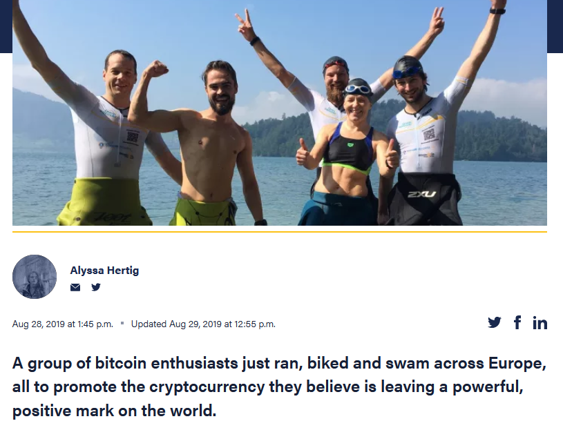

# CoinDesk: They Biked, Ran and Swam Over 200 Miles Across Europe - All for Bitcoin

A group of bitcoin enthusiasts including Anita just ran, biked and swam across Europe, all to promote the cryptocurrency they believe is leaving a powerful, positive mark on the world.

[Full article](https://www.coindesk.com/they-biked-ran-and-swam-over-200-miles-across-europe-all-for-bitcoin)
