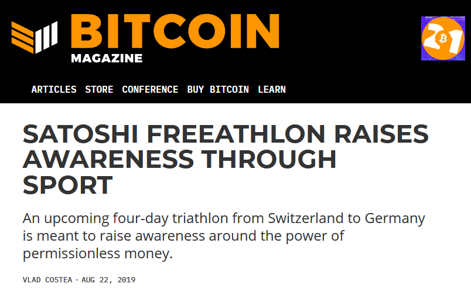

# Bitcoin Magazine: Satoshi Freeathlon Raises Awareness Through Sport

An upcoming four-day triathlon from Switzerland to Germany is meant to raise awareness around the power of permissionless money.

[Full article](https://bitcoinmagazine.com/culture/satoshi-freeathlon-raises-awareness-through-sport)
