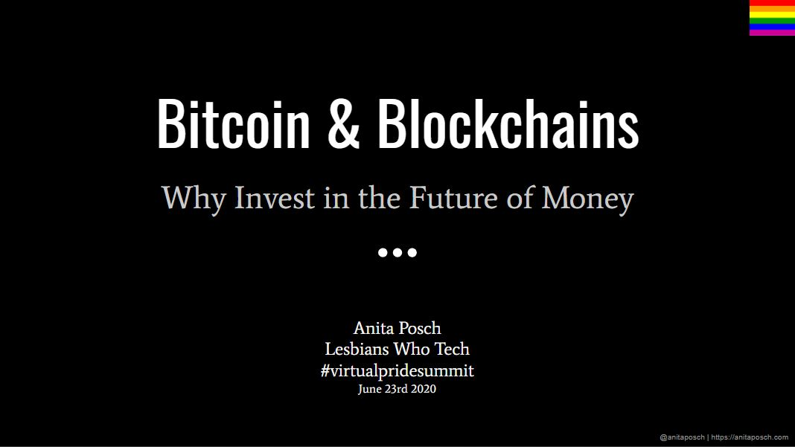

Tags: Learn Bitcoin, Talks, Blog
Link: /bitcoin-invest-future-money
Date: 2020-06-23

# Why Invest in the Future of Money with Bitcoin

It was great to be able to talk at the Lesbians Who Tech Virtual Pride Summit in 2020. Video should be available soon.

<iframe src="https://docs.google.com/presentation/d/e/2PACX-1vQa2Xem34AZBoX6fFOCrElia6CJWYLC8hhoDYYQOLDseO4H7RK2CyhwDxDY4Wa1i5XJXjhXCgt_F4vD/embed?start=false&loop=false&delayms=3000" frameborder="0" width="1440" height="839" allowfullscreen="true" mozallowfullscreen="true" webkitallowfullscreen="true"></iframe>

