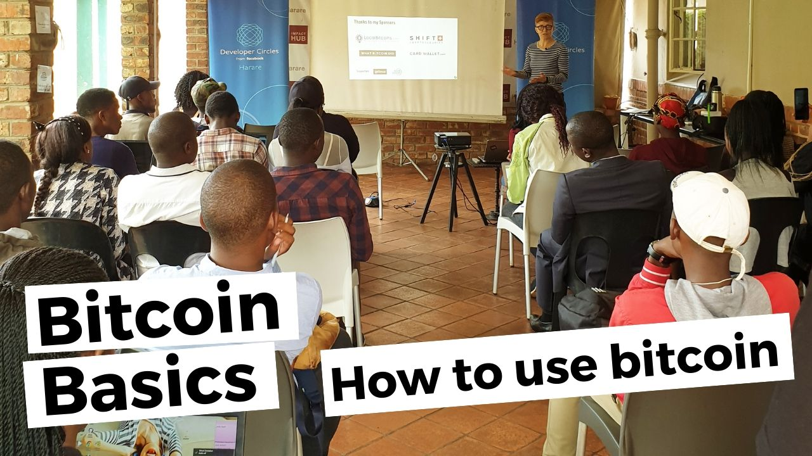

# Bitcoin basics: How to use bitcoin? A talk by Anita Posch in Harare and Gaborone in 2020

Bitcoin introduction: What is Bitcoin? Use-cases for bitcoin BTC, how to prevent scams, how bitcoin works, bitcoin mining, what is a blockchain, install a bitcoin wallet, the lightning network explained... 

While travelling Zimbabwe and Botswana for my podcast audio documentary in February 2020 I had the great opportunity to give an introduction about the Bitcoin blockchain and how one can use and earn BTC and lightning at meetups in Harare and Gaborone.

<iframe width="100%" height="476" src="https://www.youtube-nocookie.com/embed/0TwKdJIMBIs?si=8eibvpcGTfuHC32M" title="YouTube video player" frameborder="0" allow="accelerometer; autoplay; clipboard-write; encrypted-media; gyroscope; picture-in-picture; web-share" referrerpolicy="strict-origin-when-cross-origin" allowfullscreen></iframe>

