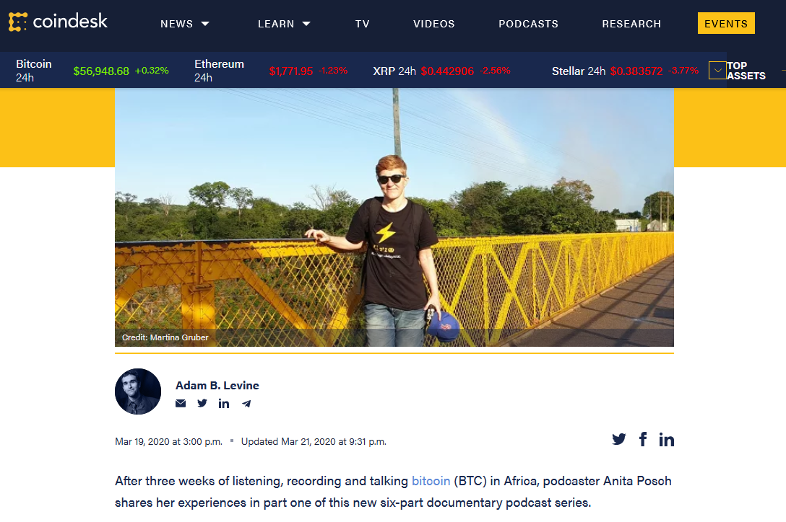

# In Zimbabwe, Crypto Is a ‘Liberation Tool’

After three weeks of listening, recording and talking Bitcoin in Africa, podcaster Anita shares her experiences in part one of this new six-part documentary podcast series.

[Full article](https://www.coindesk.com/bitcoin-in-zimbabwe-part-1-of-a-new-documentary-podcast-series)
