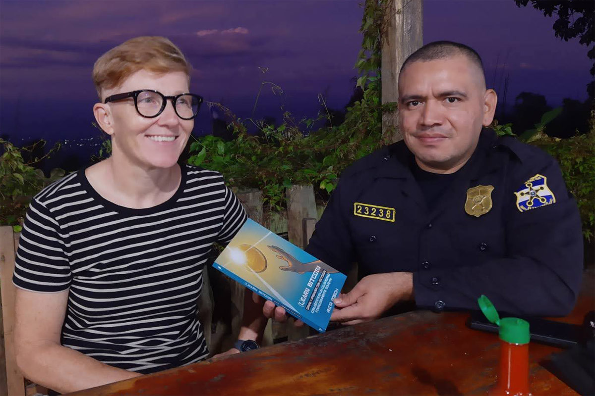

# Government-imposed Bitcoin adoption is clashing with community efforts on the ground in El Salvador - Op-ed for Bitcoin Magazine

Anita Posch wrote an [op-ed for Bitcoin Magazine after her visit to El Salvador](https://bitcoinmagazine.com/culture/reporting-on-bitcoin-adoption-in-el-salvador) in November 2021 showing that heavy-handed government efforts are clashing with Bitcoin’s self-sovereign and community-focused ethos.

Below you find Anita's original commentary.

## Strongmanship while failing the leading principle of self-custody: Not your keys, not your coins. 

Embracing Bitcoin is a bold move and a great chance for countries like El Salvador, but the end doesn't justify the means. Bitcoiners are being played for Bukele's power fantasies of a new Bitcoin City, whose original plans were downloaded from the internet. Bitcoin is non-political therefore Bitcoiners shouldn't get too close to politics. Educational communities like Bitcoin Beach and Bitcoin City SV are far more likely to achieve sustainable Bitcoin adoption than airdrops and the coercion to use custodial wallets.

In November 2021 I visited El Salvador for three weeks to research the use of Bitcoin, which has been legal tender since early September. I was attending Bitcoin week in San Salvador speaking at Adopting Bitcoin, a conference dedicated to the Lightning Network, and LaBitconf, the longest running Latin American Bitcoin conference. The following two weeks I spent in El Zonte at the Pacific Ocean, the village where Bitcoin Beach started in early 2020. I also visited [Bitcoin City SV](https://www.ascavderl.com/bitcoin-city-sv/comunidad-bitcoin) a cooperative in Sonzacate, which is educating their ~2,000 members about Bitcoin even longer than the folks at [Bitcoin Beach](https://anita.link/140).

Here are my experiences about adoption on the ground and my thoughts about El Salvador's future plans for Bitcoin City and the Bitcoin bonds, an announcement I was watching live at President Bukele's painfully overcrowded party on November 20, 2021.

Bitcoin is for anyone. That's my most important argument for Bitcoin as a tool supporting the human right to transact in a free way (as in free speech) and enabling financial inclusion of billions of people. I'm aware of the fact, that countries which have nothing left to lose and might be "rogue" states (at least from our "western" point of view) and authoritarian leaders will be the first to adopt bitcoin on a national level. If done the right way, it will most likely give their population a huge economic and sovereign leap forward compared to nation states that are laggards. As such I think it's a bold move and a great chance for El Salvador to embrace Bitcoin.

Nonetheless, Bitcoin is neutral and non-political in its foundations and actors in the Bitcoin space should act in alignment. I think it's one thing for private companies to do business with governments, it's in fact the purpose of businesses to make deals. But it gets a different spin, when prominent members of the Bitcoin space share a stage with an egomaniac politician, who is acting like an [authoritarian leader, dismantling democratic foundations](https://www.hrw.org/world-report/2021/country-chapters/el-salvador) for the sake of himself, his power and his friends.

I encourage you to read about the [human rights violations](https://www.hrw.org/world-report/2021/country-chapters/el-salvador), the illegality of abortions even in case of rape - women being prosecuted for homicide after being raped - and the containment centers for people who broke the mandatory 6 month long lockdown due to Covid-19 in 2020. To those who have in the last weeks praised the freedom in El Salvador while in Europe and elsewhere Covid restrictions endangered our freedom, remember, I never heard of any western country detaining their people for not complying with lockdown regulations.

"LGBT individuals remain [targets of homophobic and transphobic violence](https://www.hrw.org/world-report/2021/country-chapters/el-salvador#194231) by police, gangs, and others. Salvadoran LGBT rights organizations report over 600 killed since 1993. Official statistics released in January 2020 showed 692 cases of violence against LGBT and intersex people from January 2015 to June 2019. In June 2019, President Bukele dissolved the Secretariat of Social Inclusion, within which the Directorate on Sexual Diversity was based, and subsumed the directorate into an existing Gender Unit in the Ministry of Culture, renamed the Gender and Diversity Unit. LGBT activists criticized the move, protesting that few of their grave concerns regarding safety and discrimination could be adequately addressed under the ambit of culture."

One can view El Salvador's Bitcoin law from two perspectives: it's the first country in the world, that makes bitcoin legal tender or it's the first country in the world that forces its businesses to use bitcoin.

The staging of the president's announcement of [Bitcoin City](https://www.theblockcrypto.com/post/125075/heres-how-el-salvadors-president-plans-to-use-bitcoin-bonds) - with himself coming from outer space with fireworks, reminding us of [Alexander the Great and Alexandria](https://www.reuters.com/markets/rates-bonds/el-salvador-plans-first-bitcoin-city-backed-by-bitcoin-bonds-2021-11-21/) - was cringe-worthy and shows how indulged in self-love he is. His only goal was to announce something bigger than the Bitcoin law. 

The Bitcoin City presentation slides [were downloaded from the internet](https://archello.com/story/27299/attachments/photos-videos/1) and there was no detailed plan behind the announcement. It was the spontaneous idea of a so-called megalomaniac. There has been no democratic process in which this plan was discussed or approved. "It’s quite clear that Bukele is dismantling democracy very fast, and that's antithetical to bitcoin.", says [Alex Gladstein of the Human Rights Foundation](https://elfaro.net/en/202111/el_salvador/25822/Dismantling-democracy-is-antithetical-to-bitcoin.htm). At least the Bitcoin law made its way into Congress where it was approved by Bukele's party with a majority vote.

The way the Bitcoin bonds will work, was finally decided only a few minutes before Samson Mow took the stage. With the country in deep debt and its aggressive "Ley Bitcoin" it will most probably not get any more funding and support from the IMF. Therefore, the Bitcoin bonds are a great way to lure foreign currency into the country to buy more bitcoin and extend geothermal energy power plants to mine bitcoin. This is planned due the first issuance of the bonds called EBB1. I see this as a positive move in principle. El Salvador doesn't produce enough energy for itself. The country has to import electricity from abroad. The 1 MW that is currently used for mining at the La Geo plant in a town called Berlin, is not excess energy. 

El Salvador needs more power plants and the Bitcoin bonds can be a good instrument to finance infrastructure. The EBB1 succeeding bond tranches will be used to build Bitcoin City. It is completely unclear how the plans for this look.

In the best case, the money is used to build infrastructure throughout the country, spent on education, health services and the common good, lifting up the living standard for every El Salvadoran. In the worst case, the Bitcoin bonds are a way for President Bukele, his brothers and his Venezulean shadow government to defraud Bitcoiners, who believe in his good intentions.

Bukele announced Bitcoin City in the area of Conchagua volcano at the [Gulf of Fonseca](https://www.worldatlas.com/gulfs/gulf-of-fonseca.html) close to Honduras and Nicaragua. The city shall be powered by geothermal energy completely CO2 emission free. The energy is also planned to be used for Bitcoin mining. Yet the problem is, that [it is uncertain whether the volcano should be considered still active](https://www.volcanodiscovery.com/conchagua.html). I was told the volcano is dead, there is no geothermal energy left to be used.

I also heard that the situation with the neighboring countries is tense. All three with coastlines along the gulf, El Salvador, Honduras, and Nicaragua, have been involved in serious lengthy disputes over the rights of the Gulf and the islands that are located within it. With the announcement of Bitcoin City so close to the border, Bukele might step on the toes of the other countries. The [involvement of Chinese investments](https://www.csis.org/analysis/china-and-el-salvador-update) in building the ports in La Union and La Libertad adds even more complexity.

Moreover, what will happen to the people living in this area now, many of them being [indigenous people](https://minorityrights.org/country/el-salvador/)? At the time of the Spanish conquest, this area was the [Kingdom of Lenca](https://en.wikipedia.org/wiki/Lenca) people. They will be forced to leave and expropriated again. After accusations that their existence is being denied by the government and mass murder during the [1932 Salvadoran peasant uprising](https://en.wikipedia.org/wiki/1932_Salvadoran_peasant_uprising) (or _La Matanza_) which saw (estimates of) up to 30,000 peasants killed in a short period of time. "Many authors note that since _La Matanza_ the [indigenous in El Salvador have been very reluctant to describe themselves as such](https://en.wikipedia.org/wiki/Salvadorans) (in census declarations for example) or to wear indigenous dress or be seen to be taking part in any cultural activities or customs that might be understood as indigenous."

Planned cities can turn out to be very attractive and livable, but also to be a complete disaster. It takes time to build and grow a city with a high level of living quality. If you believe, you can move to Bitcoin City in two years, and get to live in an attractive urban space, think again. It's not without reason that the most [attractive, livable cities in the world](https://en.wikipedia.org/wiki/Most_livable_cities) have historic foundations and are not politically motivated planned from scratch.

And who will be able to afford living in Bitcoin City? Definitely not the poor people of El Salvador. It is envisioned as an investment center, a city for foreigners and companies. Similar to Dubai maybe, where expats make up 89% of the population. Downtown Dubai is most adversely [affected by the oversupply](https://www.asiapropertyhq.com/dubai-real-estate-market/) of property and offices. Property prices are now -30% over the past five years and [the chronic oversupply](https://www.businesstimes.com.sg/real-estate/dubai-putting-the-brakes-on-property) is much to blame for this. 

As much as I am in favor of the idea of a country using Bitcoin to achieve self-sovereignty, if it's a hierarchically planned move, there are risks attached. Investing and building Bitcoin City as well as the non-transparent handling of the private keys to El Salvador's 1,300 bitcoin and the custodial Chivo wallet are the major risks I see here.

"Gladstein’s theory is that [Bukele saw bitcoin 'as a way to get famous cheaply and to try to become the most well known Central American leader](https://elfaro.net/en/202111/el_salvador/25822/Dismantling-democracy-is-antithetical-to-bitcoin.htm), and he succeeded in all of that within a year.' Just how cheap is yet to be seen. The administration has sealed all information on how they’ve spent a $150 million trust fund approved to get the Bitcoin Law in motion, [according to the Salvadoran chapter of Transparency International](https://www.elsalvador.com/noticias/negocios/bandesal-funde-bitcoin-chivo-wallet-fideicomiso-fidebitcoin/891511/2021/), which requested the information."

There is no public information about who the developers and companies behind the Bitcoin implementations are. There are [several rumors](https://cryptosrus.com/did-you-know-el-salvadors-chivo-app-runs-on-algorand/) and a leaked document from August 2021. In the same month El Salvador signed an agreement with Koibanx to "leverage the Algorand blockchain technology". I was informed by a person close to the government, that Chivo runs on Algorand rails, but without forking the Algorand blockchain. Chivo uses its own MongoDB data base to store transactional data (a centralized, unsecure honeypot of data). [Other sources mentioned Cardano](https://bitcoinitaliapodcast.it/missione-el-salvador/day-12-why-chivo-sucks) behind the Chivo implementation.

"Silvergate Bank, a California state-chartered commercial bank and a United States Federal Reserve member, will work with Bitso to facilitate U.S. dollar transactions for the Chivo wallet. Athena Bitcoin will provide some front-end services and Chivo’s ATM-related operations, while Algorand will act as the official blockchain provider.", [Cointelegraph](https://cointelegraph.com/news/bitso-to-assist-the-launch-of-el-salvador-s-official-bitcoin-wallet-chivo) was reporting.

According to conversations I had and media articles the [keys for El Salvador's bitcoin are in the hands of a U.S.-American company: BitGo](https://www.forbes.com/sites/jonathanponciano/2021/09/07/el-salvador-taps-billionaire-backed-bitcoin-unicorn-in-the-cryptocurrencys-historic-legal-tender-debut/). The government only has a contract with BitGo, but not full custody over the public bitcoin funds. This contract can easily be broken as soon as international organizations and the U.S.-government force BitGo to cut off El Salvador's access to its custodial cold storage.

<blockquote class="twitter-tweet">
We&#39;ve also read many interviews, never debunked so far, where Mike Belshe were explaining that BitGo actually created the infrastructure. Also, some account mention Cardano instead of Algorand as the involved shitcoin! What a weird mess.
&mdash; Giacomo Zucco (Toximus Decimus Meridius) (@giacomozucco) <a href="https://twitter.com/giacomozucco/status/1471102136998154244?ref_src=twsrc%5Etfw">December 15, 2021</a></blockquote> 

Algorand founder Silvio Micali says "[Bitcoin is a recipe for disaster](https://elpais.com/retina/2018/06/25/tendencias/1529916635_610100.html)", "[with Bitcoin you can only do speculation](https://www.eldestapeweb.com/economia/criptomonedas/silvio-micali-coinventor-de-la-criptografia-moderna-con-bitcoin-solo-se-puede-hacer-especulacion--2021121110580)" and he assures, that the Algorand blockchain "[solves scalability, security and energy efficiency problems that Bitcoin has](https://www.eldestapeweb.com/economia/criptomonedas/silvio-micali-coinventor-de-la-criptografia-moderna-con-bitcoin-solo-se-puede-hacer-especulacion--2021121110580)". The usual altcoiner arguments to frame Bitcoin as "old" technology and the need for something faster and shinier.

Why didn't Strike or another Bitcoin only company develop the governmental app? If rumors are true, it's because Strike wanted to much money to develop the app (rumor has it [$ 300 Mio.](https://btc21.de/strikes-versagen/)) and Algorand (or Cardano, or Koibanx?) paid the government $ 20 Mio. to get the contract. Why would an altcoin founder, who believes his system is more decentralized, work on a Bitcoin wallet (imagine me laughing at the decentralization argument while at the same time there is a public known founder)? 

A few personal experiences from using Lightning in El Salvador. Every payment between Muun and BitcoinBeach as well as Breez worked. When I paid a driver with Lightning to his Chivo wallet we waited for 10 minutes but the money didn't show up in his wallet although I saw the confirmation on my wallet. I paid him in cash a second time.  

A friend of mine tested the Chivo ATM and sold some btc. He received a coupon with a redemption code, when he entered the code, the machine said, that it's not valid. I tried to help him out and redeemed the voucher at the Sonsonate ATM, but again: "Code invalid". My friend called the support number stated on the ATM, but nobody had an idea and we were instructed to call an U.S. number regarding the ATMs. We didn't call since we only had El Salvadoran SIM cards without international call minutes. The assistant at the ATM said, we'd need to redeem the code at the same ATM at the airport, where our friend sold the btc. On my way back home I tried both ATMs at the airport. Code not valid.

For weeks there have been complaints around Chivo, the #TimoWallet as locals call it, which means #scamwallet in English. El Salvadorans are complaining, that their bank accounts connected with Chivo had been drained by Chivo transactions, they never did.

 [Source:](https://twitter.com/designvbt/status/1470222762824421378?s=20)

<blockquote class="twitter-tweet">
Hilo con algunos afectados por la Chivo Gualet.  1- $16,000 <a href="https://t.co/EC3hehXKDz">pic.twitter.com/EC3hehXKDz</a>
&mdash; El Comisionado (@_elcomisionado_) <a href="https://twitter.com/_elcomisionado_/status/1472326380620632064?ref_src=twsrc%5Etfw">December 18, 2021</a></blockquote> 

Why does Chivo have so many problems? Of course it's a big project and they only had 3 months time to set it up, but now it's December 6 months have gone by and still there are so many serious flaws. Is this an attack on Bitcoin? Do the altcoin project managers want it to fail? I don't know. I just find it weird. After finishing this article I heard that some of the [problems with Chivo were solved](https://twitter.com/JaimeWGarcia/status/1471694256771416066?s=20) in a software update. Still, its custodial, centralized and the code is running on Amazon Web Services in the U.S..

 [Source:](https://twitter.com/lcisco10/status/1471140409183252480?s=20)

It has been said that [in El Salvador more people have Bitcoin wallets than traditional bank accounts](https://www.forbes.com/sites/theapothecary/2021/10/07/in-el-salvador-more-people-have-bitcoin-wallets-than-traditional-bank-accounts). This sounds right, given the fact that "Chivo had negotiated with the largest gas stations in the country to reduce the price of gasoline by 20 cents per gallon for those who pay through the app. That’s on top of the $30 in seed money that the government has deposited in every Salvadoran’s Chivo account", only possible with registration and ID, which is opposite to the openness that Bitcoin promises. That's why 46 percent of the population downloaded the custodial, governmental app, while only [29 percent had bank accounts](https://www.forbes.com/sites/theapothecary/2021/10/07/in-el-salvador-more-people-have-bitcoin-wallets-than-traditional-bank-accounts/) in 2017.

The owner of one of the hotels I stayed in El Zonte, told me that most people, spent or exchanged the $30 in bitcoin they received to USD. The inhabitants of El Zonte, who have been accepting bitcoin payments since the lockdown in 2020, visit the Bitcoin Beach Hope House at the end of each month to exchange their BTC to USD. I'd love to see more education on the ground, more emphasis put into the understanding and usage of an open, neutral money. Sadly I heard from an official that there will be no education about Bitcoin from the government. 

The good thing about that is, that Salvadorans have to look elsewhere for information, which gives us the opportunity to share free education about self-sovereignty and how to achieve it through self-custody. The bad thing is: the people of El Salvador can be hurt pretty badly and the experience with the Chivo wallet may turn people against Bitcoin, because they think Bitcoin isn't working not the Algorand wallet.

My hope is that the Salvadorans, who already are using not only the Chivo wallet, but also non-custodial, open-source wallets now have the opportunity to free themselves from the politicized U.S. Dollar. If they use bitcoin for remittances, accept it from tourists, are able to save a little bit and hold their keys long enough they will be much better off in three to five years. Then they will share their positive experiences with friends and families and kick-off peer-to-peer adoption.

The good news is: I met locals, who are really interested in learning more about Bitcoin and self-custody. A policeman to whom I gifted my book and two taxi drivers were very receptive to my explanations for downloading the Muun wallet and the sovereignty associated with self-ownership.

Also the 30 books I donated to Bitcoin Beach (supported by [Bitcoin Austria](https://twitter.com/bitcoin_at) and [Sovryn](https://twitter.com/SovrynBTC)) will be put to good use to educate the locals.

Community based education is a far more sustainable way of adoption than gifting airdrops, forcing people to use a new form of money they know nothing about. This could lead to people being turned away in disappointment. We don't need banks and bankers, we don't need governments with their excessive regulations and custodial solutions that exclude billions of people. Bitcoin stands on its own and individuals and communities can and should take advantage to opt-out of the traditional financial system.

Let's hope for the best. The good thing is: Bitcoin doesn't care. The network can't be manipulated and is unstoppable - tik-tok - next block. 
