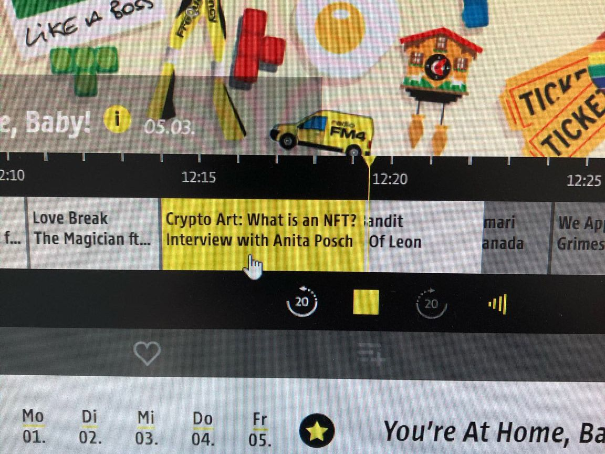
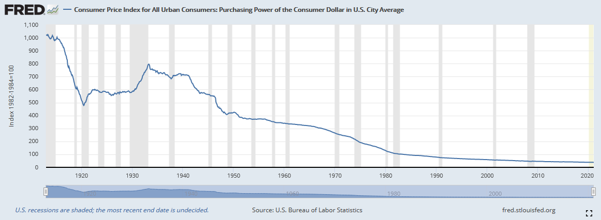

# Weekly Nr. 18 - NFTs and decentralization

<h2>Thought of the week by Anita Posch</h2>

<h3>Kings of Leon released their new album as an NFT - What is an NFT?</h3>
Find my short [explainer about NFTs](what-is-NFT-audio) on Austrian radio FM4. At the moment I see a hype in the crypto space around NFTs, similar to the ICO hype of 2017. Although many people dismiss NFTs I think they do have potential in the digital space. You might not be able to reach true scarcity, because you can't prevent copies of the art piece, but you can prove that you are the owner of that one specific piece.

<h2>This is why we need more decentralization</h2>
It is easy for oppressive governments to crack down on its people, they just have to restrict access to social media sites and servers. Happening in Senegal now.
<blockquote class="twitter-tweet">

⚠️ Confirmed: Social media and messaging apps restricted in <a href="https://twitter.com/hashtag/Senegal?src=hash&amp;ref_src=twsrc%5Etfw">#Senegal</a> amid political unrest following arrest of opposition leader; real-time metrics show Facebook, YouTube, WhatsApp and Telegram CDN servers disrupted, limiting photo and video sharing 📉

📰 <a href="https://t.co/klvokfpLyu">https://t.co/klvokfpLyu</a> <a href="https://t.co/L6q3ygu9jP">pic.twitter.com/L6q3ygu9jP</a>

— NetBlocks (@netblocks) <a href="https://twitter.com/netblocks/status/1367644916059357189?ref_src=twsrc%5Etfw">March 5, 2021</a></blockquote>

It was also easy for big tech companies to build monopolies in recent times. But it seems things are shifting. App developers like Spotify, Hey or Epic games are fighting the 30% fees they have to pay to Apple's store to be listed. One bill, which would let developers sidestep the two companies' 30 percent fees on digital purchases, cleared the Arizona House by a 31-29 vote Wednesday. Last month, Apple and Google beat back a North Dakota Senate bill that would have required Apple to let iPhone and iPad users download alternative app stores and let developers change their payment options. <a href="https://www.politico.com/news/2021/03/03/apple-google-app-store-fights-move-to-the-states-473388" target="_blank" rel="noopener">Source</a>

<h2>Quote of the Week</h2>
<blockquote>The root problem with conventional currency is all the trust that's required to make it work. The central bank must be trusted not to debase the currency, but the history of fiat currencies is full of breaches of that trust. - Satoshi Nakamoto</blockquote>

<h2>Top Stories</h2>
<h3>The Purchasing Power of Fiat Currencies Is Melting Away</h3>
One example ot that breaches of trust, that Satoshi Nakamoto was speaking of, is the devaluation of fiat currencies. In <a href="https://anitaposch.com/anitas-weekly-17-26-feb-2021/">last weeks newsletter</a> I was telling you about the rampant inflation in Germany and Austria 100 years ago. Then I showed the consumer price inflation of the last decade in Austria, which is 19%. This week I found an interesting chart showing the constant loss in purchasing power of the US Dollar.

<h3>Bitcoin's volatility is sinking</h3>
One of the major arguments against bitcoin as a store of value and medium of exchange is its high volatility. That's ignoring the fact that bitcoin's volatility over the years has been constantly sinking as you can see in the chart below. Adding to that: if you see bitcoin as a long term investment, at least for 5 years, then the short-term volatility doesn't hurt you. If you want to use it for payments, you can do that too. Just buy or earn the spent btc amount back. No change through volatility loss or gain involved.

<blockquote class="twitter-tweet">

Historical volatility in Bitcoin... <a href="https://t.co/Dte6i6ICAc">pic.twitter.com/Dte6i6ICAc</a>

— Charlie Bilello (@charliebilello) <a href="https://twitter.com/charliebilello/status/1366108195333300231?ref_src=twsrc%5Etfw">February 28, 2021</a></blockquote>

<h3>Bitcoin is highly liquid compared to US money stock</h3>
Due to the lock downs and the ongoing crisis people are holding on to their fiat currencies. Money is sitting in bank accounts losing value every single day. Meanwhile the velocity of bitcoin is higher than the velocity of US money for spending.

<blockquote class="twitter-tweet">

Bitcoin's monetary velocity is now higher than USD M1. M1 is the USD held in short term accounts for buying stuff; none of it is moving. BTC's making a joke out of it.

BTC is moving more than the money we have for spending. Nevermind BTC is for long term investment. <a href="https://t.co/ymZGOx3uRh">pic.twitter.com/ymZGOx3uRh</a>
Willy Woo (@woonomic) <a href="https://twitter.com/woonomic/status/1366285485132247047?ref_src=twsrc%5Etfw">March 1, 2021</a></blockquote>

<h3>Lightning Network is growing and exchanges are adopting</h3>
The Lightning Network is a second layer protocol on top of the Bitcoin network that allows faster payments and micropayments. You might want to listen to <a href="https://bitcoinundco.com/en/lightning-labs/" target="_blank" rel="noopener">my interview with Ryan Gentry and Desiree Dickerson</a> we're explaining, what the LN is and their outlook for its development in 2021. OKCoin, a bitcoin exchange in Singapur, has integrated the Lightning Network into their services. This means the fees for trades will go down significantly.

<blockquote class="twitter-tweet">

⚡ <a href="https://twitter.com/lightning?ref_src=twsrc%5Etfw">@Lightning</a> has now arrived at OKCoin, providing up to 99% lower fees and instant transactions <a href="https://t.co/unwXfBDoD6">https://t.co/unwXfBDoD6</a>

— OKCoin (@OKCoin) <a href="https://twitter.com/OKCoin/status/1367508435789443076?ref_src=twsrc%5Etfw">March 4, 2021</a></blockquote>

<h2>Podcast of the week audio only</h2>
<iframe src="https://www.vodio.fr/frameplay.php?idref=25669&urlref=1" style="border: 0px none; box-shadow: rgba(0, 0, 0, 0.28) 0px 0px 10px; width: calc(100% - 10px); height: 180px; margin-left: 5px; padding: 0;" scrolling="no"></iframe>

<h2>Video</h2>
https://youtu.be/l_2Kdyicslo

