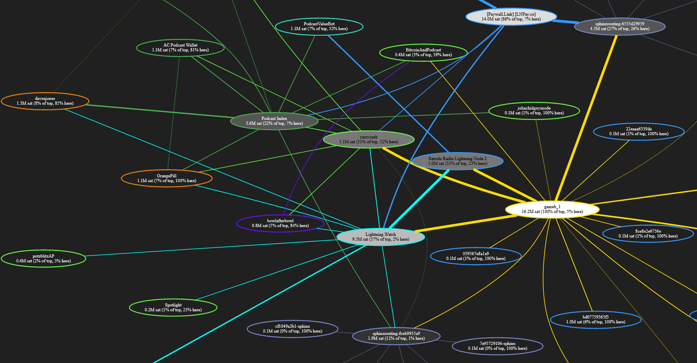

# Weekly Nr. 21 - Towards a Circular Bitcoin Economy

## Thought of the Week by Anita Posch

**Open Source and the speed of innovation**  
When I implemented the Sphinx app, that enables podcasters to get paid, on my Bitcoin and Lightning full node in late 2020, I experienced how difficult it is to use early technology. Not only from my content creator perspective, but also for the listeners - you. The Sphinx app was the first of its kind and I thought, okay, that might take a year or so until this becomes easier for a layperson. But to my surprise this week the Breez wallet implemented podcasts and streaming money and it is much more convenient. It goes to show that open source software like Bitcoin is enabling a multitude of new applications at an incredible speed of innovation.

---
## Podcasting 2.0, the Value 4 value model
At the end of 2020 a new kind of income generation model for podcasters started to take shape. It's called Podcasting 2.0, a movement that aims to free podcasters from corporate control and walled gardens. In podcasting we see the same tendencies that happened in the music business. Big monopolistic players like Spotify or Apple Music dictate income streams and take control over who is the next star and who will be canceled. Now independent podcasters have a possibility to earn money directly from their listeners, who can choose - but don't have to - pay them with micropayments while they are listening. Advantages for you, the listener? Ad free episodes, no data collection by Spotify and sponsors, no subscriptions. You give what it's worth to you - Value 4 value.

I [connected my podcast in November 2020 with the Sphinx chat app](https://anitaposch.com/bitcoin-podcast-enable-streaming-money), and listeners started to send satoshi's to my Bitcoin node. 

This week another app launched its podcasting feature. The Breez app started as a Bitcoin wallet and now you can stream podcasts and pay at the same time too. At the moment it is much easier to use than the Sphinx app. Watch the video below and see how I sent some satoshi's to my own podcast and how money is flowing into my node in real-time. All of this happens without banks, without credits cards or payment providers. These are micropayments, you can send 10 sats = 0.005 cent per minute. It's not 5 cent per minute, it's a fraction of a cent. This will never be possible in the fiat money system and it enables so many new use-cases for artists, musicians, and all sorts of content creators.

<blockquote class="twitter-tweet">
Earning <a href="https://twitter.com/hashtag/bitcoin?src=hash&amp;ref_src=twsrc%5Etfw">#bitcoin</a> with <a href="https://twitter.com/hashtag/podcasting?src=hash&amp;ref_src=twsrc%5Etfw">#podcasting</a> in a decentralized, uncensorable way got a lot more mainstream with <a href="https://twitter.com/Breez_Tech?ref_src=twsrc%5Etfw">@Breez_Tech</a> wallet. What <a href="https://twitter.com/sphinx_chat?ref_src=twsrc%5Etfw">@sphinx_chat</a> and <a href="https://twitter.com/adamcurry?ref_src=twsrc%5Etfw">@AdamCurry</a> started: watch how my node receives streaming money live. This is the future of the Internet of Value. Now. <a href="https://t.co/NclgyNXNOh">pic.twitter.com/NclgyNXNOh</a>
&mdash; Anita ✊🏼🔑🏳️‍🌈🏊🏻🚴‍♂️☮️ (@AnitaPosch) <a href="https://twitter.com/AnitaPosch/status/1374652725372321799?ref_src=twsrc%5Etfw">March 24, 2021</a></blockquote> 

This [graph shows all nodes that are a part](https://lightningwiki.net/g/?g=podcaster&t=Tag%20podcaster) of the new Value 4 value podcasting universe. An example of what the following quote of the week stands for.

---
## Quote of the Week

> "With this kind of technology individuals can directly take more control of their lives and have more self-determination." - Adam Back

---
## Meme of the Week
This is not a meme yet, but I'm sure that there will be loads of memes. What happened? Twitter CEO Jack Dorsey had to testify in front of the United States Congress on Thursday. He did this with a Bitcoin Blockclock in the background. It shows 1952, the current price of 1 satoshi in USD. A Twitter user saw this and started a conspiracy theory saying the clock shows Moscow time and pondering about Jack Dorsey's intentions. Well, it just shows that he is a Bitcoin enthusiast.

<blockquote class="twitter-tweet">
Jack Dorsey has a <a href="https://twitter.com/hashtag/Bitcoin?src=hash&amp;ref_src=twsrc%5Etfw">#Bitcoin</a> BLOCKCLOCK behind him as he testifies infront of the United States Congress. <a href="https://t.co/nAJ96cWGBF">pic.twitter.com/nAJ96cWGBF</a>
&mdash; Documenting Bitcoin 📄 (@DocumentingBTC) <a href="https://twitter.com/DocumentingBTC/status/1375129546635235329?ref_src=twsrc%5Etfw">March 25, 2021</a></blockquote> 

---
## You can buy a Tesla with Bitcoin now
Elon Musk announced that Tesla is taking your bitcoin in exchange for a car. This is a great sign for mainstream adoption, but far more exiting is that Tesla is using its own Bitcoin infrastructure and will not convert the proceeds to fiat currency. Who is losing? The banks - Tesla is its own bank now. And they use it as a store of value and - as I assume - for cross-border payments to suppliers. Companies can save a lot of exchange fees, when using bitcoin globally.

<blockquote class="twitter-tweet">
Tesla is using only internal &amp; open source software &amp; operates Bitcoin nodes directly.  Bitcoin paid to Tesla will be retained as Bitcoin, not converted to fiat currency.
&mdash; Elon Musk (@elonmusk) <a href="https://twitter.com/elonmusk/status/1374619379929772034?ref_src=twsrc%5Etfw">March 24, 2021</a></blockquote> 

## Microsoft identity network on top of Bitcoin
The main idea behind Bitcoin is to be financially self-sovereign. Another aspect of being self-determined regards our identity on the web. We all experience how companies and governments collect our data. With cryptography we can put an end to this. One thing that has been missing are decentralized identifiers (DID). 
These can be used to secure access to resources, sign and verify credentials, and facilitate application data exchange. Unlike traditional usernames and email addresses, DIDs are owned and controlled by the entity itself (be it a person, device, or company), and exist independently of any external organization or trusted intermediary. 

I heard about Microsoft choosing the Bitcoin blockchain as its base technology some years ago. It was a sign for me, that behind all the price talk, Bitcoin will bring much higher fundamental change, than most people believe.

<blockquote class="twitter-tweet">
After years of effort by Microsoft and a community of contributors, ION — the open, public, permissionless Layer 2 Decentralized ID network running on Bitcoin — was launched this morning. It&#39;s time to build the decentralized future of identity we deserve.<a href="https://t.co/3B9br7I0xW">https://t.co/3B9br7I0xW</a>
&mdash; Daniel Ƀrrr (@csuwildcat) <a href="https://twitter.com/csuwildcat/status/1375125876736548870?ref_src=twsrc%5Etfw">March 25, 2021</a></blockquote> 

## Growth of the Lightning Network
The new income generation model for podcasters is running on the Lightning network, that enables micropayments. Here you can see the adoption of Lightning all around the world.
<blockquote class="twitter-tweet">
1/5 <a href="https://twitter.com/hashtag/LightningNetwork?src=hash&amp;ref_src=twsrc%5Etfw">#LightningNetwork</a> adoption thread!  People from an astonishing 105 countries have used the Bitcoin Lightning Network this year to help buy mobile topups, electronics, groceries, clothing, plane tickets, food delivery, video games, and more on Bitrefill... <a href="https://t.co/ghLOIbIJWf">pic.twitter.com/ghLOIbIJWf</a>
&mdash; Bitrefill (@bitrefill) <a href="https://twitter.com/bitrefill/status/1374711107500249099?ref_src=twsrc%5Etfw">March 24, 2021</a></blockquote> 

---
## Video
This is one for the nerds and Tesla fans. Andy Schroder built a real time machine-to-machine charger for electric cars, that are paying over the bitcoin lightning network. 
https://youtu.be/ynZYQiJx3no

