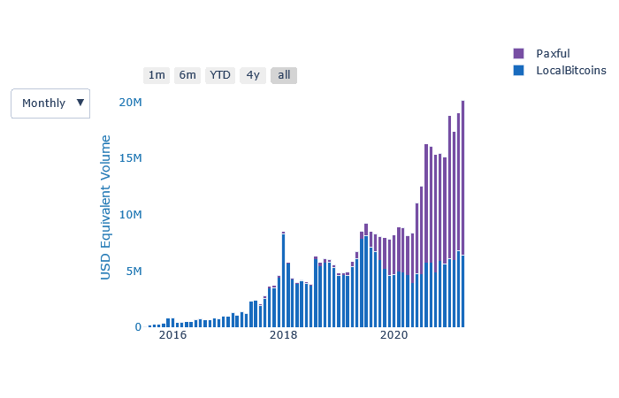
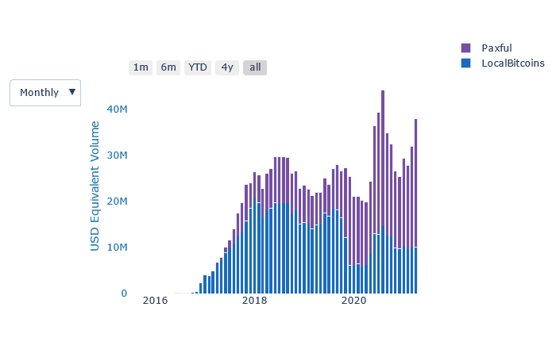
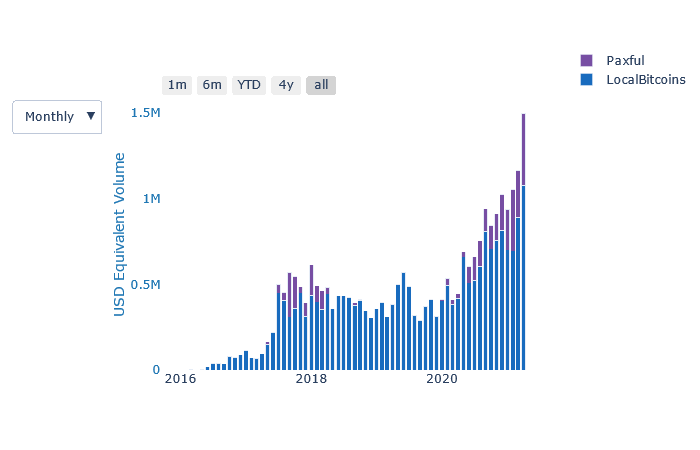
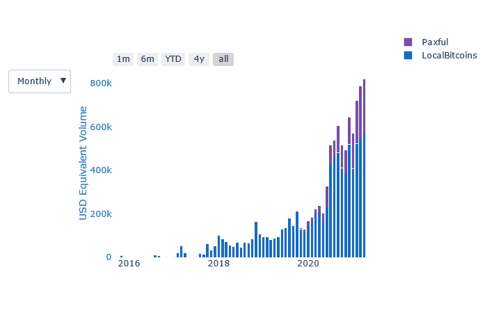
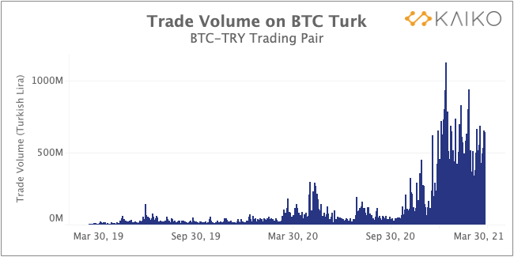
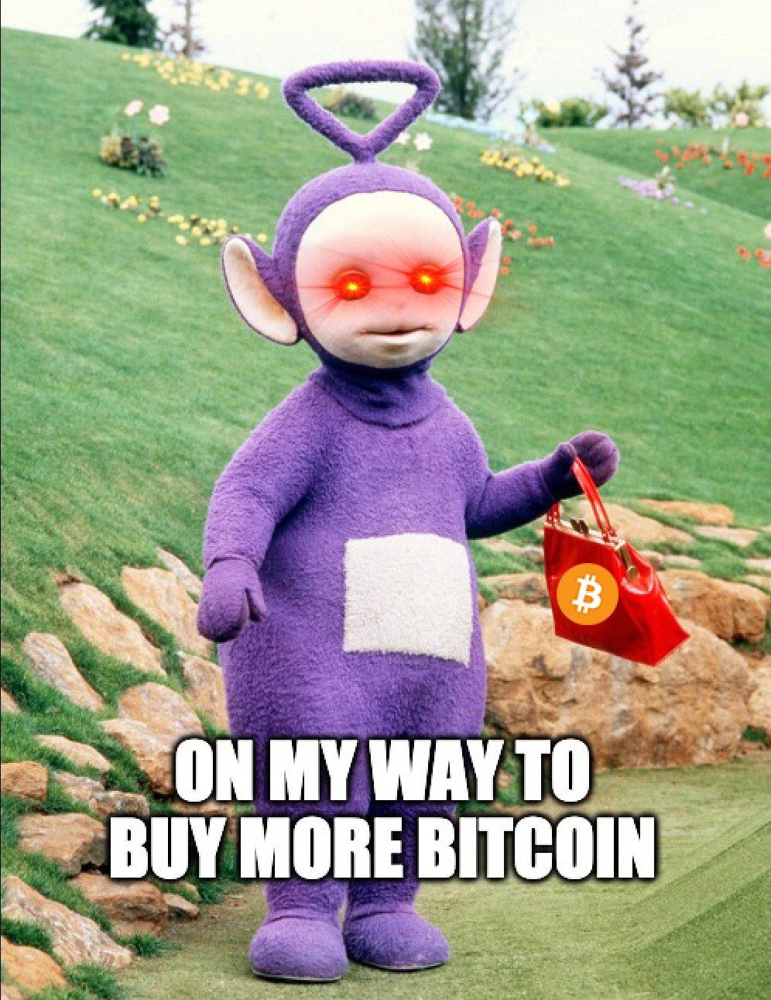

# Weekly Nr. 22 - Banning Bitcoin? Au Contraire

## Thought of the Week by Anita Posch
While nation states like Nigeria and India try to ban banks from interacting with cryptocurrencies and President Erdogan's onslaught on rights and democracy in Turkey is increasing their people are exiting the system with the help of Bitcoin. Banning Bitcoin doesn't work. Freedom of transaction is a human need and right. Individuals around the world know that. US institutions are following - most of them not because of humanitarian aspects, but Bitcoin is for everyone.

--- 

## India embracing Bitcoin despite proposed ban

>"Bitcoin might become for India’s millennials what gold is for their parents, no matter what the government says." - [Anna Baydakova](https://www.coindesk.com/indias-millennials-embrace-bitcoin) @baidakova 

India has a population of 1.4 billion people, it's the largest in the world after China. People are tech savvy, young and have access to the cheapest internet connections globally.

Rumor has it, that the Indian government wants to ban Bitcoin. Again. Despite the fact that the Central Bank lost a court case against the Bitcoin community some years earlier as Unocoin co-founder Sunny Ray told me in our [podcast about Bitcoin in India](https://bitcoinundco.com/en/sunny-ray/).

Take a look at the trading volume on P2P exchanges LocalBitcoins and Paxful - adoption is rising constantly. In March we saw an all-time trading high. Even if India would ban Bitcoin, do you think the people who already own it, will give it back? 

<small>Source: usefultulips.org</small>

---
## Nigeria 
There has been a lot of back and forth about Nigeria banning banks to interact with cryptocurrencies in the last weeks. In March the Central Bank of Nigeria (CBN) declared that there was no time the bank banned the activities of Cryptocurrencies in the country ([Source](https://www.withinnigeria.com/news/2021/03/20/cryptocurrency-ban-nigerians-are-free-to-use-bitcoin-says-cbn-declares/)). Well, anyhow: Nigerians don't care as you can see from P2P trading volume.
<small>Source: usefultulips.org</small>

---
## Bitcoin surging in Egypt, Morocco, Turkey
Interesting increases in Bitcoin trading can also be seen in Morocco, Egypt, and Turkey. The latter are countries with traditionally high inflation rates.

### Morocco
<small>Source: usefultulips.org</small>
### Egypt
<small>Source: usefultulips.org</small>
### Turkey

<small>[Source: Kaiko](https://blog.kaiko.com/the-average-bitcoin-trade-size-has-doubled-8ffa5f93fbaf)</small>

As the Turkish lira plunges and concerns arise that Turkey may return to unorthodox economic policies, including imposing capital controls to protect its currency, Bitcoin volume is rising on BTC Turk, the largest crypto exchange in Turkey. 

"Turkish President Tayyip Erdogan called on Turks to convert their foreign exchange and gold holdings through financial institutions as a “win-win” strategy for the country and themselves, after an overhaul of the central bank sent the lira down nearly 12% in a week." [Reuters](https://www.reuters.com/article/turkey-economy-gold-int-idUSKBN2BL2FH)

And keep in mind, which kind of politics are in place in Turkey: The government of President Recep Tayyip Erdoğan is dismantling human rights protections and democratic norms  in [Turkey](http://www.hrw.org/europecentral-asia/turkey) on a scale unprecedented in the 18 years he has been in office, said Human Rights Watch today. He targets women, kurds, LGBT people and democratic safeguards. [Human Rights Watch](https://www.hrw.org/news/2021/03/24/turkey-erdogans-onslaught-rights-and-democracy)

---
## Quote of the Week

> "Governments are good at cutting off the heads of a centrally controlled networks like Napster, but pure P2P networks like Gnutella and Tor seem to be holding their own." - **Satoshi Nakamoto**

---
## Meme of the Week
To be honest - I never watched Teletubbies and I don't even know, if these are the original ones. Anyhow. Last week they announced something big. 
<blockquote class="twitter-tweet">
Eh-Oh...what could the Teletubbies be possibly hiding from us? Stay tuned for something BIG this week. 🚀 <a href="https://twitter.com/hashtag/Bitcoin?src=hash&amp;ref_src=twsrc%5Etfw">#Bitcoin</a> <a href="https://t.co/fJ2NBXsENx">pic.twitter.com/fJ2NBXsENx</a>
&mdash; Teletubbies (@TeletubbiesHQ) <a href="https://twitter.com/TeletubbiesHQ/status/1377259542640218113?ref_src=twsrc%5Etfw">March 31, 2021</a></blockquote> 

<blockquote class="twitter-tweet">
Hahaha, last week Bitcoiners so: yeah, the Teletubbies announce something big for <a href="https://twitter.com/hashtag/Bitcoin?src=hash&amp;ref_src=twsrc%5Etfw">#Bitcoin</a>.   And then: <a href="https://twitter.com/hashtag/TubbyCoin?src=hash&amp;ref_src=twsrc%5Etfw">#TubbyCoin</a> on April Fool&#39;s Day. <a href="https://t.co/xckvB2XOxp">https://t.co/xckvB2XOxp</a>
&mdash; Anita ✊🏼🔑🏳️‍🌈🏊🏻🚴‍♂️☮️ (@AnitaPosch) <a href="https://twitter.com/AnitaPosch/status/1377884803077447682?ref_src=twsrc%5Etfw">April 2, 2021</a></blockquote> 

It turned out to be an April Fool's Day joke.

---
## Bitcoin privacy
Two easy to follow suggestions to increase your privacy while using bitcoin:

**1. Don't re-use addresses.**

If you use a single address for several transactions, you're not only making blockchain analysis easier to follow your own money flow, but you're also doxing your peers.

**2. Don't send round amounts.**

A bitcoin transaction is composed of one ore more inputs and one or more outputs.
[As example](https://bitcoin.stackexchange.com/questions/103260/why-is-it-recommended-to-not-send-round-number-amounts-when-making-payments-fo), if you have a 0.50106550 BTC output, and you want to send someone a payment of 0.2 BTC, then your transaction may look like this (ignoring transaction fees, for simplicity):

`Inputs: (0.50106550 BTC) -> Outputs: (0.2 BTC) (0.30106550 BTC)`

Now consider what someone who is watching the blockchain can infer, just by looking at the amounts in this transaction. Knowing that the excess value from the input will be paid back to the user as a change output, it becomes fairly easy to infer which of the two outputs is the payment (0.2 BTC), and which is the change.

Breaking heuristics like this represent a small gain in privacy, but it is a very simple and easy way to increase privacy nonetheless. [Source chytrik](https://stackexchange.com/users/12191538/chytrik)

---
## $30 Billion USD sent in Bitcoin daily
Ah, yeah. Nobody is using bitcoin, right? 
<blockquote class="twitter-tweet">
Bitcoin transaction volumes since crypto winter...  We&#39;ve gone from a steady $5 billion per day to an average of $30 billion. (This is not an April 1st joke.) <a href="https://t.co/zXR4jjlvWY">pic.twitter.com/zXR4jjlvWY</a>
&mdash; Mati Greenspan (tweets ≠ financial advice) (@MatiGreenspan) <a href="https://twitter.com/MatiGreenspan/status/1377587295415599104?ref_src=twsrc%5Etfw">April 1, 2021</a></blockquote> 

---
## Coinbase stock to begin trading 

Governments banning Bitcoin? No: U.S. [Securities and Exchange Commission](https://www.sec.gov/) (SEC) declared Coinbase’s registration statement effective. Its Class A common stock will begin trading on the Nasdaq Global Select Market under the ticker symbol “COIN” on April 14, 2021.
Coinbase is the largest cryptocurrency exchange in the U.S. valued at $100 Billion.
<blockquote class="twitter-tweet">
We’re happy to announce that earlier today, the SEC declared our S-1 registration statement effective and that we expect our direct listing to occur on April 14, 2021, with our Class A common stock trading on the <a href="https://twitter.com/Nasdaq?ref_src=twsrc%5Etfw">@NASDAQ</a> under the ticker symbol COIN.<a href="https://t.co/cwRZWmj9Pv">https://t.co/cwRZWmj9Pv</a>
&mdash; Coinbase (@coinbase) <a href="https://twitter.com/coinbase/status/1377714348991205377?ref_src=twsrc%5Etfw">April 1, 2021</a></blockquote> 

---
## Bitcoin doesn't need Goldman Sachs, Goldman Sachs needs Bitcoin
...but Bitcoin is for everyone. So go and get yourself some, before Goldman Sachs does.
<blockquote class="twitter-tweet">
You can&#39;t make this up. <a href="https://t.co/YzRYJcL6IC">pic.twitter.com/YzRYJcL6IC</a>
&mdash; Documenting Bitcoin 📄 (@DocumentingBTC) <a href="https://twitter.com/DocumentingBTC/status/1377248694412701696?ref_src=twsrc%5Etfw">March 31, 2021</a></blockquote> 

---
## Podcast of the Week
One of my listeners is a customer of Bitwage for several years. As an employee he is earning a fraction of his income in bitcoin. Every month. He is a happy guy.
https://youtu.be/pi77NdHh4io

