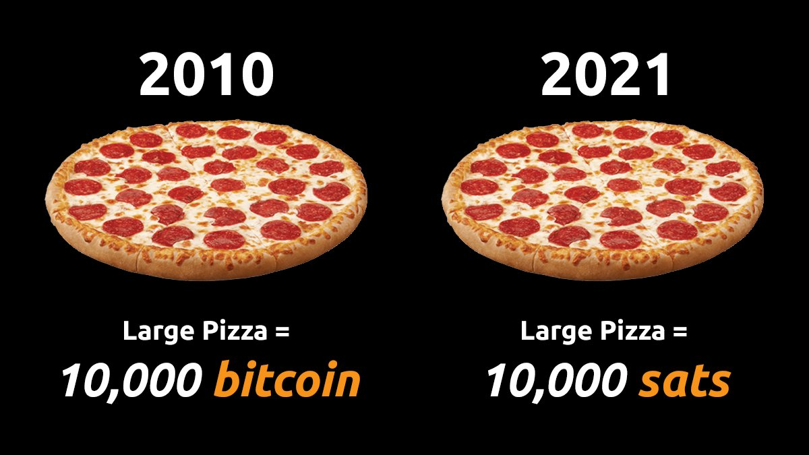
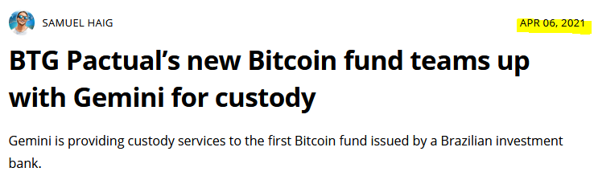
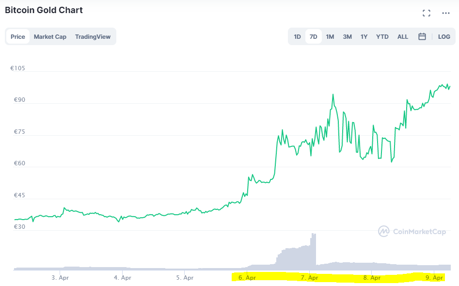

# Weekly Nr. 23 - Kleptocrats, Bitcoin will make you obsolete

## Thought of the Week by Anita
Don't rate the potential of Bitcoin because of banks and hedge funds adopting it. We all tend to praise the big players who seem to prove Bitcoin's use case. But they are here for the money and the asset, not the open, neutral network that is enabling global peaceful exchange of value that can't be disrupted by banks or governments. Money that can't be seized due its uncensorability. We should look to the people of Nigeria, Kenya, India, Venezuela or Argentina. Bitcoin proving its use case there, is the important thing. And if we all by the way raise our personal wealth - perfect. There is no guarantee for that, but the Bitcoin network has long proven its usefulness as a tool for freedom.

---
## This is where Bitcoin will shine
Kleptocrats doing, what they are doing for centuries. Bitcoin can fix this.
<blockquote class="twitter-tweet">
Ex-Finance minister Tendai Biti says by reintroducing the Zimbabwean  dollar, govt staged a grand heist and in one fell swoop wiped off entire stock of domestic debt that stood at US$12bn.  &quot;It reduced government wage Bill from 91% of total expenditure to less than 40%,&quot; he said. <a href="https://t.co/GOy5yJwaQt">pic.twitter.com/GOy5yJwaQt</a>
&mdash; TheNewsHawks (@NewsHawksLive) <a href="https://twitter.com/NewsHawksLive/status/1380204054660448258?ref_src=twsrc%5Etfw">April 8, 2021</a></blockquote> 

---
## Satoshi Nakamoto's motives
Bitcoin is highly political. No doubt. Only this week I learned that Satoshi Nakamoto's birthday is symbolic. Making Bitcoin unconfiscatable was top priority.

<blockquote class="twitter-tweet">
Satoshi Nakamoto listed their birthday as April 5, 1975  If you are wondering what animated them to create Bitcoin:  April 5 = FDR signed order 6102 making it illegal for Americans to own gold  1975 = Americans could legally own gold again  It’s all about about financial freedom.
&mdash; Alex Gladstein (@gladstein) <a href="https://twitter.com/gladstein/status/1379129556787818498?ref_src=twsrc%5Etfw">April 5, 2021</a></blockquote> 

---
## Quote of the Week
> "You will not find a solution to political problems in cryptography." 
**Satoshi Nakamoto's answer**: "Yes, but we can win a major battle in the arms race and gain a new territory of freedom for several years."

---
## Meme of the Week

h/t @DocumentingBTC

Edit: The graphic is actually wrong (today - it might not in a few years). Laszlo Hanyecz bought 2 pizzas for 10,000 bitcoin back in 2010.

---
## Education is key
We're so early that people still don't understand where they are putting their money. Last week a [new fund was announced called BTG Pactual](https://cointelegraph.com/news/btg-pactual-s-new-bitcoin-fund-teams-up-with-gemini-for-custody). "Investors" started buying Bitcoin Gold BTG, which is a hard fork (a split-off) from Bitcoin BTC and has nothing to do with the BTG fund.

## No, just no
Two things regarding the security of your hardware wallet.
* I wouldn't connect a hardware wallet via Bluetooth. I read the new generation of Bluetooth connections is very secure, but still, not for me.
* Even more not for me: a hardware wallet that can be unlocked via fingerprint. I'll get nightmares, if I think too much about that.
<blockquote class="twitter-tweet">
Thing, maybe, but bad idea. If someone wants my money I can forget a password, but they can get my finger. <a href="https://t.co/q6YcCQ30pq">https://t.co/q6YcCQ30pq</a>
&mdash; Anita ✊🏼🔑🏳️‍🌈🏊🏻🚴‍♂️☮️ (@AnitaPosch) <a href="https://twitter.com/AnitaPosch/status/1379832733577457676?ref_src=twsrc%5Etfw">April 7, 2021</a></blockquote> 

## Inflation is a good thing?
Central bank mantra is: we need inflation to steer the economy in the right direction, because we know how to control the effects of the global economy on our country. 
Maybe this worked 350 years ago, when central banks were invented. In the last decades it made the gap between rich and poor bigger and bigger. The rich see least amount of inflation, which proves French economist Richard Cantillon's theory from 1730 that the original recipients of new money enjoy higher standards of living at the expense of later recipients. The rich get cheap money, because they have securities to back the loans, they buy new assets in form of real estate, the poor and the middle class have no securities, they can't get cheap loans, they have to pay rising rents.

<blockquote class="twitter-tweet">
Inflation is also higher for the poorest, which shows how monetary policy hurts the weaker segments. <a href="https://t.co/ifzImsHjGC">pic.twitter.com/ifzImsHjGC</a>
&mdash; Daniel Lacalle (@dlacalle_IA) <a href="https://twitter.com/dlacalle_IA/status/1380162514328055808?ref_src=twsrc%5Etfw">April 8, 2021</a></blockquote> 

## Fractional reserve banking coming to Bitcoin
Caitlin Long is speaking, I'm listening. With 22 years of corporate finance experience on Wall Street and at the same time being a Bitcoin advocate, she warned about fractional reserve banking in Bitcoin for many years. I [spoke with her in 2019 about this dangerous practice](https://bitcoinundco.com/en/caitlin-long/) and why it should not be applied in Bitcoin. But let the banks, do their bank thing.

 <blockquote class="twitter-tweet">
BEWARE: FRACTIONAL RESERVE <a href="https://twitter.com/hashtag/bitcoin?src=hash&amp;ref_src=twsrc%5Etfw">#bitcoin</a> IOUs coming. &quot;Unlike a crypto exchange, Pure Digital is building an OTC offering w/ BILATERAL CREDIT LINES&quot; Translation: big banks bring big leverage to BTC. But leverage &amp; bitcoin don&#39;t mix-won&#39;t end well for the banks.<a href="https://t.co/zBERhmPxOV">https://t.co/zBERhmPxOV</a>
&mdash; Caitlin Long 🔑 (@CaitlinLong_) <a href="https://twitter.com/CaitlinLong_/status/1380153979603128332?ref_src=twsrc%5Etfw">April 8, 2021</a></blockquote> 

## The energy debate will never end
As long as people don't understand that Bitcoin is a tool of freedom dressed up as a get-rich-quick scheme (h/t @naval) they will bash Bitcoin for its energy use. If this were the only misunderstanding ok, we could handle that, but most arguments are simply wrong, come with false assumptions, and even worse from an ego-centric position of "I know better - we don't need Bitcoin, we need to ban it". 
<blockquote class="twitter-tweet">
it never ends <a href="https://t.co/4pfE0vnDeU">pic.twitter.com/4pfE0vnDeU</a>
&mdash; nic carter (@nic__carter) <a href="https://twitter.com/nic__carter/status/1379830399514329088?ref_src=twsrc%5Etfw">April 7, 2021</a></blockquote> 

It's great to see initiatives rising that aim to address that topic like [netpositive.money](https://twitter.com/netposmon) or this with CoinShares.

<blockquote class="twitter-tweet">
actions &gt; words  excited to launch the 🌍 Crypto Climate Accord 🌍, a private sector-led initiative for the entire crypto community which aims to decarbonize public blockchains by 2025.  together, we win. divided, we fall.   please join us 👇🏾<a href="https://t.co/NuTiweQ3T4">https://t.co/NuTiweQ3T4</a>
&mdash; Meltem Demirors (@Melt_Dem) <a href="https://twitter.com/Melt_Dem/status/1380176474867650568?ref_src=twsrc%5Etfw">April 8, 2021</a></blockquote> 

## Bitcoin transforms lost energy into value 

And at the same time 67% of all energy produced is lost. Bitcoin miners are using this otherwise wasted energy. I spoke with [Sébastien Gouspillou](https://bitcoinundco.com/en/sebastien-gouspillou/) and [Philippe Bekhazi](https://bitcoinundco.com/en/philippe-bekhazi/) two miners using hydropower. Listen to them, not second or third sources.

<blockquote class="twitter-tweet">
Important message indeed: 67% of all energy produced is lost. <a href="https://twitter.com/hashtag/bitcoin?src=hash&amp;ref_src=twsrc%5Etfw">#bitcoin</a> mining primarily uses this waste energy. Energy concerns about bitcoin mining are mostly plain wrong.<a href="https://t.co/PxoWAnomdN">https://t.co/PxoWAnomdN</a> <a href="https://t.co/3sTasOzfBH">https://t.co/3sTasOzfBH</a> <a href="https://t.co/ZJLbp13nhh">pic.twitter.com/ZJLbp13nhh</a>
&mdash; PlanB (@100trillionUSD) <a href="https://twitter.com/100trillionUSD/status/1372945336277331970?ref_src=twsrc%5Etfw">March 19, 2021</a></blockquote> 

