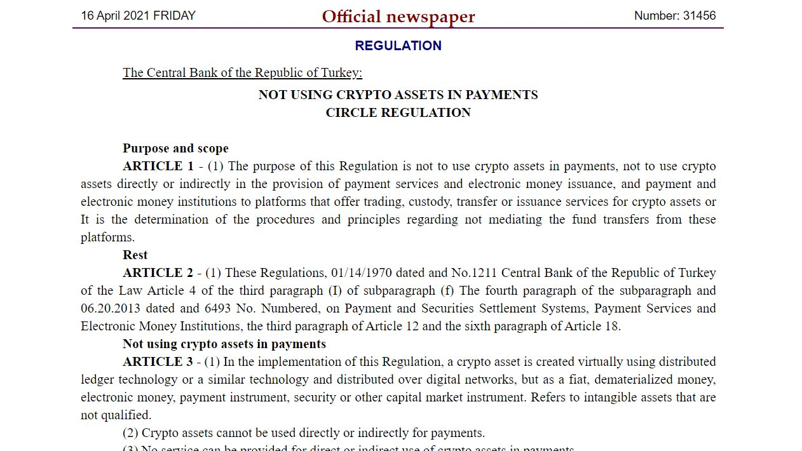
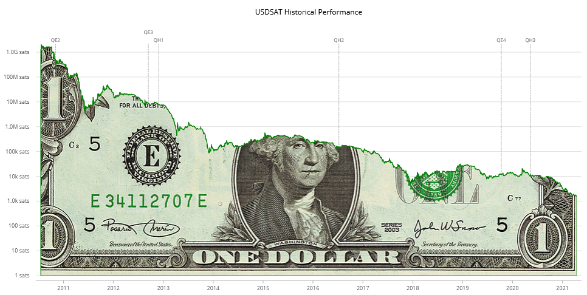
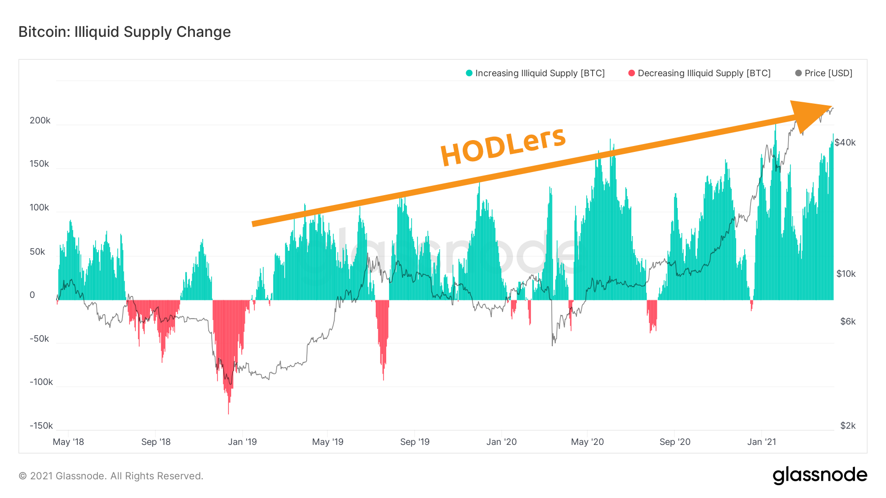

# Weekly Nr. 24 - Bitcoin Is an Alternative

<iframe width="100%" height="476" src="https://www.youtube-nocookie.com/embed/zD9R3bLnlIo" title="YouTube video player" frameborder="0" allow="accelerometer; autoplay; clipboard-write; encrypted-media; gyroscope; picture-in-picture; web-share" referrerpolicy="strict-origin-when-cross-origin" allowfullscreen></iframe>

## Thought of the Week by Anita Posch
More and more I realize how scared a big fraction of people are - in general. In today's world there are many reasons to be concerned about the future. But isn't the future something we can shape all-together? Instead of looking into new possibilities, innovating and risk-taking most people sit on the sidelines commentating, criticizing and in the end feeling left out. 

Many people fear the changes Bitcoin will bring. I think only authoritarian leaders have to be scared, it takes their power away shifting from a top-level hierarchy to a set of mathematical rules that can't be corrupted. 

## Quote of the Week
> "Bitcoin isn't about getting your money out of your country. It's about getting your country out of your money." - **Farbood**

## Turkey bans banks from using crypto
When your national currency is inflating 11% per year, and you are an authoritarian regime feeling threatened to lose its monetary control, what are you doing when people start using non-inflatable money? You (try) to ban it through disallowing institutional on- and off-ramps. But you can't stop people using bitcoin peer-to-peer. The Turkish central bank's attempt will not only fail, the value of bitcoin will rise. [Source](https://www.resmigazete.gov.tr/eskiler/2021/04/20210416-4.htm)

## Argentina needs Bitcoin

> "If you think, the world doesn't need Bitcoin, come and live here!" - Franco Amati about the need for Bitcoin in Argentina.

https://youtu.be/PNuz3211cwY

## The US dollar in satoshis
How many satoshis you need to buy one dollar. Value of BTC goes up, value of USD goes down. [Source](https://usdsat.com/)

## Meme of the Week
This week we reached a new all time high with $ 64,804. For some the resistance at 60,000 was a test in patience. Every day people waited for it to happen. For me Groundhog Day with Bill Murray and Andi MacDowell is one of the funniest movies ever. Therefore I found Paige Erlich's meme very funny.

<blockquote class="twitter-tweet">
Under 60 be like - <a href="https://t.co/1B2UufGpbv">pic.twitter.com/1B2UufGpbv</a>
&mdash; Paige Erlich (@PaigeErlich) <a href="https://twitter.com/PaigeErlich/status/1380323710574460932?ref_src=twsrc%5Etfw">April 9, 2021</a></blockquote> 

## Freedom movement in Congo accepting bitcoin donations
LUCHA a non-violent freedom movement in the Congo is now accepting bitcoin donations. 

>"We are going to use Bitcoin to defend our freedoms and support the ongoing campaign for peace in Beni....Bitcoin has been an instrument of support for several struggles and organizations like #EndSARS and Human rights Foundation especially to circumvent censorship."

<blockquote class="twitter-tweet">
DR Congo is a nation of 90M, beset by double-digit inflation + authoritarianism.  Despite the odds, a remarkable non-violent movement for democracy and freedom called LUCHA is rising up.  They are now accepting BTC donations. Watch this doc to learn more:<a href="https://t.co/wIsB4SMwAk">https://t.co/wIsB4SMwAk</a> <a href="https://t.co/2QB8wxl0sr">https://t.co/2QB8wxl0sr</a>
&mdash; Alex Gladstein (@gladstein) <a href="https://twitter.com/gladstein/status/1381124669621760011?ref_src=twsrc%5Etfw">April 11, 2021</a></blockquote> 

Also in the DR of Congo: [Bitcoin miner Sébastien Gouspillou](https://bitcoinundco.com/en/sebastien-gouspillou/), whose bitcoin mining earnings are subsidizing a new hydropower station in the Virunga national park. Heard it? If not then go ahead, it's really interesting and there is also a transcript. 

---
## Insurer AXA is accepting bitcoin
AXA is the first all-lines insurer in Switzerland to allow its customers to pay their bills with Bitcoin. They state that it represents an investment in the company's digital future in response to growing customer demand for more choice when it comes to payments. The bitcoin go to the crypto broker Bitcoin Suisse, which converts them into Swiss francs. AXA holds no bitcoin on its balance sheet. [Source](https://www.axa.ch/en/ueber-axa/blog/trend/bitcoin-cryptocurrency%20.html)

---
## More HODLing, potentially bullish
This chart shows the increase of illiquid supply since 2019. Illiquid supply are bitcoin that have not been moved for a longer period of time. Consider long-term investors who keep their BTC locked in a cold wallet with the intention of holding it for long periods of time: Their BTC is practically removed from the liquid portion of the Bitcoin supply that is in circulation and accessible for trading. In contrast, exchanges with constant in- and outflows directly contribute to the pool of liquid supply. [glassnode - supply](https://insights.glassnode.com/bitcoin-liquid-supply/)

An increasing number of individuals and institutions are holding on to their coins, removing supply from the market, which can be a driver for bitcoin's price.

But, but, the naysayers go...."if you don't spend bitcoin, the project has failed!" No. A completely new form of money has to find its value in real life first. As soon as the volatility decreases and trust has been built, people will start spending, and earning bitcoin. 

---
## ...and another article full of false arguments
This week the New York Times reminded the public about the fact that Bitcoin uses lots of electricity. Yes it does, that's right. But the arguments in the article don't hold and the conclusions are wrong. Nic Carter thankfully wrote a rebuttal. 

<blockquote class="twitter-tweet">
New for me, with great regret: My rebuttal to the meritless NYT piece on Bitcoin&#39;s energy consumption<a href="https://t.co/1KSOt5K71Q">https://t.co/1KSOt5K71Q</a>
&mdash; nic carter (@nic__carter) <a href="https://twitter.com/nic__carter/status/1382712674396508168?ref_src=twsrc%5Etfw">April 15, 2021</a></blockquote> 

---
## Coinbase's direct listing
The business and media world thinks that "cryptocurrency backers have spent years insisting that bitcoin, ethereum and other digital coins could revolutionize the world of finance. Finally, they're getting their moment." 

"The [Wall Street debut](https://edition.cnn.com/2021/04/14/investing/coinbase-stock-direct-listing/index.html) of cryptocurrency exchange Coinbase on Wednesday was a massive success, with the company's valuation at one point topping $100 billion. Shares finished the trading session at $328.28 apiece, lending the company a market value of nearly $86 billion."
 
While that may be sort of proof of Bitcoin's validity for mainstream - on the inside some Bitcoiners are crumbling since Coinbase's leadership hasn't really shown much appreciation for the underlying values of Bitcoin.  

> "Coinbase has supported every major hard fork initiative. If any of them succeeded, the company would have gained more control over the Bitcoin network. Being a top backer of a project with clear leaders would have given them an edge. It’s against the principles of Bitcoin, but seemingly-ideal to make more fiat." [Source](https://privacypros.io/exchanges/delete-coinbase/)

Anyhow, it's definitely a milestone in Bitcoin's history.
<blockquote class="twitter-tweet">
Someone I respect messaged me confused about why I&#39;m throwing shade at Coinbase instead of being happy for them and what they&#39;ve done for Bitcoin. Full transparency, here&#39;s my response. <a href="https://t.co/sRxHcIe81z">pic.twitter.com/sRxHcIe81z</a>
&mdash; Stephen Cole (@sthenc) <a href="https://twitter.com/sthenc/status/1382210646209560576?ref_src=twsrc%5Etfw">April 14, 2021</a></blockquote> 

