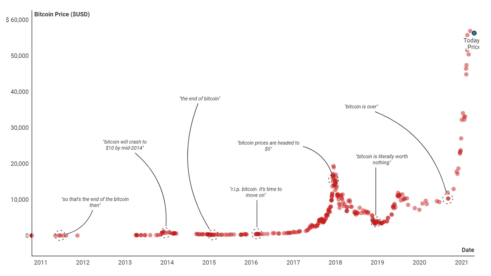
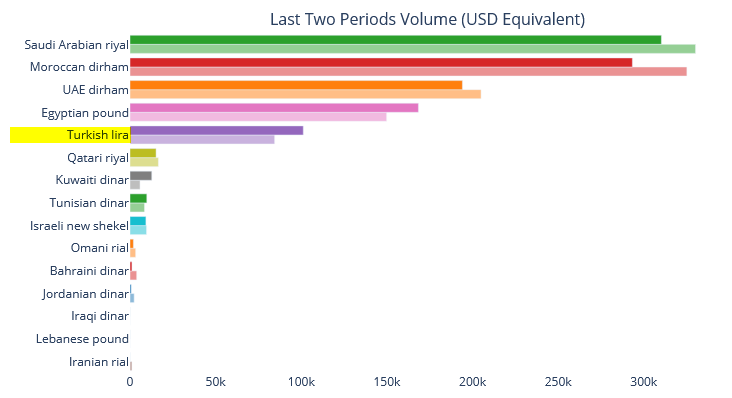
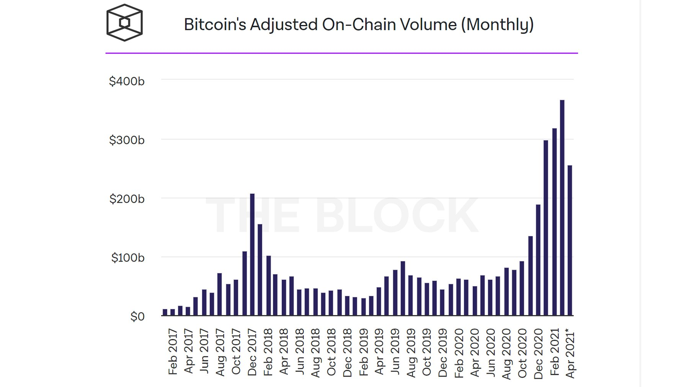
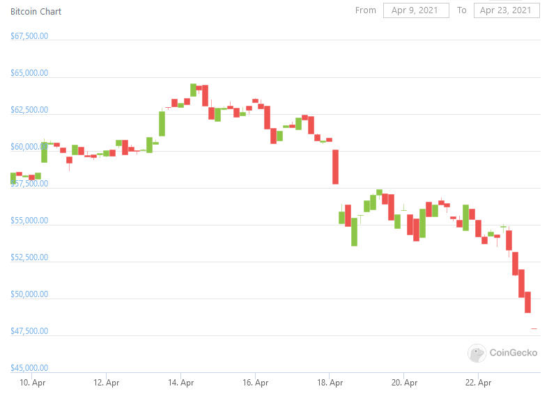
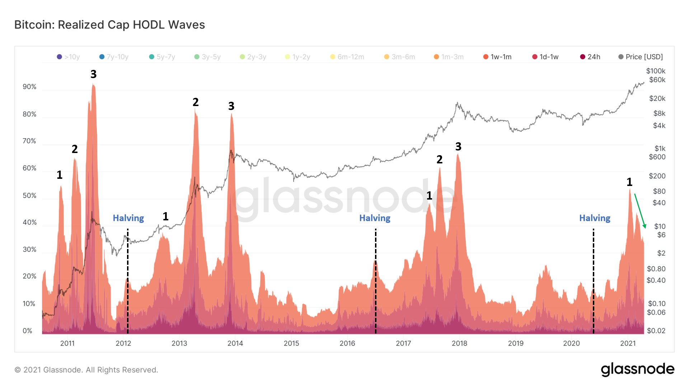

# Weekly Nr. 25 - Is Bitcoin dead again?

<iframe width="100%" height="476" src="https://www.youtube-nocookie.com/embed/JCtbmOt9fDE" title="YouTube video player" frameborder="0" allow="accelerometer; autoplay; clipboard-write; encrypted-media; gyroscope; picture-in-picture; web-share" referrerpolicy="strict-origin-when-cross-origin" allowfullscreen></iframe>

## 1 Thought of the Week by Anita Posch
Bitcoin acts like a living organism. It's a self-regulating, neutral and open financial Internet infrastructure, that is growing and healing itself in case of incidents. This weeks power outage in China and the price drop are the perfect time for another entry in the "Bitcoin is dead" database of notable skeptics. It will be the 328th time that it does not die.

 [Source](https://twitter.com/jerryxfeng)

---
## 2 Quote of the Week
> In the near future, the government having a monopoly on money will seem as strange as the government having a monopoly on religion or language. - **Conner Brown**

---
## 3 Major drop in hash rate due to China
Due to an incident in Xinjiang Bitcoin's hash rate dropped by an estimate 20-25% from April 15-16th. There a two main areas of mining in China, in the wet season most miners are operating in Sichuan where's an abundance of excess energy from hydro power stations. In the current dry season mining moves to the province of Xinjiang, where 56.6% of the grid is powered by coal and 43.4% by renewables. 

What can we learn from that outage, which gives us many data points:
* Due to the lower hash rate blocks get mined slower, which leads to higher transaction fees.
* Bitcoin has a built-in difficulty adjustment. Hash rate is automatically adjusted every 2016 blocks (approx. every 14 days). If the hash rate decreases the hash rate difficulty is lowered, so that the rhythm of mined blocks - one every 10 minutes - is restored.
* A potential Chinese mining ban would have the same result: Bitcoin in general is not affected. With more Lightning Network adoption in the future, payments will still be cheap and fast. Not every payment has to be settled on-chain. 
* This accident might drive decentralization further, because miners learned not to operate at one single location. Mustafa Yilham from Bixin Group (accounts for 2.5% of all Bitcoin mining) expects more miners moving outside China or to regions that are mainly powered by renewable energy.
* It seems that the share of global hash rate in China has dropped from 60% in the last year. In a few weeks we will know, if the estimate of Yilham comes true, that China's share is around 32-40% at most. Which would be the time to stop the story that mining is centralized in China.

<blockquote class="twitter-tweet">
So if estimated 80% of the mining in China was located in Xinjiang as of last week, and 80% of them were shut down and it only affected 20-25% of the network. That means hashrate in China is currently around 32-40% at most. Time to stop the China control network FUD.
&mdash; Mustafa Yilham (@MustafaYilham) <a href="https://twitter.com/MustafaYilham/status/1384278277179674626?ref_src=twsrc%5Etfw">April 19, 2021</a></blockquote> 

---
## 4 China recognizes Bitcoin as investment option

<blockquote class="twitter-tweet">
Breaking: Li Bo, deputy governor of the Central Bank of China, said that crypto assets such as Bitcoin should be used as investment tools or alternative investments. This is the first time that the Chinese government has recognized the asset value of cryptocurrencies. <a href="https://t.co/bgDIVA1eMJ">pic.twitter.com/bgDIVA1eMJ</a>
&mdash; Wu Blockchain (@WuBlockchain) <a href="https://twitter.com/WuBlockchain/status/1383798033679224836?ref_src=twsrc%5Etfw">April 18, 2021</a></blockquote> 

---
## 5 Turkey bans Bitcoin - Trading volume increases
Last week the Turkish central bank announced a ban on Bitcoin that will take effect from May. Effect: the P2P trading volume in Turkey increased 20% in the last 7 days.

---
## 6 Bitcoin a trojan horse for freedom

> "People who don't care about human rights or are anti human rights gonna be forced to buy it and start strengthening its global network effects, they don't care about what it does for people, but they don't need to care, Bitcoin doesn't run on altruism." - **Alex Gladstein, Human Rights Foundation**

https://youtu.be/uQRkOn0A5qA

---
## 7 Bitcoin growing faster than the Internet

The Bitcoin adoption curve is very similar to the adoption of the Internet. We are very early, it's comparable to 1997. But Bitcoin is growing faster.

<blockquote class="twitter-tweet">
In terms of adoption, Bitcoin has roughly the same users as the Internet had in 1997.  But Bitcoin&#39;s growing faster. Next 4 years on current path will bring Bitcoin users to 1b people, that&#39;s the equivalent of 2005 for the Internet. <a href="https://t.co/Np9yTR3WkL">pic.twitter.com/Np9yTR3WkL</a>
&mdash; Willy Woo (@woonomic) <a href="https://twitter.com/woonomic/status/1356310219215699968?ref_src=twsrc%5Etfw">February 1, 2021</a></blockquote> 

---
## 8 On-chain volume record
Bitcoin transaction volume reached a new all time high in March. $366.3 billion have been sent, @TheBlock__ reports. 

---
## 9 Don't fret, price moves without you
Last weeks price drop stresses you out? Don't, it will go up again. 

In the meantime I have a meditation for you: Bitcoin strength and endurance. Hilarious.

https://youtu.be/l1ltkH6Fepo 

Nobody says that what happened in the past will be repeated in the future, but each halving has had three peaks of supply held by short-term holders. We just saw the first drop, it might be that there will be one or two to come, which could result in a prce increase.

