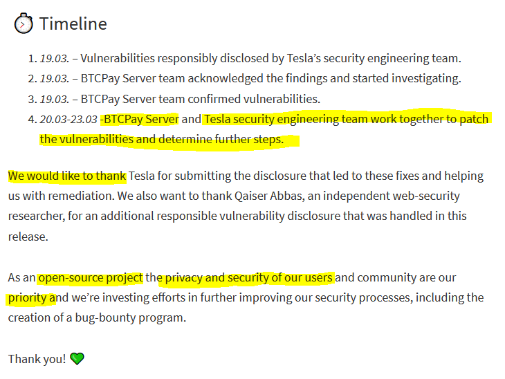
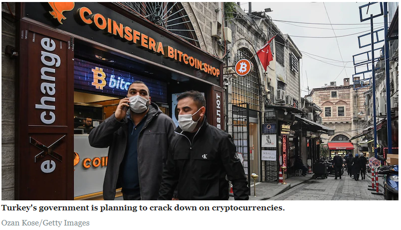
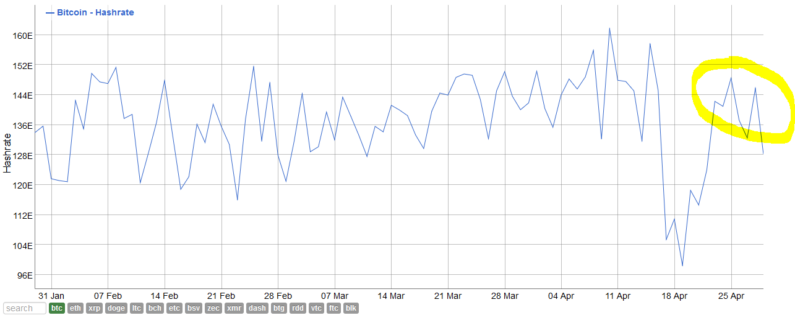
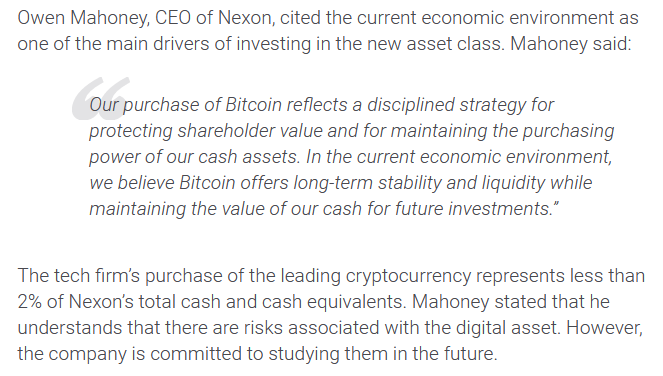

# Weekly Nr. 26 - The BullBear Week

<iframe width="100%" height="476" src="https://www.youtube-nocookie.com/embed/e0qGbamD5Xg" title="YouTube video player" frameborder="0" allow="accelerometer; autoplay; clipboard-write; encrypted-media; gyroscope; picture-in-picture; web-share" referrerpolicy="strict-origin-when-cross-origin" allowfullscreen></iframe>

## 1 Thought of the Week by Anita Posch

What a fun week, the convinced Bitcoiner says, while the gamblers are crying over their losses. Yeah, we're still ~10k away from the all-time-high, but who cares. If you're in the Bitcoin mindset and looking forward to the bitcoin circle economy then it really doesn't matter and you buy the dip. Thanks to [@BitcoinMemeHub](https://twitter.com/BitcoiniMemeHub) for capturing the moment.

---
## 2 Quote of the Week
> "I think it's essential for a program of this nature to be open source." - Satoshi Nakamoto

---
## 3 Tesla's security team helped patching a bug in BTCPay

BTCPay Server is an open source payment processor used by thousands of merchants globally. It enables individuals and companies to receive bitcoin payments or donations. The great thing is, it's absolutely free, while any of the traditional payment processors take a cut of the sales. Tesla is using BTCPay to receive payments in its online shop and the security team found vulnerabilities in the code, which then were disclosed and patched together with the BTCPay team. [Source](https://blog.btcpayserver.org/vulnerability-disclosure-v1-0-7-0/)

This is why open source software is superior. It allows for collaboration between different entities which even could be competitors, because the underlying software is neutral. That goes for Bitcoin too and this is why it is the best candidate for a world reserve currency. You can [learn more about the fantastic founding story of BTCPay in my interview with Nicolas Dorier](https://bitcoinundco.com/en/nicolas-dorier/). 

https://www.youtube.com/watch?v=8GkbkNKBEl4

---
## 4 China, please ban mining!

The Chinese capital city of Beijing is conducting a check on data centres involved in cryptocurrency mining to better understand their impact on energy consumption, according to sources and a document seen by [Source: Reuters](https://www.reuters.com/article/china-bitcoin/chinas-capital-probes-cryptocurrency-mining-sources-idUSL4N2MM0ZL).

Data centres need to report the amount, and share, of power consumed by cryptocurrency mining, according to the notice.

Edward Lu, senior vice president of Canaan Inc, a Chinese maker of cryptocurrency mining machines, said it increasingly serves clients in places such as Canada, northern Europe and central Asia, which have cheap and abundant electricity and clear and predictable regulations.

"China used to be a place where cryptocurrency mining was thriving, but the business is shrinking due to policies," Lu said.

<blockquote class="twitter-tweet">
Damn, you mean China will crack down on miners and they will spread across different countries and get <a href="https://twitter.com/hashtag/bitcoin?src=hash&amp;ref_src=twsrc%5Etfw">#bitcoin</a> more decentralised? Let&#39;s hope this is true. Thank you China (but this time do it for real 🙏)
&mdash; @ndeet@bitcoinhackers.org (@ndeet) <a href="https://twitter.com/ndeet/status/1387892379181531144?ref_src=twsrc%5Etfw">April 29, 2021</a></blockquote> 

---
## 5 Bad news for Turkish exchange customers

After the [announced ban on crypto payments](https://anitaposch.com/weekly-24) two weeks ago two Turkish exchanges - Thodex and Vebitcoin - stopped operations this week leaving thousands of customers without access to their funds. This is tragic, but not something where we need to ask for more regulation like Philip Gradwell did, chief economist at the surveillance company Chainalysis, he said: ["The troubles at Turkish exchanges illustrate the importance of clear and stable regulation for cryptocurrency."](https://markets.businessinsider.com/currencies/news/crypto-exchange-collapses-turkey-bitcoin-risks-btc-vebitcoin-thodex-2021-4-1030346376) - No, these troubles show that people need to hold their keys themselves and not use custodians. 

---
## 6 Bitcoin promotes fairness

> "Bitcoin is the biggest chance for humanity, the human rights movement, for anti-corruption measurements and for a more peaceful and fair life together, because Bitcoin enables a transparent, open, permissionless exchange of value, which is a human need that can be satisfied by Bitcoin in a decentralized way for everyone equally around the world." - **Anita Posch**

https://youtu.be/UqPHi_mNLac

---
## 7 Bitcoin works without Internet 
Did you know that one can send bitcoin over ham radio? That Blockstream rented satellites which cover the planet and stream the Bitcoin blockchain down to earth? Now you know.

In case of bad Internet reception, an electricity outage or Internet shutdowns by your friendly authoritarian government one can use a traditional satellite dish and receive bitcoin transactions to stay synchronized and verify one's own transactions. Now Blockstream offers a BaseStation, that you only need to assemble, align and start.

<blockquote class="twitter-tweet">
Get the new <a href="https://twitter.com/hashtag/BlockstreamBaseStation?src=hash&amp;ref_src=twsrc%5Etfw">#BlockstreamBaseStation</a> and access the <a href="https://twitter.com/hashtag/Bitcoin?src=hash&amp;ref_src=twsrc%5Etfw">#Bitcoin</a> satellite network to get your blocks from geosynchronous orbit. 🚀<a href="https://t.co/iDGXEWnHNI">pic.twitter.com/iDGXEWnHNI</a> <a href="https://t.co/PYLZ1a74rs">https://t.co/PYLZ1a74rs</a>
&mdash; Samson Mow (@Excellion) <a href="https://twitter.com/Excellion/status/1387509237945749506?ref_src=twsrc%5Etfw">April 28, 2021</a></blockquote> 

---
## 8 Hash rate recovering
After last weeks drop in hash rate due to the incident in a Chinese energy plant, the hash rate has been bouncing back. Proving [what I said last week - Bitcoin is a self-regulating organism](https://anitaposch.com/weekly-25).

---
## 9 Publicly-listed tech firm Nexon purchases $100 million in Bitcoin as a store of value
Online game provider Nexon Co. acquired $100 million in Bitcoin. This became the largest-ever purchase of bitcoin made by a listed company in Tokyo. The purchase represents less than 2% of Nexon's total cash and cash equivalents. They are tipping their toes in it, a great strategy to learn for the future. [Source](https://www.fxstreet.com/cryptocurrencies/news/publicly-listed-tech-firm-nexon-purchases-100-million-in-bitcoin-as-a-store-of-value-202104280238)

---
## Subscribe to (L)earn Bitcoin

[Subscribe for my weekly newsletter. It's free.](https://anita.link/weekly)

---

If you want to check, here is today's [Bitcoin price](https://www.coingecko.com/en/coins/bitcoin).

No financial advice. DYOR.