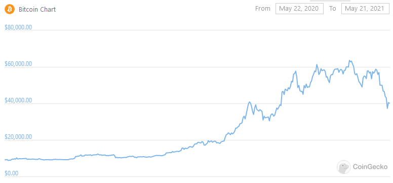
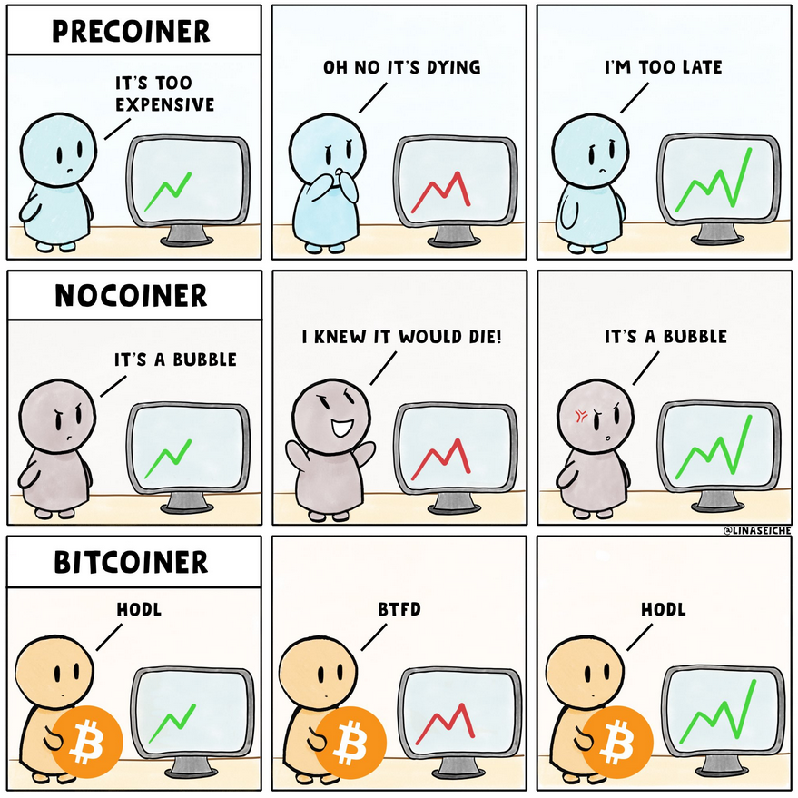
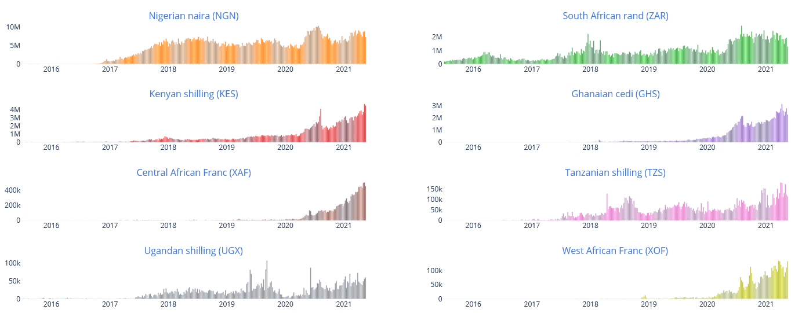
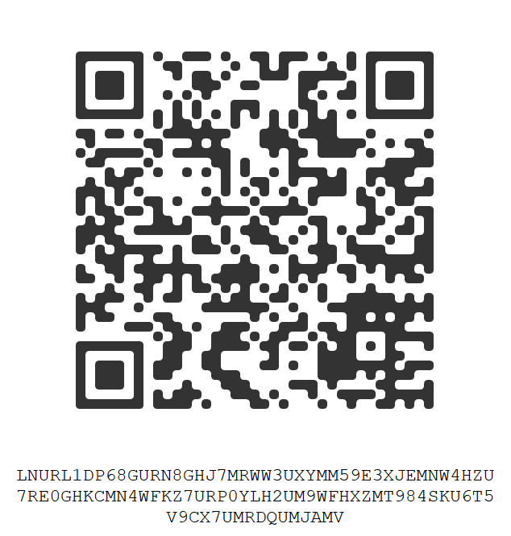

# Weekly Nr. 29 - Bitcoin Is On Sale and That's Good

<iframe width="100%" height="476" src="https://www.youtube-nocookie.com/embed/4de2ToVnvJA" title="YouTube video player" frameborder="0" allow="accelerometer; autoplay; clipboard-write; encrypted-media; gyroscope; picture-in-picture; web-share" referrerpolicy="strict-origin-when-cross-origin" allowfullscreen></iframe>

If you want to try something new - you can now support my work through sending some sats over the Lightning Network by scanning the QR code on the thumbnail of the episode on YouTube. This technology is called LNURL and it works with following wallets: BlueWallet, Zeus, Zap, Wallet of Satoshi or BLW. Scroll down and you'll find the QR code too. 

## 1 Thought of the Week by Anita
While the **speculators have been shaken out** by last weeks dip in Bitcoin, Sub-Saharan Africans are accumulating and using it for their real-life needs and struggles. Bitcoin is up 320% in the last year, when dropping 30% media call it a bloodbath, while the real bloodbaths happen in developing nations. **28 countries did NOT vote for the protection of their people against genocide, ethnic cleansing, war crimes and crimes against humanity** at the UN this week! These people need Bitcoin.

---
## 2 Quote of the Week
> "We are in the capitulation phase, which is a really great time to buy.", says **Cathie D. Wood** CEO of ARKinvest 

<blockquote class="twitter-tweet">
<a href="https://t.co/SUPUET7Ztl">pic.twitter.com/SUPUET7Ztl</a>
&mdash; ODELL (@matt_odell) <a href="https://twitter.com/matt_odell/status/1395053254288068612?ref_src=twsrc%5Etfw">May 19, 2021</a></blockquote> 

---
## 3 Bitcoin dipping, what's next?
In the last month we saw an "astonishing" bitcoin price drop of 30%. Media articles have been referring to this as the [bloodbath, the carnage](https://decrypt.co/71405/5-reasons-crypto-market-500-billion-bloodbath) and new entrants to the market - so called weak hands - started panicking and sold their coins. Many saw Elon Musk's dismissal of Bitcoin's energy consumption as the single reason for the dip, while this might have triggered the sale, there were more reasons:

* FUD spread by Reuters over a new ban for banks to use cryptocurrency in China - this regulation is in place since 2017
* Leveraged positions got liquidated - many firms had bet on Bitcoin using borrowed money (leverage). This is ok, as long as prices hold steady or rise. But when prices drop significantly, trading houses ask firms to post extra collateral. If the firms can't do that, their positions will be liquidated to cover their exposure. Which adds to the panic.
* Uncertainty over Tether's reserve - Tether is a stablecoin pegged to the US Dollar. Last week tether revealed a breakdown of their reserves, which were not reassuring to the critics. This unease might have added up to the drop in price.
* Tax day in the US - May 17 was the final day to file taxes for many Americans. Those who actively traded crypto last year likely finished 2021 with a healthy profit. As such, many U.S. crypto holders may have sold of a chunk of their portfolio this week to pay Uncle Sam.

While we saw a dip of 30% at the same time bitcoin gained 320% in the last 12 months. For long-term believers in Bitcoin this was just another drop, just another possibility to buy bitcoin for a better price. 

Now **compare this dip to the value loss of national currencies** like the Turkish Lira, the Brazilian Real, the Russian Ruble, the Argentine Peso or the Venezulean Bolivar they lost between -60% to -100% of value from 2010 to today, while Bitcoin went from Zero to  $40,000 without any government help.

<blockquote class="twitter-tweet">
The &quot;cryptocurrency crash&quot; in perspective.  Bitcoin vs USD 2010-Today: +67,138,762% Venezuelan Bolivar -100% (redenominated and collapsed a few times over)  Argentine peso -95.7% Turkish Lira -82.1% Brazilian Real -67.1% Russian Ruble -59.2%<a href="https://twitter.com/hashtag/Bitcoin?src=hash&amp;ref_src=twsrc%5Etfw">#Bitcoin</a> <a href="https://twitter.com/hashtag/cryptocurrencies?src=hash&amp;ref_src=twsrc%5Etfw">#cryptocurrencies</a>
&mdash; Daniel Lacalle (@dlacalle_IA) <a href="https://twitter.com/dlacalle_IA/status/1395337791660298240?ref_src=twsrc%5Etfw">May 20, 2021</a></blockquote> 

**What's next?** I don't know, what I know is, that on May 19, someone bought the dip - bitcoin worth $750 Million was moved off exchanges and this is a good time to stack some sats.

<blockquote class="twitter-tweet">
$750,000,000 worth of <a href="https://twitter.com/hashtag/bitcoin?src=hash&amp;ref_src=twsrc%5Etfw">#bitcoin</a> was just moved off of exchanges in the last 10 minutes. Someone bought the dip. <a href="https://t.co/uvHVk0i37Q">pic.twitter.com/uvHVk0i37Q</a>
&mdash; Documenting Bitcoin 📄 (@DocumentingBTC) <a href="https://twitter.com/DocumentingBTC/status/1395099131371266052?ref_src=twsrc%5Etfw">May 19, 2021</a></blockquote> 

---
## 4 Volatility is good
For long-term investors volatility is a good thing. A new form of peer-to-peer money has to find its value on the free market, it's only natural that it has volatility. Listen to what Mark Yusko, Founder, CEO of Morgan Creek Capital Management has to say:

<blockquote class="twitter-tweet">
&quot;<a href="https://twitter.com/hashtag/Bitcoin?src=hash&amp;ref_src=twsrc%5Etfw">#Bitcoin</a> has the same amount of volatility as Amazon stock...when was the right time to sell Amazon? That would be never. Volatility is not your enemy.&quot; <a href="https://twitter.com/MarkYusko?ref_src=twsrc%5Etfw">@MarkYusko</a> on <a href="https://twitter.com/search?q=%24BTC&amp;src=ctag&amp;ref_src=twsrc%5Etfw">$BTC</a> and crypto volatility: <a href="https://t.co/QLWcoR7DzA">pic.twitter.com/QLWcoR7DzA</a>
&mdash; Worldwide Exchange (@CNBCWEX) <a href="https://twitter.com/CNBCWEX/status/1395313638651609090?ref_src=twsrc%5Etfw">May 20, 2021</a></blockquote> 

How new entrants see the market and how Bitcoiners see the market (Source: @LinaSeiche):

---
## 5 Where Bitcoin is needed the most
These 15 countries voted against the UN resolution to protect against genocide, ethnic cleansing, war crimes and crimes against humanity! 

<blockquote class="twitter-tweet">
LIST OF SHAME: Countries who just voted NO to UN General Assembly resolution on the Responsibility to Protect.  🇰🇵 North Korea 🇰🇬 Kyrgyzstan 🇳🇮 Nicaragua 🇿🇼 Zimbabwe 🇻🇪 Venezuela 🇮🇩 Indonesia 🇧🇮 Burundi 🇧🇾 Belarus 🇪🇷 Eritrea 🇧🇴 Bolivia 🇷🇺 Russia 🇨🇳 China 🇪🇬 Egypt 🇨🇺 Cuba 🇸🇾 Syria <a href="https://t.co/AohcXFvxBY">pic.twitter.com/AohcXFvxBY</a>
&mdash; UN Watch (@UNWatch) <a href="https://twitter.com/UNWatch/status/1395062501310701569?ref_src=twsrc%5Etfw">May 19, 2021</a></blockquote> 

28 countries abstained from the vote. Millions of people in 43 countries live under authoritarian regimes. Zimbabwe and Eritrea are also on the list of shame. Listen to my [podcast episodes from Zimbabwe](https://bitcoinundco.com/en/bitcoin-zimbabwe/) and next week I will release an interview with Meron Estefanos, an activist who tells us about the depressing situation of Eritreans. These are the people, who need Bitcoin.

---
## 6 Sub-Saharan Africa's trading volume up in 2021
The trading volume on peer-to-peer exchanges LocalBitcoins.com and Paxful.com show increases up to 6,000 % in some of the Sub-Saharan African countries in the last 12 months. This thing has just been started and it goes to show, that Africans understand the usefulness of Bitcoin.

[Source: usefultulips.org](https://www.usefultulips.org/combined_Sub%20Saharan%20Africa_Page.html)

---
## 7 Bitcoin, NFTs and the arts 

This week's interview guest is Adam B. Levine, the pioneer of Bitcoin podcasting and an early supporter of NFTs. Adam had **Metakovan on his show, who bought Beeple's NFT for $ 69 million** - the most expensive NFT sold at an auction so far. Here he is talking about the misunderstandings around NFTs.

https://youtu.be/F0749D0mfU8

---
## 8 USA regulatory crackdown will spur decentralization

Seems as long as people pay their taxes and stay compliant with laws, the US government will enable innovation. But: Bitcoin doesn't care. Decentralized platforms like Sovryn will not be affected by centralized regulations. While I don't encourage breaking the law, in many countries of the world you simply have to break the law and regulations out of necessity. Or you're breaking the law, because you're publishing an unwanted truth - see WikiLeaks. [Caitlin Long, a guest on my show](https://anita.link/14) is summarizing the history of US crypto regulation in this tweet. 

<blockquote class="twitter-tweet">
1/ IT&#39;S CLEAR a US <a href="https://twitter.com/hashtag/crypto?src=hash&amp;ref_src=twsrc%5Etfw">#crypto</a> regulatory crackdown is starting but I&#39;m optimistic bc most of the major players/agencies have spoken already &amp; the policy is taking shape: it&#39;s &quot;pay taxes, comply w/ laws &amp; don&#39;t take shortcuts, &amp; we&#39;ll enable the innovation.&quot; It&#39;s NOT a &quot;<a href="https://twitter.com/hashtag/bitcoin?src=hash&amp;ref_src=twsrc%5Etfw">#bitcoin</a> ban&quot;
&mdash; Caitlin Long 🔑 (@CaitlinLong_) <a href="https://twitter.com/CaitlinLong_/status/1395489635120394242?ref_src=twsrc%5Etfw">May 20, 2021</a></blockquote> 

## 9 Donate to my work

Send some sats:

---
## Subscribe to (L)earn Bitcoin

[Subscribe for my weekly newsletter. It's free.](https://anita.link/weekly)

---

If you want to check, here is today's [Bitcoin price](https://www.coingecko.com/en/coins/bitcoin).

No financial advice. DYOR.