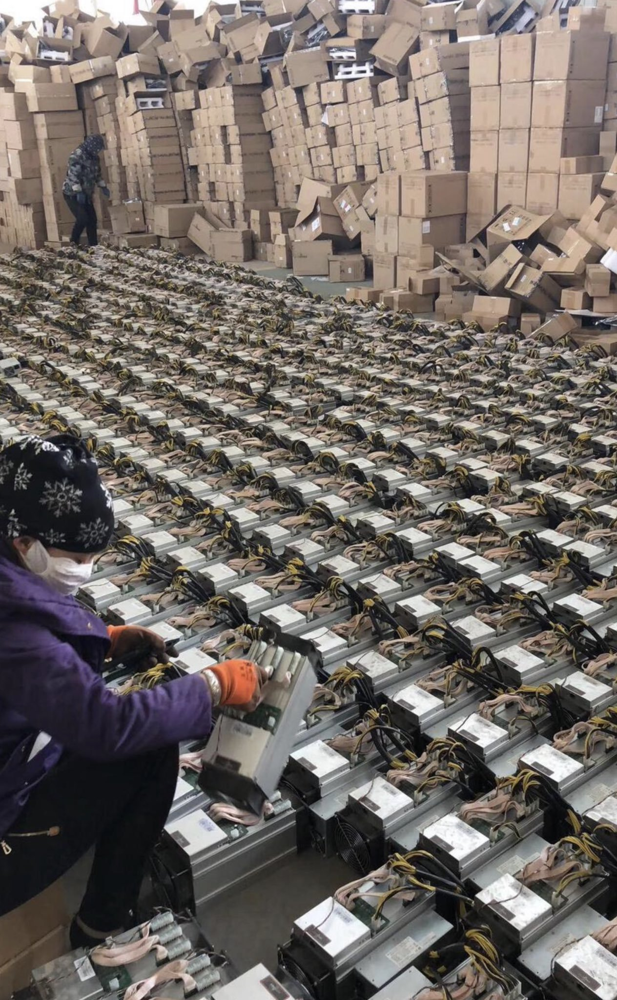
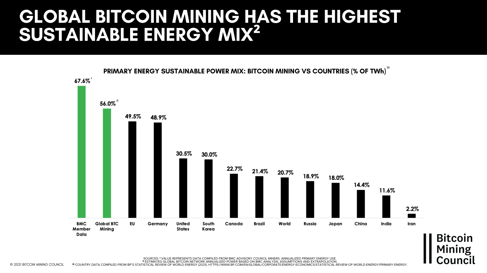

# Weekly Nr. 35 - Bitcoin keeps calm and carries on

## 1 Thought of the week
China's crackdown on Bitcoin is the biggest nation-state attack so far. As discussions are heating up, Bitcoin users are called "de-facto" criminals and back-doors are demanded. The good news is: the network doesn't care, infrastructure is constantly being built and every day people realize the advantages of self-custody.

---

## 2 Quote of the week

The famous "Keep calm and carry on" poster was a [motivational poster](https://en.wikipedia.org/wiki/Keep_Calm_and_Carry_On) produced by the [British government](https://en.wikipedia.org/wiki/Government_of_the_United_Kingdom) in 1939 in preparation for [World War II](https://en.wikipedia.org/wiki/World_War_II "World War II")
Evocative of the Victorian belief in British stoicism – the "[stiff upper lip](https://en.wikipedia.org/wiki/Stiff_upper_lip "Stiff upper lip")", self-discipline, fortitude, and remaining calm in adversity – the poster has become recognised around the world. Another poster was saying:

> “Freedom is in peril. Defend it with all your might.” – **UK Ministry of Information, 1939**

So Bitcoiners for freedom, remain calm in adversity!

---
## 3 China's crackdown on cryptocurrencies
In June we saw a massive crackdown on Bitcoin by the Chinese government. It has been a concerted strike not only against miners, but also on banks, exchanges, social media platforms and influencers. Terms such as "Huobi" or "OKEx" have been banned, crypto influencers suspended and deplatformed, law enforcement arrested 1,100 people for alleged money laundering. 
<blockquote class="twitter-tweet">
June 2021 brought the most aggressive sovereign assault on <a href="https://twitter.com/hashtag/Bitcoin?src=hash&amp;ref_src=twsrc%5Etfw">#Bitcoin</a> ever. That is not hyperbole, that is fact. Check this timeline- 25 discrete events in 30 days and I&#39;m sure I missed a couple. A massive concerted effort from China. Yet here we are, making blocks &amp; trading $33k. <a href="https://t.co/YeRucQsUae">pic.twitter.com/YeRucQsUae</a>
&mdash; Travis Kling (@Travis_Kling) <a href="https://twitter.com/Travis_Kling/status/1410630499748388865?ref_src=twsrc%5Etfw">July 1, 2021</a></blockquote> 

Miners have been moving from China to other regions like Kazachstan or the US. They turned off their machines, which resulted in a 50% hashrate drop in the last 2 months. Now the hashrate is at the same levels where it was in November 2019. Because of the reduced processing power blocks need at the moment 13 minutes on average to be found instead of 10. This will change in the next 24 hours, when the mining difficulty is automatically re-adjusted by -27.4%, the greatest downward adjustment ever (by the way: the [maximum difficulty adjustment is 1/4x down and 4x up](https://twitter.com/adam3us/status/1410915206444859392?s=20)). Afterwards the heartbeat of the Bitcoin network will be back to a blocktime of 10 minutes. 

Here you can see how the difficulty adjustment is calculated in Bitcoin's software: 
<blockquote class="twitter-tweet">
The source: <a href="https://t.co/XbYXJs5mlM">pic.twitter.com/XbYXJs5mlM</a>
&mdash; mutatrum (@mutatrum) <a href="https://twitter.com/mutatrum/status/1410923776217387008?ref_src=twsrc%5Etfw">July 2, 2021</a></blockquote> 

This drop is not a problem for the network. The hashrate will take some months to increase again to old levels, because machines need to be moved and set up again on a new location. In general it will prove Bitcoin's resilience to nation-state attacks and it's global mobility. 

---
## 4 Bitcoin mining council discloses energy mix 

23 mining companies, that represent 32% of the network have formed the Bitcoin Mining Council a voluntary and open forum of Bitcoin miners committed to the network and its core principles. Their goal is to educate the public on the benefits of Bitcoin and Bitcoin mining. Michael Saylor convened the first meeting in May 2021 and yesterday the miners disclosed their energy mix used in the second quarter. 

Mining council members energy mix is [67.6% from sustainable resources](https://t.co/sucmulwapL?amp=1), which is higher than the global miners mix of 56%, both higher than the EU and Germany which are around 49%. Bitcoin's energy mix is already more sustainable than the grid sources all around the world.

Still, even if Bitcoin is using renewable energy only, critics will find reasons why it should be banned or highly regulated. Either because they want to promote their own project like Worldcoin or Cardano, or any other with proof-of-stake, or because they don't want the change from the legacy system to a progressive one.

---

## 5 Bitcoin users called "de-facto participant in a criminal conspiracy"

Democratic Rep. Bill Foster of Illinois, co-chair of the House blockchain caucus, said Tuesday that laws must be passed to allow federal courts to identify digital-asset holders and then reverse transactions in bitcoin or other digital currencies. Culminating in stating that "[Many in Congress see bitcoin users as ‘de-facto participant in a criminal conspiracy’](https://www.marketwatch.com/story/government-must-have-power-to-reverse-crypto-transactions-says-co-chair-of-blockchain-caucus-11624995008)" - very nice thank you. To criminalize 100 million people, who just want to exchange money freely, in one sentence is quite an achievement.

Cryptographer Adam Back explains, why it's a terrible idea to have a back-door in Bitcoin and other cryptographic software:
<blockquote class="twitter-tweet">
key escrow, back-doors etc are a ridiculous idea, categorically debunked 20 years ago. and they can&#39;t keep key material and data away from mass hacks and leaks, insider exploits, and illegal NSA back-dooring, to save their lives also. so they are not safe.
&mdash; Adam Back (@adam3us) <a href="https://twitter.com/adam3us/status/1410218541324849154?ref_src=twsrc%5Etfw">June 30, 2021</a></blockquote> 

---
## 6 Banks stormed in Lebanon

"Lebanon, which already had a fragile economy, has been sinking into an [unprecedented financial crisis since 2019](https://www.equaltimes.org/in-the-midst-of-lebanon-s?lang=en#.YN7oYegzaHs). In two years, the local currency, the Lebanese pound, has lost about 90 per cent of its value. While the official rate set by the Central Bank of Lebanon is 1,500 pounds to the US dollar, and the bank rate is 3,900 pounds, in reality, on the black market, a dollar is today equivalent to 13,000 pounds. This inflation is having a dramatic impact on farmers."

But not only on farmers, students who need their savings to pay for studying abroad are not getting their money out of the bank. Goes to show, that self-custodying your money can be a big advantage.

"For those, we are preparing lawsuits so that the banks, which deprived them from pursuing their studies, pay them compensation," Abou Zour said. "It is so unfair... The [banks are acting randomly and in a discriminatory way](https://www.upi.com/Top_News/World-News/2021/06/30/lebanon-Lebanon-bank-crisis-students/9601624991330/), making transfers to some and not others, while refusing to bring their money deposited in correspondent banks abroad to help solve the issue."

The problem lies deeper in the fact that there is simply no money left from the deposits. Banque du Liban, Lebanon's central bank, whose losses were estimated at $50 billion, has barely $15 billion left as required reserves. However, it is bowing to pressures by the country's ruling leaders to keep funding a subsidy program at the expense of the depositors' savings.

As a result people are demonstrating and some have stormed banks:
<blockquote class="twitter-tweet">
بوركت الأيادي ☺️   &quot;إقتحام البنك اللبناني - السويسري في الحمرا والسيطرة على كافة أقسامه وتكسير محتوياته وبعثرة أوراقه وملفاته ورميها من النوافذ &quot; <a href="https://t.co/mmqR8TjvBv">pic.twitter.com/mmqR8TjvBv</a>
&mdash; هبة (@Hiibaa6891) <a href="https://twitter.com/Hiibaa6891/status/1409503507070210055?ref_src=twsrc%5Etfw">June 28, 2021</a></blockquote> 

---

## 7 Buy bitcoin without fees

Jack Mallers announced that it's now possible to buy bitcoin on Strike with no fees outside of the market spread. In a [Medium article](https://jimmymow.medium.com/announcing-the-bitcoin-tab-133fffc5f668) he shows what you get, when purchasing BTC for $100 after fees:

-   Coinbase: $97.01
-   Venmo: $97.70
-   CashApp: $97.74

We can see Coinbase remains the most expensive, at nearly 3%. Venmo and CashApp are cheaper, but still, often charge retail well over 2% to buy bitcoin. [PayPal recently lifted its costs for merchants](https://www.reuters.com/article/paypal-rates-idCNL2N2NZ2HJ) (unseen for customers) from 2.59% plus 49 cents to 3.49% plus 49 cents per transaction. A move that will largely affect small-to-medium sized businesses, while large merchants tend to negotiate unique deals for their businesses. 

Even more - to support small businesses - bitcoin transactions need to be cheap and fast, which can be achieved through Lightning payments. Strike is not available in the EU yet. I added my name to the Strike waiting list: there are 103,337 people waiting already!

---

## 8 Lyn Alden: the debt trap of emerging countries
**Lyn Alden** is one of the **sharpest minds in the bitcoin space**, an investment strategist with a background in engineering and finance, Lyn started investing at a young age and made **equity research and investing** her primary business. She is focusing on value investing with a global macro overlay. Recently she shared the stage at the Bitcoin2021 conference in Miami with Lightning Labs CEO Elizabeth Stark on the topic of Bitcoin for billions, not billionaires, which is the core of my work in the Bitcoin space too. I hope you enjoy the interview as much as I did.

https://www.youtube.com/watch?v=2ZrbDj8l_lQ

---
## Subscribe to (L)earn Bitcoin

[Subscribe for my weekly newsletter. It's free.](https://anita.link/weekly)

---

If you want to check, here is today's [Bitcoin price](https://www.coingecko.com/en/coins/bitcoin).

No financial advice. DYOR.