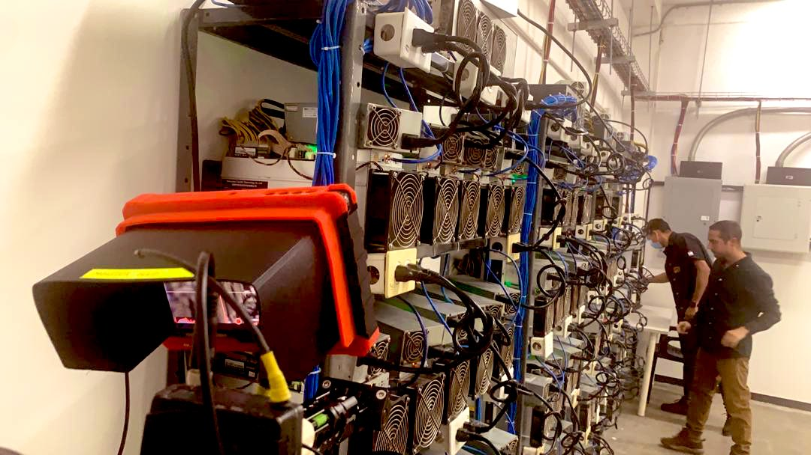
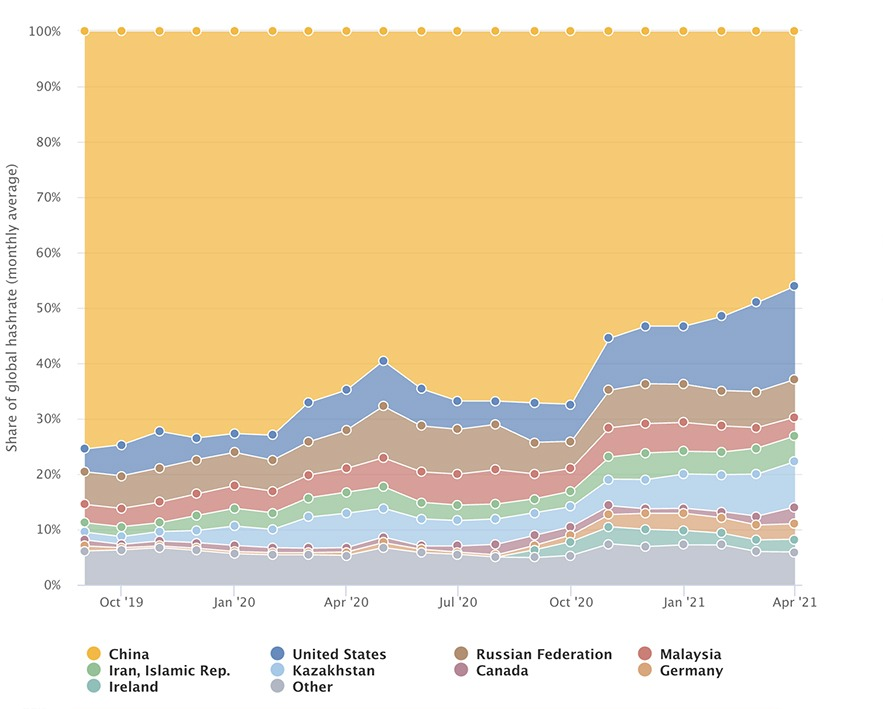
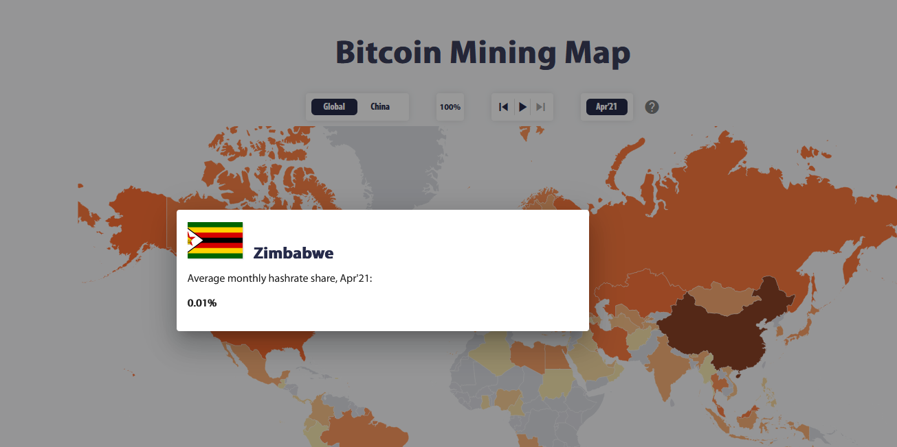

# Weekly Nr. 37 - Bitcoin unites people

## 1 Thought of the week

Bitcoin is the only true neutral money in existence. There is no centralized actor that can be banned or shut down. It's not possible to weaponize Bitcoin and use it against your own population or other countries as it's happening with national currencies. Everyone needs to understand this. It's the reason why no amount of energy used for securing Bitcoin via mining is "wasted".

---

## 2 Quote of the week

> "A lot of people automatically dismiss e-currency as a lost cause because of all the companies that failed since the 1990's. I hope it's obvious it was only the centrally controlled nature of those systems that doomed them." - **Satoshi Nakamoto**

---

## 3 US hegemony powered by the petrodollar

On 15 August 1971, the United States, lead by President Richard Nixon, unilaterally terminated convertibility of the US dollar to gold, effectively bringing the Bretton Woods system to an end and rendering the dollar a fiat currency. 

Afterwards currencies around the world all became fiat currencies, and the global monetary system became less ordered. This was the first time in human history that this happened, where all currencies in the world at the same time were rendered into fiat currencies, which are backed by ...nothing, it's money by decree. 

"In the early 1970’s, there were a variety of geopolitical conflicts including the Yom Kippur War and the OPEC oil embargo. In 1974, however, the United States and Saudi Arabia reached an agreement, and from there, the world was set on the petrodollar system; a clever way to make a global fiat currency system work decently enough....With the petrodollar system, Saudi Arabia (and other countries in OPEC) sell their oil exclusively in dollars in exchange for US protection and cooperation. Even if France wants to buy oil from Saudi Arabia, for example, they do so in dollars....In return, the United States uses its unrivaled blue-water navy to protect global shipping lanes, and preserve the geopolitical status quo with military action or the threat thereof as needed.", says [Lyn Alden in her article about the petrodollar](https://www.lynalden.com/fraying-petrodollar-system/).

This brought global power to the US, but the price for this leadership is high. It benefits the US corporate class over the US worker class and excludes billions of people from using the banking system. This dominance might come to an end in the next decades as countries like China and Russia are big enough to challenge the US. In this currency war a neutral money like Bitcoin could grow to be the next global currency system backing national currencies.

<blockquote class="twitter-tweet">
The global monetary system built around the dollar currently relies on the US running persistent trade deficits with the rest of the world, and benefits the US corporate class over the US worker class, which is part of why it&#39;s gradually losing steam. <a href="https://t.co/UN1xCleABw">https://t.co/UN1xCleABw</a> <a href="https://t.co/dddJaFbXX7">https://t.co/dddJaFbXX7</a> <a href="https://t.co/i3DLYixhOa">pic.twitter.com/i3DLYixhOa</a>
&mdash; Lyn Alden (@LynAldenContact) <a href="https://twitter.com/LynAldenContact/status/1414740409096540165?ref_src=twsrc%5Etfw">July 13, 2021</a></blockquote> 

---
## 4 Money used as a weapon - Cuban crisis

In many, maybe the most countries of the world, governments and rulers are fighting their battles over power at the expense of the population. Recent example is Cuba, which is addressing US sanctions with a suspension of dollar deposits in cash in Cuban banking and financial institutions.

When announcing the decision, the Central Bank of Cuba (BCC) affirmed that it is made [“in view of the obstacles imposed by the economic blockade of the United States so that the national banking system can deposit abroad the cash in USD that is collected in the country”](https://oncubanews.com/en/cuba/economy/cuba-temporarily-suspends-cash-deposits-in-dollars/)

The measure took effect on June 21, Cubans who need to buy food, medicine and other essential goods and were not able to deposit their dollars prior to that date, are not able to buy them now. ["The result of this is that the government received a barrage of dollars that will give it a temporary respite from its external obligations."](https://oncubanews.com/en/cuba/economy/cuban-economy/unraveling-suspension-of-cash-dollar-deposits-in-cuban-banks/). In my words: the government / central bank is stealing the people's cash.

Adding to that, the people's basic needs can't be satisfied in the country. ["I’m here because of hunger, because there’s no medicine, because of power cuts – because there’s a lack of everything, said a man in his 40s who didn’t want to give his name for fear of reprisals."](https://www.theguardian.com/global-development/2021/jul/12/thousands-march-in-cuba-in-rare-mass-protests-amid-economic-crisis) All that led this week to the biggest mass demonstrations for three decades in Cuba.

"I am 81 years old and I have lived 60 years in lies, it is over, we take off the cloak of silence." Cuban granny protesting in front of the Capitol in Havana, on 07/11/21.

<blockquote class="twitter-tweet">
&quot;Tengo 81 años y he vivido 60 años en la mentira, ya se acabó, nos quitamos el ropaje del silencio.&quot; Abuelita cubana protestando frente al Capitolio de La Habana, <a href="https://twitter.com/hashtag/Cuba?src=hash&amp;ref_src=twsrc%5Etfw">#Cuba</a> el 11/07/21.<a href="https://twitter.com/hashtag/SOSCuba?src=hash&amp;ref_src=twsrc%5Etfw">#SOSCuba</a> <a href="https://twitter.com/hashtag/CubaLibre?src=hash&amp;ref_src=twsrc%5Etfw">#CubaLibre</a> <a href="https://twitter.com/hashtag/CubaSOS?src=hash&amp;ref_src=twsrc%5Etfw">#CubaSOS</a> <a href="https://twitter.com/hashtag/CubaNoEstaSola?src=hash&amp;ref_src=twsrc%5Etfw">#CubaNoEstaSola</a> <a href="https://twitter.com/hashtag/SOSMatanzasCuba?src=hash&amp;ref_src=twsrc%5Etfw">#SOSMatanzasCuba</a> <a href="https://twitter.com/hashtag/SOSMatanzas?src=hash&amp;ref_src=twsrc%5Etfw">#SOSMatanzas</a> <a href="https://t.co/S0XUpxsJY1">pic.twitter.com/S0XUpxsJY1</a>
&mdash; Domingo Chelme Prensa y DDHH (@DChPrensayDDHH) <a href="https://twitter.com/DChPrensayDDHH/status/1415505334412644352?ref_src=twsrc%5Etfw">July 15, 2021</a></blockquote> 

---
## 5 "Human B" documentary recording in Venezuela
It's not far from one dictatorship to the other. [Venezuela's situation is not all that different. Its leadership has destroyed the economy, even though the country enjoys larger oil reserves than Saudi Arabia. Hospitals have run out of medicine, children are starving](https://www.investopedia.com/news/venezuela-petro-not-cryptocurrency/), the currency has been inflated into oblivion.

The team of "Human B", a documentary about the people in Bitcoin, is currently filming in Caracas, Venezuela. Many miners were seized in recent years by the government, which then started to mine on its own. Still private mining pools exist and will be featured in the documentary.

By the way: remember "the Petro"? Announced by President Maduro in Dec 2017 it was said to be the cryptocurrency of Venezuela. In fact it was a [scam](https://bitcoinundco.com/en/petro-scam-bitcoin-venezuela/), ripping off investors.

<blockquote class="twitter-tweet">
Our camera crew in Caracas 🇻🇪 is working hard this week to capture the reality of Bitcoin in Venezuela. We’re grateful to have so many people working on this project!<a href="https://twitter.com/hashtag/bitcoin?src=hash&amp;ref_src=twsrc%5Etfw">#bitcoin</a> unites people all over the world.   (german translation👇🏽) <a href="https://t.co/FT2uHYcFVt">pic.twitter.com/FT2uHYcFVt</a>
&mdash; AaRon_Ruben (@cinemuck_) <a href="https://twitter.com/cinemuck_/status/1415408127139328001?ref_src=twsrc%5Etfw">July 14, 2021</a></blockquote> 

Last week Eva and Aaron visited Austria to shoot an interview with me. They are filmmakers from Germany who fell into the Bitcoin rabbit hole. It has been fascinating them so much that they want to express what they've learned in this film. If you want to [contribute to the production of the documentary, you can donate here](https://tallyco.in/s/higwxl/).

## 6 New report on mining confirms hashrate relocation from China
[New data gathered for the Cambridge Bitcoin Electricity Consumption Index (CBECI)](https://www.jbs.cam.ac.uk/insight/2021/new-data-reveals-timeline-of-chinas-bitcoin-mining-exodus/), suggests that China’s share of global hashrate (the total computational power of server farms participating in Bitcoin’s consensus process) has been in significant decline for some time prior to the recent crackdown on Bitcoin mining announced by the country’s government in June 2021.

China’s share of total Bitcoin mining power has declined from 75.5% in September 2019 to 46% in April 2021 – before the restrictions were even imposed. In the same period, the United States’ share of total Bitcoin hashrate increased from 4.1% to 16.8%, putting it in second place. One of the standout observations is the almost six-fold increase of mining share in Kazakhstan. An energy-rich country located in Central Asia, it has seen its share rise from a mere 1.4% in September 2019 to 8.2% in April 2021, catapulting it to third place in global mining power share. The Russian Federation (6.8%) and Iran (4.6%) complete the top five as shown by the chart below.

---

## 7 Bitcoin mining in Africa and Zimbabwe

On the CBECI website you can find a [Bitcoin Mining Map](https://cbeci.org/mining_map) showing the geographical breakdowns of it's total hashrate from September 2019 to April 2021. I was pleased and surprised to find out that someone, somewhere is mining bitcoin in Zimbabwe. The other African countries where bitcoin was or is being mined are: Algeria, Lybia, Egypt Arab Rep., Sudan, Ghana, Nigeria, Cameroon, Angola, South Africa, Tanzania, Ethiopia, Mali, Niger, Kenya, Uganda, Malawi, Morocco. Not on the map is the Democratic Republic of the Congo, but I know from [Sébastien Gouspillou, that they are mining with hydropower there](https://bitcoinundco.com/en/sebastien-gouspillou/).

---
## Subscribe to (L)earn Bitcoin

[Subscribe for my weekly newsletter. It's free.](https://anita.link/weekly)

---

If you want to check, here is today's [Bitcoin price](https://www.coingecko.com/en/coins/bitcoin).

No financial advice. DYOR.

