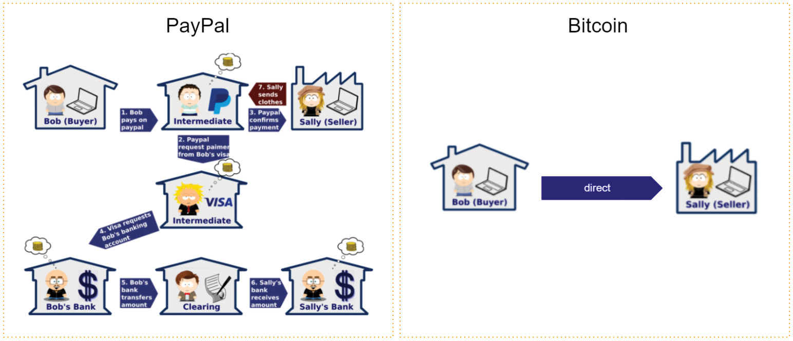
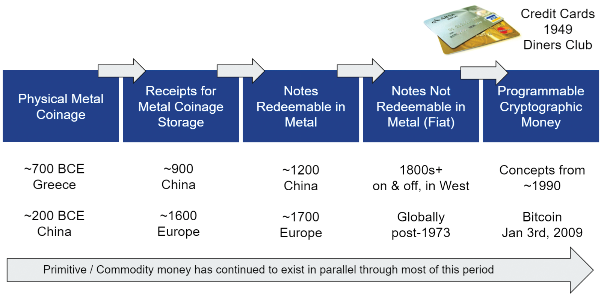
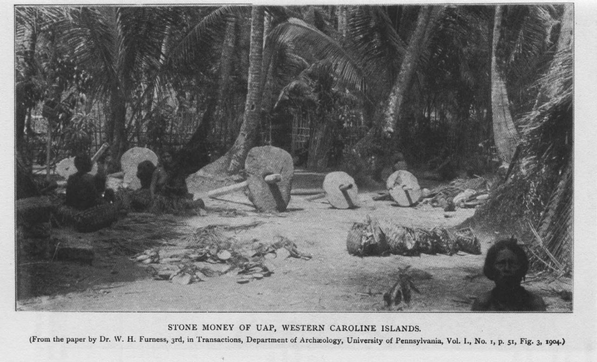

# The Evolution of Money

This is a series about the history of money and the current financial system taken from my book [(L)earn Bitcoin](https://learnbitcoin.link)

Pt. 1 The evolution of money  
Pt. 2 [How money is created](https://anitaposch.com/money-creation)  
Pt. 3 [Central banks and inflation](https://anitaposch.com/inflation)  
Pt. 4 [Bitcoin is not a Ponzi scheme](https://anitaposch.com/bitcoin-is-no-ponzi-scheme)  
Pt. 5 [Today's Petrodollar System](https://anitaposch.com/petrodollar-bitcoin)

On January 3, 2009, Bitcoin was born. Since its creation, the Bitcoin P2P network Internet Protocol (IP) has attached new blocks of data to a chain of transactions approximately every 10 minutes. The Bitcoin blockchain stores transactions in the correct chronological order which cannot be altered afterwards, as fixed as time itself. Just as our heartbeat preserves our bodies, this process is preserved by a system that draws its foundations from cryptography, game theory, IT, and decentralized networks that keep itself in balance.

This self-regulating system has the following characteristics:

-   Bitcoin transactions are censorship resistant.
-   Bitcoin is immutable.
-   Bitcoin cannot be counterfeited.
-   Bitcoin transactions are highly secure without intermediaries, like a bank.
-   Bitcoin transactions are transparent, publicly visible and can be audited by anybody.

 [^1]
In a traditional payment there are up to seven intermediaries until the payment reaches the recipient. Bitcoin has none.

-   Bitcoin is a neutral network: it does not moralize or distinguish between "good" and "bad" payments.
-   Bitcoin is permissionless: there are no gatekeepers that can prevent its use.
-   Bitcoin is borderless: it can be used worldwide.
-   Bitcoin, the Internet Protocol, is a common good: it belongs to everybody, not a single entity such as a company.
-   The rules of Bitcoin are enforced by the programmatically secure consensus of all parties involved.

Bitcoin is people's money. Bitcoin is the evolution of money. It is a continuation of the perpetual process of discovering new money that has always been a part of the history of mankind. Over the millennia, various new forms of money have been found and used, from a direct exchange between people to a credit system in a gold standard, to fiat currency to today's current non-backed inflationary system. The banking and monetary system as we know it today has existed and evolved for about 300 years. It is only natural that, with the emergence of a new form of communication via the internet, a new form of economy and a new type of money, namely internet-native money, should arise.

 [^2]

Programmable cryptographic money or the ["Internet of Money"](https://amzn.to/2PpKZcs) - as Andreas M. Antonopoulos puts it - is unstoppable. We are at the beginning of a new era in the history of mankind. 

## Rai Stones of Yap
If Bitcoin sounds mind-boggling and you can't grasp the concept of a blockchain as a shared ledger of truth, the Rai of the Isle of Yap is a good example to introduce some overlapping concepts.

Rai are large stone disks used on Yap island in the Western Pacific (Micronesia). They were "minted" from the limestone deposits of the island of Palau and used as a currency until the 20th century. 

 [^3] 

Rai stones were brought to Yap via boat and, due to their size and weight, were not moved when spent, but simply changed owners. Every transaction was "recorded" orally within the small community, with the stone's ownership history becoming common knowledge. Eventually, the transaction "history"/"ledger" became the only part that mattered. A stone was once dropped by the canoe transferring it to Yap and sank. The stone was deemed to still be money, since it still existed, even though no one has seen or had access to it since. 

This is particularly important because it demonstrates a naturally occurring use of a ledger of transactions. The ledger was shared orally between the inhabitants and attributed ownership and delegated property without a single stone moving; everyone agreed on it and a consensus was formed. This is how we can make a comparison to the functions of the Bitcoin blockchain; it is a shared ledger of all transactions, stored simultaneously on thousands of computers (nodes) globally. [^4]

Another similarity to Bitcoin is the actually creation of Rai stone, which was work intense and a form of proof-of-work. The stones were carved out with hand tools, quarried overseas and brought to the island via canoe. Once the Rai stones became easy to manufacture with modern techniques, they became less useful as money, because they were no longer a reliable indicator of energy spent.

Rai stones have been viewed by modern economists as a primitive form of money, and are often used as an example to support the thesis that the value of some forms of money can be assigned purely through a shared belief in said value.[^5] Today's money is not backed by anything either. In fact, it is only established and declared legal tender by government regulation. Because of that, it is the medium of account we use and therefore is perceived as valuable.

Next part: [how money is created](https://anitaposch.com/money-creation) 

[^1]: [Illustration NetGuardians retrieved April 2017](https://www.netguardians.ch/ngfintechblog/2016/11/17/blockchain-explained-part-1)
[^2]: Anita, credits: University of Nicosia, MOOC in Digital Currency, “A brief history of money” with image: Lotus Head, CC BY-SA 3.0, wikimedia.org
[^3]: Image: "Stone Money of Uap, Western Caroline Islands." - Dr. Caroline Furness Jayne took this photograph during a 1903 stay on Yap, Public domain, via Wikimedia Commons
[^4]: [Wikipedia Rai stones](https://en.wikipedia.org/wiki/Rai_stones)
[^5]: [University of Nicosia, Introduction to Digital Currencies, Session 1, p. 15]

---

This content is part of my [(L)earn Bitcoin book](https://learnbitcoin.link) available as paperback and ebook. 
{|<}

---
## Subscribe to (L)earn Bitcoin

[Subscribe for my weekly newsletter. It's free.](https://anita.link/weekly)
