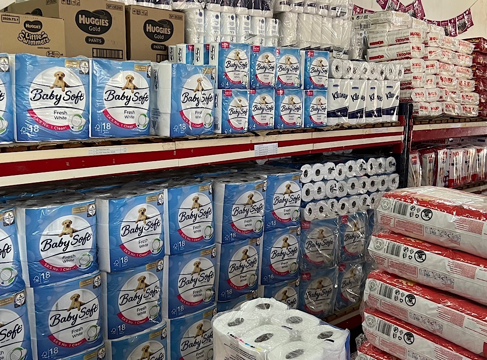
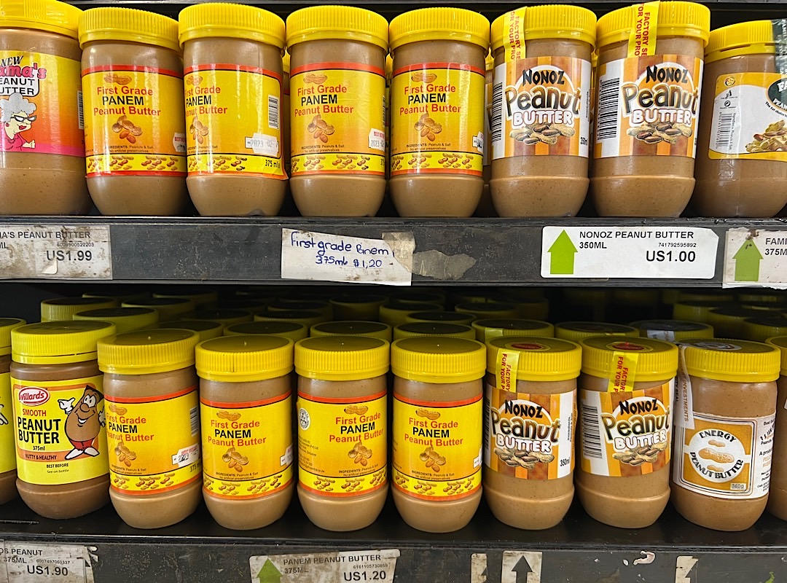
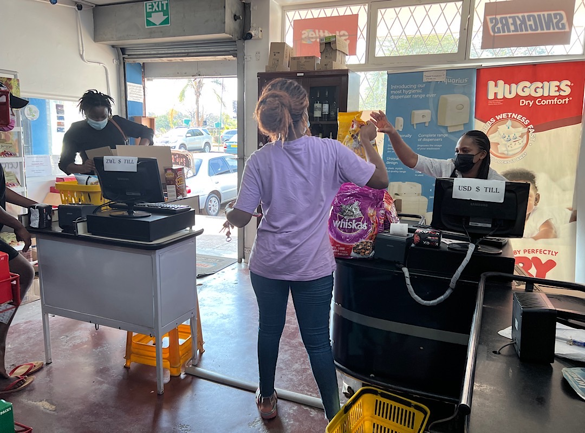
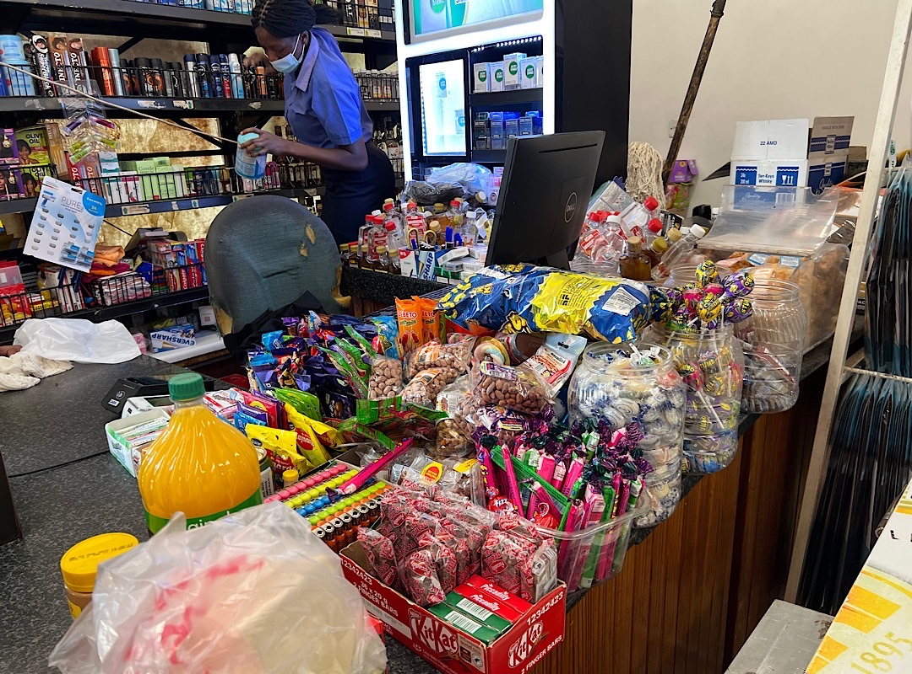

# Shopping with two currencies in Zimbabwe

Greetings from day 1 in Zimbabwe, where toilet paper costs 10 USD (more than twice than in Austria) 

Prices are labeled in USD. Otherwise the shop owners would need to change the price tags every day.

You can pay with USD or the local Zimbabwe Dollar, which is legal tender. In this shop they have one till for RTGS = Zimbabwe Dollar and one for USD.

Since there are only USD banknotes and no coins in circulation, you get your change in small packets of sweets or chewing gum.

---

You like Anita Posch's work and efforts with [Bitcoin for Fairness](https://bffbtc.org) to foster Bitcoin adoption on the ground in the Global South? It's all community powered and funded by donations. Feel free to [support our work with a donation](https://anita.link/donate) or send sats to our Lightning address: bffbtc@getalby.com.