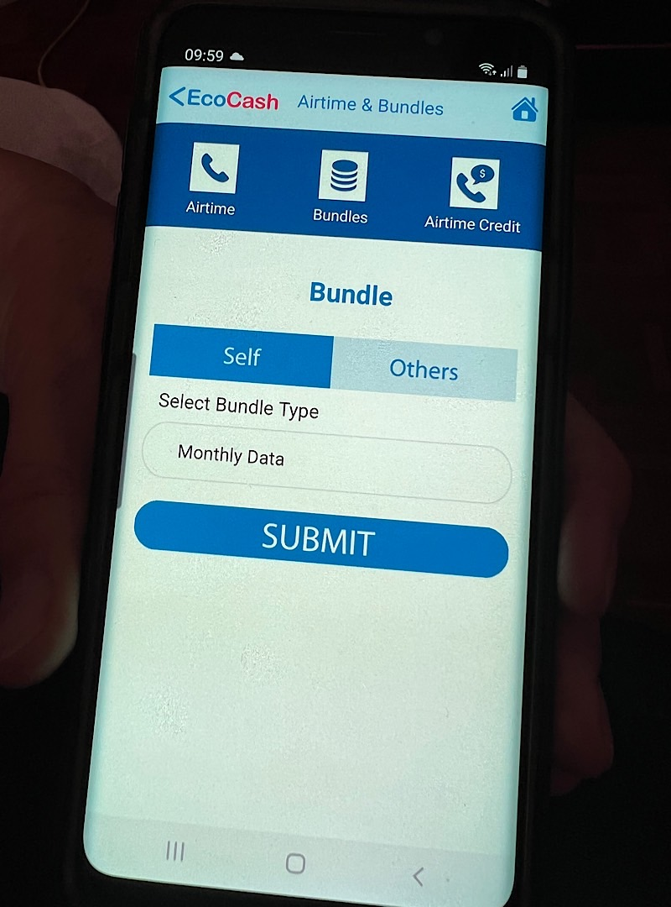
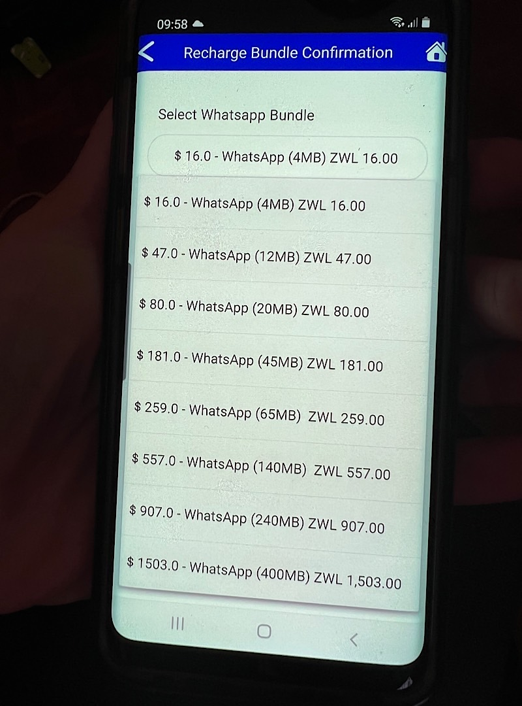
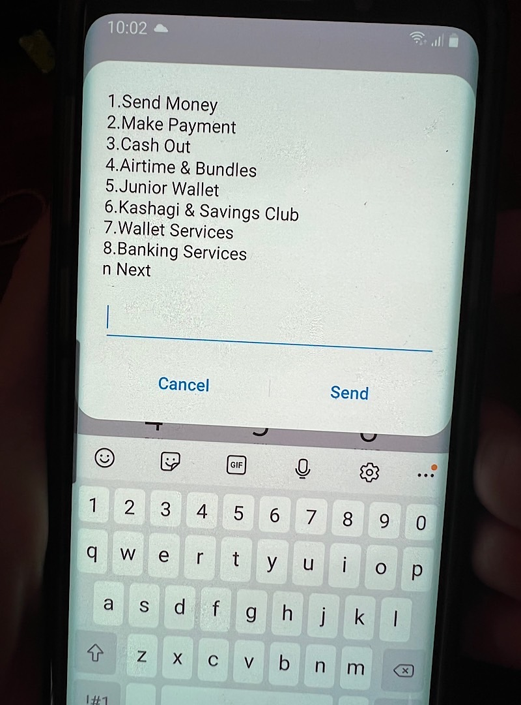
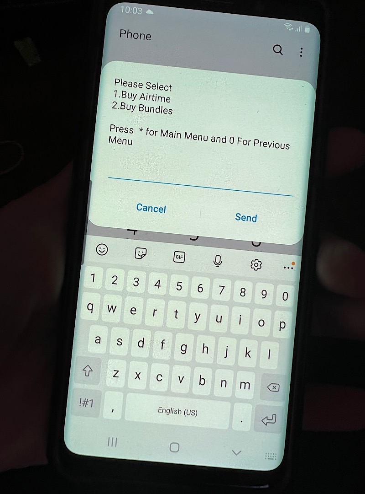
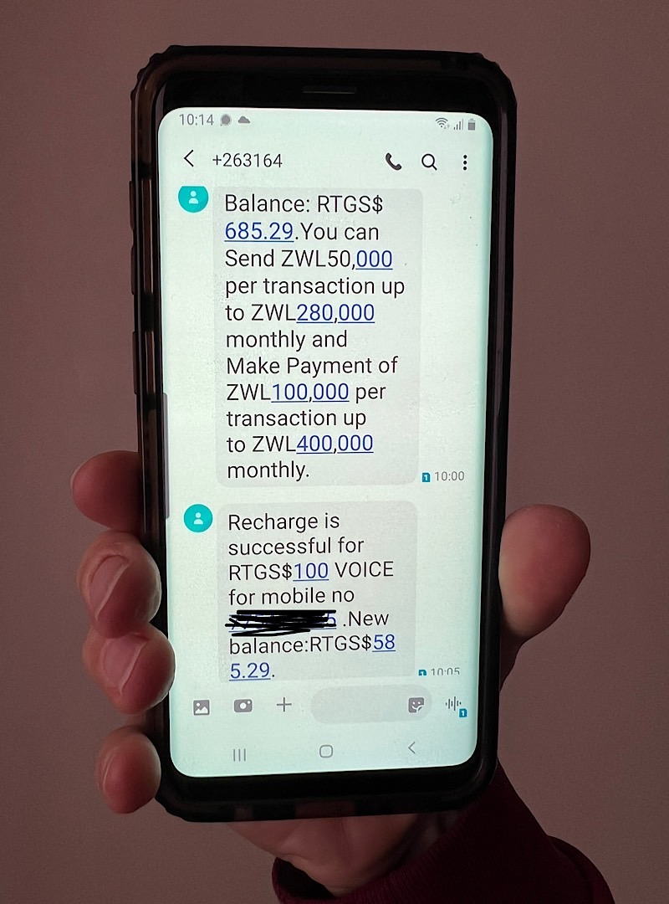

# Topping up my phone with EcoCash

Today I used my Zimbabwean SIM card and added airtime to it so that I can do calls and send texts.

My friend paid for my bundle with EcoCash from her phone. EcoCash is the biggest mobile money provider in Zimbabwe. 

We used USSD (Unstructured Supplementary Service Data) which is a global system for mobile communications that is used to send text messages. In Europe I never used USSD codes, but in Southern Africa it’s a big deal, because mobile money is working via text.

If you can access the internet and download an App you can also use this to top up your phone.

You have different choices for different types of bundles, with which you have more or less options to use the internet. In Europe, if you buy an internet subscription you can use the full range of browsing websites and downloading apps on your phone. But here it's very different. Many people can only afford the smallest bundles, which are WhatsApp or Facebook bundles. These are cheaper but restrict internet use. You can't browse or download apps, you're able to use WhatsApp only. That's why some people believe Facebook is the Internet.

Since the majority of people in Zimbabwe own feature phones they are buying airtime like this.

Select your choice.

Below: Text messages showing the recharge and my wallet balance. The first text explains the transaction limits. I’m allowed to send a maximum of ZWL 50,000 per transaction to someone else, that is USD 90 at today’s official rate. This is capped at a maximum of ZWL 280,000 a month. Meaning I can send USD 509 in total monthly.

---

You like Anita's work and efforts with [Bitcoin for Fairness](https://bffbtc.org) to foster Bitcoin adoption on the ground in the Global South? It's all community powered and funded by donations. Feel free to [support our work with a donation](https://anita.link/donate) or send sats to our Lightning address: bffbtc@getalby.com.