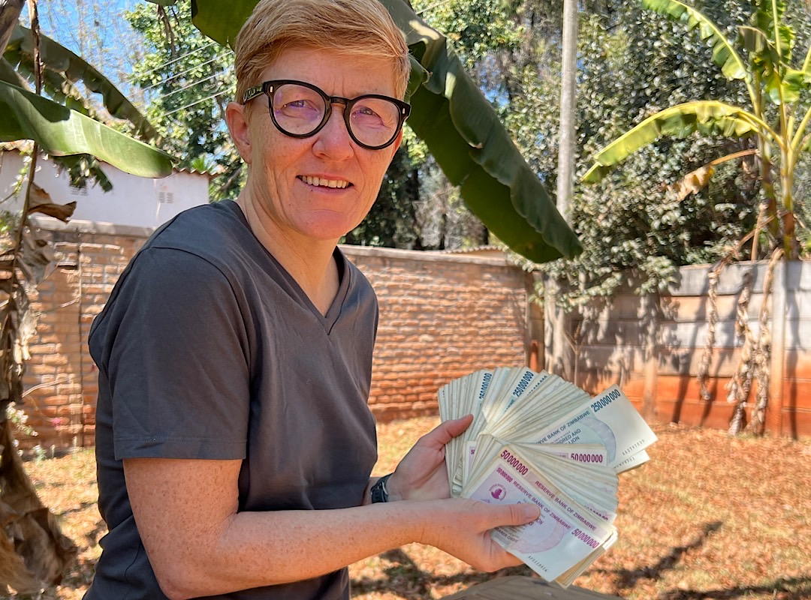
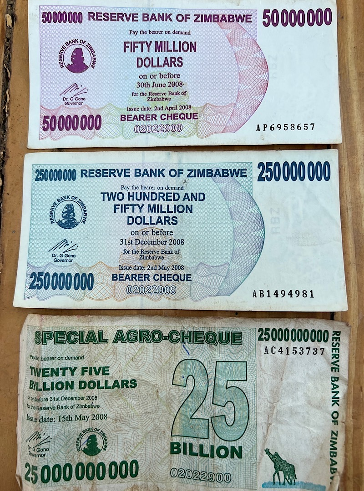
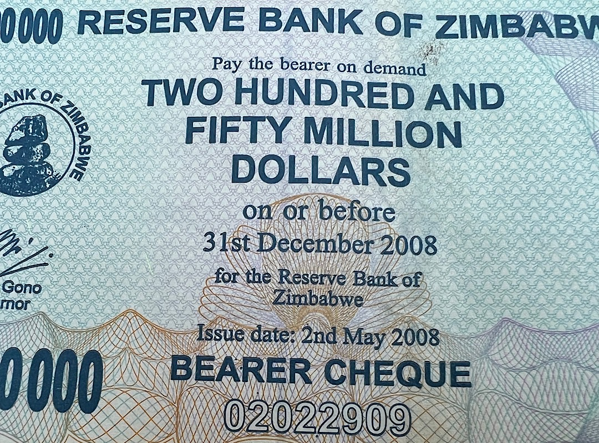

# Traditional currencies are worthless without authorities
No need to wait for bitcoin to go to 10 Million anymore! I'm a Billionaire already!

My Zimbabwean friend searched her archive and found 55 Billion Dollar! No need to work anymore! Oh, it's Zimbabwean Dollar? From 2008?

Thanks, you can have it. It's not worth the paper it's printed on.

Jokes aside as this is a serious issue for the Zimbabweans who had to live through several periods of hyperinflation since independence.

As I was sorting the notes I remembered that I saw some of these banknotes in an antiques shop somewhere in Zimbabwe in 2020. One of those was sold for 5 USD. I could make 500 USD by selling it. Theoretically. Thing is, it's illegal to sell these old banknotes. 

One of these is an Agro-Cheque, you can buy it on the internet for USD 47.99. It was released in 2008 and was originally intended for the exclusive use of Zimbabwean farmers, although they found their way into regular commerce as prices continued to rise.

Look at the detail. It says "Pay the bearer on demand 250 Million Dollars on or before 31st December 2008 for the Reserve Bank of Zimbabwe. Issue date: 2nd May 2008". It's money with an expiry date! 

Goes to show that fiat banknotes and coins can be issued and rendered worthless by the will of bankers and politicians. By those same people who (try to) control the value of the money they made local legal tender. It derives its value only from this legal act. Bitcoin's issuance is powered by a consensus of machines and is cryptographically secured. There is no human centralized issuer for bitcoin, who could profit from it. 

<iframe width="100%" height="473" src="https://www.youtube-nocookie.com/embed/pMobznkP2UE?si=XnvHIQWZRBrcCbUt" title="YouTube video player" frameborder="0" allow="accelerometer; autoplay; clipboard-write; encrypted-media; gyroscope; picture-in-picture; web-share" referrerpolicy="strict-origin-when-cross-origin" allowfullscreen></iframe>

---

You like Anita's work and efforts with [Bitcoin for Fairness](https://bffbtc.org) to foster Bitcoin adoption on the ground in the Global South? It's all community powered and funded by donations. Feel free to [support our work with a donation](https://anita.link/donate) or send sats to our Lightning address: bffbtc@getalby.com.