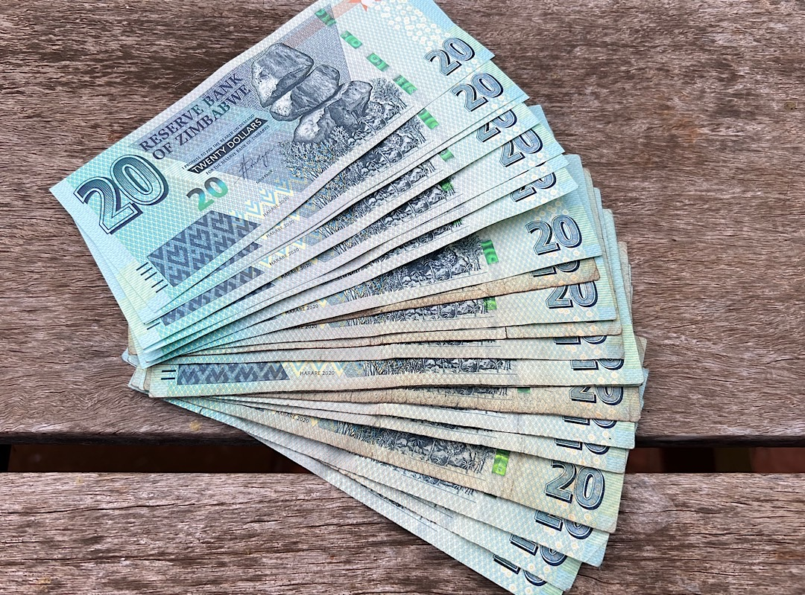

# Insights from exchanging Bitcoin Peer-to-Peer in Zimbabwe 

Due to the difficult and dangerous political climate in Zimbabwe at the moment, I can't disclose the identity of the people I'm talking with. Bitcoin isn't banned here, only banks are banned from offering bank accounts to people who interact with bitcoin. Exchanges are not welcome. Speaking and trading freely with bitcoin can make you the target of harassment, arrest or worse things.

## Liquidity problem

Since exchanges can't operate within Zimbabwe and Zimbabweans can't open an exchange account internationally, because of sanctions there is a problem with Bitcoin liquidity. There aren't enough bitcoin available for the local demand. Interestingly Binance started allowing Zimbabweans to use their platform again a few days ago.

With no exchanges available the trading is P2P only. WhatsApp groups are used to find buyers and sellers who then meet in person to exchange the money. Sometimes „human escrow“ is involved meaning an individual is the trusted relationship in between maker and taker. 

## High usage of USDT

I found a person who helped me exchange bitcoin to USD cash today. The commission usually is 5% and they only accept a trade if it's for 1,000 USD or more. The maximum amount they change is 50,000 USD. The trader can't accept lower amounts because they are meeting with the customers in person. Meaning driving around town which is costly and takes time. If they were to accept 100 USD trades, they'd only make 5 USD per trade. 

Another very important insight was that they themselves aren't holding any bitcoin. They very well understand the advantages of bitcoin especially in a country like Zimbabwe, but they can't afford to lose money. It's easy to trade bitcoin, when it's in a bull market, but in a bear market being a trader is especially risky, because by the time they receive the bitcoin from the seller the value can have gone down already. That's why they convert bitcoin immediately into USDT. I was told that from the hundreds of customers this trader deals with only a handful are buying bitcoin to hold it. All the others are interested in Bitcoins properties as payment rails like being uncensorable, fast, permissionless, with low fees, globally usable, no paperwork, not controlled by the government, but they are using other transaction methods mainly USDT, which has no volatility. Until bitcoin's price isn't more stable people who can't afford to hold long-term will use USDT over bitcoin.

The government is now deducting 4% of every digital transaction as a tax. Last time I was here in March 2022, it was 2%.

## 50 Cents USD
This is today’s photo: 420 Zimbabwe Dollar are 0,5 USD.

---

You like Anita's work and efforts with [Bitcoin for Fairness](https://bffbtc.org) to foster Bitcoin adoption on the ground in the Global South? It's all community powered and funded by donations. Feel free to [support our work with a donation](https://anita.link/donate) or send sats to our Lightning address: bffbtc@getalby.com.