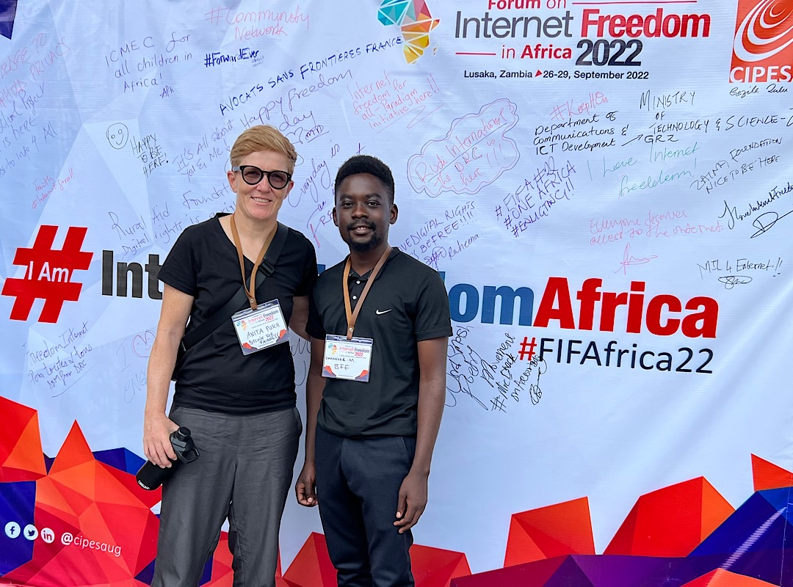
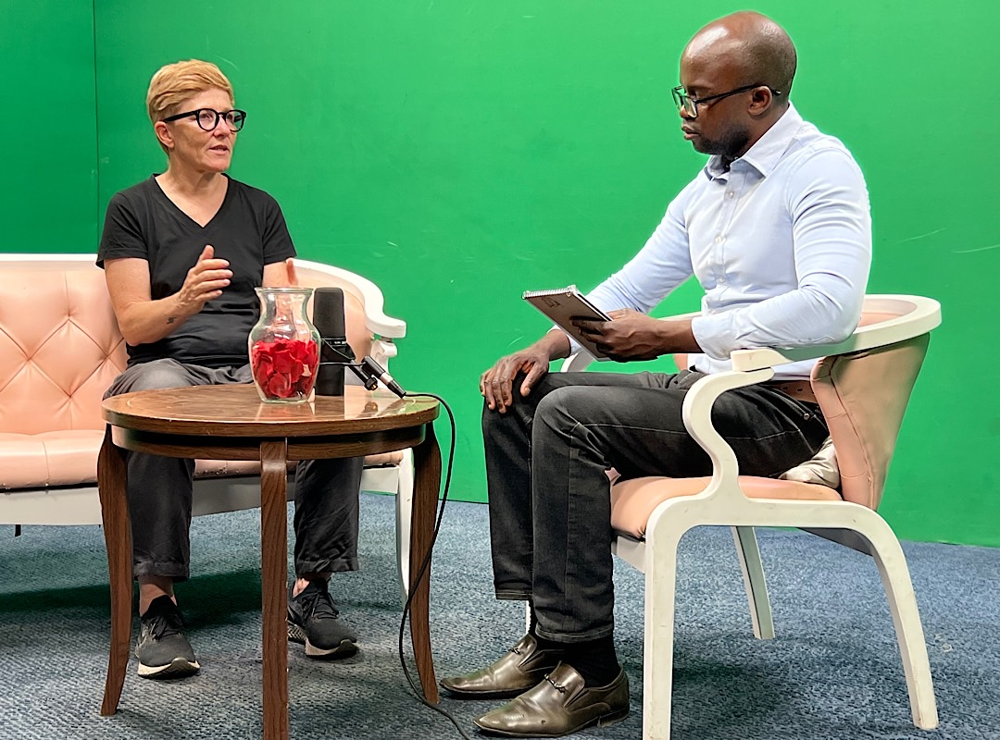

# Forum on Internet Freedom and TV interview

Today I was preparing for the panel on Digital Rights at the Forum on Internet Freedom in Africa. I'll be speaking about Bitcoin and how it enforces human and digital rights. 

In the afternoon I was giving an interview for the QfM morning show. It will be broadcasted on Thursday morning. 
https://twitter.com/AnitaPosch/status/1575187882431619077

---

You like Anita Posch's work and efforts with [Bitcoin for Fairness](https://bffbtc.org) to foster Bitcoin adoption on the ground in the Global South? It's all community powered and funded by donations. Feel free to [support our work with a donation](https://anita.link/donate) or send sats to our Lightning address: bffbtc@getalby.com.