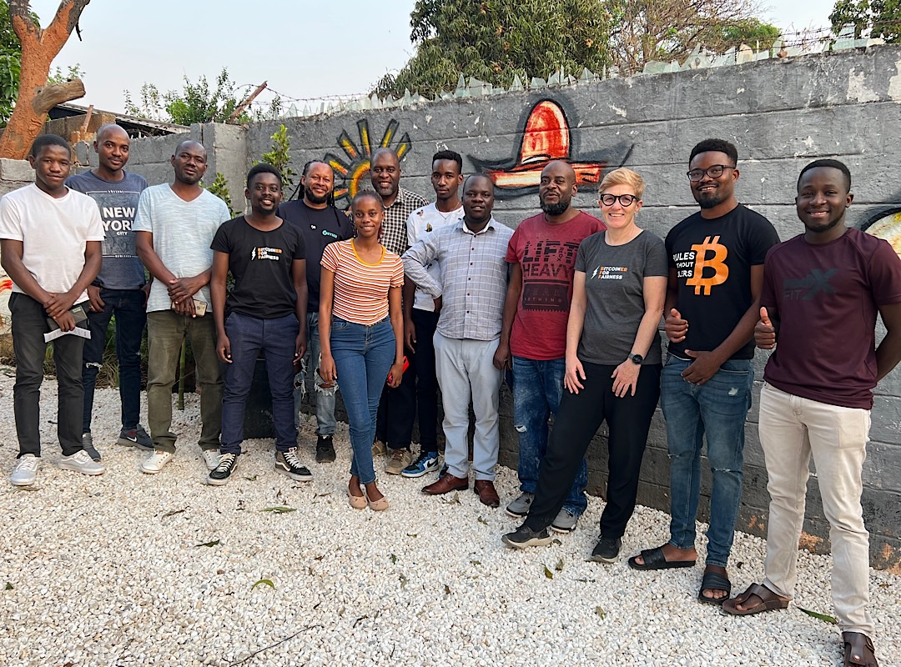
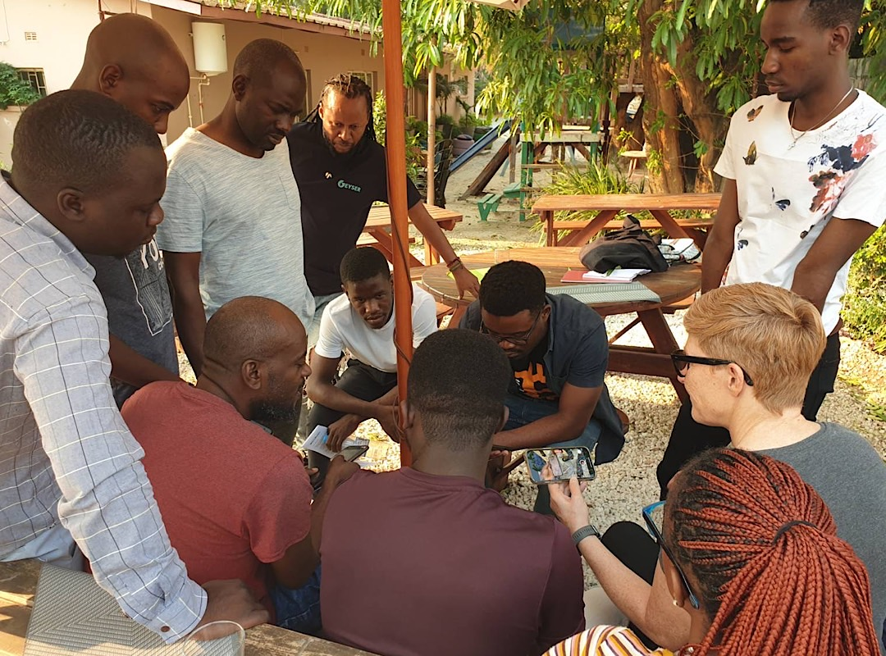
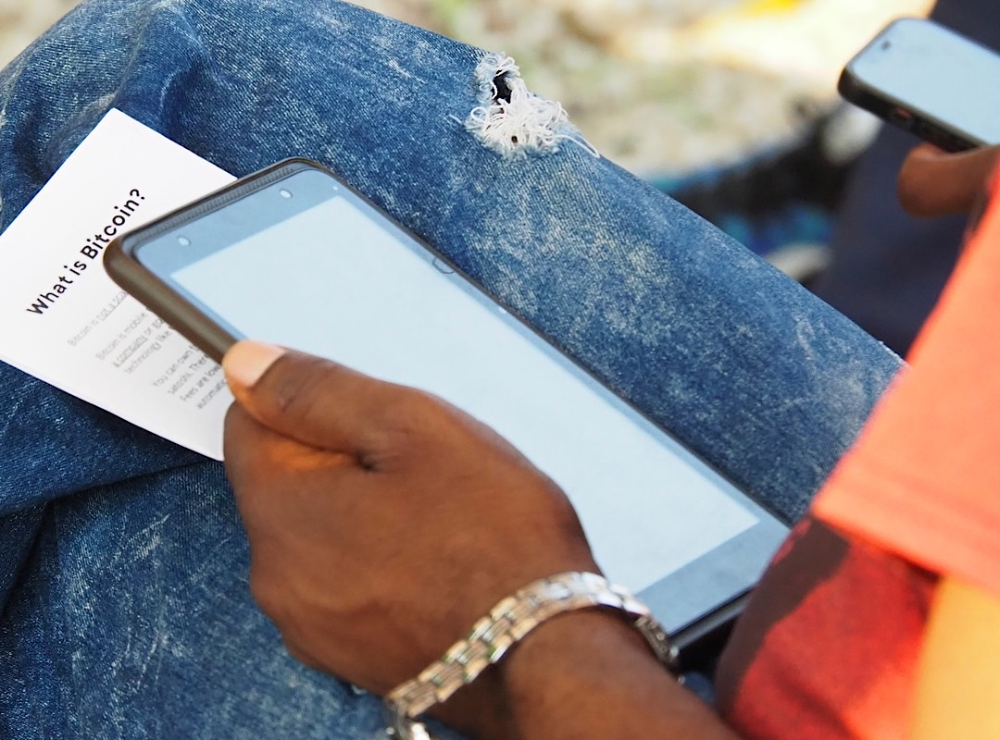
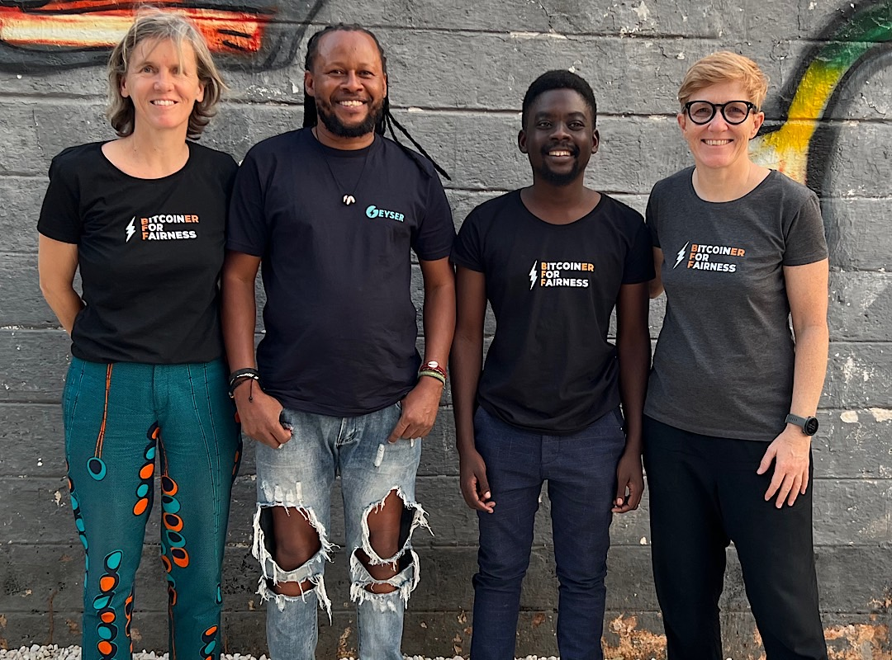
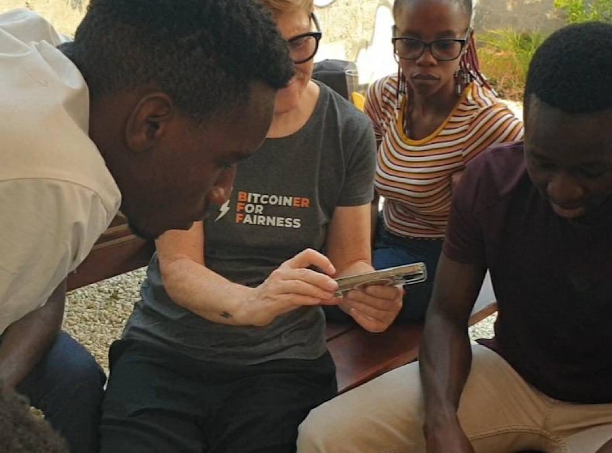
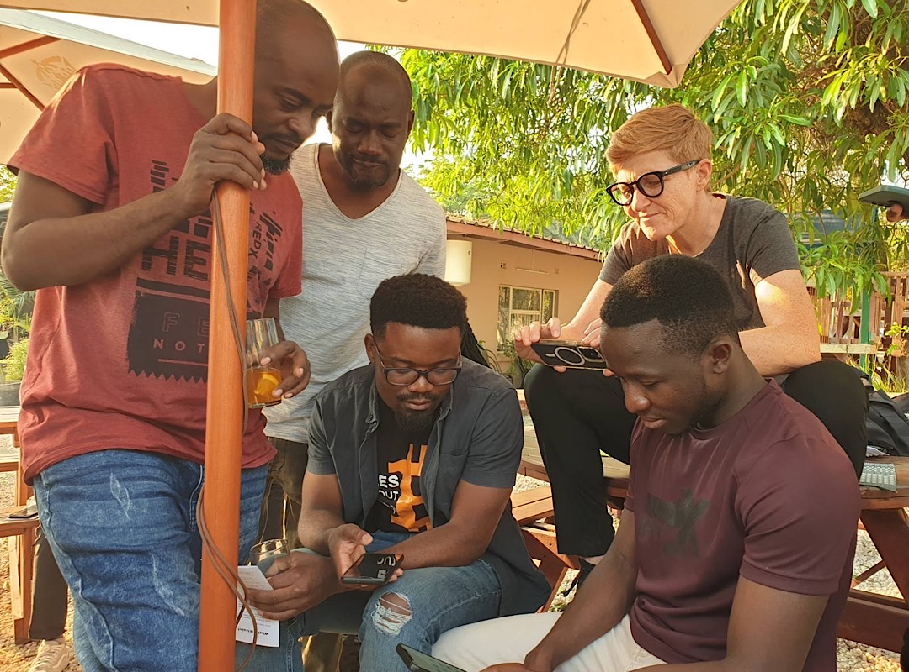
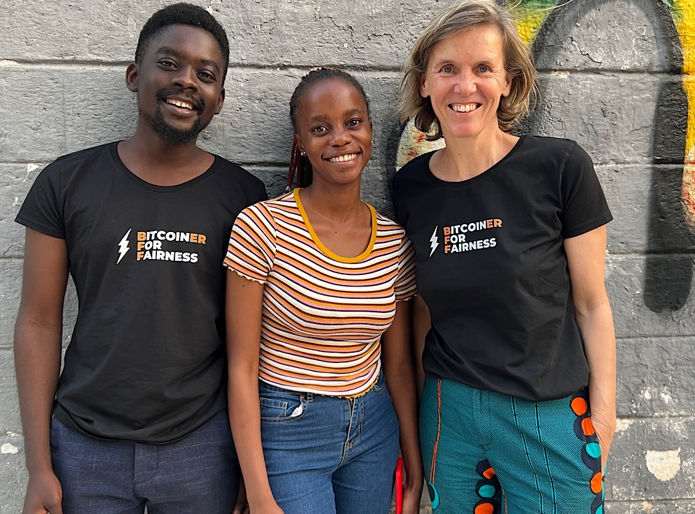
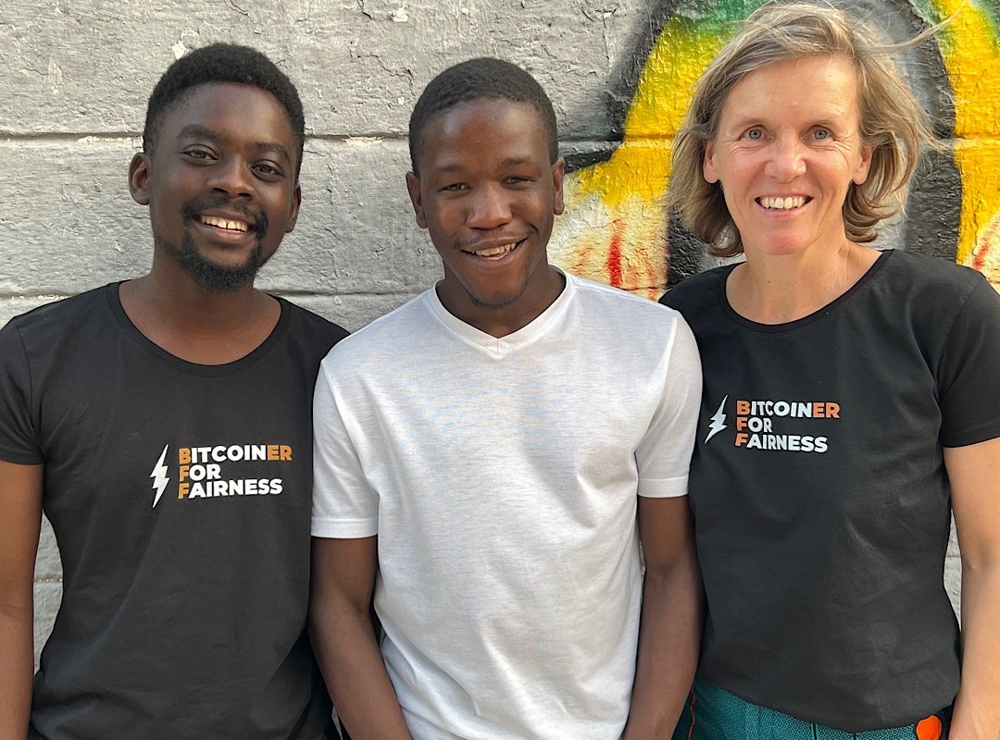
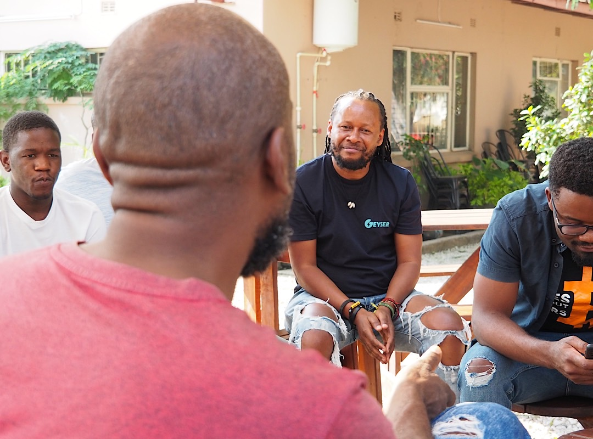
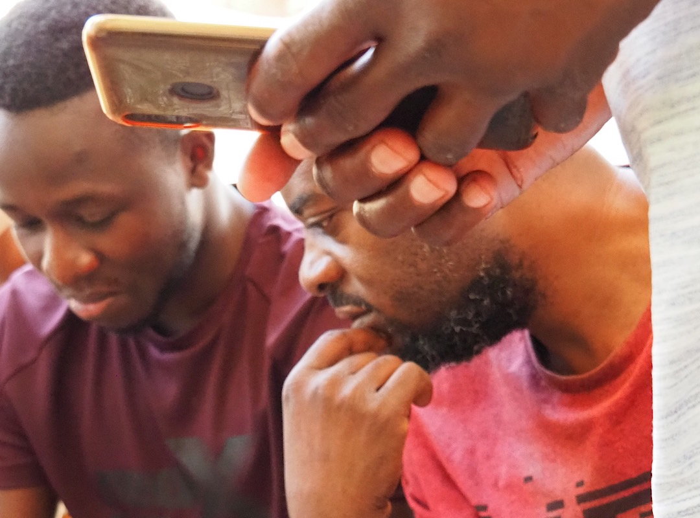

# Bitcoin Meetup in Zambia

We met at Scallywags a cafe that is accepting Bitcoin. After a brief introduction every attendant shared why they are interested in Bitcoin and what their professional background is. Then we discussed the importance of self-custody versus leaving your bitcoin on exchanges. I spoke about the possibilities to earn bitcoin (as [mentioned in my Unza presentation](/bitcoin-unza)) and then we tried several services to buy bitcoin and to spend it for airtime. 

We demonstrated how

* to buy bitcoin with kwacha via [azte.co](https://azte.co)
* to buy airtime for MTN, Airtel or Zamtel with bitcoin via [Bitrefill](https://bitrefill.com)
* to use Machankura8333 to send and receive Lightning Bitcoin via feature phone (USSD code)
* to send Lightning Bitcoin from Machankura8333 to a Lightning address
* to setup and use a Lightning address

---

You like Anita Posch's work and efforts with [Bitcoin for Fairness](https://bffbtc.org) to foster Bitcoin adoption on the ground in the Global South? It's all community powered and funded by donations. Feel free to [support our work with a donation](https://anita.link/donate) or send sats to our Lightning address: bffbtc@getalby.com.