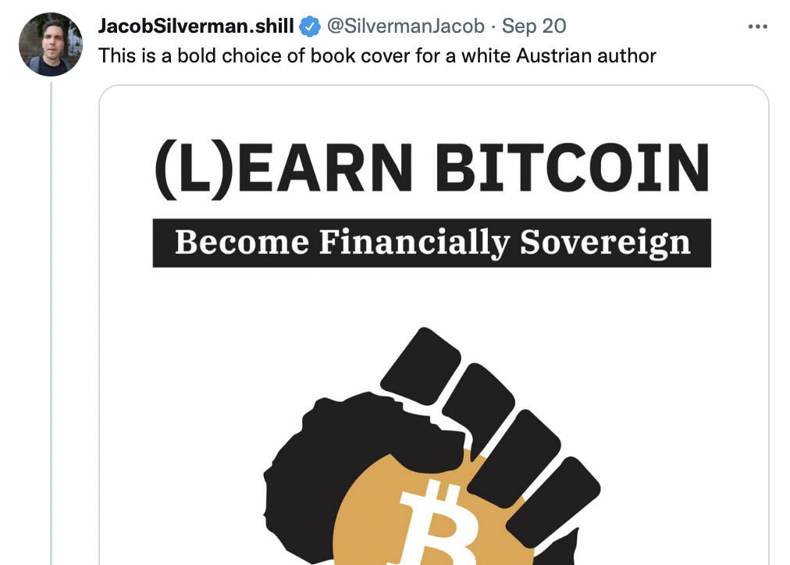
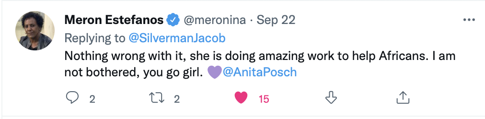
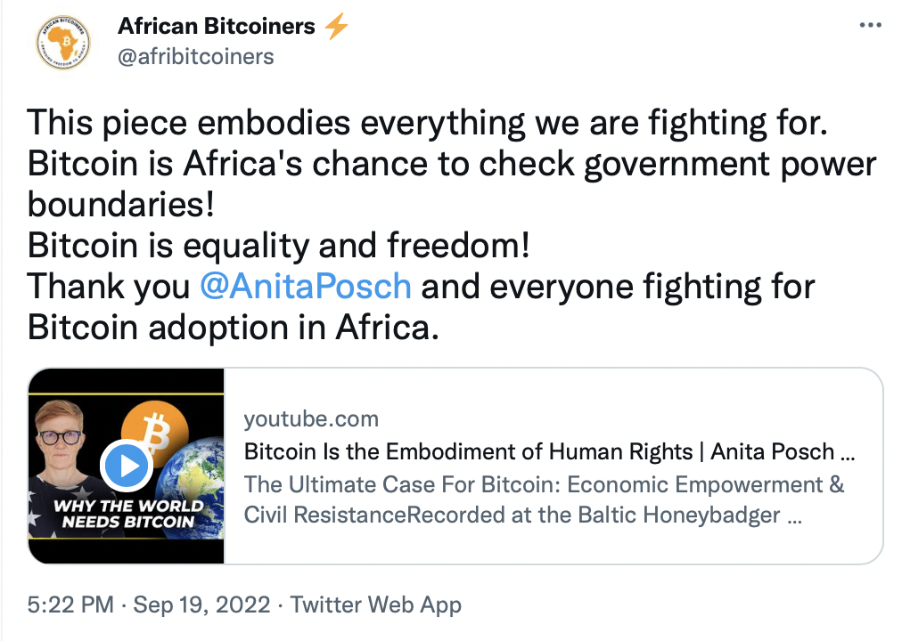
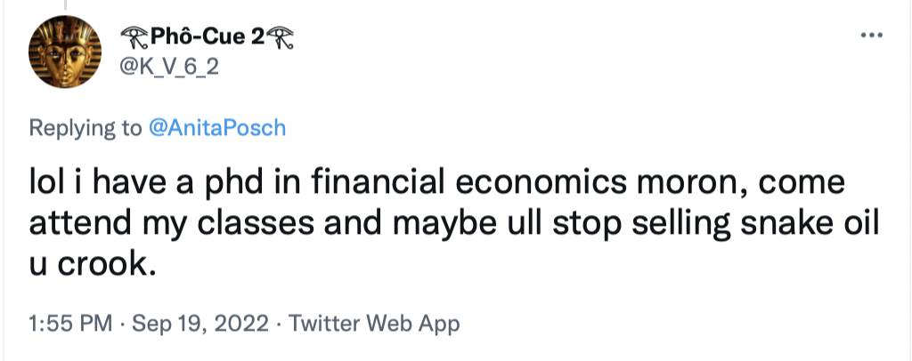

# A black raised fist on my book cover - a "bold choice"

In September 2022 the logo on the cover of my book - a black raised fist in the shape of the African continent holding a Bitcoin logo - was described as being a "bold choice for a white Austrian author". 

The tweet author, a "white guy from New York" is currently writing a book about crypto and fraud. Hence I assume he is searching for all possible reasons to attack Bitcoin. Since I'm aware of the problem of cultural appropriation and someone in that thread mentioned "Bitcoin colonialism" I guess this is what the author meant with "a bold choice". Maybe I'm featured as a Bitcoin colonialist in his upcoming book? 

<small>[Source](https://twitter.com/SilvermanJacob/status/1572253976271228936)</small>

As the use of Bitcoin is increasing, the resistance and arguments against it are also on the rise. Social media has been dividing people in the past 20 years and this "It's either us or them" has only become stronger since the Covid pandemic. Everyone seems to have the right to be offended by the smallest things and cancel others. Some people even are offended on behalf of those who really have a good reason to be offended. And this is not coming from a place to protect the less powerful, it's more likely out of their own interest and the firm belief to be right. Discussions on Twitter are getting heated easily and I'm convinced that some other person will start a discussion around my work and the book cover. Hence I have decided to share my motivations and disclose information on how the logo came to be on my book cover and in doing so explain my "bold choice".

The world is an unfair place. That I have experienced myself as being part of a minority group. Recently two lesbians were hanged in the Iran. Lucky me, that I was born in Europe. Of course my personal struggles with being a women and lesbian can't be compared to what other people have to suffer through in their lives. From childhood on I realized how different the chances are to live a free and prosperous, happy life all around the world and that simply the place and structures one has been born into by chance define how successful, wealthy and free one can become. 

I started my Bitcoin work out of the impulse to contribute in making the world a more fair place. I also saw that Bitcoin education and the chances for being an early adopter were almost Zero in many parts of the world. Everything was centered around the USA and Europe. I realized that Bitcoin is much more needed in the Global South, in countries with authoritarian leaders, dictatorships and in kleptocracies. I understood that [Bitcoin is enforcing human rights](https://anitaposch.com/bitcoin-human-rights-riga-2022) and that was why I started to focus on Africa and began to invite [Africans to speak about the use cases for Bitcoin in their countries](https://bitcoinundco.com/en/bitcoin-in-africa/). I wanted to understand if and how a technology like Bitcoin is helpful and what can be learned from it.

In early 2020 I visited Zimbabwe for the first time. I wanted to have a first hand experience and understand the difficulties and challenges that people face. Early 2022 I started [Bitcoin for Fairness](https://bffbtc.org) and traveled to Zimbabwe, Zambia and South Africa to share knowledge about Bitcoin. One of the most important topics in my talks is how to detect scams. All of the workshops and talks are free for the participants. I'm not selling anything. BFF is sponsored by the Human Rights Foundation, various Bitcoin centric companies and supported by individual donors. 

In May 2022 I visited Bitcoin Ekasi, a community project in a township in Mossel Bay, South Africa. I brought some donations like a device to run a Bitcoin node, hardware wallets and learned how the circular Bitcoin economy was working. All shop owners who are accepting bitcoin were introduced to it by Luthando, the Bitcoin Ekasi senior coach. 

<small>[Source](https://twitter.com/BitcoinEkasi/status/1565590098191720448)</small>

Bitcoin Ekasi is a voluntary grassroots project and is using the logo with the black fist created by @level39 for their project. In the spirit of the Bitcoin logo, @level39 donated the raised fist logo to the public domain. The logo is [prominently displayed](https://twitter.com/search?q=from%3Abitcoinekasi&src=typed_query&f=image) in shops and on signs throughout the community. Since I was so impressed by their work and I am a firm believer that Bitcoin is a tool to empower people I asked them if I'm allowed to use the logo on my book. 

<small>[Source](https://twitter.com/BitcoinEkasi/status/1572697386723561472)</small>

The raised fist is a global symbol of revolution, [fighting oppression](https://www.nationalgeographic.com/history/article/history-of-raised-fist-global-symbol-fighting-oppression) and solidarity that traces its roots back to at least the Western labor movement of the early 20th century. It represents [unity and solidarity with oppressed peoples]([https://en.wikipedia.org/wiki/Raised_fist](https://en.wikipedia.org/wiki/Raised_fist)). Gold medalist Tommie Smith and bronze medalist John Carlos famously held black raised fists on the podium after the 200 m race at the 1968 Summer Olympics — to protest racism and injustice against African-Americans in the United States. The clenched raised fist has a particularly important meaning in Africa. Nelson Mandela used it as a salute upon his release from Victor Verster Prison in 1990. The pose has since been [immortalized in a statue at the South African Embassy in Washington, D.C.](https://www.washingtonpost.com/local/statue-of-mandela-unveiled-at-south-african-embassy/2013/09/21/df42c014-231f-11e3-b73c-aab60bf735d0_story.html), honoring his legacy.

For me Bitcoin is a tool to make the gap between rich and poor smaller. Regardless of people's color, gender, wealth or whatever. Anyone can use it. I'm very aware of the great injustices that have happened and are still happening on the continent. Bitcoin can be the instrument for a historic reparation. Yes, I'm a white and therefore privileged person, but nobody takes away my right to stand with my African friends in their fight for justice.

In my journey to understand cultural appropriation I stumbled upon critics of the concept like [Kwame Anthony Appiah](https://en.wikipedia.org/wiki/Kwame_Anthony_Appiah), ethics columnist for the _New York Times_, [who said](https://en.wikipedia.org/wiki/Cultural_appropriation): 

> "The key question in the use of symbols or regalia associated with another identity group is not: What are my rights of ownership? Rather it's: Are my actions disrespectful?". 

Taking the black raised fist as the logo on my cover is the opposite of disrespect. I'm showing my solidarity with African people and I am trying to support their projects as best as I can. I'm convinced that Bitcoin is a grassroots movement and as such I'm approaching my educational efforts from a standpoint of being on the same level. 

<small>[Source](https://twitter.com/meronina/status/1572805003743469568)</small>

<small>[Source](https://twitter.com/afribitcoiners/status/1571882374274887682)</small>

Regarding the accusation of "Bitcoin colonialism": this is totally absurd, because Bitcoin is not a weapon to suppress and extort another culture. It's protection from extortion, from corruption and looting. Holding the private keys to your bitcoin means no one can take your money away. It's a voluntary movement - nobody is forced to use it. I'm ALWAYS sharing the risks involved, the volatility, the risk of 3rd party custody, and so on. It's not a Ponzi scheme! Yes, the value rises the more people are using it. That's the reason why I'm working on the ground to help people being faster in adopting than the rich people from the North. In a Ponzi the creator runs off with the money in the end. Nobody can run away with someone else's bitcoin. 

<small>[Source](https://twitter.com/K_V_6_2/status/1571830456236085248)</small>

Nonetheless, I understand the Bitcoin haters. I know where it comes from. They think it made a lot of white dudes rich and is scamming the less fortunate. Crypto influencers are selling snake-oil. These things are happening. It's also Ukrainians fleeing with the help of Bitcoin and Russian oligarchs stealing with the help of Bitcoin. This is how any technology has two sides. But I'm not willing to give up the fight for a tool that can empower billions of people through being an unstoppable and not corruptible system, because of the naysayers. Bitcoin is the best chance we have to make the world a better place. Pessimism leads nowhere. 

All of the above will not keep Bitcoin haters from attacking my work. I know.

---
You like my work and efforts with [Bitcoin for Fairness](https://bffbtc.org) to foster Bitcoin adoption on the ground in the Global South? It's all community powered and funded by donations. Feel free to [support our campaign with a donation](https://anita.link/geyser), send sats to our lightning address bff@geyser.fund or send fiat money on [Patreon](https://patreon.com/anitaposch).
