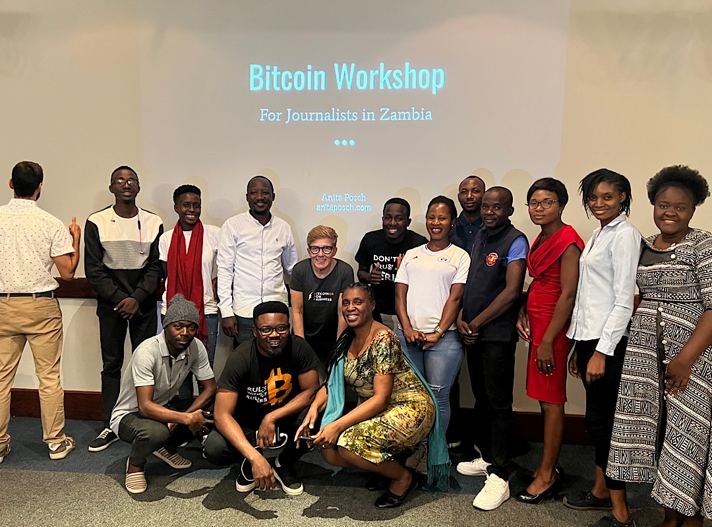
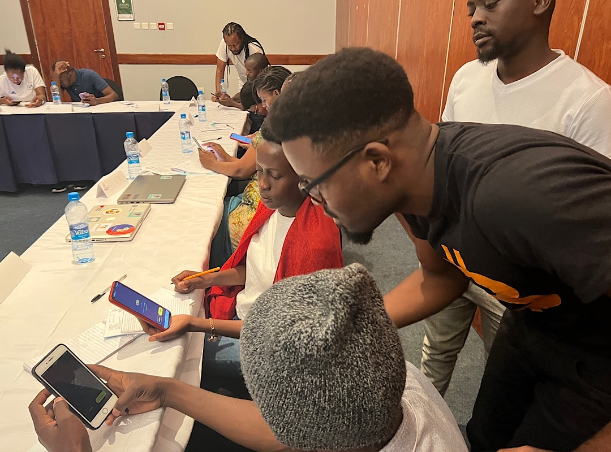
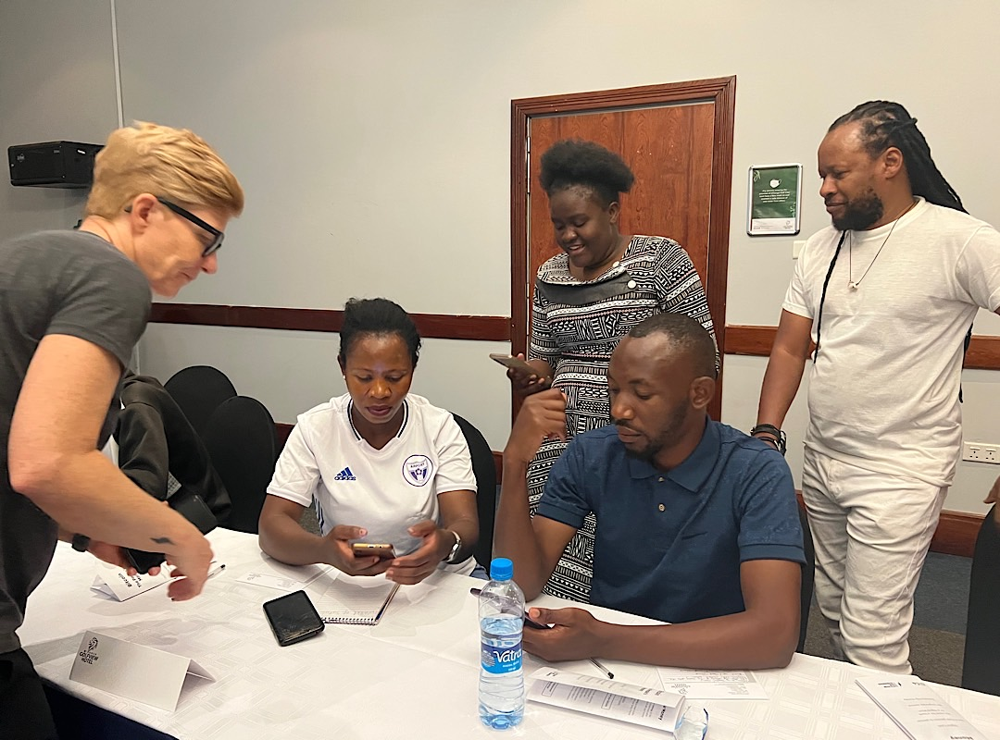
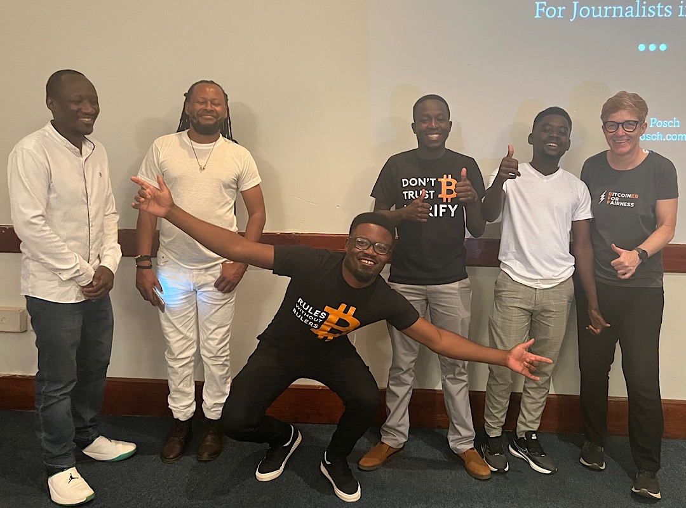
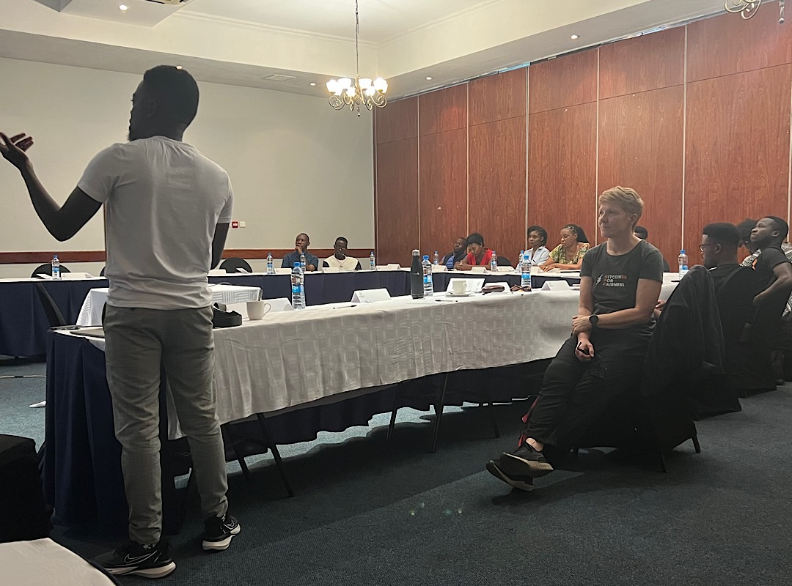
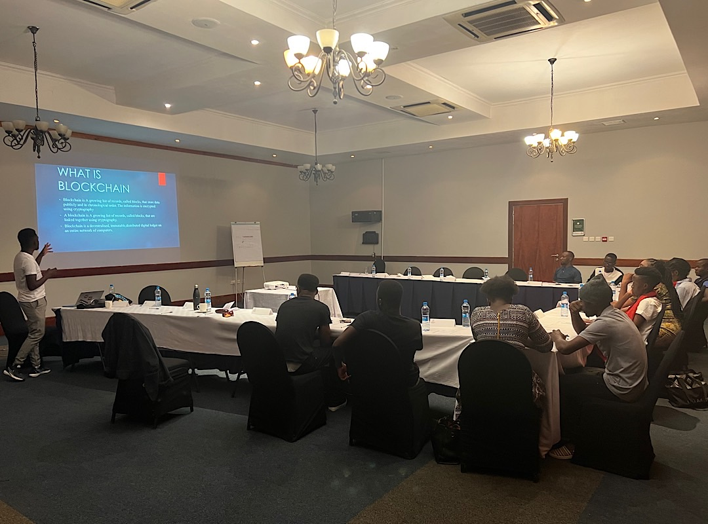
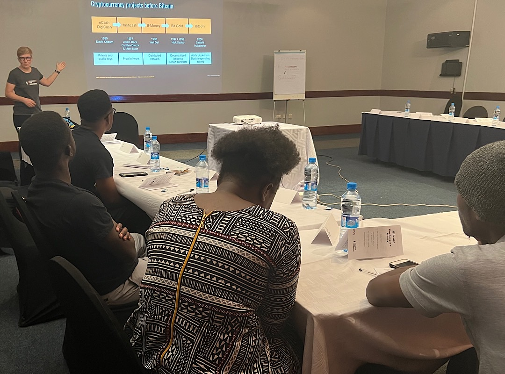

# Bitcoin Workshop for Journalists in Zambia

Together with my Bitcoin for Fairness team on the ground I conducted a Bitcoin workshop for journalists in Lusaka on October 7, 2022. The work of journalists is important in creating knowledge and opinion about Bitcoin. That's why we thought it's critical to share information about Bitcoin directly amongst them. The workshop and my Zambia trip was made possible by a sponsorship from Paxful, a Geyser grant and a donation from What Bitcoin Did host Peter McCormack.

Many interested journalists responded, but we had to restrict the workshop to 10 people. First because of the costs and secondly because keeping the participants number low enables deeper engagement with every participant. 

We were four lecturers, Japhet and Emmanuel from Lusaka, Harrison, who traveled from the north of Zambia to join us, it took him 16 hours by bus (855 km) and 3 hours by bicycle to reach his village and me.

The curriculum was: 
* History of Money (Harrison from Kasama, Zambia)
* What’s Blockchain (Emmanuel from Lusaka)
* What’s Bitcoin (Anita)
* Bitcoin vs Cryptocurrency (Harrison)
* Installing a Bitcoin wallet and sending and receiving bitcoin (Anita)
* How to identify scams (Japhet from Lusaka) 
* How to earn bitcoin (Anita)

The whole BFF team enjoyed the workshop and the journalists responded very positive too. You can see the smile on their faces when they received their first satoshis in the videos below. I think we were able to bust a lot of myths around Bitcoin with "Bitcoin is a scam" being the most important. We also emphasized the importance of a neutral, permissionless money for human rights and privacy. In an interview I told the journalists, that their country could use the excess electricity from their hydropower stations to start mining bitcoin and hold it as a reserve, which in 10 to 20 years could turn out to be very positive for Zambia. 

My slides

<iframe src="https://docs.google.com/presentation/d/e/2PACX-1vT9pPjq0rhnVC-hfg3FUQWpCBJsgC8gKuYBH7u5iMJzoKMtpnmUmdiWC06DfqLvl45XwVuCyBRrRKeH/embed?start=false&loop=false&delayms=5000" frameborder="0" width="480" height="299" allowfullscreen="true" mozallowfullscreen="true" webkitallowfullscreen="true"></iframe>

<iframe src="https://docs.google.com/presentation/d/e/2PACX-1vTOny8OvSowf6v6zAWA0YcVDk9kakRKtmGBXLxn03CvkF2pCaRwWXY8_bLY0aeJMHRJKiauYCYZix7_/embed?start=false&loop=false&delayms=60000" frameborder="0" width="480" height="299" allowfullscreen="true" mozallowfullscreen="true" webkitallowfullscreen="true"></iframe>

---
You like my work and efforts with [Bitcoin for Fairness](https://bffbtc.org) to foster Bitcoin adoption on the ground in the Global South? It's all community powered and funded by donations. Feel free to [support our campaign with a donation](https://anita.link/geyser), send sats to our lightning address bff@geyser.fund or send fiat money on [Patreon](https://patreon.com/anitaposch).