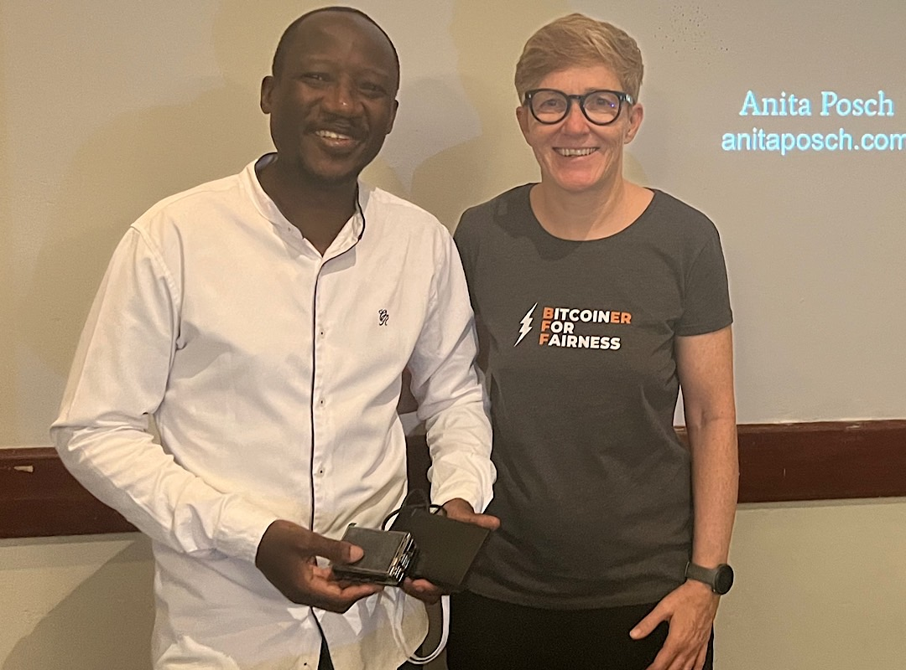
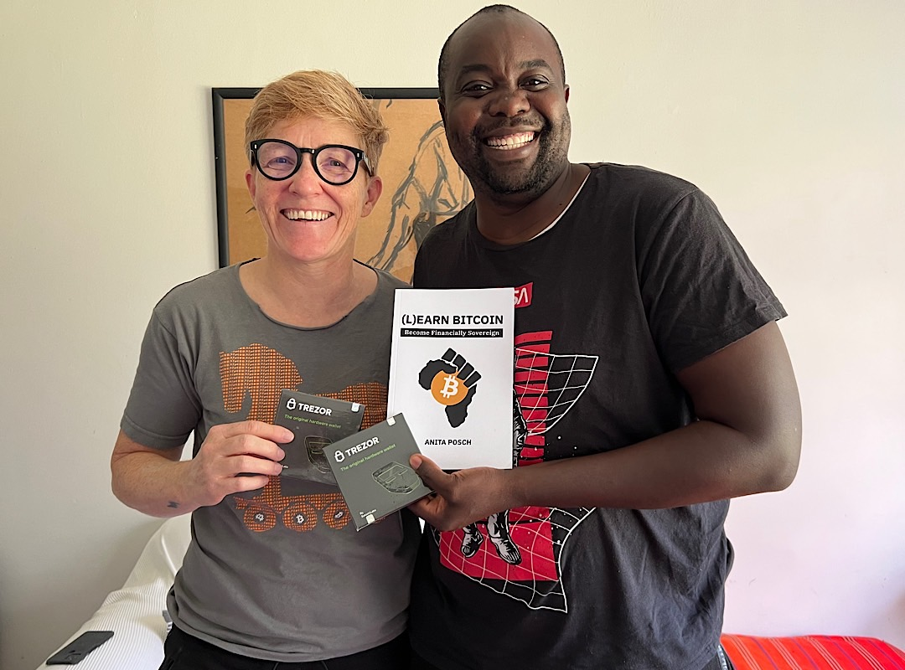
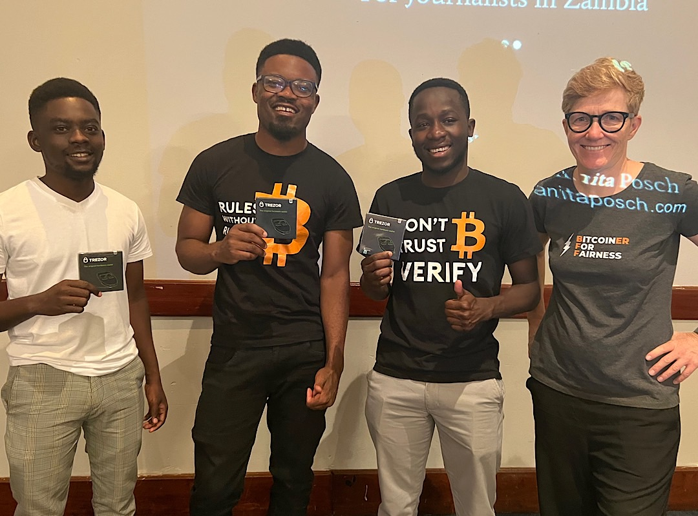

# A Bitcoin node and Trezor hardware wallets for Zambia

One of the goals of my [non-profit initiative Bitcoin for Fairness](https://bffbtc.org) is to bring Bitcoin infrastructure to countries where these kinds of devices aren't available yet. In May 2022 I [brought a device called Raspiblitz, which is a Bitcoin and Lightning node to Bitcoin Ekasi](https://bffbtc.org/lightning-node-south-africa/) in South Africa. It's up and running now, which means that they are a part of the network, can validate their transactions thus making them their own bank. 

https://twitter.com/BitcoinEkasi/status/1539262556120010755

Zambia has its first Raspiblitz now too. I'm looking forward to see them being connected with Bitcoin Ekasi and the rest of the network soon. It was also donated by my community! 

Running your own node means one is validating not only transactions but also the rules of the network. One can say: "Your node, your rules" it's the top level in the staircase of financial sovereignty. Most people not even reach the level of "Your keys, your coins", where they custody their own seed phrase. Often it's lack of knowledge or lack of a secure device to store their keys, that's where Trezor comes in. The Czech company donated some Model One hardware wallets, which I gave to Zambian Bitcoiners.

---

You like Anita's work and efforts with [Bitcoin for Fairness](https://bffbtc.org) to foster Bitcoin adoption on the ground in the Global South? It's all community powered and funded by donations. Feel free to [support our work with a donation](https://anita.link/donate) or send sats to our Lightning address: bffbtc@getalby.com.