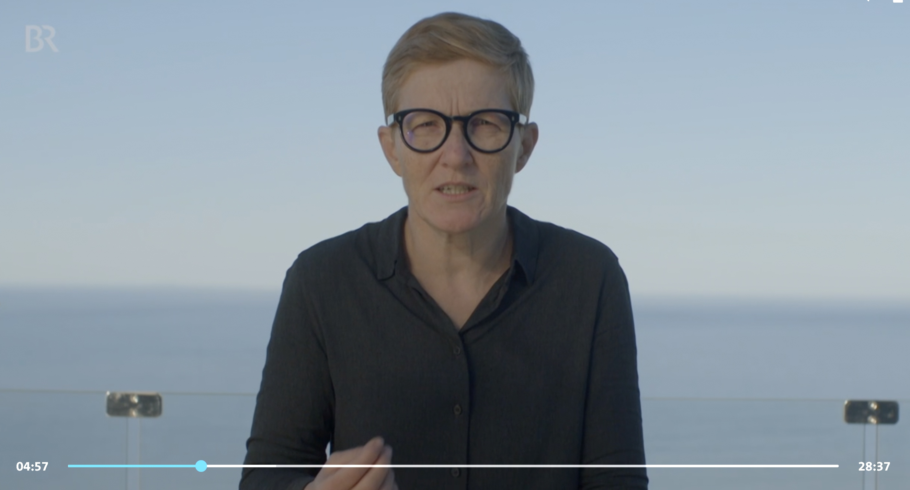

# Dokumentation über Bitcoin in Südafrika mit Anita Posch im deutschen Fernsehen
Die deutschen Fernsehsender ARD und BR haben eine Bitcoin-Dokumentation veröffentlicht, für die sie Anita Posch nach Südafrika begleitet haben, wo sie im Mai 2022 mit Bitcoin Ekasi gearbeitet hat. Das Township ist ein Beispiel dafür, dass Bitcoin von jedem genutzt werden kann, auch von Menschen in weniger privilegierten Verhältnissen.

Insgesamt findet Anita Posch die Dokumentation sehr gut gemacht. Es gibt einige sachlich falsche Dinge, wie wenn "Tante" über die CO2-Emissionen spricht, die eine einzelne Transaktion verursacht. Das ist fehlerhafte Mathematik. Der Energieverbrauch für Bitcoin skaliert nicht mit der Anzahl der Transaktionen. Die Anzahl der Transaktionen, die on-chain stattfinden, und die Anzahl der Transaktionen, die off-chain stattfinden - zum Beispiel über Second-Layer-Technologien wie das Lightning Network oder über Börsen, die Transaktionen bündeln - korrelieren nicht mit den Kosten des Minings. 

Anita Posch hat ein ganzes Kapitel ihres [Buches der Frage nach Bitcoins ökologischem Fußabdruck gewidmet](https://learnbitcoin.link).

Weitere Ergebnisse dieser Reise sind:   
* Anita Posch hat einen [raspiblitz](https://twitter.com/raspiblitz) mitgebracht, der [BitcoinEkasi](https://twitter.com/BitcoinEkasi) mit dem Lightning- und Bitcoin-Netzwerk verbindet. Damit kann Ekasi die eigenen Transaktionen verifizieren und sind jetzt ihre eigene Bank.
* Anita Posch hat mit dem Ekasi-Team [Trezor Hardware-Wallets](https://trezor.com) eingerichtet, die die Bitcoin der Ladeninhaber:innen sichern.   

Hier ist die Dokumentation auf Deutsch (bis zum 25. Oktober 2027 verfügbar):

---
You like my work and efforts with [Bitcoin for Fairness](https://bffbtc.org) to foster Bitcoin adoption on the ground in the Global South? It's all community powered and funded by donations. Feel free to [support our campaign with a donation](https://anita.link/donate), send sats to our lightning address bff@geyser.fund.

