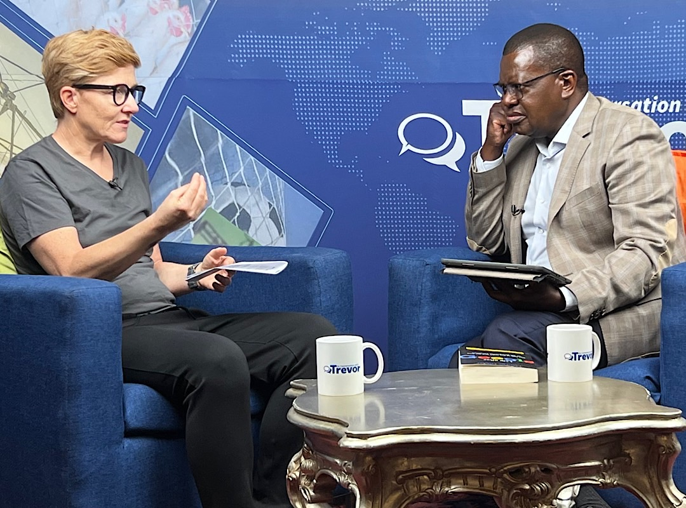

# Anita in conversation with Trevor Ncube on influential Zimbabwean channel - Ep. 165

Trevor Ncube, a Zimbabwean media entrepreneur influential and well respected throughout Southern Africa, invited me to be a guest on his show "In conversation with Trevor", an honor and pleasure for me.

Ncube was named among the 100 most influential people in Africa in 2012 and 2013. He has currently 270k followers on Twitter. On 10 December 2005, Trevor Ncube had his passport taken away by Robert Mugabe's government, in the first application of restrictive press freedom laws. He exiled to South Africa, now he is back and recording his show in Zimbabwe's capital Harare.

<iframe width="100%" height="473" src="https://www.youtube.com/embed/Isrhajmf9cc" title="YouTube video player" frameborder="0" allow="accelerometer; autoplay; clipboard-write; encrypted-media; gyroscope; picture-in-picture" allowfullscreen></iframe>

Trevor Ncube is Chairman of Alpha Media Holdings (AMH) based in Harare Zimbabwe, a company he co-founded 25 years ago. AMH owns four newspaper titles in Zimbabwe namely [NewsDay](https://www.newsday.co.zw/) (national daily), [Southern Eye](https://www.southerneye.co.zw/) (regional daily), [The Zimbabwe Independent](http://theindependent.co.zw/) (business weekly) and [The Standard](https://thestandard.newsday.co.zw/) (Sunday).

<iframe src="https://www.vodio.fr/frameplay.php?idref=25734&urlref=1" style="border: 0px none; box-shadow: rgba(0, 0, 0, 0.28) 0px 0px 10px; width: calc(100% - 10px); height: 180px; margin-left: 5px; padding: 0;" scrolling="no"></iframe>

### How to listen to Anita's Podcast

This is a Value4Value bitcoin enabled podcast. This means you can use a podcast app like [Fountain](https://fountain.fm) on your phone and send some satoshis to me while listening to the episode to show your appreciation. 

Listen on: [Apple Podcast](https://podcasts.apple.com/at/podcast/bitcoin-co/id1432576313) | [Spotify](https://open.spotify.com/show/0EJu3cMWF0AMxeO8NMH71z) | [YouTube](https://www.youtube.com/playlist?list=PL2zepPkogWotoUrb4T2XjLHa3SGHT5IX-) | [Pocket Casts](https://pca.st/YYPf) 

