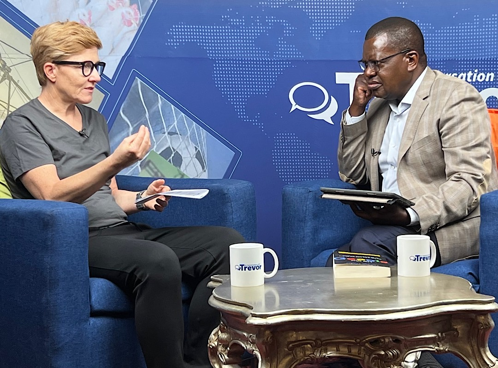

# Anita Posch on influential Zimbabwean YouTube channel

Trevor Ncube, a Zimbabwean media entrepreneur influential and well respected throughout Southern Africa, invited me to be a guest on his show "In conversation with Trevor", an honor and pleasure for me.

Ncube was named among the 100 most influential people in Africa in 2012 and 2013. He has currently 270k followers on Twitter. On 10 December 2005, Trevor Ncube had his passport taken away by Robert Mugabe's government, in the first application of restrictive press freedom laws. He exiled to South Africa, now he is recording his show in Harare.

<iframe width="100%" height="473" src="https://www.youtube.com/embed/Isrhajmf9cc" title="YouTube video player" frameborder="0" allow="accelerometer; autoplay; clipboard-write; encrypted-media; gyroscope; picture-in-picture" allowfullscreen></iframe>

Trevor Ncube is Chairman of Alpha Media Holdings (AMH) based in Harare Zimbabwe, a company he co-founded 25 years ago. AMH owns four newspaper titles in Zimbabwe namely [NewsDay](https://www.newsday.co.zw/) (national daily), [Southern Eye](https://www.southerneye.co.zw/) (regional daily), [The Zimbabwe Independent](http://theindependent.co.zw/) (business weekly) and [The Standard](https://thestandard.newsday.co.zw/) (Sunday).

---
You like my work and efforts with [Bitcoin for Fairness](https://bffbtc.org) to foster Bitcoin adoption on the ground in the Global South? It's all community powered and funded by donations. Feel free to [support our campaign with a donation](https://anita.link/geyser), send sats to our lightning address bff@geyser.fund or send fiat money on [Patreon](https://patreon.com/anitaposch).