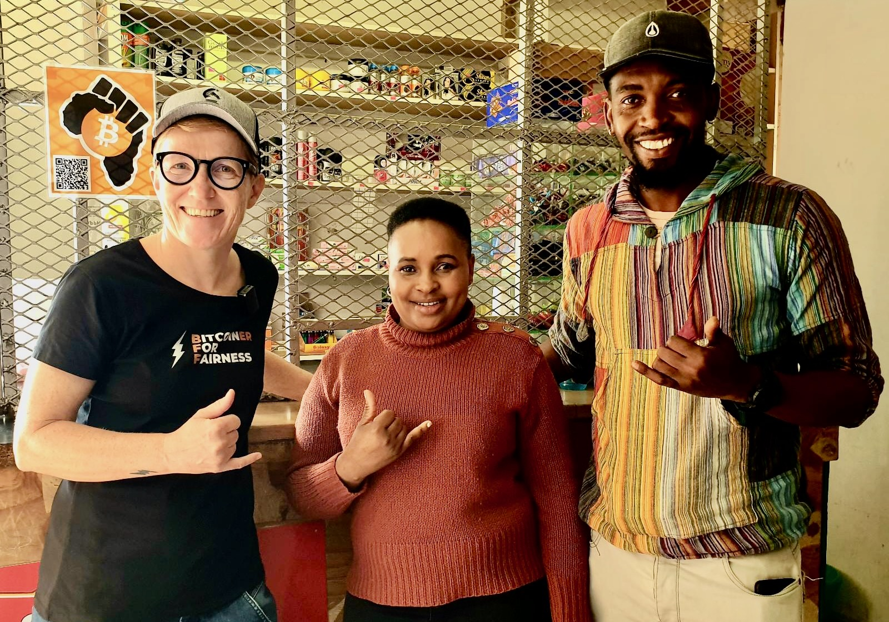

# Paying your groceries with bitcoin in South Africa 

## Pick'n'Pay one of the biggest supermarket chains started accepting bitcoin lightning payments

Since I visited South Africa in May 2022 I knew from Carel van Wyk's work to integrate bitcoin payments at Pick'n'Pay. Carel van Wyk is one of the Bitcoin pioneers in South Africa. In our interview he is speaking about how he had found out about Bitcoin in 2010. Being a technically skilled entrepreneur he realized Bitcoin’s potential to change the world very early. As a co-founder of Luno, now one of the largest exchanges in the world, he is sharing ideas how he sees Bitcoin unleash its full potential.

<iframe src="https://www.vodio.fr/frameplay.php?idref=25725&urlref=1" style="border: 0px none; box-shadow: rgba(0, 0, 0, 0.28) 0px 0px 10px; width: calc(100% - 10px); height: 180px; margin-left: 5px; padding: 0;" scrolling="no"></iframe>

Carel is a builder so I was pleased to hear that he was working on a tool to enable Lightning payments at Pick'n'Pay. I was visiting Bitcoin Ekasi in Mossel Bay the same time and I understood the importance of Carel's project in regards to the ability to buy groceries without having to exchange their bitcoin before. The Bitcoin Ekasi coaches are paid in bitcoin and now they can immediately spend it in the local Spaza shops (the small informal grocery stores in the township) and the shop owners can restock and spend their earned bitcoin at Pick'n'Pay. This is a huge development for the Bitcoin Ekasi project as it enables a circular economy.

 
The first shop owner to accept bitcoin was Nosihle. In May she told me she had wanted proof that one can buy real goods with bitcoin, before she was going to accept it in her shop. Coach Luthando had convinced her by using a Bitrefill voucher to buy something real with it. When she saw that with her own eyes, she started accepting bitcoin. Now Nosihle and the other shop owners can restock their inventory without the hassle of converting their bitcoin to Rand. 

<blockquote class="twitter-tweet">
So, about that exciting <a href="https://twitter.com/hashtag/Bitcoin?src=hash&amp;ref_src=twsrc%5Etfw">#Bitcoin</a> and <a href="https://twitter.com/hashtag/LightningNetwork?src=hash&amp;ref_src=twsrc%5Etfw">#LightningNetwork</a> announcement...  👀  Built by <a href="https://twitter.com/CryptoConverted?ref_src=twsrc%5Etfw">@CryptoConverted</a> Lightning payments have arrived at major local retailer <a href="https://twitter.com/PicknPay?ref_src=twsrc%5Etfw">@PicknPay</a>  💥🧡🔥<a href="https://t.co/Cv4t6fQm2d">https://t.co/Cv4t6fQm2d</a>  And we&#39;ve been helping them test it since May. 👇👇👇 <a href="https://t.co/20faGZ3q7x">pic.twitter.com/20faGZ3q7x</a>
&mdash; Bitcoin Ekasi (@BitcoinEkasi) <a href="https://twitter.com/BitcoinEkasi/status/1587416952305319936?ref_src=twsrc%5Etfw">November 1, 2022</a></blockquote> 

<small>Source: https://www.timeslive.co.za/news/south-africa/2022-11-01-pick-n-pay-lets-you-pay-for-groceries-using-bitcoin-here-are-stores-where-its-accepted/</small>

