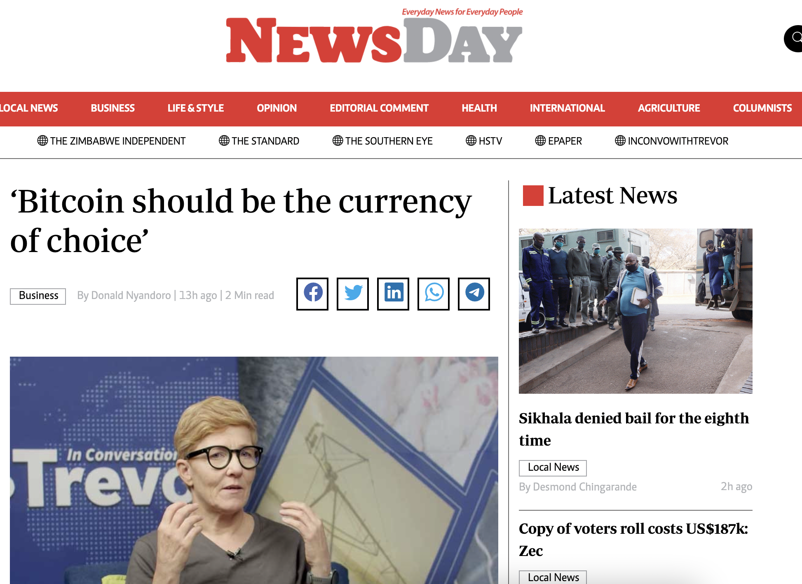

# Message to Zimbabweans: "Bitcoin should be the currency of choice"

After my appearance on "In Conversation With Trevor" Newsday Zimbabwe published an [article titled ‘Bitcoin should be the currency of choice’.](https://www.newsday.co.zw/business/article/200002981/bitcoin-should-be-the-currency-of-choice)

"Anita Posch has urged Zimbabwean businesses and individuals to use bitcoin as a medium of exchange because of its low charges when transacting as well as its being less prone to abuse."

Newsday Zimbabwe has 640k followers on Twitter and is one of the bigger newspapers in Zimbabwe.

<blockquote class="twitter-tweet">
Shared with 670k followers of NewsDay <a href="https://twitter.com/hashtag/Zimbabwe?src=hash&amp;ref_src=twsrc%5Etfw">#Zimbabwe</a>.  Probably nothing. <a href="https://t.co/dwn5wi8p5F">https://t.co/dwn5wi8p5F</a>
&mdash; Anita ⚡🏳️‍🌈 Bitcoin for Fairness (@AnitaPosch) <a href="https://twitter.com/AnitaPosch/status/1588486255972876288?ref_src=twsrc%5Etfw">November 4, 2022</a></blockquote> 
