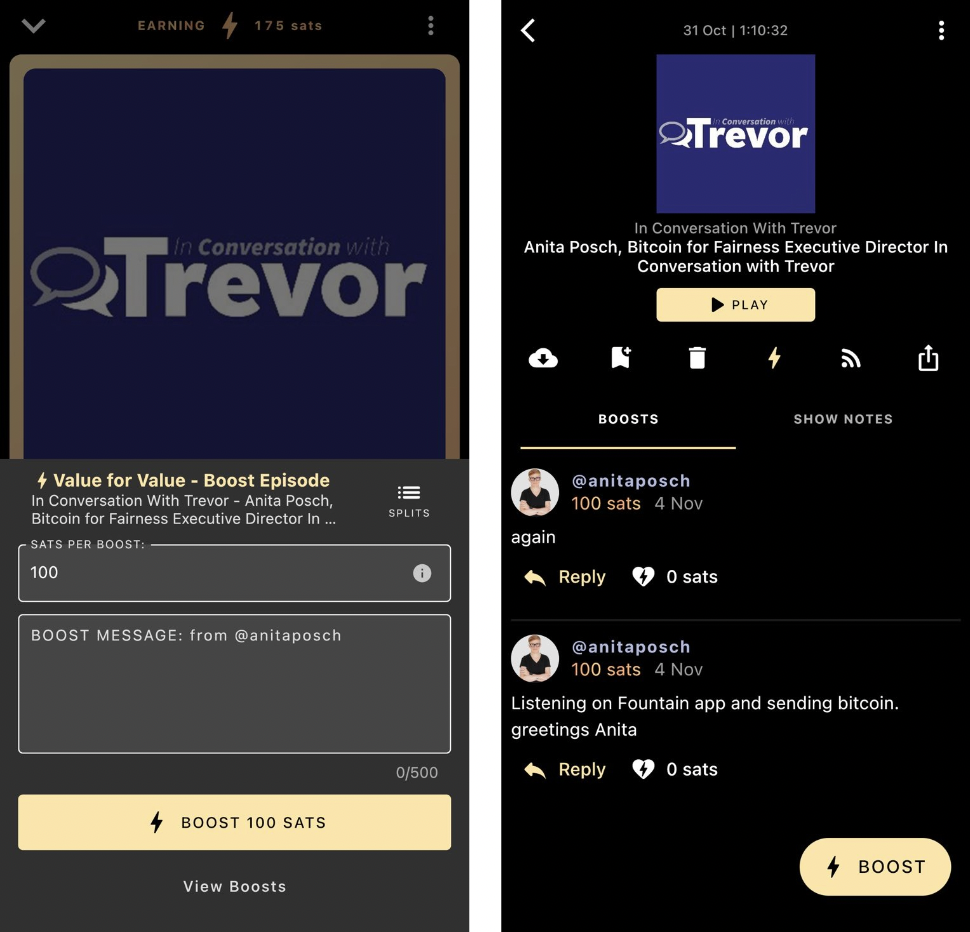

# "In Conversation with Trevor" the first Zimbabwean podcast to receive bitcoin payments

In November 2020 [my podcast was one of the first eleven podcasts globally](/bitcoin-podcast-enable-streaming-money) that was set up to receive Bitcoin payments in real-time over the Lightning network. Streaming money is a term coined by Andreas M. Antonopoulos in 2016, when he was speaking of the possibilities to earn bitcoin online through content creation. Back then it was an idea only, the realization demanded the development of the Lightning Network, which enables fast and cheap micro-payments, where money can be streamed without direct intervention of the user. 

## Value 4 Value

What do these terms mean? The idea of Value 4 Value is that content is provided for free, but consumers have the option to give back. They can opt-in to pay an amount of their choice for the value they've received directly to the content creator. As soon as a podcast is [V4V enabled you can find it on the Podcastindex](https://podcastindex.org/podcast/value4value), which is a database of over 4 Million podcasts at the time of writing.

## Number of Bitcoin enabled podcasts globally 

In only two years the [number of V4V enabled podcasts went from 11 to 9,970 in November 2022](https://podcastindex.org/podcast/value4value).

Now the **first Zimbabwean podcast is bitcoin payment enabled**. After I was a guest at "In Conversation With Trevor" I worked together with Trevor Ncube's team to setup his podcast for V4V streaming. I added the Value Tag from [getAlby](https://getalby.com) to the RSS Feed and connected the Alby account with [Blue Wallet](https://bluewallet.io/) to see the incoming streams on the phone. On the Podcastindex you can see [In Conversation with Trevor is now Value 4 Value enabled](https://podcastindex.org/podcast/5784258). 

Update June 2025: Since there has been a lot of technical development, the V4V functionality has been disabled on that specific podcast. Below screenshots demonstrate how sending sats works, while listenting to an episode on the Fountain player.

## How can I stream bitcoin to a podcast?

As a podcast listener you need to install a Lightning enabled podcast app like [Fountain](https://www.fountain.fm/) on your phone. Then you need to top it up with a little bit of bitcoin and you can start showing the podcaster that you value their content by streaming satoshis per minute and send boostagrams.

