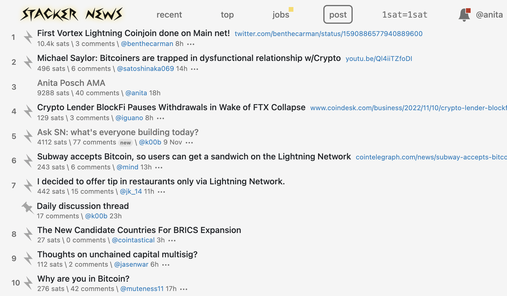

# Earn bitcoin on Stacker News: People asked and I answered

Stacker News is a forum (like Reddit or Hacker News) where you can earn real money for creating or curating content. Rather than collecting “upvotes” that are not redeemable or transferable on Reddit or Hacker News, on [Stacker News you can earn Bitcoin](https://stacker.news) that can immediately be spent anywhere.

You login to Stacker News with Lightning meaning the people behind the service do not store your email or a password (you can also use an email, if you don't have a Lightning wallet yet). After that you can edit your profile page and start posting content. Every new user gets two free posts and five free comments after joining the site. Many users have earned enough sats from their first few posts and comments to continue posting on the site indefinitely without ever depositing their own funds. Other readers can upvote your content by paying a few satoshis. 

The Ask me Anything session was started by an initial post by me, where I introduced myself and the AMA. I was asked a lot of interesting questions and enjoyed the session very much. Here you can [read all questions and answers](https://stacker.news/items/92142).

---
You like my work and efforts with [Bitcoin for Fairness](https://bffbtc.org) to foster Bitcoin adoption on the ground in the Global South? It's all community powered and funded by donations. Feel free to [support our campaign with a donation](https://anita.link/geyser), send sats to our lightning address bff@geyser.fund or send fiat money on [Patreon](https://patreon.com/anitaposch).