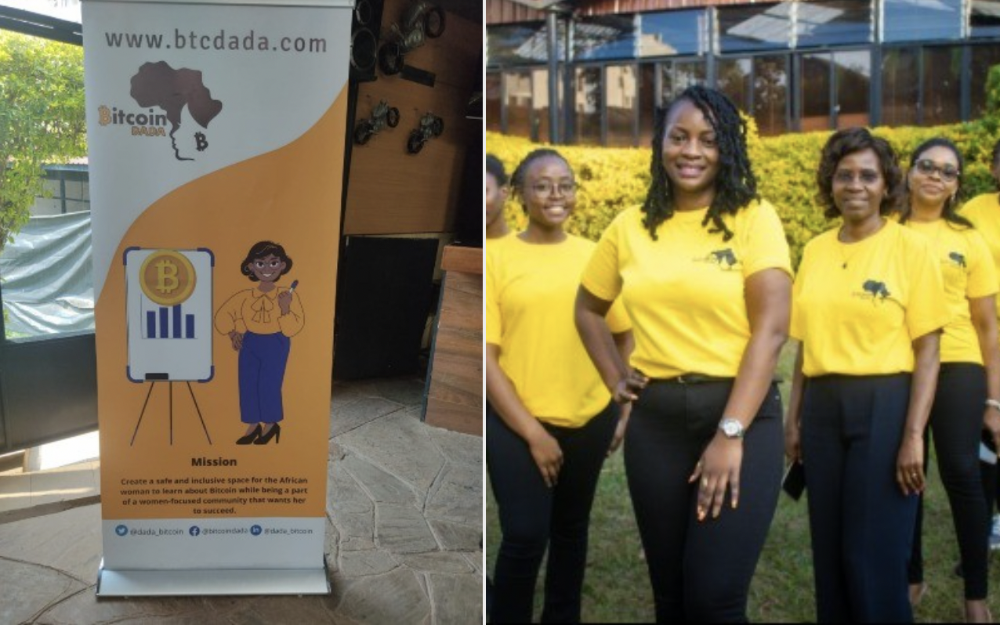

# Empowering female Bitcoin educators in Africa

## BFF's supporters make it happen!

In the name of Bitcoin Dada I want to thank everyone who donated towards getting Marcel Lorraine to attend the Afrobitcoin conference in Ghana in December 2022. We had set up a campaign on Tallycoin.app together, where the proceeds directly went into Marcel's wallet. Yesterday we reached the goal to cover the costs for travel and accommodation.

In our work in Ghana we will focus on self-custody, choosing wallets, how to safely store the backup. I want to show her how to setup a Bitcoin podcast and how to earn satoshis.

## African women need the right training to combat financial exclusion

I have spent some months in the Southern African region the last years and my main take aways are that education focused on self-custody, how to prevent getting scammed, privacy and how to earn bitcoin is essential, if we want to reach the goal of financial inclusion for millions of Africans. Our Bitcoin for Fairness meetups or my talks in Africa are overwhelmingly attended by men, just as they have been in every country I have visited so far, whether it has been in the US, Europe, or South America.

Bitcoin Dada is a women centric entity that is working towards educating African women into Bitcoin. Dada means Sister in Swahili. The goal of Bitcoin Dada is to narrow the gender divide in the space through education, online courses, community events and social networking.

<blockquote class="twitter-tweet">
On Behalf of Bitcoin Dada I would like to extend my gratitude to the larger <a href="https://twitter.com/hashtag/Bitcoin?src=hash&amp;ref_src=twsrc%5Etfw">#Bitcoin</a> community who contributed in making African BTC conference a reality for <a href="https://twitter.com/marcelorraine?ref_src=twsrc%5Etfw">@marcelorraine</a>  Special thanks to <a href="https://twitter.com/AnitaPosch?ref_src=twsrc%5Etfw">@AnitaPosch</a> for the guidance &amp; contributions, <a href="https://twitter.com/SatoshiJournal?ref_src=twsrc%5Etfw">@satoshijournal</a> <a href="https://twitter.com/GloireKW?ref_src=twsrc%5Etfw">@GloireKW</a> from... 1/n
&mdash; Bitcoin DADA (@dada_bitcoin) <a href="https://twitter.com/dada_bitcoin/status/1592286052336766983?ref_src=twsrc%5Etfw">November 14, 2022</a></blockquote> 

