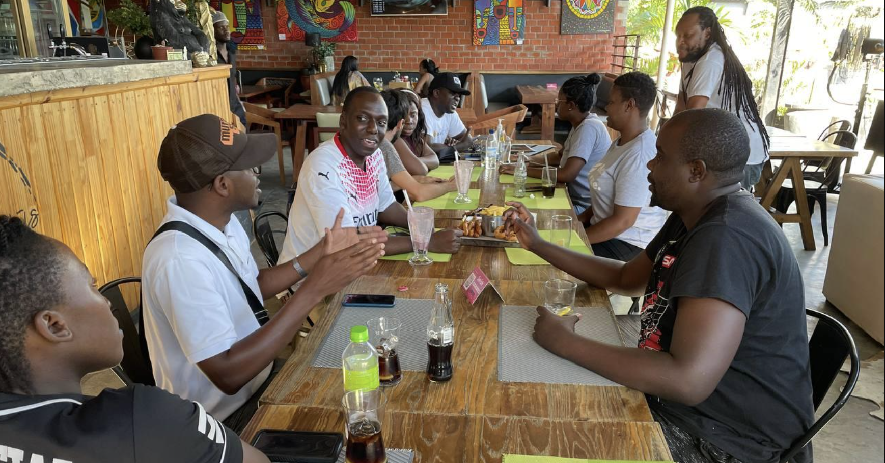

---
taxonomy:
    tags: [Blog, Zambia, Bitcoin in Africa]
routes:
    default: '/bitcoin-meetup-zambia-4'
date: 2022-11-20 10:40
dateformat: 'Y-m-d H:i'
summary: The fourth BFF Bitcoin meetup in Zambia took place on Saturday Nov 19. 
thumbnail: _Zambia-meetup-4.png
---

# Bitcoin Meetup Zambia Nr.  4

The fourth monthly Bitcoin Meetup in Lusaka, Zambia took place on November 19th, 2022 at Scallywags Cafe & Restaurant, where BTC is accepted. The meetup was organised by my local [Bitcoin for Fairness](https://bffbtc.org) friends as part of its Bitcoin education initiative. 

During the November Bitcoin Meetup, two main topics were discussed: 

1. the importance of self-custody and the pros and cons of trading. 
   The topic of self-custody is extremely important at the moment following the fall of FTX. 
   
2. As for the second topic, it should be noted that there are many people in Zambia who have lost money because of bitcoin trading scams due to lack of knowledge and promises of fast money.

---
You like my work and efforts with [Bitcoin for Fairness](https://bffbtc.org) to foster Bitcoin adoption on the ground in the Global South? It's all community powered and funded by donations. Feel free to [support our campaign with a donation](https://anita.link/geyser), send sats to our lightning address bff@geyser.fund or send fiat money on [Patreon](https://patreon.com/anitaposch).
