# Opposing The Corruptible Fiat System, Bitcoin Enforces Universal Human Rights

> You can listen to this article it's [episode 166 "How Bitcoin Enforces Human Rights"](https://anitaposch.com/podcast-bitcoin-enforces-human-rights-166).

In 2022, European politicians formed an initiative with the goal of [banning proof-of-work mining](https://www.coindesk.com/policy/2021/11/02/unpacking-europes-looming-mica-crypto-regulation/) because of its high electricity consumption. The underlying goal is to blame Bitcoin for damaging the environment, when it’s - as they claim - just a tool for useless speculation.

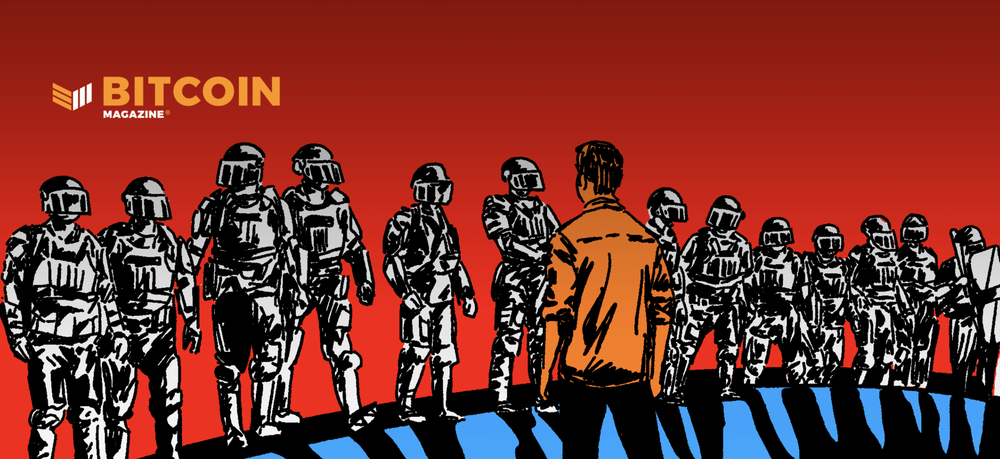

> This article was originally published on [Bitcoin Magazine](https://bitcoinmagazine.com/culture/bitcoin-enforces-universal-human-rights) by BTC Inc.

In 2021, the co-founder of Ripple, which [advertises itself](https://ripple.com/xrp/) as having better qualities than bitcoin, [donated $5 million](https://bitcoinmagazine.com/culture/greenpeace-environment-attacks-help-bitcoin) to support Greenpeace USA with a campaign called “Clean Up the Code.” It attempts to lobby Bitcoin developers to change the mining mechanism from proof of work to proof of stake, which would supposedly reduce its power consumption by 99%. With Ethereum moving from proof of work to proof of stake recently, these actors feel they have seen their theory confirmed and are trying to lobby against Bitcoin even more.

What they don’t mention is that the [differences between proof of work to proof of stake are huge](https://anitaposch.com/bitcoin-differences-proof-of-work-stake). These mechanisms have different goals and very different outcomes, which result in different properties of the cryptocurrencies they secure. In short: the immutability of proof of work is stronger than that of proof of stake. 

Proof of work is better at producing a robust, immutable blockchain that has a fair degree of decentralization and cannot be easily tampered with, even by very rich, very influential, very powerful organizations and entities. Proof of stake doesn’t have any of these goals. It has the goal of governance in an environmentally-friendly way that still maintains decentralization but allows some flexibility of a blockchain. In the short weeks after Ethereum’s switch, the overwhelming proportion of validators started to [censor transactions following the U.S. Office of Foreign Asset Control (OFAC) sanctions list](https://cointelegraph.com/news/ethereum-inches-even-closer-to-total-censorship-due-to-ofac-compliance).

Proof of work makes Bitcoin uncensorable, immutable and permissionless. These are the properties for resistance. It’s a tool for financial self defense and a Trojan horse for freedom. Bitcoin is a silent revolution. It empowers civil resistance. It’s our only shot at finding a better money that actively enforces human rights and supports activists in their resistance against dictators and authoritarians.

In this article, I won’t discuss energy use, because as soon as you understand the importance of Bitcoin to make the world more fair, you’ll get that the amount of energy used is off topic. You’ll understand that even better when you understand that Bitcoin mining is securing the total value stored on the blockchain and renders it the most secure network that we know of. And, on top of that, Bitcoin mining is already one of the greenest industries globally.

In the following, I lay out how Bitcoin enforces seven of the 30 articles mentioned in the [Universal Declaration of Human Rights](https://www.un.org/en/about-us/universal-declaration-of-human-rights). It should become clear that Bitcoin is neither useless nor just a tool for speculation.

## The Universal Declaration of Human Rights

Let’s turn back time to December 1948. Three years after the end of World War II, the world was still in horror over what had happened since Germany attacked Poland in [September 1939](https://encyclopedia.ushmm.org/content/en/article/invasion-of-poland-fall-1939). It started a war that lasted six years, killed approximately [80 million people](https://en.wikipedia.org/wiki/World_War_II_casualties), including [six million Jews](https://www.nationalww2museum.org/war/articles/holocaust) and many other members of minorities like Roma, Sinti, Black Germans, the differently abled, socialists, communists and homosexuals.

As a consequence, the United Nations was [founded in 1945 by 51 countries](https://en.wikipedia.org/wiki/United_Nations) committed to maintaining international peace and security, developing friendly relations among nations and promoting social progress, better living standards and human rights.

One of the outcomes was the Universal Declaration of Human Rights which was proclaimed on [December 10, 1948.](https://www.un.org/en/about-us/udhr/history-of-the-declaration) In succeeding decades it has been integrated into many countries’ laws and can be seen as a common standard of achievements for all peoples and all nations. It sets out, for the first time in human history, fundamental human rights to be universally protected and it has been [translated into over 500 languages](https://www.ohchr.org/en/stories/2016/11/universal-declaration-human-rights-now-available-more-500-languages-and-dialects).

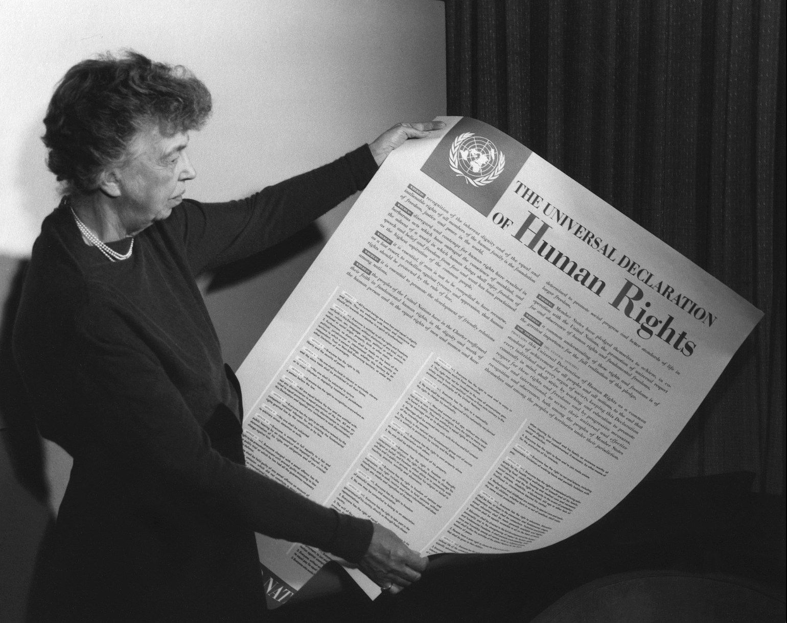 
[Source](https://www.flickr.com/photos/fdrlibrary/27758131387/)

An UN committee chaired by [Eleanor Roosevelt](https://en.wikipedia.org/wiki/Eleanor_Roosevelt) [drafted 30 articles](https://www.un.org/en/observances/human-rights-day/women-who-shaped-the-universal-declaration). [Hansa Jivraj Mehta](https://en.wikipedia.org/wiki/Hansa_Jivraj_Mehta), an Indian educator, independence activist, feminist and writer, [was responsible](https://www.un.org/en/about-us/udhr/history-of-the-declaration) for changing the language of the Universal Declaration of Human Rights from “all men are born free and equal” to “all human beings are born free and equal,” highlighting the need for gender equality.

[Source](https://thelogicalindian.com/story-feed/get-inspired/dr-hansa-mehta/)

The Universal Declaration of Human Rights served as a recommendation for a number of laws. Laws can be enforced or not. Laws in themselves are no guarantee that anyone is treated equally or is not being discriminated against or free from suffering under financial oppression. Contrary to human-enforced laws, a protocol that is enforced by mathematical rules built in consensus with all its users will always be non-discriminatory and provide an inclusive financial system. “Rules without rulers,” as [Andreas M. Antonopoulos says](https://youtu.be/gq-t7Ky6QmE).

The questions remain: How much electricity is the life and freedom of billions of people worth? How do people in the developed North come to decide what a good use of energy is for the South? Beyond a tool for “speculation,” isn’t Bitcoin also a great tool for privacy and financial self-sovereignty globally?

Let’s take a look at the state of the world today and how this global regulatory regime came into place that is defining who has possibilities and who hasn’t.

## The State of the World

### The Unequal Distribution of Democracy

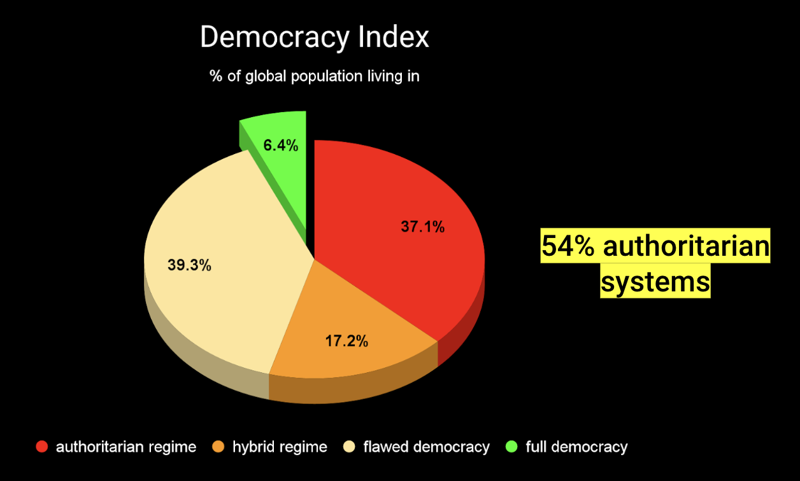
[Source](https://en.wikipedia.org/wiki/Democracy_Index)

Fifty-four percent of the global population lives in authoritarian or hybrid regimes. They don’t enjoy the privilege of living in full democracies. Only 6.4% of all people live in countries of “full democracy” like Germany, France, Austria and so on, or in the U.S. All of the others around the world are living in either flawed democracies or they are in full dictatorships or authoritarian regimes. The place where you were born largely defines the chances you’ll have in life (exceptions are rare).

[Source](https://www.visualcapitalist.com/mapped-the-state-of-global-democracy-2022/)

A look at the map of the democracy index shows a pattern to remember. The dark red areas are the countries where life is the worst, their peoples have the least freedom. The worst country per this metric is Afghanistan, followed by Myanmar, North Korea, the Democratic Republic of the Congo, Syria and the Central African Republic.

### The Centers of Corruption

[Source](https://www.transparency.org/en/cpi/2021)

A look on the map of political corruption shows a similar pattern. The dark red areas are stretched from the Northeast, starting in Russia and China, going over Africa and into South America. There seems to be some sort of correlation between corruption and failing democracies. That is corruption enables both human rights abuses and democratic decline. In turn, these factors lead to higher levels of corruption, setting off a vicious cycle.

### The Inequality of Wealth

[Source](https://howmuch.net/articles/world-wealth-map-2018)

Finally, let’s look at the world wealth map. The same pattern is visible. In countries with dictators and authoritarian leaders, people are on average poorer, with the poorest countries being in Africa and the Middle East.

The average net worth across the entire world indicates the enormous disparity between the developed world and everyone else. At one extreme, there are countries with net worth (with “net worth” being measured as the market value of all assets minus any outstanding debts) numbers over $500,000, and at the other extreme, there are places where people have less than $500 to their names. There is a smattering of light orange countries in between, but the worldwide map demonstrates an astonishing level of inequality between the haves and the have nots.

## A History of Monetary Power

### The British Empire

The reasons for the huge inequality are manifold. Colonialism has definitely been one of them. This map below shows the British Empire in 1910. This political and economical control enabled the United Kingdom to become the first monetary hegemon (“hegemony” refers to a single state that has decisive influence over the functions of the international monetary system). In 1910, the British pound was [still backed by gold](https://www.royalmint.com/invest/discover/gold-news/what-was-the-gold-standard/) (the gold standard meant that a portion of circulating money was backed by gold in the treasuries of banks) and everyone used it for trade.

[Source](https://en.wikipedia.org/wiki/British_Empire)

### The United States of Power

After the first world war, this British power faded. The second world war created a new hegemon. The U.S. had won the war, had the most powerful economy and controlled [basically all of the world’s gold reserves](https://www.imf.org/external/np/exr/center/mm/eng/mm_dr_01.htm#:~:text=By%201947%2C%20the%20United%20States,to%20pay%20for%20the%20war.). During the war, [many European countries sent their gold reserves to the U.S.](https://en.wikipedia.org/wiki/Bretton_Woods_system) to protect them from being stolen by the Nazis.

As financial analyst Lyn Alden [describes](https://www.lynalden.com/fraying-petrodollar-system/): 

> “With the Bretton Woods system and the following petrodollar system, the United States obtained a near-global lock on the international money system. Previous empire currencies never obtained that complete of a financial lock on the world, and thus were never true ‘global reserve’ currencies but instead were just ‘widely recognized and dominant’ currencies…

> “However, after only a decade, the Bretton Woods system began to fray. The United States began running large fiscal deficits and experiencing mildly rising inflation levels, first for the late 1960s domestic programs, and then for the Vietnam War. The United States began to see its gold reserves shrink, as other countries began to doubt the backing of the dollar and therefore redeemed dollars for gold instead of comfortably holding dollars…

> “The system had an underlying flaw that when left unaddressed brought the system down. It was never truly sustainable as designed. There was no way that the U.S. could maintain enough gold to back all of its currency for domestic use, and simultaneously back enough currency for expanding global use as well (which was the part that was redeemable).” 

### The Birth of the Fiat System

As Alden continues: “Eventually in 1971, math came back with a vengeance on the Bretton Woods system, and Richard Nixon ended the convertibility of dollars to gold, and thus ended the Bretton Woods system. The closing of gold convertibility was proposed to be temporary at the time, but it ultimately became permanent. Rather than shifting to another country, though, the United States was able to re-order the global monetary system with itself still in the center, in the next system.” 

When Richard Nixon [abolished the gold standard in 1971](https://www.investopedia.com/ask/answers/09/gold-standard.asp#:~:text=The%20Bretton%20Woods%20agreement%20established,the%20U.S.%20dollar%20to%20gold.), he basically rendered all currencies in the world as fiat money. “[Fiat](https://en.wiktionary.org/wiki/fiat#:~:text=Etymology,let%20it%20be%20done%E2%80%9D).)” is a Latin word that means “let it be done.” Since 1971, our currencies aren’t backed by gold anymore and only have value because they are legal tender. The [economical consequences have been immense](https://wtfhappenedin1971.com/).

It was the first time in history that only fiat currencies existed. This can lead to serious problems, for instance when one tries to use printed paper in another country. Why should businesses and governments in other countries accept pieces of paper, which can be printed endlessly by a foreign government and have no firm backing, as a form of payment for their valuable goods and services? The fiat system had a problem.

### The Petrodollar

In 1974, following a variety of geopolitical conflicts including, the [Yom Kippur War](https://en.wikipedia.org/wiki/Yom_Kippur_War) and the [OPEC oil embargo](https://history.state.gov/milestones/1969-1976/oil-embargo), the United States and Saudi Arabia [reached an agreement](https://www.bloomberg.com/news/features/2016-05-30/the-untold-story-behind-saudi-arabia-s-41-year-u-s-debt-secret) to sell their oil exclusively in U.S. dollars in exchange for U.S. protection and cooperation. From there, the world was set on the petrodollar system; a clever way to make a global fiat currency system work decently enough.

[Source](https://bitcoinmagazine.com/culture/the-hidden-costs-of-the-petrodollar)

### The Petrodollar Since 1974

But the system is cracking here and there. In August 2017, for instance, Venezuela declared that it would cease pricing its oil in U.S. dollars and instead use euros, yuan and other currencies. In March 2022, [media reports suggested](https://www.wsj.com/articles/saudi-arabia-considers-accepting-yuan-instead-of-dollars-for-chinese-oil-sales-11647351541) that Saudi Arabia was considering pricing some of its oil sales to China in the Chinese yuan rather than the U.S. dollar. On March 23, 2022, Vladimir Putin [announced an order](https://www.reuters.com/business/energy/putin-says-russia-will-start-selling-gas-unfriendly-countries-roubles-2022-03-23/) forbidding “non-friendly” countries (including EU countries, the U.S. and Japan) from buying Russian gas in any other currency besides Russian ruble (although the Russian Finance Ministry [reportedly said](https://en.wikipedia.org/wiki/Petrodollar_recycling) it would also accept gold or bitcoin).

### A Decentralized Global Monetary System

Alden’s base case going forward [is that](https://www.lynalden.com/fraying-petrodollar-system/):

> “...over the next several years, the global economy will, more likely than not, encounter a bear cycle of the current petrodollar system. If so, assets such as global equities, quality residential real estate, precious metals, industrial commodities, and alternatives such as Bitcoin, are likely to do well.

> From there, the global monetary system will gradually become more decentralized, in the sense that alternate payment systems and alternate currency settlements among trading partners are growing in use. This will indeed be a more structural shift towards a new system. It could happen slowly, as it already is, or it could accelerate if the US itself also shifts out of the fraying system.” 

## Consequences of Monetary Hegemony

For at least the past 78 years, marked by the end of World War II, the global economy has more or less revolved around the U.S. dollar. The Bretton Woods system was also the start of global financial institutions like the International Monetary Fund (IMF) and the World Bank. Since then, a lot of additional organizations like the Bank For International Settlements (BIS), the Financial Action Task Force (FATF) and OFAC were launched. Unelected representatives are inventing rules to fight money laundering, tax evasion and, in recent decades, terrorism. 

I haven’t heard of any financial regulation that was voted on by the population. But every country in the world has to regulate its banks. In parts for good reason, but despite the overarching regulations, the world is still riddled with fraud, banking failures (and now, also cryptocurrency fraud in cases such as [FTX](https://bitcoinmagazine.com/legal/ftx-files-for-bankruptcy-ceo-resigns), [Luna, etc.](https://bitcoinmagazine.com/markets/terra-collapse-teaches-about-crypto-and-bitcoin)) and money laundering. It’s just that the small fish get caught, while the big fish in most cases simply pay a fine which is less than their profits and move on.

There is already enough regulation and laws around traditional finance and the cryptocurrency industry. The [fall of FTX was caused by fraud, not because Bitcoin is a tool to rip off people](/bitcoin-ponzi-scheme). The opposite is true. If all actors in the industry were to stay true to the Bitcoin principles of transparency and not building on debt, then these things wouldn’t have happened. It’s centralized actors and their secrecy that allow fraud like that to happen. Fraud has always been a crime, there are laws to deal with it. It’s not lack of regulation, it’s lack of oversight.

### Organized and Willful Financial Exclusion

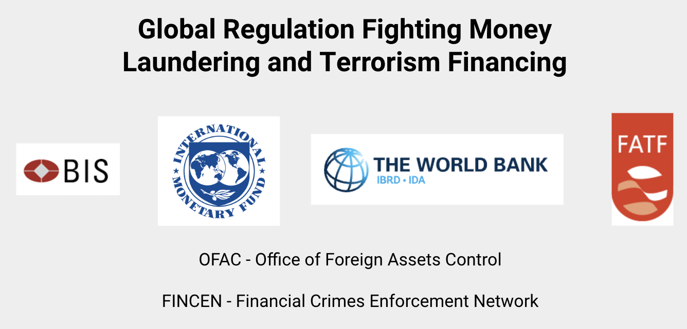

How did the above institutions come into being? It’s interesting to see the background of organizations which make decisions determining the difference between the have and have nots.

### The BIS: the Central Bank of Central Banks

The BIS is an [international financial institution](https://en.wikipedia.org/wiki/International_financial_institutions) owned by [central banks](https://en.wikipedia.org/wiki/Central_bank) that “fosters international monetary and financial cooperation and serves as a bank for central banks.” Interesting sidenote: the BIS shouldn’t exist anymore if it was for members of the Bretton Woods conference.

The BIS was founded in Europe in 1930. During the second world war, the BIS helped the Germans transfer assets from occupied countries. The fact that top-level German industrialists and advisors sat on the BIS board seemed to provide ample evidence of how the BIS might be used by [Adolf Hitler](https://en.wikipedia.org/wiki/Adolf_Hitler) throughout the war, with the help of American, British and French banks. Between 1933 and 1945, the BIS board of directors included several Nazis, for instance, a prominent Nazi official, [Emil Puhl](https://en.wikipedia.org/wiki/Emil_Puhl) responsible for processing dental gold looted from concentration camp victims. All of these directors were [later convicted of war crimes or crimes against humanity](https://en.wikipedia.org/wiki/Bank_for_International_Settlements).

For this reason, the Bretton Woods Conference was [meant to be Norway’s proposal for](https://en.wikipedia.org/wiki/Bretton_Woods_Conference) “liquidation of the Bank for International Settlements at the earliest possible moment.” Moreover, now that the IMF has been established, the BIS seems even more superfluous.

But the momentum for dissolving the BIS faded after U.S. President Franklin Roosevelt died in April 1945. Under his successor, Harry S. Truman, the top U.S. officials most critical of the BIS, left office by 1948, the [liquidation had been put aside](https://en.wikipedia.org/wiki/Bretton_Woods_Conference).
  
### The FATF: the Financial Action Task Force

The FATF is an intergovernmental organization [founded in 1989](https://www.fatf-gafi.org/about/whatwedo/) on the initiative of the G7 to develop policies to combat money laundering. Following the September 11 terrorist attacks in the U.S. in 2001, its mandate [was expanded to include terrorism financing](https://www.fatf-gafi.org/publications/fatfgeneral/documents/terroristfinancing.html).

Since 2000, the FATF has maintained the [FATF blacklist](https://en.wikipedia.org/wiki/FATF_blacklist#Current_FATF_blacklist) and the [FATF greylist](https://en.wikipedia.org/wiki/FATF_blacklist#Current_FATF_greylist). These are lists of countries that the FATF considers non-cooperative and deficient in the global effort to combat money laundering and terrorist financing. While, under international law, the FATF blacklist carries with it no formal sanctions, in reality, FATF blacklist members often fall under intense financial pressure.

### Accepting Two Billion Excluded People as Collateral Damage 

The effects on people in these countries are huge. Sanctions always hurt the poor and vulnerable the most. The powerful find their ways out. For instance, FATF has made it difficult for non-governmental organizations (NGOs) in these countries to access funds to aid in relief situations due to strict FATF criteria. The FATF recommendations do not specifically set out restrictions for NGOs.

According to [Wikipedia](https://en.wikipedia.org/wiki/Financial_Action_Task_Force):

“In a 2020 paper, Ronald Pol states that while the FATF has been very successful in getting its policies adopted worldwide, the actual impact of those policies is rather small: according to Pol’s estimates, less than 1% of illegal profits are seized, with the costs of implementing the policies being at least one hundred times larger. Pol contends that industry and policymakers consistently ignore this, instead evaluating the policies based on success metrics that are largely irrelevant.”

The U.S. was attacked in 2001 and in the following years, it strengthened regulations to combat terrorism which trickled down to almost all jurisdictions in the world, consequently excluding billions of unregistered and stateless people from establishing bank accounts, get jobs, purchase homes or start businesses. In addition, these people are impoverished, marginalized, discriminated against, disenfranchised and politically excluded.

For instance, there is Winnet Zhamini, aged 33 and grandmother. She is one of 300,000 Zimbabweans who will never have access to a bank account because of her lack of identification papers. As she told [The Guardian](https://www.theguardian.com/global-development/2021/jul/12/we-cannot-vote-or-get-jobs-plight-of-300000-zimbabweans-without-documents):

> “I have never had a birth certificate or an ID. My father was Malawian and settled here in the 70s. When we were born, we never had an opportunity to get birth certificates. My mother, who was Zimbabwean, died, my father just disappeared. My husband left me because I do not own any particulars. My sister got married and bore four children, but the husband chased her away because she has no ID. I cannot even buy a sim card. I cannot get a job, I survive on doing laundry. But we get exploited because there is no choice.”

These organizations are forcing everyone into overarching regulations and bureaucracy, which enable control on the level of the individual leading to financial exclusion and oppression of billions of people. 

The data collected by authorities is a honeypot for hackers, online crimes and extortion. And this all to find the few who are really money laundering or financing terrorism. Instead of general surveillance, why not focus and target the few? It’s a vicious circle. Sanctions, overarching regulations and financial control are the reasons why people need Bitcoin.

## How Bitcoin Enforces The Universal Declaration Of Human Rights

A global regulatory regime is excluding an [estimated 1.7 billion](https://www.forbes.com/sites/niallmccarthy/2018/06/08/1-7-billion-adults-worldwide-do-not-have-access-to-a-bank-account-infographic/?sh=2c27ca4c4b01) (perhaps 3 billion if you include an estimated two children per adult) people from having a bank account. Which leads us to the [Universal Declaration of Human Rights](https://www.un.org/en/about-us/universal-declaration-of-human-rights) and its [30 articles](http://hrlibrary.umn.edu/edumat/hreduseries/hereandnow/Part-5/8_udhr-abbr.htm). I’ll refer to seven of these articles to demonstrate how Bitcoin is supporting Human Rights.

### Article 1: Right to Equality

[Source](https://www.un.org/en/about-us/universal-declaration-of-human-rights)

This human right would suggest we all are born free to enjoy dignity and rights. But this is definitely not the case financially. Billions of people being too poor or without IDs are excluded from financial services. Of the 1.7 billion unbanked (these are just the household heads, including families, it’s more), 980 million are women.

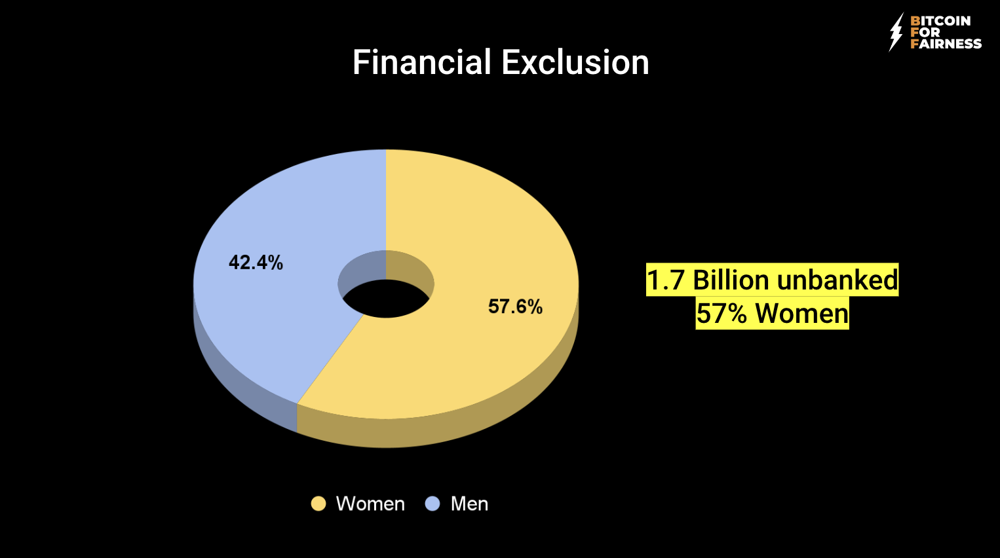
[Data source](https://borgenproject.org/unbanked-population/) 

Unbanked people can’t store their cash safely because of potential damage from animals like rats or because it makes them a target for robbery, and they can’t borrow money or else they fall prey to loan sharks.

As a Nigerian loan shark victim [has said](https://www.theafricareport.com/238323/nigeria-post-covid-loan-sharks-target-most-vulnerable-nigeians/):

> “Towards the last days of February (2022), I borrowed N18,000 ($43) from the Soko-loan app which I saw on Facebook. During the application, the app displayed 92 days as the minimum loan tenure but after I had submitted my data, I saw an interest rate of (about) 45% for 14 days!”

The solution is not more regulation, but open access to secure, decentralized money.

#### Financial Illiteracy and Lack of Wealth Cause Exclusion

If you do manage to have an ID and access to a bank account or mobile money service in Africa, it still doesn’t mean that you can access it easily or send money to someone in your own country or abroad. Red tape, unfunctional or non-existent IT infrastructure and high fees make this so hard that many people, even though they own bank accounts, just stop using them.

[Source](https://www.weforum.org/agenda/2017/04/financial-inclusion-south-africa/)

The fee structure of South African banks, for instance, is up to four times higher than in countries such as Germany, Australia and even India. Many people are willing to run the risk of loss and theft associated with cash to avoid the fees and the red tape.

People on low incomes have a deep mistrust of the formal financial sector, which is rooted in fears of exploitation. Past abuses, such as the inappropriate [marketing and selling of financial products](https://www.groundup.org.za/article/postbank-security-breach-highlights-sassas-failures/), have shown that poor people are highly susceptible to rapacious commercial interests.

Africa’s poor are particularly vulnerable due to widespread financial illiteracy, exacerbating the sense of mistrust and levels of exploitation fostered by these practices. Unfortunately, this is a [systemic education problem](https://www.weforum.org/agenda/2017/04/financial-inclusion-south-africa/) within Africa that cannot be addressed in the short term.

This is also a problem with all crypto tokens and outright scams as well. Bitcoin educators must make the difference between centralized institutions and the internet protocol of money clear to the people. Education is key, especially when the existing system must not be copied into the future, which was the goal of Bitcoin and Satoshi Nakamoto in the first place.

> “The root problem with conventional currency is all the trust that’s required to make it work. The central bank must be trusted not to debase the currency, but the history of fiat currencies is full of breaches of that trust. Banks must be trusted to hold our money and transfer it electronically, but they lend it out in waves of credit bubbles with barely a fraction in reserve. We have to trust them with our privacy, trust them not to let identity thieves drain our accounts.” - Satoshi Nakamoto

#### Monetary Colonialism

[Data Source](https://en.wikipedia.org/wiki/CFA_franc)

Fourteen African countries which were colonized by France with about 200 million inhabitants are still obliged to use the Central African franc and the West African franc, collectively known as the CFA franc. The CFA franc is legal tender and is pegged to the euro. The countries must deposit half of their foreign exchange with the French Treasury. Although these countries have been independent for decades, they don’t have financial sovereignty. That’s not independence, that’s monetary colonialism.

#### Inflation is Hidden Tax

For the first time since the 1920s, Austrians and Germans are feeling the impact of inflation. [Ten percent was the peak in November 2022](https://www.trendingtopics.eu/energiekrise-inflation-in-oesterreich-steigt-auf-105-prozent/). [Energy prices in Europe are skyrocketing](https://ec.europa.eu/eurostat/web/products-eurostat-news/-/ddn-20221031-1). Friends in Austria are telling me that they won’t heat their flats this winter and are buying cheap food. They have “middle-class” jobs, they are well educated. Ten to 20 years ago, the jobs they are doing were paying enough to buy an apartment on credit, own a car and go on a holiday trip with the family. Those days are over.

Compared to countries like [Zimbabwe with 500% inflation](https://en.wikipedia.org/wiki/Hyperinflation_in_Zimbabwe), or [Cuba with 135%](https://translatingcuba.com/food-prices-increased-in-cuba-by-52-percent-last-year/), [Turkey with 73.5%](https://www.nxtmine.com/economics/with-turkish-ppi-hitting-a-shocking-132-erdogan-goes-after-short-sellers-as-hyperinflation-craters-the-lira/) and so on, this is still bearable. Being in Zimbabwe, I always wonder how people survive these difficulties. The current inflation is only topped by the [hyperinflation in Zimbabwe around 2008](https://anitaposch.com/baby-i-m-a-billionaire) when the highest denominated banknote was “worth” $100 trillion.

Just imagine that the value of your money is decreasing by 500% per month. The salaries of civil servants, doctors and teachers in Zimbabwe are around $300 per month, and they are paid in the Zimbabwe dollar. Saving money is completely impossible. Either you spend it immediately or you try to find someone who wants to exchange it to the U.S. dollar. Every day is centered around money management. [“What is the rate today?”](https://anitaposch.com/finding-the-best-deals-in-zimbabwe) might be the most used question after “Hello, how are you?” in Zimbabwe, followed by the decision of [“in which currency am I going to pay?”](https://anitaposch.com/shopping-with-two-currencies-in-zimbabwe)

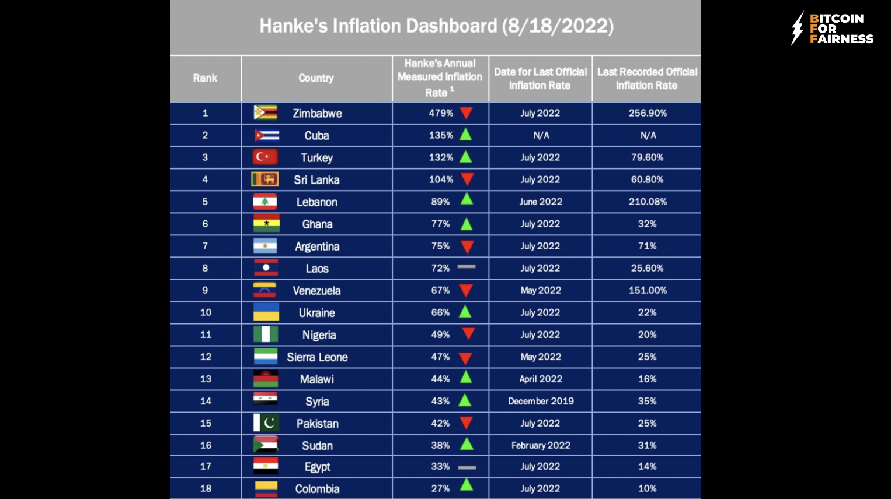
[Source](https://twitter.com/steve_hanke/status/1562135077575954433/photo/1  )

One of the reasons for the high inflation in Zimbabwe is [excessive money printing](https://zimpricecheck.com/analysis-and-opinion/its-not-gold-coins-here-is-the-real-reason-why-the-rate-has-fallen/).

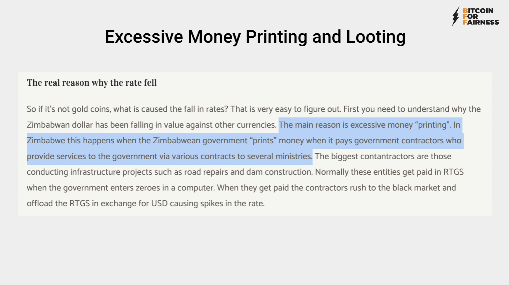
[Source](https://zimpricecheck.com/analysis-and-opinion/its-not-gold-coins-here-is-the-real-reason-why-the-rate-has-fallen/)

During my first visit to Zimbabwe in 2020 I put together a [podcast series where I documented the financial situation of people and if and how Bitcoin can be used to fight inflation and corruption](https://anita.link/51). My conclusion was that Zimbabwe sadly is a kleptocracy, the elites are corrupt and loot all money from the people.

#### How Bitcoin Fixes Inflation from Money Printing

There will only ever be 21 million bitcoin. When I mention that in my [talks in Zimbabwe](https://anitaposch.com/newsday-zimbabwe), people immediately understand the use case. There will be no monetary inflation, which would render bitcoin to have less value. Yes, bitcoin’s value is volatile, that’s because its price is determined by supply and demand and there is simply not enough demand yet to stabilize the value. But nobody can inflate the maximum amount of bitcoin that will be available. Bitcoin can also not be forged like cash or gold.

#### Corruption

Speaking of corruption and gold. Corruption is abuse of entrusted power for private gain. In Zimbabwe, the ruling elites are behind its disappearing gold. Every year, [gold worth $1.5 billion is being looted](https://www.businesstimes.com.sg/energy-commodities/zimbabwe-losing-us15b-gold-a-year-to-smuggling-report).

At the same time, Zimbabwe’s once enviable healthcare sector is collapsing under the weight of dilapidated infrastructure, a lack of drugs and poorly-paid staff going on frequent strike. [Pregnant women are being forced to pay bribes](https://www.theguardian.com/global-development/2020/nov/03/lives-have-been-lost-pregnant-women-in-zimbabwe-forced-to-pay-bribes-when-giving-birth) to get help with giving birth, with reports of babies being born in queues outside maternity clinics. People are dying in traffic every day due to the poor condition of streets, while the [government and ministers are rewarding themselves with new luxury cars](https://www.theguardian.com/world/2020/jul/07/zimbabwe-spends-millions-on-officials-luxury-cars-as-country-goes-hungry).

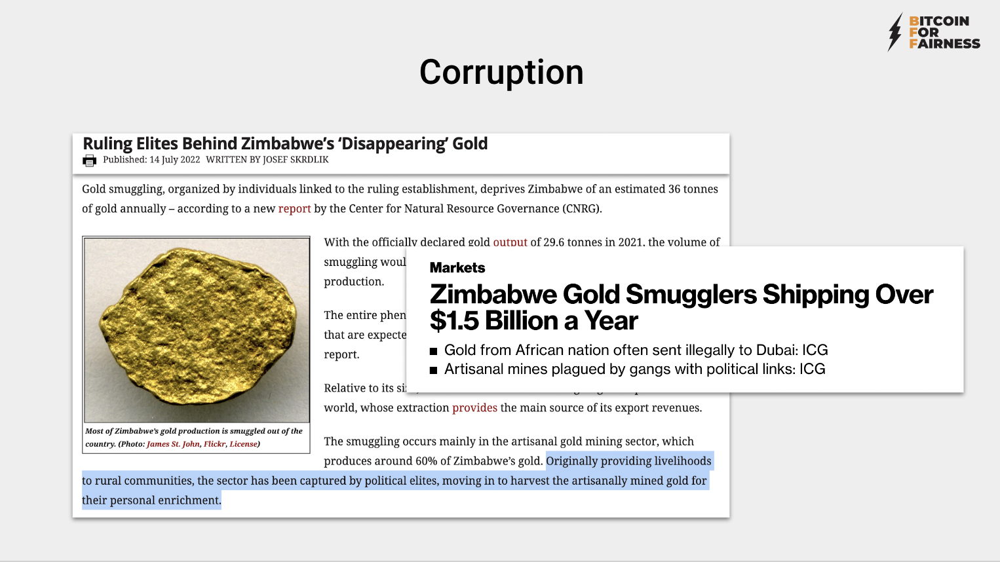
[Source one](https://www.occrp.org/en/daily/16564-ruling-elites-behind-zimbabwe-s-disappearing-gold), [source two](https://www.bloomberg.com/news/articles/2020-11-24/zimbabwe-gold-smugglers-estimated-to-ship-1-5-billion-a-year#xj4y7vzkg)

Not only in Zimbabwe is corruption a huge problem. Almost every authoritarian-led country has a high level of corruption. Corruption [erodes trust, weakens democracy, hampers economic development and further exacerbates inequality, poverty, social division and the environmental crisis](https://www.transparency.org/en/what-is-corruption).

#### How Bitcoin Fixes Corruption

The Bitcoin blockchain is a transparent ledger of all transactions that took place since Bitcoin started publicly on January 3, 2009. That means that budgets for ministries or projects can be audited. With multisignature wallets, the possibility to steal funds shrinks. This would only be possible if all signers were to collude.

But this doesn’t contradict the privacy-preserving properties of Bitcoin. If you choose to make a budget auditable, you can. The private keys give you the possibility to stay private or to reveal data. If you self custody your bitcoin, you decide. This is how Bitcoin empowers individuals and keeps authorities in check.

<iframe width="560" height="315" src="https://www.youtube.com/embed/sl4Yr9fBqQ4?start=135" title="YouTube video player" frameborder="0" allow="accelerometer; autoplay; clipboard-write; encrypted-media; gyroscope; picture-in-picture" allowfullscreen></iframe>

### How Bitcoin Fixes the Right to Equality

Bitcoin is a neutral, global, borderless money. As an open protocol, it can be used by anyone. No one can be excluded and everyone is treated the same. Bitcoin gives self sovereignty on a personal and national level. Bitcoin doesn’t care where you were born. Suffering a high amount of inflation and corruption is a result of the misfortune of your birth location.

### Article 12: The Right to Privacy

You read that correctly: privacy is one of the human rights mentioned in the declaration. How can it be that our privacy is highly infringed not only by companies like Facebook, but also by the regulatory authorities? In the name of preventing money laundering and child abuse, we’re all under constant surveillance.

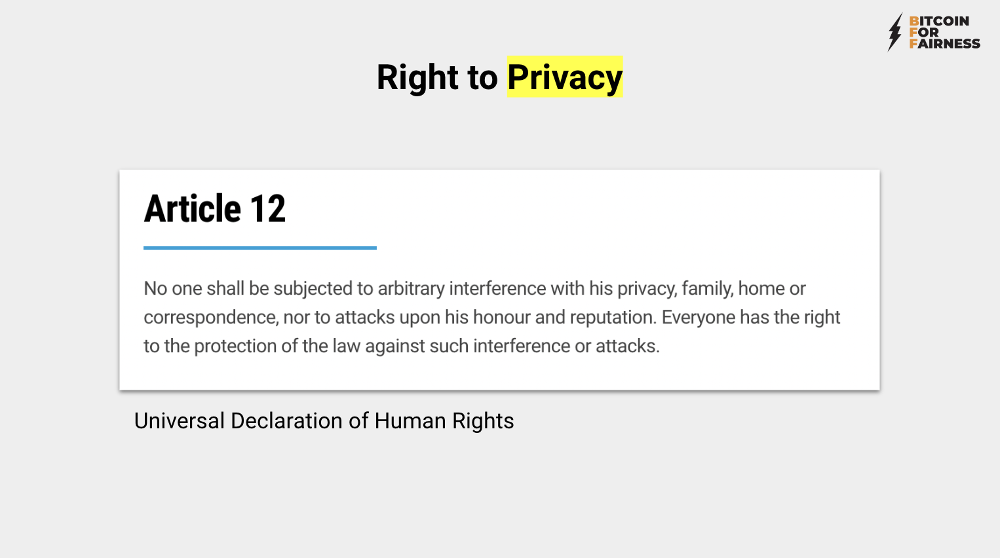
[Source](https://anitaposch.com/bitcoin-human-rights-riga-2022)

Financial surveillance and control seem to be the goals of institutions like the BIS. In 2021, the general manager, Agustín Carstens, [said in regards to central bank digital currencies (CBDCs)](https://bitcoinist.com/the-bis-wants-absolute-control-of-your-money-via-central-bank-digital-currencies/):

<iframe width="560" height="315" src="https://www.youtube.com/embed/9FM4Fu2ujDE" title="YouTube video player" frameborder="0" allow="accelerometer; autoplay; clipboard-write; encrypted-media; gyroscope; picture-in-picture" allowfullscreen></iframe>

Yet people arguing with me saying, "But I've got nothing to hide, it's ok, we need this control to fight criminals." 

[Source](https://anitaposch.com/bitcoin-human-rights-riga-2022)

My answer: it’s not about having nothing to hide! Alone, this idea is pushing human rights activists, lesbians and gays, opposition members and so on under the suspicion that they have something to hide. No, they do not have anything to hide. Nonetheless, they are targets of violence, intimidation and prison and are facing death in many countries. That’s the reason why privacy is important.

Even more so, it’s important that everyone is using privacy protection. The more people who care about privacy, the better protected freedom fighters and vulnerable groups are. This means that more privacy protection needs to be included in Bitcoin at the blockchain level. Less-wealthy people can’t afford a VPN service that costs $10 per month. They use what they get for free.

[Many millions are on Facebook and WhatsApp in Africa](https://www.statista.com/topics/9922/social-media-in-africa/). Why? Because it’s the only option they have. The cheapest option that telecom providers there offer are “social media” bundles. That’s why [thousands of people believe that Facebook is the internet](https://qz.com/333313/milliions-of-facebook-users-have-no-idea-theyre-using-the-internet). We shouldn’t repeat that mistake. But we’re on the brink. Luno, Binance and Coinbase are well-known brands in Africa. Most people believe that one needs to use an exchange or a bank to be able to use Bitcoin, and not only in Africa. I’ve heard that several times from people.

Privacy is a luxury for most Africans. They are even more prone to data collection and abuse.

### How Bitcoin fixes the Right to Privacy

Bitcoin’s privacy isn’t perfect, yet. New technologies like [PayJoins or Confidential Transactions](https://bitcoinmagazine.com/technical/list-of-bitcoin-privacy-proposals) will hopefully be implemented in the coming years. Payments on the Lightning Network are more private already. Wrapped Lightning invoices protect the recipient from being identified by custodians. With CoinJoins, you can already achieve a high level of privacy. In the future, this kind of protection needs to be the standard.

Still, since Bitcoin is pseudonymous and many people in African countries use it peer to peer without know-your-customer (KYC) identification, it gives them more privacy than their bank or mobile money provider. In Zimbabwe, all digital transactions are [automatically taxed at 4%](https://bitcoinundco.com/en/bitcoin-insights-africa/). Every payment is traceable by the government since mobile money transactions are moving from one SIM card to the other and SIM users are registered.

Privacy is never zero or one. It’s on a scale. The privacy possible while using Bitcoin is higher than that of your credit card, but lower than that of using cash. There is definitely a lot of work to be done and it’s important to make Bitcoin on the base chain more private. But Bitcoin gives you plausible deniability already now. It protects one from being an easy target.

## Article 19: Freedom of Speech

Funding the opposition in Zimbabwe? Supporting a gay rights group in Saudi Arabia? Protesting against China in Hong Kong? Donating toward Ukrainian refugees? Then you’re sharing your opinion with the world through your financial transactions. If you can’t send money to an abortion clinic in the U.S. for fear of being prosecuted, then your freedom of speech has been taken away.

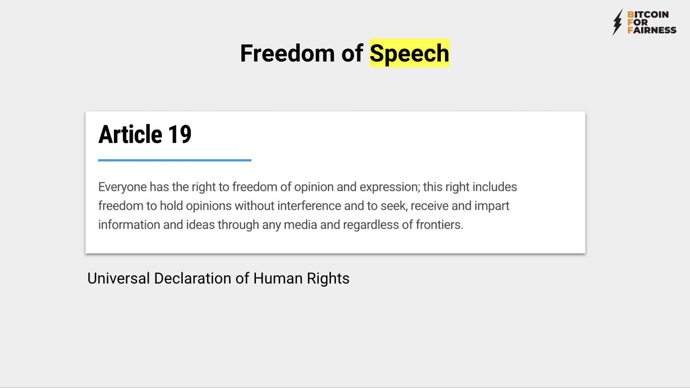
[Source](https://www.un.org/en/about-us/universal-declaration-of-human-rights)

Similar cases to the below are not unique to Zimbabwe, but that is just the country I visited for the longest period. The young man pictured on the left was brutally murdered because he was an activist. The man pictured on the right was arrested because he was wearing a yellow t-shirt. Yellow is the color of the opposition, and [wearing yellow was forbidden by the government](https://bulawayo24.com/index-id-news-sc-local-byo-217547.html).

“Even schoolchildren have not been spared with reports suggesting that schools with yellow uniforms have been directed to abandon them and pick different colours,” [ZimEye](https://www.zimeye.net/2022/03/08/mnangagwa-bans-yellow-attire/) reported.

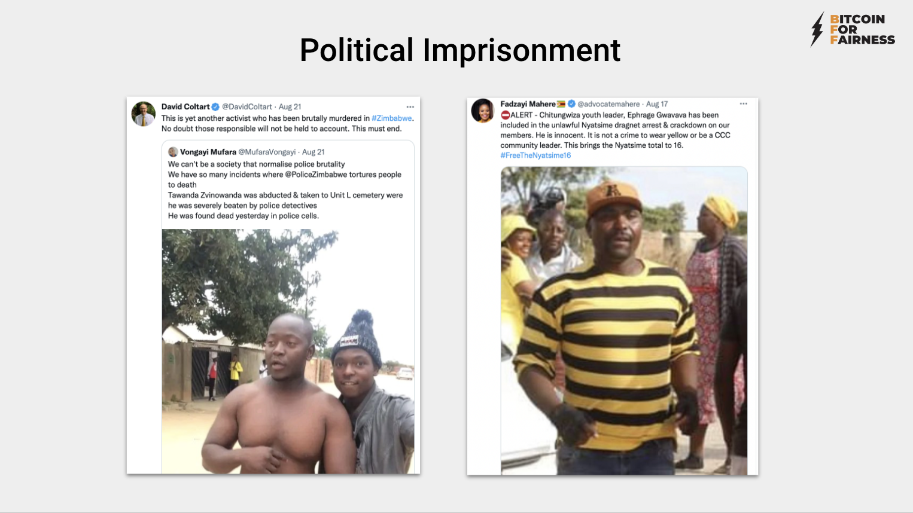
[Source](https://anitaposch.com/bitcoin-human-rights-riga-2022)

## How Bitcoin fixes Freedom of Speech

Bitcoin transactions are uncensorable. Used the right way, Bitcoin gives you enough privacy to express your opinion (I’m not talking about any privacy it may grant for committing crimes).

## Article 20: Freedom of Association

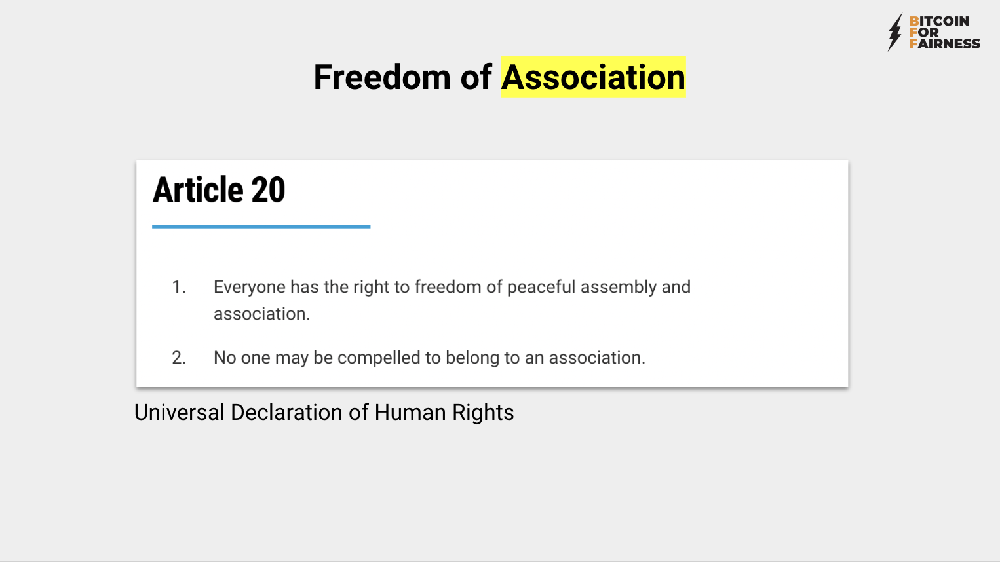
[Source](https://www.un.org/en/about-us/universal-declaration-of-human-rights)

Freedom of speech goes hand in hand with freedom of association. If you can’t express your political opinion, if you can’t meet with your fellow demonstrators or freedom fighters because of financial surveillance, then you’re stripped from political power. If your activism endangers the authoritarian powers, then they cut you off from your bank account. 

This happened in Nigeria [during the EndSARS](https://bitcoinmagazine.com/culture/nigerian-protest-group-finds-sovereign-lifeline-in-bitcoin) movement which started in October 2020. The demonstrations against police brutality were supported by the Nigerian Feminist Coalition. They collected donations via their bank account and gave food, drinks and other needed support to the demonstrators, but not for long. The country’s central bank cut off their bank account. But the women remembered Bitcoin, the technology that works without banks. Tech savvy as they were, they set up a BTCPay Server instance and started collecting donations in bitcoin from all over the world.

[Source](https://qz.com/africa/1922466/how-bitcoin-powered-nigerias-endsars-protests), [source two](https://anita.link/88)

<iframe width="560" height="315" src="https://www.youtube.com/embed/BH-XqzmavQo?start=2713" title="YouTube video player" frameborder="0" allow="accelerometer; autoplay; clipboard-write; encrypted-media; gyroscope; picture-in-picture" allowfullscreen></iframe>

## How Bitcoin fixes Freedom of Association

Bitcoin’s privacy and uncensorability enables people to cooperate against dictatorships. You simply can’t freeze a Bitcoin account, because there are no accounts. As long as you self custody your keys, no one can take your money away from you.

## Article 2: Freedom from Discrimination

[Source](https://www.un.org/en/about-us/universal-declaration-of-human-rights)

### Financial Oppression via Foreign Exchange Controls

> "Foreign exchange controls are imposed by a government on the purchase/sale of foreign currencies by residents, on the purchase/sale of local currency by nonresidents, or the transfers of any currency across national borders. Countries with weak and/or developing economies generally use foreign exchange controls to limit speculation against their currencies. They may also introduce capital controls, which limit foreign investment in the country." –[Wikipedia](https://en.wikipedia.org/wiki/Foreign_exchange_controls)

Thirty-one countries globally are imposing foreign exchange controls, such as Argentina, Ethiopia, Ghana, Nigeria, Russia, Ukraine, Venezuela and Zimbabwe, just to name a few. These discriminatory restrictions are financial oppression.

[Source](https://www.techzim.co.zw/2022/06/zipit-moxnthly-limits-increased/)

[In Zimbabwe, for instance](https://www.techzim.co.zw/2022/06/zipit-moxnthly-limits-increased/), online banking transactions are limited to $600 dollars per month. Per transaction you can only transfer $37. It’s basically impossible to run a business like that.

Another form of financial discrimination is the war on cash. In 2016, [the Indian government and central bank withdrew the highest-denominated banknotes](https://www.strategy-business.com/article/What-Happened-after-India-Eliminated-Cash) from one day to the other to fight money laundering and the black market. Hundreds of thousands of cash dependent people stormed banks and ATMs to exchange their banknotes. But, of course, ATMs were empty and it was a weekend.

The result was that [82 people died](https://thewire.in/uncategorised/the-costs-of-demonetisation-death-toll-rises-to-82-eight-million-bidi-workers-remain-unpaid) and millions lost their money. And this overreach had seemingly zero positive effect, because two years later, the black market money problem still existed.

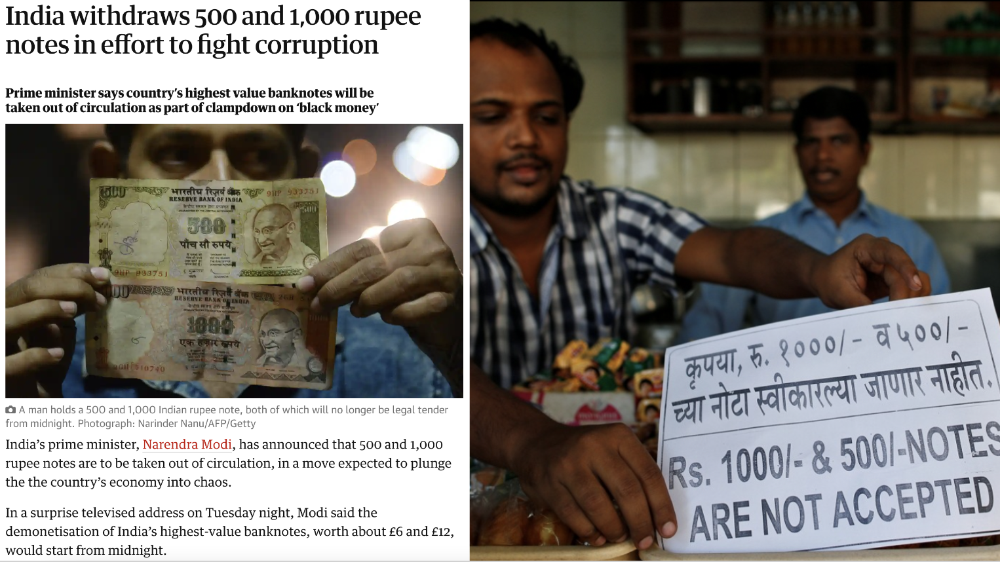
[Source one](https://www.theguardian.com/world/2016/nov/08/india-withdraws-500-1000-rupee-notes-fight-corruption), [source two](https://thewire.in/uncategorised/the-costs-of-demonetisation-death-toll-rises-to-82-eight-million-bidi-workers-remain-unpaid)

## How Bitcoin Fixes Freedom from Discrimination

Bitcoin is permissionless. Anyone can use it, regardless of race, gender, status or wealth. Nobody can take it away from you. Since it’s a protocol controlled by code and machines, there can be no discrimination based on human prejudices.

## Article 13: Freedom of Movement

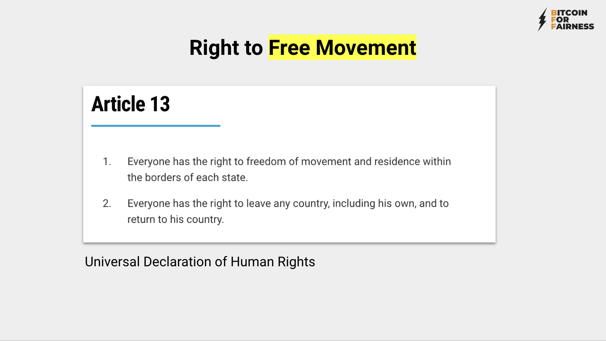
[Source](https://www.un.org/en/about-us/universal-declaration-of-human-rights)

Most people don’t have the right to free movement — at least they aren’t welcome to arrive in many countries. Even if one is allowed to move freely, one can’t take all of their wealth with themselves. 

Imagine you need to flee your home because of war or discrimination and persecution. You can’t just go to the bank and ask for all of your money and transfer it abroad. [Foreign exchange controls and regulations](https://www.tradecommissioner.gc.ca/china-chine/control-controle.aspx?lang=eng) ban the import of a stash of money higher than a few thousand U.S. dollars. If you own a house or land, you need to sell it and see how you can transfer it from one jurisdiction to the other.

## How Bitcoin fixes Freedom of Movement

Bitcoin is borderless. It enables free movement without losing all your wealth.

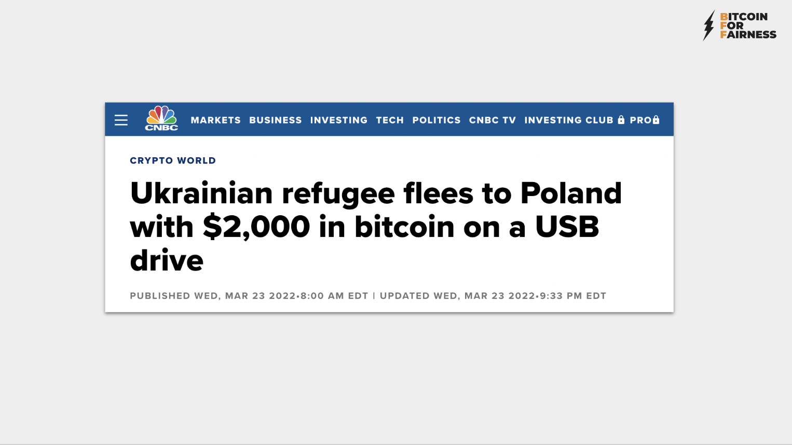
[Source](https://www.cnbc.com/2022/03/23/ukrainian-flees-to-poland-with-2000-in-bitcoin-on-usb-drive.html)

The Ukrainian referred to in the above headline was able to flee the war zone because they could take their bitcoin with them. In fact, you don’t even need a device to take all of your wealth with you. Memorize the 12 seed words to your Bitcoin wallet, throw away your smartphone or computer and move over borders. On the other side, get yourself a phone, install a wallet and import the seed words. You’ll have access to your money.

## Article 17: Right to Own Property

[Source](https://www.un.org/en/about-us/universal-declaration-of-human-rights)

Seventy-five economies globally [still limit women’s rights to manage assets](https://blogs.worldbank.org/opendata/where-world-do-women-still-face-legal-barriers-own-and-administer-assets). There are countries in which women are not allowed to own property or inherit it — they never will be owners of land that could be used as a security to apply for a loan or support their informal businesses. This is occurring mostly in countries in the Middle East, North Africa, South Asia, Sub-Saharan Africa, East Asia and the Pacific.

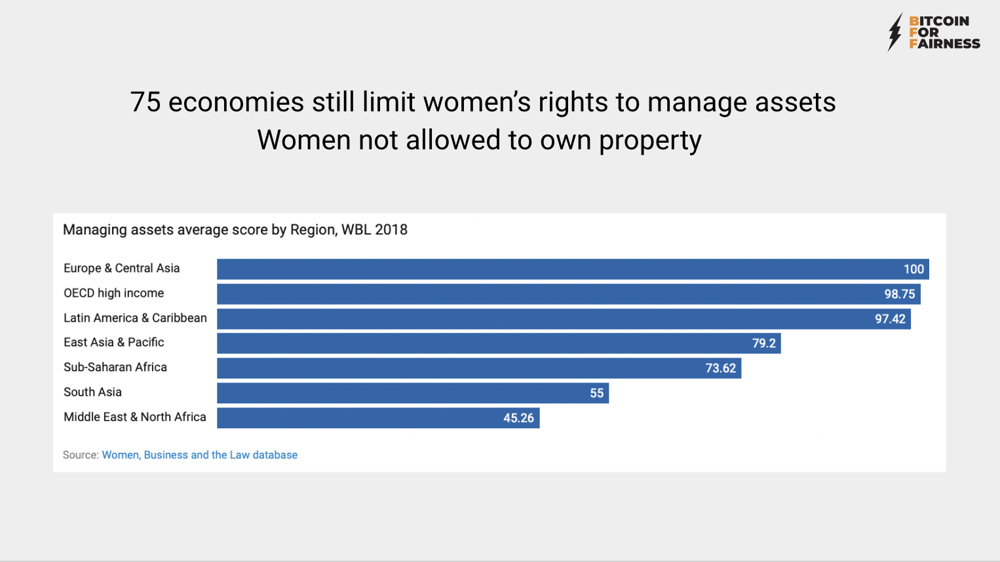
[Source](https://blogs.worldbank.org/opendata/where-world-do-women-still-face-legal-barriers-own-and-administer-assets)

> “Data shows that giving women greater access to assets through inheritance can change outcomes for children, particularly girls. In 1994, two states in India reformed the Hindu Succession Act to allow women and men the same ability to inherit joint family property. This altered control over assets within families and increased parental investments in daughters. Mothers who benefited from the reform spent twice as much on their daughters’ education, and women were more likely to have bank accounts and sanitary latrines where the reform occurred.” - [World Bank](https://blogs.worldbank.org/opendata/where-world-do-women-still-face-legal-barriers-own-and-administer-assets)

Women are the majority of Kenya’s population; they perform [70% of the agricultural labor](https://www.weforum.org/agenda/2018/03/women-farmers-food-production-land-rights/), but they [own less than 2% of the land](https://www.csmonitor.com/World/Africa/2021/0322/Kenyan-women-can-own-land-too-A-women-only-village-inspires-others) and control very little of the income produced by their labor. According to a [Savings Learning Lab report](https://www.itad.com/wp-content/uploads/2020/02/Savings-Count-Trends-in-access-use-and-the-ecosystem-of-savings-in-Sub-Saharan-Africa-1.pdf), after being provided with savings accounts, market vendors in Kenya, primarily women, saved at a higher rate and invested 60% more in their businesses. Women-headed households in Nepal spent 15% more on nutritious foods (meat and fish) and 20% more on education after receiving free savings accounts. Moreover, farmers in Malawi who had their earnings deposited into savings accounts spent 13% more on farming equipment and increased their crop values by 15%.

Bitcoin empowers women and vulnerable groups, because one can own it secretly. No one needs to know. This lowers the danger of money being taken away by partners and family members.

In the near future, people will be able to use bitcoin as a collateral for micro loans. One can save as little as one cent or $1 in bitcoin a day on the Lightning Network. After saving a certain value, like $50, they can receive a micro loan. After paying back, they’ll get back the collateral.

### How Bitcoin Fixes the Right to Property

Bitcoin is not only digital money, it’s digital property. Therefore, self custodying your bitcoin makes you an owner of property. Since Bitcoin is permissionless, the right to own property is granted to anyone.

## Bitcoin Is a Silent Revolution

[Source](https://www.transparency.org/en/news/cpi-2021-corruption-human-rights-democracy), image source: Lagos, Nigeria – Activists protest against the controversial anti-social media bill introduced in the parliament, November 2019. Photo: Oluwafemi Dawodu/Shutterstock

> “In authoritarian contexts where control rests with a few, social movements are the last remaining check on power. It is the collective power held by ordinary people from all walks of life that will ultimately deliver accountability.” - Daniel Eriksson, CEO Transparency International

Bitcoin is carried by a social movement. It’s a silent revolution. By being in charge of our private keys, each one of us is part of a collective with the power to force governments to be held accountable. With the help of Bitcoin, dictators can be toppled. Self custody your bitcoin, incapacitate them from the power to create and seize money and their funds will dry out. Hold them accountable by pressuring them to audit public funds.

It may sound illogical, but by using Bitcoin, you’re supporting freedom fighters globally and helping make the world more inclusive. This is why my non-profit initiative is called “[Bitcoin For Fairness.”](https://bffbtc.org/) Ultimately Bitcoin doesn’t fix everything. There will always be rich and poor people. But Bitcoin definitely fixes one huge thing: It enables fair access to a borderless, neutral money that can’t be altered to the advantage of any single entity.

Bitcoin delivers the opportunity for historical reparation from the effects of colonialism. It can make the gap between rich and poor smaller. That’s why I put so much effort into sharing Bitcoin self-custody knowledge in African countries and the Global South. The peer-to-peer, non-KYC revolution will take place here, where people are used not to using banks. My motto is: “Keep the unbanked unbanked” and support them in their fight for financial freedom. I’m just an ally visiting and sharing knowledge. The local people are key. The opportunity is there, I trust they’ll take it and run.

Bitcoin isn’t useless, it’s priceless. Anyone who is lobbying for a Bitcoin ban or attempts to control it is an enemy of freedom and of humankind. It’s a voluntary network, if you don’t like it, don’t use it.

---
You like my work and efforts with [Bitcoin for Fairness](https://bffbtc.org) to foster Bitcoin adoption on the ground in the Global South? It's all community powered and funded by donations. Feel free to [support our campaign with a donation](https://anita.link/geyser), send sats to our lightning address bff@geyser.fund or send fiat money on [Patreon](https://patreon.com/anitaposch).

---

Sources:

[^1] https://www.flickr.com/photos/fdrlibrary/27758131387/  
[^2] https://thelogicalindian.com/story-feed/get-inspired/dr-hansa-mehta/  
[^3] https://en.wikipedia.org/wiki/Democracy_Index  
[^4] https://www.visualcapitalist.com/mapped-the-state-of-global-democracy-2022/  
[^5] https://www.transparency.org/en/cpi/2021  
[^6] https://howmuch.net/articles/world-wealth-map-2018  
[^7] https://en.wikipedia.org/wiki/British_Empire  
[^8] https://www.lynalden.com/fraying-petrodollar-system/  
[^9] https://bitcoinmagazine.com/culture/the-hidden-costs-of-the-petrodollar  
[^10] https://en.wikipedia.org/wiki/Petrodollar_recycling  
[^11] https://www.un.org/en/about-us/universal-declaration-of-human-rights  
[^12] http://hrlibrary.umn.edu/edumat/hreduseries/hereandnow/Part-5/8_udhr-abbr.htm  
[^13] https://en.wikipedia.org/wiki/Bank_for_International_Settlements  
[^14] https://en.wikipedia.org/wiki/Bretton_Woods_Conference  
[^15] https://en.wikipedia.org/wiki/Financial_Action_Task_Force   
[^16] https://www.theguardian.com/global-development/2021/jul/12/we-cannot-vote-or-get-jobs-plight-of-300000-zimbabweans-without-documents  
[^17] https://borgenproject.org/unbanked-population/  
[^18] https://www.theafricareport.com/238323/nigeria-post-covid-loan-sharks-target-most-vulnerable-nigeians/  
[^19] https://www.weforum.org/agenda/2017/04/financial-inclusion-south-africa/  
[^20] https://en.wikipedia.org/wiki/CFA_franc  
[^21] https://twitter.com/steve_hanke/status/1562135077575954433/photo/1  
[^22] https://zimpricecheck.com/analysis-and-opinion/its-not-gold-coins-here-is-the-real-reason-why-the-rate-has-fallen/  
[^23] https://www.theguardian.com/global-development/2020/nov/03/lives-have-been-lost-pregnant-women-in-zimbabwe-forced-to-pay-bribes-when-giving-birth  
[^24] https://www.occrp.org/en/daily/16564-ruling-elites-behind-zimbabwe-s-disappearing-gold  
https://www.bloomberg.com/news/articles/2020-11-24/zimbabwe-gold-smugglers-estimated-to-ship-1-5-billion-a-year#xj4y7vzkg  
[^25] https://www.theguardian.com/world/2020/jul/07/zimbabwe-spends-millions-on-officials-luxury-cars-as-country-goes-hungry  
[^26] https://www.transparency.org/en/what-is-corruption  
[^27] https://bulawayo24.com/index-id-news-sc-local-byo-217547.html  
[^28] https://www.zimeye.net/2022/03/08/mnangagwa-bans-yellow-attire/  
[^29] https://en.wikipedia.org/wiki/Foreign_exchange_controls  
[^30] https://www.techzim.co.zw/2022/06/zipit-monthly-limits-increased/  
[^31] https://www.strategy-business.com/article/What-Happened-after-India-Eliminated-Cash
https://thewire.in/uncategorised/the-costs-of-demonetisation-death-toll-rises-to-82-eight-million-bidi-workers-remain-unpaid  
[^32] https://blogs.worldbank.org/opendata/where-world-do-women-still-face-legal-barriers-own-and-administer-assets  
[^33] Anita Posch: (L)earn Bitcoin  
[^34] Lagos, Nigeria – Activists protest against the controversial anti-social media bill introduced in the parliament, November 2019. Photo: Oluwafemi Dawodu/Shutterstock
https://www.transparency.org/en/news/cpi-2021-corruption-human-rights-democracy

