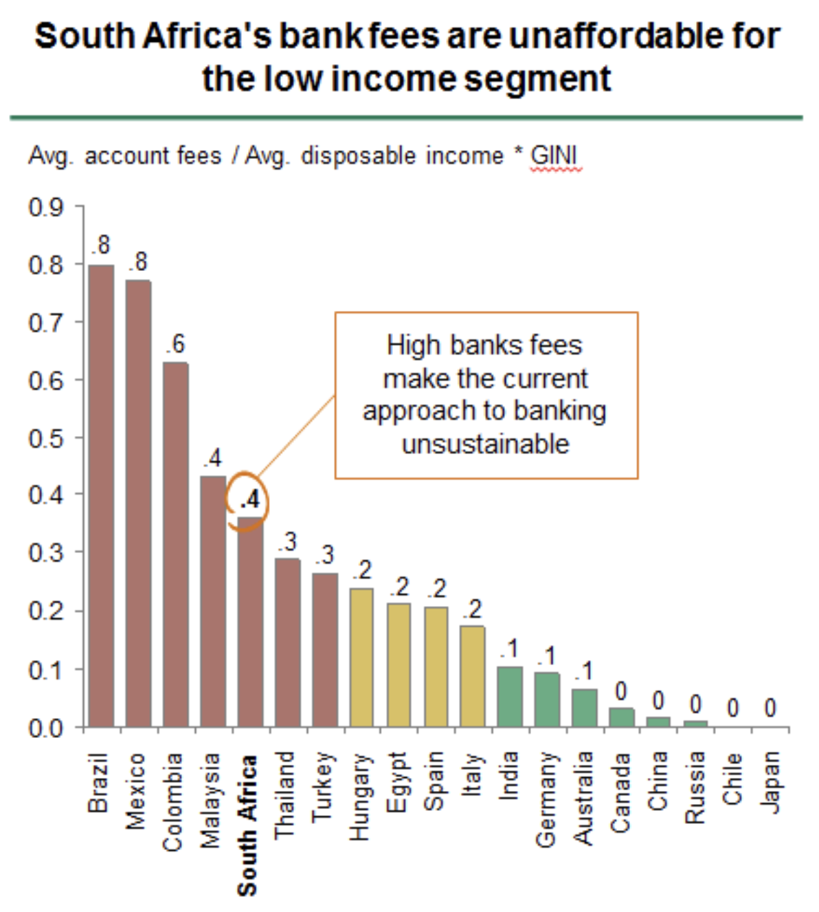

# Bitcoin ni Dhamira ya Kupinga Udhalimu wa Fedha - Na inalenga kulinda Haki za Binadamu Duniani Kote

> Unaweza Sikiliza makala hii kupitia [episode 166 "How Bitcoin Enforces Human Rights"](https://anitaposch.com/podcast-bitcoin-enforces-human-rights-166).

Mnamo 2022, wanasiasa wa Uropa waliunda mpango kwa lengo la [Kupiga marufuku Uchimbaji wa Bitcoin](https://www.coindesk.com/policy/2021/11/02/unpacking-europes-looming-mica-crypto-regulation/) kwa sababu ya matumizi yake makubwa ya umeme. Lengo la msingi ni kulaumu Bitcoin kwa kuharibu mazingira, wakati ni - kama wanavyodai - ni zana tu ya uvumi usio na maana.

> Makala hii ilichapishwa hapo awali [Bitcoin Magazine](https://bitcoinmagazine.com/culture/bitcoin-enforces-universal-human-rights) by BTC Inc.

Mnamo 2021, mwanzilishi mwenza wa Ripple, ambayo [kama ilivyo tangazwa](https://ripple.com/xrp/) kuwa na sifa bora kuliko bitcoin, [ilichangiwa dola za kimarekani milioni 5](https://bitcoinmagazine.com/culture/greenpeace-environment-attacks-help-bitcoin) kusaidia Greenpeace USA na kampeni inayoitwa "Safisha Kanuni." Inajaribu kushawishi watengenezaji wa Bitcoin kubadilisha utaratibu wa uchimbaji madini kutoka kwa uthibitisho wa kazi hadi uthibitisho wa hisa, ambayo ingepunguza matumizi yake ya nguvu kwa 99%. Pamoja na Ethereum kuhama kutoka kwa uthibitisho wa kazi hadi uthibitisho wa hisa hivi karibuni, watendaji hawa wanahisi wameona nadharia yao imethibitishwa na wanajaribu kushawishi dhidi ya Bitcoin hata zaidi.

Kitu ambacho hawakukitaja ni [tofauti baina ya Uthibitisho wa Kazi na Uthibitisho wa uekaji wa Hisa kama dhamana](https://anitaposch.com/bitcoin-differences-proof-of-work-stake). Mbinu hizi zina malengo tofauti na matokeo tofauti kabisa, ambayo husababisha tofauti katika sifa za sarafu za kidijitali zinazozilinda. Kwa ufupi: uthibitisho wa kazi (proof of work) una uthabiti mkubwa zaidi kuliko uthibitisho wa hisa (proof of stake). 

Uthibitisho wa kazi (proof of work) ni bora zaidi katika kuunda blockchain imara na isiyoweza kubadilishwa, ambayo ina kiwango cha haki cha ugatuaji na haiwezi kuchezewa kwa urahisi hata na taasisi au mashirika yenye utajiri, ushawishi, na mamlaka makubwa. Uthibitisho wa hisa (proof of stake) hauna malengo haya. Lengo lake ni kusimamia mtandao kwa njia rafiki kwa mazingira huku ukidumisha ugatuaji, lakini pia kuruhusu blockchain kubadilika kwa kiasi fulani. Katika wiki chache tu baada ya Ethereum kubadili mfumo wake, asilimia kubwa ya walidhihirishaji (validators) ilianza [asilimia kubwa ya walidhihirishaji (validators) ilianza kuzuia miamala kwa kufuata orodha ya vikwazo ya Ofisi ya Udhibiti wa Mali za Kigeni ya Marekani (OFAC)](https://cointelegraph.com/news/ethereum-inches-even-closer-to-total-censorship-due-to-ofac-compliance).

Uthibitisho wa kazi (proof of work) unafanya Bitcoin isiweze kudhibitiwa, isiweze kubadilishwa, na isiwe na vizuizi vya ruhusa. Hizi ndizo sifa kuu za uwezo wa kupinga udhalimu. Ni zana ya kujilinda kifedha, na farasi wa Troyi wa uhuru. Bitcoin ni mapinduzi ya kimya. Inaipa nguvu harakati za upinzani wa kiraia. Ni nafasi yetu pekee ya kupata mfumo bora wa fedha unaolinda haki za binadamu na kuwaunga mkono wanaharakati katika mapambano yao dhidi ya madikteta na watawala wa kimabavu.

Katika makala hii, sitajadili matumizi ya nishati, kwa sababu mara tu utakapofahamu umuhimu wa Bitcoin katika kuifanya dunia kuwa yenye usawa zaidi, utaelewa kuwa hoja ya matumizi ya nishati si ya msingi. Utaelewa hilo hata zaidi pale utakapotambua kuwa uchimbaji wa Bitcoin (Bitcoin mining) unalinda thamani yote iliyohifadhiwa kwenye blockchain, na kuifanya iwe mtandao salama zaidi tuliowahi kuujua. Na zaidi ya hayo, uchimbaji wa Bitcoin tayari ni miongoni mwa sekta zinazotumia nishati safi zaidi duniani.

Katika sehemu inayofuata, naeleza jinsi Bitcoin inavyotekeleza vipengele saba kati ya 30 vilivyotajwa katika[Azimio la haki za Binadamu Duniani](https://www.un.org/en/about-us/universal-declaration-of-human-rights). Inapaswa kufahamika wazi kuwa Bitcoin si kitu kisicho na maana, wala si kwa ajili ya uvumi pekee — ni teknolojia yenye matumizi ya kweli na umuhimu wa kijamii.

## Azimia la haki za Binadamu Duniani

Tuirudishe historia hadi Desemba 1948. Miaka mitatu baada ya kumalizika kwa Vita vya Pili vya Dunia, dunia bado ilikuwa imeshtushwa na yale yaliyotokea tangu Ujerumani ilipovamia Poland mwaka [Septemba 1939](https://encyclopedia.ushmm.org/content/en/article/invasion-of-poland-fall-1939). Ilianzisha vita ambavyo vilidumu zaidi ya miaka sita kuchukua maisha ya [milioni 80](https://en.wikipedia.org/wiki/World_War_II_casualties), ukijumuisha [Wayahudi/walowezi Milioni 6](https://www.nationalww2museum.org/war/articles/holocaust) na watu wengine wengi wa makundi ya wachache kama vile Waroma, Wasinti, Wajerumani Weusi, watu wenye ulemavu, wanasoshalisti, wakomunisti na watu wanajiohusisha na mapenzi ya jinsia moja.

Kwa madhara haya, umoja wa mataifa uliundwa rasmi [Uliundwa mwaka 1945 na nchi  51 duniani](https://en.wikipedia.org/wiki/United_Nations) waliodhamiria kudumisha amani na usalama wa kimataifa, kukuza uhusiano wa kirafiki kati ya mataifa, na kuendeleza maendeleo ya kijamii, viwango bora vya maisha, na haki za binadamu.

Moja ya matokeo yake ilikuwa ni Azimio la Kimataifa la Haki za Binadamu ambalo lilitangazwa tarehe. [Disemba 10, 1948.](https://www.un.org/en/about-us/udhr/history-of-the-declaration) Katika miongo iliyofuata, Azimio hili limeingizwa katika sheria za nchi nyingi na linaweza kuonekana kama kiwango cha pamoja cha mafanikio kwa watu wote na mataifa yote. Linabainisha, kwa mara ya kwanza katika historia ya binadamu, haki za msingi za binadamu ambazo zinapaswa kulindwa kote duniani, na limekuwa [imetafsiriwa kwa zaidi ya lugha 500 tofauti](https://www.ohchr.org/en/stories/2016/11/universal-declaration-human-rights-now-available-more-500-languages-and-dialects).

 
[Source](https://www.flickr.com/photos/fdrlibrary/27758131387/)

Kamati ya uoja wa Mataiafa ikiongozwa [Eleanor Roosevelt](https://en.wikipedia.org/wiki/Eleanor_Roosevelt) [viliandaliwa vifungu 30](https://www.un.org/en/observances/human-rights-day/women-who-shaped-the-universal-declaration). [Hansa Jivraj Mehta](https://en.wikipedia.org/wiki/Hansa_Jivraj_Mehta), Mwanaharakati,msomi,mwandishi na mpigania uhuru mwenye asili ya Kihindi writer, [alikuwa na jukumu](https://www.un.org/en/about-us/udhr/history-of-the-declaration) kubadilisha lugha ya Azimio la Haki za Binadamu Duniani “wanadamu wote wako huru na sawa” kwa “wanadamu wote wamezaliwa wako huru na sawa,” ikilenga kutilia mkazo umuhimun wa Usawa wa Kijinsia

[Source](https://thelogicalindian.com/story-feed/get-inspired/dr-hansa-mehta/)

Azimio la Kimataifa la Haki za Binadamu lilitumika kama pendekezo kwa sheria mbalimbali. Sheria zinaweza kutekelezwa au zisiwepo kabisa. Sheria zenyewe si dhamana kwamba mtu yeyote atatendewa kwa usawa, hatabaguliwa, au ataepushwa na mateso ya unyanyasaji wa kifedha. Kinyume na sheria zinazotekelezwa na binadamu, mkataba unaotekelezwa na kanuni za kihisabati zilizojengwa kwa makubaliano ya pamoja kati ya watumiaji wake wote utabaki kuwa usiobagua na utatoa mfumo shirikishi wa kifedha. “Sheria bila watawala.”, kama alivyosema [Andreas M. Antonopoulos says](https://youtu.be/gq-t7Ky6QmE).

Maswali yanaendelea kubaki: Ni kiasi gani cha umeme kina thamani ya maisha na uhuru wa mabilioni ya watu? Ni kwa namna gani watu wa Kaskazini iliyoendelea wanaweza kuamua nini ni matumizi mazuri ya nishati kwa watu wa Kusini? Zaidi ya kuwa chombo cha ‘kubahatisha bei,’ je, Bitcoin si pia nyenzo kubwa kwa faragha na uhuru wa kifedha duniani kote?

Hebu tuangalie hali ya dunia ya leo na jinsi utawala huu wa udhibiti wa kimataifa ulivyojitokeza ambao unaamua nani ana fursa na nani hana.

## Hali ya Dunia kwa Sasa

### Mgawanyo wa Demokrasia ulivyokosa Usawa

[Chanzo](https://en.wikipedia.org/wiki/Democracy_Index)

Asilimia hamsini na nne (54%) ya watu duniani wanaishi chini ya tawala za kiimla au mifumo ya mseto wa kiimla na kidemokrasia. Hawapati fursa ya kuishi katika nchi zenye demokrasia kamili. Ni asilimia 6.4 tu ya watu wote wanaoishi katika nchi zenye “demokrasia kamili” kama vile Ujerumani, Ufaransa, Austria, na kadhalika, au Marekani. Wengine wote duniani wanaishi ama katika demokrasia zenye mapungufu, au chini ya utawala wa kidikteta au wa kiimla kabisa. Mahali ulipozaliwa mara nyingi hufafanua kwa kiasi kikubwa nafasi utakazopata maishani (isipokuwa kwa nadra sana).

[Chanzo](https://www.visualcapitalist.com/mapped-the-state-of-global-democracy-2022/)

Ramani ya Kielelezo cha Demokrasia kunaonesha mtindo wa kukumbukwa. Maeneo mekundu sana ndiyo nchi ambazo maisha ni mabaya zaidi, na watu wake wana uhuru mdogo kabisa. Kwa mujibu wa kipimo hiki, nchi iliyo katika hali mbaya zaidi ni Afghanistan, ikifuatiwa na Myanmar, Korea Kaskazini, Jamhuri ya Kidemokrasia ya Kongo, Syria na Jamhuri ya Afrika ya Kati.

### The Centers of Corruption

[Source](https://www.transparency.org/en/cpi/2021)

Ramani ya ufisadi wa kisiasa kunaonesha mtindo unaofanana. Maeneo mekundu sana yanatokea Kaskazini-Mashariki, yakianzia Urusi na China, yakivuka Afrika na kuingia Amerika Kusini. Kuna uhusiano fulani unaoonekana kati ya ufisadi na kushindwa kwa demokrasia. Ufisadi unachochea ukiukwaji wa haki za binadamu pamoja na kuporomoka kwa demokrasia. Nayo hali hii huongeza viwango vya ufisadi, na hivyo kuanzisha mzunguko hatari usioisha.

### Usawa Duni wa Mgawanyo wa Utajiri(Mali)

[Chanzo](https://howmuch.net/articles/world-wealth-map-2018)

Hatimaye, hebu tuitazame ramani ya utajiri duniani. Mtindo uleule unaonekana wazi. Katika nchi zenye watawala wa kidikteta na wa kiimla, watu huwa maskini kwa wastani, huku nchi maskini zaidi zikiwa barani Afrika na katika eneo la Mashariki ya Kati.

Thamani ya wastani wa mali halisi duniani inaonesha tofauti kubwa sana kati ya mataifa yaliyoendelea na mataifa mengine yote. Kwa upande mmoja, kuna nchi ambazo wastani wa mali halisi (mali halisi ikimaanisha thamani ya soko ya mali zote mtu anazomiliki baada ya kutoa madeni) unazidi dola 500,000, na kwa upande mwingine, kuna maeneo ambako watu wana chini ya dola 500 kwa jina lao. Kuna nchi chache za rangi ya machungwa hafifu katikati ya viwango hivyo, lakini ramani ya dunia inaonesha kiwango cha kushangaza cha kutokuwepo kwa usawa kati ya waliokuwa na mali na wasiokuwa nayo..

## Historia ya Nguvu ya Kifedha

### Utawala wa Muingereza

Sababu za kuwepo kwa tofauti kubwa ya kiuchumi ni nyingi. Ukoloni bila shaka umekuwa mojawapo ya sababu kuu. Ramani iliyo hapa chini inaonesha Milki ya Uingereza mwaka 1910. Udhibiti huu wa kisiasa na kiuchumi uliiwezesha Uingereza kuwa dola ya kwanza yenye mamlaka ya kifedha duniani (“hegemoni” ikimaanisha taifa moja lenye ushawishi mkubwa juu ya uendeshaji wa mfumo wa fedha wa kimataifa). Mwaka 1910, pauni ya Uingereza ilikuwa [bado ililindwa na dhahabu](https://www.royalmint.com/invest/discover/gold-news/what-was-the-gold-standard/) (Kiwango cha dhahabu kilimaanisha kuwa sehemu ya fedha zilizokuwa kwenye mzunguko ilikuwa imeungwa mkono na dhahabu iliyohifadhiwa katika hazina za mabenki, na kila mtu alitumia pauni hiyo kwa ajili ya biashara.

[Chanzo](https://en.wikipedia.org/wiki/British_Empire)

### Nguvu za Kiutawala wa Mmarekani

Baada ya Vita ya Kwanza ya Dunia, nguvu hii ya Uingereza ilianza kufifia. Vita ya Pili ya Dunia ilizalisha dola mpya yenye mamlaka makubwa. Marekani ilikuwa imeshinda vita, ilikuwa na uchumi wenye nguvu zaidi, na ilidhibiti.[kimsingi hakiba yote ya dhahabu duniani](https://www.imf.org/external/np/exr/center/mm/eng/mm_dr_01.htm#:~:text=By%201947%2C%20the%20United%20States,to%20pay%20for%20the%20war.). Wakati wa vita, [nchi nyingi za bara Ulaya zilituma hakiba ya dhahabu zao kwenda Ummoja wa Nchi za Amerika](https://en.wikipedia.org/wiki/Bretton_Woods_system) kuzilinda dhidi ya ubadhrifu wa Watu wa sera za Kinazi.

Mchambuzi wa Maswala ya Kifedha Lyn Alden [ameeleza](https://www.lynalden.com/fraying-petrodollar-system/): 

> “Kupitia mfumo wa Bretton Woods na ule wa baadaye wa petrodola, Marekani ilipata udhibiti wa karibu wa kimataifa juu ya mfumo wa fedha wa dunia. Sarafu za himaya zilizotangulia hazikuwahi kupata udhibiti wa kifedha wa kiwango hicho duniani, na kwa hivyo hazikuwahi kuwa ‘sarafu ya akiba ya kimataifa’ kwa maana halisi, bali zilikuwa tu ‘sarafu zinazotambuliwa sana na kutawala kwa kiasi kikubwa…

> “Hata hivyo, baada ya miongo michache tu, mfumo wa Bretton Woods ulianza kusambaratika. Marekani ilianza kupata nakisi kubwa za bajeti na kushuhudia viwango vya mfumuko wa bei vikianza kupanda kwa kiasi, kwanza kutokana na mipango ya ndani ya miaka ya mwisho ya 1960, na baadaye kutokana na Vita ya Vietnam. Marekani ilianza kuona akiba yake ya dhahabu ikipungua, kwani nchi nyingine zilianza kutilia shaka uhalali wa dhamana ya dola, na hivyo kuanza kubadilisha dola kwa dhahabu badala ya kuzihifadhi kwa utulivu…

> “Mfumo huo ulikuwa na dosari ya msingi ambayo ilipoachwa bila kushughulikiwa, ilisababisha kuanguka kwa mfumo mzima. Kamwe haukuwa endelevu kwa jinsi ulivyoundwa. Haikuwezekana kwa Marekani kuwa na dhahabu ya kutosha kudhamini fedha zote za matumizi ya ndani, huku wakati huo huo ikidhamini pia fedha za matumizi yanayozidi kimataifa (ambazo ndizo zilikuwa na haki ya kubadilishwa kwa dhahabu).” 

### Uzao wa Pesa za Serikali(Fiati)

Kama Alden anavyoendelea kueleza: “Hatimaye mwaka 1971, hesabu zilijibu kwa nguvu dhidi ya mfumo wa Bretton Woods, na Richard Nixon akaamua kusitisha kubadilishwa kwa dola kuwa dhahabu, hatua iliyokuwa mwisho rasmi wa mfumo wa Bretton Woods. Kufungwa kwa uwezekano wa kubadilisha dola kuwa dhahabu kulipendekezwa kuwa ni kwa muda tu, lakini mwishowe kuligeuka kuwa hatua ya kudumu. Badala ya mfumo huo kuhamia katika nchi nyingine, Marekani iliweza kupangilia upya mfumo wa fedha wa kimataifa kwa namna ambayo ilibaki kuwa katikati ya mfumo mpya.”

Kipindi Richard Nixon [iliondoa mfumo wa kiwango cha dhahabu mwaka 1971](https://www.investopedia.com/ask/answers/09/gold-standard.asp#:~:text=The%20Bretton%20Woods%20agreement%20established,the%20U.S.%20dollar%20to%20gold.), Kimsingi, aliifanya sarafu zote duniani ziwe fedha za fiati. “[Pesa za Kiserikali](https://en.wiktionary.org/wiki/fiat#:~:text=Etymology,let%20it%20be%20done%E2%80%9D).)” ni neno la Kilatini linalomaanisha “na iwe hivyo.” Tangu mwaka 1971, sarafu zetu hazijaungwa tena na dhahabu, na zina thamani tu kwa sababu zinatambuliwa kisheria kama njia halali ya malipo. [Athari za kiuchumi zilizotokana na hatua hiyo zimekuwa za kiwango kikubwa na zenye athari za muda mrefu.](https://wtfhappenedin1971.com/).

likuwa mara ya kwanza katika historia ambapo sarafu zote zilizokuwepo zilikuwa za fiat pekee. Hali hii inaweza kusababisha matatizo makubwa, kwa mfano, pale mtu anapojaribu kutumia karatasi iliyochapishwa kama fedha katika nchi nyingine. Kwa nini biashara na serikali za mataifa mengine zikubali vipande vya karatasi, ambavyo vinaweza kuchapishwa bila kikomo na serikali ya kigeni, na ambavyo havina dhamana madhubuti, kama njia halali ya kulipia bidhaa na huduma zao zenye thamani? Mfumo wa fiat ulikuwa na tatizo la msingi.

### Dola ya Mafuta: Mfumo wa Malipo ya Mafuta kwa Dola ya Marekani

Mwaka 1974, kufuatia migogoro mbalimbali ya kijiografia ya kisiasa, ikiwa ni pamoja na.[Vita vya Yom Kippur](https://en.wikipedia.org/wiki/Yom_Kippur_War) na [Vikwazo vya mafuta vya OPEC](https://history.state.gov/milestones/1969-1976/oil-embargo),Marekani pamoja na Utawala wa Saudia walifikia makubaliano](https://www.bloomberg.com/news/features/2016-05-30/the-untold-story-behind-saudi-arabia-s-41-year-u-s-debt-secret) kuuza mafuta yao kwa dola za Marekani pekee, kwa kwa ahadi ya kupatiwa ulinzi na ushirikiano kutoka Marekani. Kuanzia hapo, dunia ikaingia rasmi katika mfumo wa dola ya mafuta (petrodollar); mbinu ya kisiasa na kiuchumi iliyobuniwa kwa ustadi ili kuufanya mfumo wa sarafu ya fiat ya kimataifa ufanye kazi kwa kiwango kinachokubalika

[Chanzo](https://bitcoinmagazine.com/culture/the-hidden-costs-of-the-petrodollar)

### Dola ya Mafuta: Mfumo wa Malipo ya Mafuta kwa Dola ya Marekani1974

Lakini mfumo huu umeanza kuonyesha nyufa hapa na pale. Kwa mfano, mnamo Agosti 2017, Venezuela ilitangaza kuwa ingetumia euro, yuan na sarafu nyingine badala ya dola za Marekani katika upangaji wa bei ya mafuta yake. Mnamo Machi 2022,[Vyombo vya Havari viliripoti](https://www.wsj.com/articles/saudi-arabia-considers-accepting-yuan-instead-of-dollars-for-chinese-oil-sales-11647351541) Saudi Arabia ilikuwa ikifikiria kuweka bei ya baadhi ya mauzo yake ya mafuta kwa China kwa kutumia yuan ya Kichina badala ya dola ya Marekani. Mnamo tarehe 23 Machi 2022, Vladimir Putin [amri ilitangazwa](https://www.reuters.com/business/energy/putin-says-russia-will-start-selling-gas-unfriendly-countries-roubles-2022-03-23/) falikataza nchi zisizo “rafiki” (ikiwemo nchi za Umoja wa Ulaya, Marekani na Japani) kununua gesi ya Urusi kwa sarafu yoyote ile isipokuwa ruble ya Kirusi (ingawa Wizara ya Fedha ya Urusi [iliripotiwa kwa kusema](https://en.wikipedia.org/wiki/Petrodollar_recycling) Itakubali malipo ya Dhahabuau Bitcoin).

### Mfumo Huru wa Fedha Duniani

Dhana kuu ya Alden kuhusu mwelekeo wa baadaye [ini kwamba](https://www.lynalden.com/fraying-petrodollar-system/):

> “...katika miaka michache ijayo, uchumi wa dunia huenda ukakumbwa na mzunguko wa kushuka kwa thamani (bear cycle) wa mfumo wa sasa wa dola ya mafuta (petrodollar). Iwapo hali hiyo itatokea, mali kama vile hisa za kimataifa, mali halisi bora ya makazi, madini ya thamani, bidhaa za viwandani, na mbadala kama Bitcoin, huenda zikanufaika.

> Kuanzia hapo, mfumo wa fedha wa kimataifa utaanza kuwa mgatuo zaidi, kwa maana ya kwamba mifumo mbadala ya malipo na matumizi ya sarafu mbadala kati ya washirika wa biashara itazidi kuenea. Hii itakuwa kweli ni mabadiliko ya kimuundo kuelekea mfumo mpya. Mabadiliko haya yanaweza kuwa ya polepole, kama yanavyoendelea hivi sasa, au yanaweza kuharakishwa endapo Marekani yenyewe itaondoka kwenye mfumo huu unaoendelea kudhoofika.” 

## Madhara ya Kutegemea Taifa Moja Kifedha" 

Kwa angalau miaka 78 iliyopita, kuanzia na mwisho wa Vita ya Pili ya Dunia, uchumi wa dunia kwa kiasi kikubwa umejikita kwenye dola ya Marekani. Mfumo wa Bretton Woods pia ulikuwa mwanzo wa taasisi za kifedha za kimataifa kama Shirika la Fedha la Kimataifa (IMF) na Benki ya Dunia. Tangu wakati huo, mashirika mengine mengi yaliibuka kama vile Benki ya Kimataifa ya Makazi (BIS), Kikosi Kazi cha Kimataifa cha Kukabiliana na Uhalifu wa Fedha (FATF), na Ofisi ya Udhibiti wa Mali za Kigeni ya Marekani (OFAC). Wawakilishi wasiochaguliwa wamekuwa wakibuni kanuni za kupambana na utakatishaji wa fedha, ukwepaji wa kodi, na katika miongo ya hivi karibuni, ugaidi.

Sijawahi kusikia kuhusu kanuni yoyote ya kifedha ambayo imepitishwa kwa kura ya wananchi. Lakini kila nchi duniani inalazimika kudhibiti benki zake. Kwa sehemu, hili lina maana nzuri, lakini licha ya kanuni hizi zinazotawala kila upande, dunia bado imejaa ulaghai, kushindwa kwa taasisi za kifedha (na sasa pia udanganyifu wa fedha za kidijitali katika kesi kama ya[FTX](https://bitcoinmagazine.com/legal/ftx-files-for-bankruptcy-ceo-resigns), [Luna, etc.](https://bitcoinmagazine.com/markets/terra-collapse-teaches-about-crypto-and-bitcoin)) na utakatishaji wa fedha(Pesa Chafu kuwa safi). Kinachotokea ni kwamba samaki wadogo(watu wa chini) ndio wanaokamatwa, huku samaki wakubwa(watu wenye uwezo kifedha,kisiasa)katika hali nyingi huishia kulipa faini ndogo isiyolingana na faida waliyopata kisha wanaendelea na shughuli zao kama kawaida.

TTayari kuna sheria na kanuni nyingi zinazohusu sekta ya fedha za kawaida pamoja na tasnia ya fedha za kidijitali (cryptocurrency).. The [Anguko la FTX lilisababishwa na Ubadhirifu,na sio Bitcoin kama inavyodhaniwa kuwa ndio ilisababisha](/bitcoin-ponzi-scheme). Kinyume chake ndicho kilicho kweli. Kama wahusika wote katika tasnia hii wangekuwa waaminifu kwa misingi ya Bitcoin uwazi na kutotegemea madeni basi mambo haya yasingetokea. Ni wahusika wa kimfumo wa kati (centralized actors) na usiri wao ndio wanaowezesha ulaghai wa aina hiyo kutokea. Ulaghai umekuwa uhalifu tangu zamani, na zipo sheria za kushughulikia jambo hilo. Tatizo si ukosefu wa kanuni, bali ni ukosefu wa usimamizi wa kweli..

### Uondoaji wa Makusudi wa Watu Katika Mfumo wa Kifedha

Je, taasisi hizi zilianzaje? Ni jambo la kufurahisha kuchunguza historia ya mashirika haya ambayo hufanya maamuzi yanayoamua tofauti kati ya waliokuwa na mali na wasiokuwa nayo

### BIS: Benki Kuu ya Mabenki Kuu

BIS ni [Taasisi ya kimataifa ya masuala ya Kifedha](https://en.wikipedia.org/wiki/International_financial_institutions) inayomilikiwa[central banks](https://en.wikipedia.org/wiki/Central_bank) ambayo “inahamasisha ushirikiano wa kimataifa wa kifedha na wa fedha za kigeni, na inahudumu kama benki kwa mabenki kuu.” Jambo la kuvutia pembeni: BIS haingekuwepo tena endapo maamuzi ya washiriki wa mkutano wa Bretton Woods yangefuatwa kikamilifu

TBIS ilianzishwa barani Ulaya mwaka 1930. Wakati wa Vita ya Pili ya Dunia, BIS iliwasaidia Wajerumani kuhamisha mali kutoka katika nchi zilizokuwa zimevamiwa. Ukweli kwamba wanasiasa wa ngazi ya juu wa sekta ya viwanda wa Kijerumani pamoja na washauri walikaa katika bodi ya BIS ulionekana kutoa ushahidi wa kutosha kuhusu jinsi taasisi hiyo ingeweza kutumiwa na[Adolf Hitler](https://en.wikipedia.org/wiki/Adolf_Hitler) tkatika kipindi chote cha vita, kwa msaada wa benki za Marekani, Uingereza na Ufaransa. Kati ya mwaka 1933 na 1945, bodi ya wakurugenzi wa BIS ilijumuisha Wanazi kadhaa, kwa mfano, afisa mmoja mashuhuri wa utawala wa Nazi,[Emil Puhl](https://en.wikipedia.org/wiki/Emil_Puhl) aliyekuwa na jukumu la kushughulikia dhahabu ya meno iliyoibwa kutoka kwa wahanga wa kambi za mateso. Wakurugenzi wote hawa walikuwa [waliohusika baadaye walihukumiwa kwa uhalifu wa kivita au uhalifu dhidi ya ubinadamu](https://en.wikipedia.org/wiki/Bank_for_International_Settlements).

kwa sababu hii, mkutano wa Bretton Woods  [iliyokusudiwa kuwa pendekezo la Norway kwa ajili ya](https://en.wikipedia.org/wiki/Bretton_Woods_Conference) “kuifuta Benki ya Kimataifa ya Utatuzi(BIS) haraka iwezekanavyo." Zaidi ya hayo, sasa kwamba IMF (Shirika la Fedha la Kimataifa) limeanzishwa, BIS inaonekana kuwa haina umuhimu tena.
Lakini msukumo wa kuivunja BIS ulipungua baada ya Rais wa Marekani Franklin Roosevelt kufariki dunia mwezi Aprili 1945. Chini ya mrithi wake, Harry S. Truman, maafisa wa juu wa Marekani waliokuwa wakikosoa vikali BIS waliondoka madarakani kufikia mwaka 1948, na hivyo [ufutwaji ulighairika na kuwekwa pembeni](https://en.wikipedia.org/wiki/Bretton_Woods_Conference).
  
### FATF: Kikosi Kazi cha Kimataifa cha Kukabiliana na Uhalifu wa Kifedha
FATF ni taasisi ya kimataifa ya ushirikiano wa kiserikali kati ya nchi wanachama"[iliyoanzishwa mnamo 1989](https://www.fatf-gafi.org/about/whatwedo/) okwa kuanzishwa na kundi la G7 kwa lengo la kuandaa sera za kupambana na utakatishaji wa fedha. Kufuatia mashambulizi ya kigaidi ya Septemba 11 mwaka 2001 nchini Marekani, mamlaka yake [mamlaka yake yalipanuliwa kujumuisha ufadhili wa ugaidi](https://www.fatf-gafi.org/publications/fatfgeneral/documents/terroristfinancing.html).

Tangu mwaka 2000, FATF imeendelea kudumisha.[Orodha ya nchi au taasisi zilizoorodheshwa na FATF kama hatari](https://en.wikipedia.org/wiki/FATF_blacklist#Current_FATF_blacklist) na pia [Orodha ya nchi au taasisi zilizo chini ya ufuatiliaji wa FATF](https://en.wikipedia.org/wiki/FATF_blacklist#Current_FATF_greylist). Hizi ni orodha za nchi ambazo FATF inaona hazishirikiani ipasavyo na zina dosari katika juhudi za kimataifa za kupambana na utakatishaji wa fedha na ufadhili wa ugaidi. Ingawa, chini ya sheria za kimataifa, orodha ya rangi ya FATF haina adhabu rasmi, katika hali halisi, nchi zilizoorodheshwa kwenye orodha hii mara nyingi hukumbwa na shinikizo kubwa la kifedha.

### Kubali Watu Bilioni Mbili Walioachwa Pembeni Kama Athari Mbaya Isiyokusudiwa

Athari kwa watu katika nchi hizi ni kubwa sana. Vikwazo vinaumiza zaidi maskini na walio hatarini. Wenye mamlaka huwa na njia za kujiokoa. Kwa mfano, FATF imewafanya mashirika yasiyo ya serikali (NGOs) katika nchi hizi kugongwa na changamoto za kupata fedha za kusaidia katika hali za dharura kutokana na vigezo kali vya FATF. Mapendekezo ya FATF hayataji vikwazo maalum kwa mashirika yasiyo ya serikali.

Kutokana[Wikipedia](https://en.wikipedia.org/wiki/Financial_Action_Task_Force):

“Katika karatasi ya mwaka 2020, Ronald Pol anasema kuwa ingawa FATF imefanikiwa sana kupata sera zake kukubalika duniani kote, athari halisi za sera hizo ni ndogo sana: kwa takwimu za Pol, chini ya asilimia 1 ya faida haramu hukamatwa, huku gharama za kutekeleza sera hizo zikiwa mara mia moja zaidi. Pol anasisitiza kuwa sekta na watunga sera mara nyingi huzipuuza hizi, na badala yake hupima mafanikio ya sera kwa vigezo ambavyo kwa kiasi kikubwa havihusiani".

Marekani ilishambuliwa mwaka 2001 na katika miaka iliyofuata, ilizidisha kanuni za kupambana na ugaidi ambazo zilienea hadi karibu katika maeneo yote ya kisheria duniani, na hivyo kuwatenga mabilioni ya watu wasiojulikana na wasio na taifa kuanzisha akaunti za benki, kupata ajira, kununua nyumba au kuanzisha biashara. Zaidi ya hayo, watu hawa ni masikini, wamekataliwa, wanabaguliwa, hawana haki za kiraia na wamekataliwa kisiasa.

Kwa mfano, kuna Winnet Zhamini, mwenye umri wa miaka 33 na bibi mkubwa. Yeye ni miongoni mwa Wazimbabwe 300,000 ambao hawatawahi kupata akaunti ya benki kwa sababu ya ukosefu wa karatasi za utambulisho. Kama alivyosema [The Guardian](https://www.theguardian.com/global-development/2021/jul/12/we-cannot-vote-or-get-jobs-plight-of-300000-zimbabweans-without-documents):

> "Sijawahi kupata cheti cha kuzaliwa au kitambulisho. Baba yangu alikuwa Mmalawi na alikulia hapa miaka ya sabini. Tulipozaliwa, hatukuwa na nafasi ya kupata vyeti vya kuzaliwa. Mama yangu, ambaye alikuwa Mzimbabwe, alifariki, baba yangu alitoweka tu. Mume wangu alinitiachia kwa sababu sina nyaraka zozote. Dada yangu alioa na kuzaa watoto wanne, lakini mume wake alimkimbiza kwa sababu hana kitambulisho. Siwezi hata kununua kadi ya simu. Siwezi kupata kazi, naishi kwa kufanya kazi za kufua nguo. Lakini tunanyanyaswa kwa sababu hatuna chaguo."

Mashirika haya yanawalazimisha watu wote kufuata kanuni na taratibu za jumla zinazowezesha udhibiti hadi kwa kiwango cha mtu binafsi, na kusababisha kutengwa kifedha na unyanyasaji wa mabilioni ya watu.

Takwimu zinazokusanywa na mamlaka ni kivutio kwa wadukuzi, uhalifu mtandaoni na utapeli. Haya yote hufanyika ili kuwatafuta wachache wanaofanya utakatishaji wa fedha au kufadhili ugaidi. Badala ya uangalizi wa jumla, kwa nini wasiangalie na kuwachukulia hatua wachache hao tu? Ni mzunguko hatari usioisha. Vikwazo, kanuni za jumla na udhibiti wa kifedha ndizo sababu kwanini watu wanahitaji Bitcoin

## Jinsi Bitcoin Inavyosaidia Kutekeleza Azimio la Kimataifa la Haki za Binadamu

Utawala wa kimataifa wa udhibiti unaowatenga[takirabani watu bilioni 1.7](https://www.forbes.com/sites/niallmccarthy/2018/06/08/1-7-billion-adults-worldwide-do-not-have-access-to-a-bank-account-infographic/?sh=2c27ca4c4b01) (labda watu bilioni 3 ikiwa unahesabu watoto wawili kwa kila mtu mzima) wasio na uwezo wa kuwa na akaunti ya benki. Hii inatufikisha kwenye [Azimio la Haki za Binaadamu](https://www.un.org/en/about-us/universal-declaration-of-human-rights) na zipo katika [Vifungu 30](http://hrlibrary.umn.edu/edumat/hreduseries/hereandnow/Part-5/8_udhr-abbr.htm). Nitatumia vifungu saba kati ya hizi kuonyesha jinsi Bitcoin inavyounga mkono Haki za Binadamu

### Kifungu cha 1: Haki ya Usawa kwa wote

[Source](https://www.un.org/en/about-us/universal-declaration-of-human-rights)

Haki hii ya binadamu inaonyesha kuwa sote tunazaliwa huru kufurahia hadhi na haki zetu. Lakini hali hii si kweli kifedha. Mabilioni ya watu wanaishi katika umasikini mkubwa au hawana vitambulisho na kwa hivyo wameachwa pembeni katika huduma za kifedha. Kutoka kwa watu bilioni 1.7 wasio na akaunti za benki (hawa ni wakuu wa kaya tu, ikijumuisha familia, idadi ni kubwa zaidi), milioni 980 ni wanawake.

[Data source](https://borgenproject.org/unbanked-population/) 

Watu wasio na akaunti za benki hawawezi kuhifadhi pesa zao kwa usalama kutokana na hatari ya uharibifu kutoka kwa wanyama kama panya, au kwa sababu hufanya kuwa lengo la wizi, na hawawezi kukopa pesa kwa hofu ya kushindwa kulipa na kuangukia mikononi mwa wakopaji wa riba kubwa.
Kama mhanga wa mikopo yenye riba kubwa nchini Nigeria [alisema](https://www.theafricareport.com/238323/nigeria-post-covid-loan-sharks-target-most-vulnerable-nigeians/):

> “Karibu siku za mwisho za Februari (2022), nilikopa N18,000 (dola 43) kutoka kwenye app ya Soko-loan ambayo niliona kwenye Facebook. Wakati wa kuomba mkopo, app ilionyesha siku 92 kama muda wa chini wa mkopo, lakini baada ya kuweka taarifa zangu, niliona kiwango cha riba cha (takriban) asilimia 45 kwa siku 14!”

Suluhisho si kanuni zaidi, bali ni upatikanaji wa wazi wa fedha salama na zisizodhibitiwa na mtu mmoja mmoja.

#### Kutokuwepo kwa Uelewa wa Masuala ya Kifedha na Ukosefu wa Mali Husababisha Kutengwa

Ikiwa unapata kitambulisho na huduma ya akaunti ya benki au huduma ya fedha za simu Afrika, bado haimaanishi kuwa unaweza kuitumia kwa urahisi au kutuma pesa kwa mtu nchini kwako au nje ya nchi. Taratibu ngumu, miundombinu ya teknolojia isiyo imara au isiyokuwepo, pamoja na ada kubwa, hufanya iwe vigumu sana kiasi cha watu wengi, hata wale wenye akaunti za benki, kuacha kuzitumia.

[Chanzo](https://www.weforum.org/agenda/2017/04/financial-inclusion-south-africa/)

Muundo wa ada za mabenki ya Afrika Kusini, kwa mfano, ni mara nne zaidi kuliko nchi kama Ujerumani, Australia na hata India. Watu wengi wako tayari kuchukua hatari ya kupoteza au kuibiwa fedha taslimu ili kuepuka ada hizo na taratibu ngumu.

Watu wenye kipato cha chini wana imani ndogo kabisa na sekta rasmi ya kifedha, ambayo imetokana na hofu za kunyanyaswa. Matumizi mabaya ya zamani, kama vile [utangaza na uuzaji wa bidhaa za kifedha](https://www.groundup.org.za/article/postbank-security-breach-highlights-sassas-failures/), imeonyesha kuwa watu maskini wanakumbwa kwa kiasi kikubwa na maslahi mabaya ya biashara yenye shauku ya faida.

Maskini wa Afrika wako katika hatari zaidi kutokana na ukosefu mkubwa wa elimu ya kifedha, jambo ambalo linaongeza hali ya kutoaminiana na viwango vya unyonyaji vinavyochochewa na mwenendo huu. Kwa bahati mbaya, hili ni. [tatizo la elimu linalotokana na mfumo wa elimu](https://www.weforum.org/agenda/2017/04/financial-inclusion-south-africa/) Ndani ya Afrika, tatizo hili ni la mfumo mzima ambalo haliwezi kutatuliwa kwa muda mfupi.

Hii pia ni tatizo kwa sarafu zote za kidijitali (crypto tokens) na ulaghai wa moja kwa moja. Wataalamu wa Bitcoin wanapaswa kufafanua kwa watu tofauti kati ya taasisi zilizosimamiwa na watu wachache na itifaki ya mtandao wa fedha. Elimu ni muhimu sana, hasa wakati mfumo uliopo haupaswi kuigwa katika siku za usoni, ambalo lilikuwa lengo la Bitcoin na Satoshi Nakamoto tangu mwanzo.

> “Tatizo kuu la sarafu za kawaida ni imani zote zinazohitajika ili ziweze kufanya kazi. Benki kuu inapaswa kuaminiwa isidorore thamani ya sarafu, lakini historia ya sarafu za fiat imejaa ukiukaji wa imani hiyo. Benki zinapaswa kuaminiwa kushikilia fedha zetu na kuhamisha kwa njia ya kielektroniki, lakini huwa zinaazimia mikopo katika wimbi la mabwawa ya mkopo huku zikiwa na akiba kidogo sana. Tunapaswa kuziamini kuhifadhi faragha yetu, kuziamini zisiruhusu wezi wa utambulisho kuchukua fedha zetu kutoka kwenye akaunti.”
— Satoshi Nakamoto

#### Ukoloni wa Mfumo wa Fedha"

[Chanzo cha taarifa](https://en.wikipedia.org/wiki/CFA_franc)

Nchi kumi na nne za Afrika ambazo zilikuwa koloni za Ufaransa, zenye watu takriban milioni 200, bado zinahitajika kutumia fedha za Kifaransa za Afrika ya Kati na Afrika Magharibi, zinazojulikana kwa pamoja kama CFA franki. CFA franki ni sarafu halali na imefungwa kwa euro. Nchi hizi zinapaswa kuweka nusu ya fedha zao za kigeni kwenye Hazina ya Ufaransa. Ingawa nchi hizi zimekuwa huru kwa miongo kadhaa, hazina uhuru wa kifedha. Hii si uhuru, ni ukoloni wa fedha.

#### Mfumuko wa Bei ni Aina ya Kodi Isiyoonekana

kwa mara ya kwanza tangu miaka ya 1920, Waustri na Wajerumani wanahisi athari za mfumuko wa bei [Asilimia 1o ndo kiwango cha juu mpaka 2022](https://www.trendingtopics.eu/energiekrise-inflation-in-oesterreich-steigt-auf-105-prozent/). [Bei za nishati Ulaya zinaongezeka kwa kasi isiyo ya kawaida](https://ec.europa.eu/eurostat/web/products-eurostat-news/-/ddn-20221031-1). Marafiki zangu huko Austria wananieleza kuwa hawawezi kutumia joto katika vyumba vyao msimu huu wa baridi na wananunua chakula cha bei nafuu. Wana kazi za "tabaka la kati," wameelimika vizuri. Miaka kumi hadi ishirini iliyopita, kazi wanazofanya zilitosha kununua nyumba kwa mkopo, kumiliki gari na kwenda likizo na familia. Siku hizo zimepita..

Ikilinganishwa na nchi kama [Zimbabwe yenye 500% mfumuko wa Bei](https://en.wikipedia.org/wiki/Hyperinflation_in_Zimbabwe), or [Cuba with 135%](https://translatingcuba.com/food-prices-increased-in-cuba-by-52-percent-last-year/), [Uturuki yenye  73.5%](https://www.nxtmine.com/economics/with-turkish-ppi-hitting-a-shocking-132-erdogan-goes-after-short-sellers-as-hyperinflation-craters-the-lira/)na kadhalika, bado inaweza kuvumiliwa. Nikiwa Zimbabwe, huwa najiuliza watu wanawezaje kuishi na changamoto hizi. Mfumuko wa bei wa sasa unazidiwa tu na. [mfumuko wa bei wa juu sana (hyperinflation) uliojitokeza Zimbabwe takriban mwaka 2008](https://anitaposch.com/baby-i-m-a-billionaire) wakati karatasi ya thamani kubwa zaidi ilikuwa “inathamani” dola trilioni 100.

Fikiria tu thamani ya pesa zako inapungua kwa asilimia 500 kwa mwezi. Misaada ya wafanyakazi wa umma, madaktari na walimu Zimbabwe ni takriban dola 300 kwa mwezi, na malipo yao hufanyika kwa dola ya Zimbabwe. Kuokoa pesa ni jambo lisilowezekana kabisa. Au unatumia papo hapo au unajaribu kupata mtu anayetaka kubadilisha pesa hizo kwa dola za Marekani. Kila siku inalenga usimamizi wa fedha [“Kwa Sasa(leo) ipo katikakiwango gani?”](https://anitaposch.com/finding-the-best-deals-in-zimbabwe) inaweza kuwa swali linalotumika zaidi baada ya “Habari, uko aje?” nchini Zimbabwe, ikifuatiwa na uamuzi wa [“Kwa pesa aina naweza kulipa vizuri?”](https://anitaposch.com/shopping-with-two-currencies-in-zimbabwe)

[Source](https://twitter.com/steve_hanke/status/1562135077575954433/photo/1  )

Moja ya sababu kubwa ya mfumuko wa bei ni [uchapaji wa fedha usio na mipaka](https://zimpricecheck.com/analysis-and-opinion/its-not-gold-coins-here-is-the-real-reason-why-the-rate-has-fallen/).

[Source](https://zimpricecheck.com/analysis-and-opinion/its-not-gold-coins-here-is-the-real-reason-why-the-rate-has-fallen/)

Wakati wa ziara yangu ya kwanza Zimbabwe mwaka 2020, niliandaa[mfululizo wa podcast ambapo niliandika kuhusu hali ya kifedha ya watu na kama na jinsi Bitcoin inaweza kutumika kupambana na mfumuko wa bei na ufisadi](https://anita.link/51). Hitimisho langu lilikuwa kwamba kwa huzuni Zimbabwe ni kleptokrasia, ambapo viongozi wa tabaka la juu ni wabadhirifu na huchukua bila sheria pesa zote kutoka kwa wananchi.

#### Jinsi Bitcoin Inavyopambana na Mfumuko wa Bei Unaosababishwa na Uchapaji wa Fedha

Kutakuwa na Bitcoin milioni 21 tu kamwe. Nilipongelea katika.[Maongezi ndani Zimbabwe](https://anitaposch.com/newsday-zimbabwe), watu huelewa mara moja matumizi yake. Hakutakuwa na mfumuko wa fedha, ambao ungefanya Bitcoin kuwa na thamani ndogo. Ndiyo, thamani ya Bitcoin ni tete, hiyo ni kwa sababu bei yake huamuliwa na usambazaji na mahitaji, na bado mahitaji hayatoshi kudumisha thamani thabiti. Lakini hakuna mtu anayeweza kuongeza idadi ya juu kabisa ya Bitcoin itakayotolewa. Bitcoin pia haiwezi kuundwa bandia kama fedha taslimu au dhahabu.

#### Rushwa(Ubadhirifu)

Kuhusu ufisadi na dhahabu. Ufisadi ni matumizi mabaya ya madaraka yaliyotolewa kwa mtu kwa manufaa binafsi. Zimbabwe, viongozi wa tabaka la juu ndilo chanzo cha kupotea kwa dhahabu yake. Kila mwaka, [dhahabu yenye thamani ya dola bilioni 1.5 inaibiwa.](https://www.businesstimes.com.sg/energy-commodities/zimbabwe-losing-us15b-gold-a-year-to-smuggling-report).

Wakati huo huo, sekta ya huduma za afya nchini Zimbabwe ambayo hapo awali ilikuwa na hadhi ya kuigwa inavunjika kwa kasi kutokana na miundombinu iliyoharibika, ukosefu wa dawa na wafanyakazi waliolipwa vibaya ambao mara kwa mara wanaingia kwenye mgomo. [Wanawake wajawazito wanalazimishwa kulipa rushwa](https://www.theguardian.com/global-development/2020/nov/03/lives-have-been-lost-pregnant-women-in-zimbabwe-forced-to-pay-bribes-when-giving-birth) kupata huduma ya kujifungua, na ripoti za watoto huzaliwa wakati wakiwa katika foleni nje ya vituo vya uzazi. Watu wanakufa kila siku barabarani kutokana na hali mbaya ya miundombinu ya barabara, wakati [serikali na mawaziri wanajizawadia magari ya kifahari mapya](https://www.theguardian.com/world/2020/jul/07/zimbabwe-spends-millions-on-officials-luxury-cars-as-country-goes-hungry).

[Source one](https://www.occrp.org/en/daily/16564-ruling-elites-behind-zimbabwe-s-disappearing-gold), [source two](https://www.bloomberg.com/news/articles/2020-11-24/zimbabwe-gold-smugglers-estimated-to-ship-1-5-billion-a-year#xj4y7vzkg)

Si Zimbabwe pekee ambako ufisadi ni tatizo kubwa. Karibu kila nchi inayoongozwa kwa mabavu ina kiwango cha juu cha ufisadi. Ufisadi.[unadhoofisha imani ya wananchi, unalegeza misingi ya demokrasia, unakwamisha maendeleo ya kiuchumi na unaongeza zaidi ukosefu wa usawa, umasikini, mpasuko wa kijamii na mgogoro wa mazingira](https://www.transparency.org/en/what-is-corruption).

#### Namna Bitcoin Inavyosaidia Kupambana na Ufisadi
Blockchain ya Bitcoin ni daftari wazi la miamala yote iliyofanyika tangu Bitcoin ilipoanza rasmi tarehe 3 Januari 2009. Hii inamaanisha kuwa bajeti za wizara au miradi zinaweza kukaguliwa. Kwa kutumia pochi za sahihi nyingi (multisignature wallets), uwezekano wa kuiba fedha unapungua sana. Hii ingewezekana tu endapo wasaini wote wangekubaliana kufanya njama.

Lakini hili halipingani na sifa ya Bitcoin ya kulinda faragha. Ukichagua kufanya bajeti iwe wazi kwa ukaguzi, unaweza kufanya hivyo. Ufunguo binafsi (private keys) unakupa uwezo wa kubaki faragha au kufichua taarifa. Ukijitunzia mwenyewe bitcoin zako, wewe ndiye unaefanya maamuzi. Hivi ndivyo Bitcoin inavyompa mtu mmoja mmoja nguvu na kuwaweka mamlaka katika mipaka yao..

<iframe width="100%" height="473" src="https://www.youtube.com/embed/sl4Yr9fBqQ4?start=135" title="YouTube video player" frameborder="0" allow="accelerometer; autoplay; clipboard-write; encrypted-media; gyroscope; picture-in-picture" allowfullscreen></iframe>

### Bitcoin Kama Njia ya Kutekeleza Haki ya Usawa

Bitcoin ni fedha isiyoegemea upande wowote, ya kimataifa na isiyo na mipaka. Kama itifaki iliyo wazi, inaweza kutumiwa na mtu yeyote. Hakuna anayeweza kutengwa, na kila mtu anachukuliwa kwa usawa. Bitcoin inatoa mamlaka ya kujitawala kifedha kwa mtu binafsi na hata kwa taifa zima. Bitcoin haijali mahali ulipozaliwa. Kutaabika kutokana na mfumuko mkubwa wa bei na ufisadi ni matokeo ya bahati mbaya ya mahali ulipozaliwa

### Kifungu: Haki ya Faragha na Usiri

Umesoma vizuri: faragha ni moja ya haki za binadamu zilizotajwa katika azimio hilo. Inawezekanaje kwamba faragha yetu inakiukwa kwa kiwango kikubwa, si tu na kampuni kama Facebook, bali pia na mamlaka za udhibiti? Kwa jina la kupambana na utakatishaji wa fedha na unyanyasaji wa watoto, sisi sote tunafuatiliwa kila wakati

[Source](https://anitaposch.com/bitcoin-human-rights-riga-2022)

Ufuatiliaji na udhibiti wa kifedha vinaonekana kuwa ndio malengo ya taasisi kama BIS. Mwaka 2021, Meneja Mkuu wa taasisi hiyo, Agustín Carstens., [alisema kuhusu sarafu za kidijitali za benki kuu (CBDCs](https://bitcoinist.com/the-bis-wants-absolute-control-of-your-money-via-central-bank-digital-currencies/):

<iframe width="100%" height="473" src="https://www.youtube.com/embed/9FM4Fu2ujDE" title="YouTube video player" frameborder="0" allow="accelerometer; autoplay; clipboard-write; encrypted-media; gyroscope; picture-in-picture" allowfullscreen></iframe>

Hata hivyo, watu hunibishia wakisema, “Lakini mimi sina cha kuficha, ni sawa tu, tunahitaji udhibiti huu ili kupambana na wahalifu" 

[Source](https://anitaposch.com/bitcoin-human-rights-riga-2022)

Jibu langu: si suala la kutokuwa na cha kuficha! Wazo hili peke yake linawasukuma wanaharakati wa haki za binadamu, wapenzi wa jinsia moja (wanawake kwa wanawake na wanaume kwa wanaume), wanachama wa upinzani na wengine wengi kuwa chini ya mashaka kwamba wana jambo la kuficha. La hasha, hawana cha kuficha. Hata hivyo, wanakuwa waathirika wa vurugu, vitisho, vifungo, na wanakabiliwa na hatari ya kifo katika nchi nyingi. Hii ndiyo sababu kwanini faragha ni muhimu sana.

Zaidi ya hapo, ni muhimu kwamba kila mtu atumie njia za kulinda faragha. Kadri watu wengi wanavyojali faragha, ndivyo wapigania uhuru na makundi yaliyo hatarini wanavyolindwa zaidi. Hii inamaanisha kuwa ulinzi zaidi wa faragha unapaswa kujengwa moja kwa moja katika kiwango cha blockchain ya Bitcoin. Watu wasio na uwezo mkubwa kifedha hawawezi kumudu huduma ya VPN inayogharimu dola 10 kwa mwezi. Wanatumia kile walichonacho bure.

[Waafrika mamilioni wanatumia Whatsapp na Facebook](https://www.statista.com/topics/9922/social-media-in-africa/). Kwa nini? Kwa sababu hiyo ndiyo chaguo pekee walilonalo. Chaguo la bei nafuu zaidi ambalo watoa huduma za mawasiliano wanatoa huko ni vifurushi vya “mitandao ya kijamii.” Ndiyo maana. [Maelefu ya watu wanaamini Facebook ni Mtandao](https://qz.com/333313/milliions-of-facebook-users-have-no-idea-theyre-using-the-internet). Hatupaswi kurudia kosa hilo. Lakini tupo kwenye ukingo. Luno, Binance na Coinbase ni chapa zinazojulikana sana barani Afrika. Watu wengi wanaamini kuwa ni lazima kutumia soko la ubadilishanaji au benki ili kuweza kutumia Bitcoin na si Afrika tu. Nimesikia hilo mara kadhaa kutoka kwa watu mbalimbali.

Faragha ni anasa kwa Waafrika wengi. Wao wako hatarini zaidi kukusanyiwa taarifa zao na kudhulumiwa kupitia matumizi mabaya ya taarifa za wateja.

### Namna Bitcoin Inavyolinda Haki ya Faragha

Faragha ya Bitcoin bado haijakamilika kikamilifu. Teknolojia mpya kama vile.[PayJoins au Miamala ya Sir](https://bitcoinmagazine.com/technical/list-of-bitcoin-privacy-proposals) zinatarajiwa kutekelezwa katika miaka ijayo. Malipo kupitia Mtandao wa Lightning tayari yana faragha zaidi. Ankara za Lightning zilizounganishwa (wrapped invoices) hulinda mpokeaji asitambulike na watoa huduma wa kidijitali. Kwa kutumia CoinJoins, unaweza tayari kupata kiwango cha juu cha faragha. Katika siku zijazo, aina hii ya ulinzi inapaswa kuwa kiwango cha kawaida.

Hata hivyo, kwa kuwa Bitcoin ni ya jina-bandia (pseudonymous) na watu wengi katika nchi za Afrika huitumia kwa njia ya moja kwa moja ya mtu kwa mtu (peer to peer) bila utambulisho wa lazima (KYC), huwapa faragha zaidi kuliko benki au watoa huduma za fedha za simu. Nchini Zimbabwe, miamala yote ya kidijitali [ainatozwa kodi ya asilimia 4%](https://anitaposch.com/bitcoin-insights-africa/).Kila malipo yanaweza kufuatiliwa na serikali kwa sababu miamala ya fedha kwa njia ya simu huhamia kutoka laini moja ya simu kwenda nyingine, na watumiaji wa SIM wamesajiliwa.

Faragha haiko katika kiwango cha sifuri au moja. Iko kwenye mizani. Faragha unayoweza kupata unapoitumia Bitcoin ni ya juu kuliko ile ya kadi ya mkopo, lakini ni ya chini kuliko ile ya kutumia fedha taslimu. Bila shaka, bado kuna kazi kubwa ya kufanya, na ni muhimu kufanya Bitcoin katika mnyororo wa msingi (base chain) kuwa ya faragha zaidi. Hata hivyo, Bitcoin tayari inakupa uwezo wa kukanusha kwa hoja ya msingi (plausible deniability). Inakulinda dhidi ya kuwa mlengwa rahisi.

## Kifungu cha 19: Uhuru wa Kujieleza

Kufadhili upinzani nchini Zimbabwe? Kusaidia kikundi cha kutetea haki za mashoga nchini Saudi Arabia? Kupinga utawala wa China huko Hong Kong? Kuchangia wakimbizi wa Kiukraine? Basi unakuwa unashiriki maoni yako na dunia kupitia miamala yako ya kifedha. Ikiwa huwezi kutuma pesa kwa kliniki ya kutoa mimba nchini Marekani kwa hofu ya kushtakiwa, basi uhuru wako wa kujieleza umechukuliwa.

[Chanzo](https://www.un.org/en/about-us/universal-declaration-of-human-rights)

Matukio kama haya yaliyo hapa chini si ya kipekee kwa Zimbabwe, lakini ndiyo nchi niliyokaa kwa muda mrefu zaidi. Kijana aliyeonyeshwa upande wa kushoto aliuawa kikatili kwa sababu alikuwa mwanaharakati. Mwanaume aliye upande wa kulia alikamatwa kwa sababu alikuwa amevaa fulana ya njano. Rangi ya njano ni alama ya upinzani, na [Seikali imepiga marufuku rangi ya manjano](https://bulawayo24.com/index-id-news-sc-local-byo-217547.html).

“Hata wanafunzi wa shule za msingi hawakuepuka katazo hili,kuwa kuna ripoti zinazodai kuwa shule zenye sare za rangi ya njano zimeelekezwa kuziacha na kuchagua rangi nyingine. [ZimEye](https://www.zimeye.net/2022/03/08/mnangagwa-bans-yellow-attire/) reported.

[chanzo](https://anitaposch.com/bitcoin-human-rights-riga-2022)

## Namna Bitcoin Inavyosaidia Kulinda Uhuru wa Maon

Miamala ya Bitcoin haiwezi kuzuiwa na kufatliwa na mtu yeyote. Ikitumika kwa njia sahihi, Bitcoin inakupa faragha ya kutosha kueleza maoni yako (sizungumzii kuhusu faragha inayoweza kutumiwa kutenda uhalifu)..

## Kifungu cha 20: Haki ya Uhuru wa Kuunda na Kujiunga na Vikundi

[chanzo](https://www.un.org/en/about-us/universal-declaration-of-human-rights)

Uhuru wa kujieleza huenda sambamba na uhuru wa kujumuika. Ikiwa huwezi kueleza maoni yako ya kisiasa, ikiwa huwezi kukutana na waandamanaji wenzako au wapigania uhuru kwa sababu ya ufuatiliaji wa kifedha, basi unanyang'anywa uwezo wako wa kisiasa. Ikiwa harakati zako za kiwanaharakati zinatishia watawala wa kimabavu, basi wanakukatia huduma za akaunti ya benk

Hii ilitokea nchini Nigeria [wakati wa maandamano maalumu yaliyoitwa EndSARS](https://bitcoinmagazine.com/culture/nigerian-protest-group-finds-sovereign-lifeline-in-bitcoin) harakati ambayo ilianza mwezi Oktoba 2020. Maandamano dhidi ya ukatili wa polisi yaliungwa mkono na Umoja wa Wanaharakati wa Kike wa Nigeria (Nigerian Feminist Coalition). Walikusanya michango kupitia akaunti yao ya benki na kutoa chakula, vinywaji na msaada mwingine muhimu kwa waandamanaji — lakini haikudumu kwa muda mrefu. Benki Kuu ya nchi hiyo ilikata akaunti yao ya benki. Lakini wanawake hao walikumbuka kuhusu Bitcoin, teknolojia inayofanya kazi bila kutegemea mabenki. Wakiwa na ujuzi wa kiteknolojia, waliunda mfumo wa BTCPay Server na kuanza kukusanya michango kwa Bitcoin kutoka kila kona ya dunia

[Chanzo](https://qz.com/africa/1922466/how-bitcoin-powered-nigerias-endsars-protests), [source two](https://anita.link/88)

<iframe width="100%" height="473" src="https://www.youtube.com/embed/BH-XqzmavQo?start=2713" title="YouTube video player" frameborder="0" allow="accelerometer; autoplay; clipboard-write; encrypted-media; gyroscope; picture-in-picture" allowfullscreen></iframe>

## Namna Bitcoin Inavyolinda na Kukuza Haki ya Kujumuika

Faragha na usiri ndani ya Bitcoin na uwezo wake wa kutozuiliwa vinawawezesha watu kushirikiana dhidi ya tawala za kidikteta. Huwezi kufungia akaunti ya Bitcoin, kwa sababu hakuna akaunti katika mfumo huu. Mradi tu umehifadhi funguo zako binafsi mwenyewe, hakuna mtu anayeweza kukuchukulia pesa zako.

## Kifungu cha 2: Uhuru na haki ya Kuishi Bila Ubaguzi

[Source](https://www.un.org/en/about-us/universal-declaration-of-human-rights)

### Kikwazo cha Kifedha kwa Kutumia Udhibiti wa Mabadilishano ya Fedha za Kigeni

> Udhibiti wa fedha za kigeni huwekwa na serikali ili kudhibiti ununuzi/uuza wa sarafu za kigeni na wakazi wa ndani, au ununuzi/uuza wa sarafu ya ndani na wageni, au uhamishaji wa aina yoyote ya sarafu kuvuka mipaka ya kitaifa. Nchi zenye uchumi dhaifu au unaoendelea kwa kawaida hutumia udhibiti huu ili kuzuia uvumi dhidi ya sarafu zao. Vilevile, zinaweza kuweka udhibiti wa mtaji (capital controls), ambao huzuia au kupunguza uwekezaji wa moja kwa moja wa kigeni ndani ya nchi. –[Wikipedia](https://en.wikipedia.org/wiki/Foreign_exchange_controls)

Nchi thelathini na moja duniani kote zimeweka vikwazo kwa lengo la udhibiti wa fedha za kigeni, zikiwemo Argentina, Ethiopia, Ghana, Nigeria, Urusi, Ukraine, Venezuela na Zimbabwe, kutaja chache tu. Vikwazo hivi vya kibaguzi ni aina ya ukandamizaji wa kifedha.

[Chanzo](https://www.techzim.co.zw/2022/06/zipit-moxnthly-limits-increased/)

[Kwa mfano, nchini Zimbabwe](https://www.techzim.co.zw/2022/06/zipit-moxnthly-limits-increased/), onMiamala ya benki kwa njia ya mtandaoni imewekewa kikomo cha dola 600 kwa mwezi. Kwa kila muamala mmoja, unaweza tu kutuma dola 37. Kwa hali kama hii ni ngumu au haiwezekani kabisa kuendesha biashara katika mazingira kama haya.

Aina nyingine ya ubaguzi wa kifedha ni vita dhidi ya matumizi ya fedha taslimu. Mwaka 2016.., [Serikali ya India na Benki Kuu yake zilitangaza kuondoa noti za juu zaidi kwa thamani katika mzunguko.](https://www.strategy-business.com/article/What-Happened-after-India-Eliminated-Cash) Kutoka siku moja hadi nyingine, hatua hiyo ilichukuliwa kwa lengo la kupambana na utakatishaji wa fedha na soko la magendo. Mamia ya maelfu ya watu waliotegemea fedha taslimu walifurika benki na mashine za ATM kubadilisha noti zao. Lakini, kama kawaida, mashine za ATM zilikuwa tupu na ilikuwa ni mwishoni mwa wiki

Matokeo yake ni mabaya na [watu 82 walifariki](https://thewire.in/uncategorised/the-costs-of-demonetisation-death-toll-rises-to-82-eight-million-bidi-workers-remain-unpaid) Na mamilioni walipoteza fedha zao. Na licha ya hatua hiyo kali, haikuleta matokeo chanya, kwani miaka miwili baadaye, tatizo la pesa za soko la magendo bado liliendelea kuwepo.

[Chanzo](https://www.theguardian.com/world/2016/nov/08/india-withdraws-500-1000-rupee-notes-fight-corruption), [source two](https://thewire.in/uncategorised/the-costs-of-demonetisation-death-toll-rises-to-82-eight-million-bidi-workers-remain-unpaid)

## Jinsi Bitcoin Inavyotatua Uhuru Dhidi ya Ubaguzi

Bitcoin haina vikwazo vya ruhusa. Mtu yeyote anaweza kuitumia, bila kujali rangi, jinsia, hadhi au utajiri. Hakuna mtu anayeweza kukunyang’anya. Kwa kuwa ni itifaki inayoendeshwa na msimbo wa kompyuta na mashine, hakuna ubaguzi unaotokana na upendeleo wa kibinadamu.

## Kifungu cha 13: Uhuru wa Kuhama na Kusafiri kutoka sehemu moja kwenda nyengine

[Source](https://www.un.org/en/about-us/universal-declaration-of-human-rights)

MWatu wengi hawana haki ya uhuru wa kusafiri — angalau hawakaribishwi kuingia katika nchi nyingi. Hata kama mtu ameruhusiwa kusafiri kwa uhuru, hawezi kuchukua mali zake zote pamoja naye.

Fikiria unalazimika kukimbia nyumbani kwako kutokana na vita, ubaguzi au mateso. Huwezi kwenda benki na kuomba pesa zako zote na kuzipeleka nje ya nchi kirahisi.. [Udhibiti na Kanuni za Fedha za Kigen](https://www.tradecommissioner.gc.ca/china-chine/control-controle.aspx?lang=eng) bNa huwezi kuingiza kiasi kikubwa cha pesa kinachozidi maelfu machache ya dola za Kimarekani. Ikiwa unamiliki nyumba au ardhi, unalazimika kuuza mali hiyo na kisha kuangalia namna ya kuhamisha thamani hiyo kutoka eneo moja la mamlaka hadi jingine.

## Namna Bitcoin inavyosaidia uhuru wa Kuhama na Kusafiri kutoka sehemu moja kwenda nyengine

Bitcoin is borderless. It enables free movement without losing all your wealth.

[Source](https://www.cnbc.com/2022/03/23/ukrainian-flees-to-poland-with-2000-in-bitcoin-on-usb-drive.html)

Mwananchi wa Ukraine aliyezungumziwa katika kichwa cha habari hapo juu aliweza kukimbia eneo la vita kwa sababu aliweza kuchukua Bitcoin yake pamoja naye. Kwa kweli, huhitaji hata kifaa chochote ili kubeba utajiri wako wote. Kumbuka tu maneno 12 ya mbegu ya pochi yako ya Bitcoin, tupa simu yako au kompyuta, na vuka mipaka. Upande wa pili, nunua simu, sakinisha pochi (wallet), na uingize maneno ya mbegu. Utakuwa na uhuru wa pesa zako muda wowote.

## Kifungu cha 17: Haki ya Kumiliki Mali

[Source](https://www.un.org/en/about-us/universal-declaration-of-human-rights)

Kuna jumla ya uchumi 75 duniani kote [wanakosesha wanawake haki ya kumiliki mali](https://blogs.worldbank.org/opendata/where-world-do-women-still-face-legal-barriers-own-and-administer-assets). Kuna nchi ambazo wanawake hawaruhusiwi kumiliki mali wala kurithi — kamwe hawatakuwa wamiliki wa ardhi ambayo ingeweza kutumika kama dhamana ya kupata mkopo au kuendeleza biashara zao zisizo rasmi. Hali hii inajitokeza zaidi katika nchi za Mashariki ya Kati, Afrika Kaskazini, Asia ya Kusini, Afrika Kusini mwa Jangwa la Sahara, Asia ya Mashariki na eneo la Pasifiki.

[Chanzo](https://blogs.worldbank.org/opendata/where-world-do-women-still-face-legal-barriers-own-and-administer-assets)

> “Takwimu zinaonyesha kuwa kuwapa wanawake fursa kubwa ya kumiliki mali kupitia urithi kunaweza kubadilisha matokeo ya maisha kwa watoto, hasa wasichana. Mwaka 1994, majimbo mawili nchini India yalifanya marekebisho kwenye Sheria ya Urithi wa Kihindu (Hindu Succession Act) ili kuruhusu wanawake na wanaume kuwa na haki sawa ya kurithi mali ya familia ya pamoja. Hatua hii ilibadilisha udhibiti wa mali ndani ya familia na kuongeza uwekezaji wa wazazi kwa watoto wa kike. Akina mama waliowanufaika na marekebisho hayo walitumia kiasi cha mara mbili zaidi kwa elimu ya mabinti zao, na wanawake walikuwa na uwezekano mkubwa wa kuwa na akaunti za benki na vyoo vya kisasa katika maeneo ambayo marekebisho hayo yalifanyika.” - [Benki ya Dunia](https://blogs.worldbank.org/opendata/where-world-do-women-still-face-legal-barriers-own-and-administer-assets)

Wanawake wengi zaidi nchini Kenya; wao hufanya kazi asilimia kubwa katika[Asilimia zaidi ya 70% wamejingiza katika kilimo](https://www.weforum.org/agenda/2018/03/women-farmers-food-production-land-rights/), lakini [wanamiliki ardhi si zaidi ya asilimia 2%](https://www.csmonitor.com/World/Africa/2021/0322/Kenyan-women-can-own-land-too-A-women-only-village-inspires-others) lakini wanamiliki sehemu ndogo sana ya mapato yanayotokana na kazi yao. Kwa mujibu wa ripoti moja.. [Ripoti kutoka taasisi Savings Learning Lab](https://www.itad.com/wp-content/uploads/2020/02/Savings-Count-Trends-in-access-use-and-the-ecosystem-of-savings-in-Sub-Saharan-Africa-1.pdf), Baada ya kupewa akaunti za akiba, wauzaji sokoni nchini Kenya—ambao wengi wao ni wanawake—walianza kuweka akiba kwa kiwango kikubwa zaidi na kuwekeza kwa asilimia 60 zaidi katika biashara zao. Kaya zinazoongozwa na wanawake nchini Nepal zilitumia asilimia 15 zaidi kwa vyakula vyenye lishe bora (kama nyama na samaki), na asilimia 20 zaidi kwa elimu baada ya kupokea akaunti za akiba bila malipo. Zaidi ya hayo, wakulima nchini Malawi ambao walihifadhi mapato yao kwenye akaunti za akiba walitumia asilimia 13 zaidi kununua vifaa vya kilimo na wakaongeza thamani ya mazao yao kwa asilimia 15.

Bitcoin inawawezesha wanawake na makundi yaliyo hatarini, kwa sababu mtu anaweza kumiliki bila kujulikana. Hakuna anayehitaji kujua. Hii inapunguza hatari ya fedha kuchukuliwa na wapenzi au wanafamilia.

Katika siku za usoni, watu wataweza kutumia bitcoin kama dhamana ya kupata mikopo midogo. Mtu anaweza kuweka akiba ya senti moja au dola moja kwa siku kwa kutumia Mtandao wa Lightning. Baada ya kufikisha thamani fulani, kama dola 50, anaweza kupata mkopo mdogo. Akimaliza kulipa mkopo, atarejeshewa dhamana yake..

### Namna Bitcoin inavyosaidia Uhuru wa Kumiliki Mali

Bitcoin si pesa za kidijitali tu au mtandao, bali pia ni mali ya kidijitali. Kwa hiyo, unapohifadhi bitcoin yako binafsi, unakuwa mmiliki halali wa mali. Kwa kuwa Bitcoin haina vikwazo vya ruhusa, haki ya kumiliki mali inatolewa kwa mtu yeyote.

## Bitcoin Ni Mapinduzi ya Kimya yasio na Madhara

[Chanzo](https://www.transparency.org/en/news/cpi-2021-corruption-human-rights-democracy), image source: Lagos, Nigeria – Wanaharakati wakiandamana kupinga muswada tata wa kupinga matumizi ya mitandao ya kijamii uliowasilishwa bungeni, Novemba 2019. Picha: Oluwafemi Dawodu/Shutterstock

> Katika mazingira ya kiimla au kibabe na nguvu ambako madaraka yanashikiliwa na wachache, harakati za kijamii ndizo kizuizi cha mwisho dhidi ya madaraka yasiyodhibitiwa. Ni nguvu ya pamoja inayoshikiliwa na watu wa kawaida kutoka tabaka mbalimbali za maisha ambayo hatimaye italeta uwajibikaji.” – Daniel Eriksson, Mkurugenzi Mtendaji wa Transparency International

Bitcoin inaendeshwa na harakati ya kijamii. Ni mapinduzi ya kimya. Kwa kuwa na udhibiti wa funguo zetu binafsi, kila mmoja wetu ni sehemu ya nguvu ya pamoja yenye uwezo wa kulazimisha serikali kuwajibika. Kwa msaada wa Bitcoin, madikteta wanaweza kuondolewa madarakani. Hifadhi bitcoin yako mwenyewe (self-custody), uwanyang’anye uwezo wa kuunda na kunyakua pesa, na fedha zao zitakauka. Wawajibishe kwa kuwalazimisha kufanya ukaguzi wa matumizi ya fedha za umma.

Inaweza kuonekana kama si jambo la ajabu na nje ya maadili, lakini kwa kutumia Bitcoin, unawaunga mkono wapigania uhuru kote duniani na unasaidia kuufanya ulimwengu kuwa jumuishi zaidi. Hii ndiyo sababu mpango wangu wa kijamii usio wa kibiashara unaitwa “[Bitcoin kwa Madhumuni ya Haki.”](https://bffbtc.org/) Hatimaye, Bitcoin haitatatua kila kitu au matatizo ya mtu mmoja mmoja. Kutakuwa na matajiri na masikini daima. Lakini Bitcoin bila shaka inarekebisha jambo moja kubwa: inatoa fursa ya haki kwa kila mtu kupata pesa na kuweza kutumia pasipo na mipaka, isiyoegemea upande wowote, na isiyoweza kubadilishwa kwa manufaa ya chombo au taasisi moja tu.

Bitcoin inatoa fursa ya kufidia kihistoria madhara ya ukoloni. Inaweza kupunguza pengo kati ya matajiri na maskini. Ndiyo maana ninawekeza juhudi kubwa katika kueneza uelewa wa kujitunza Bitcoin katika nchi za Afrika na Kusini mwa Dunia. Mapinduzi ya moja kwa moja ya mtu kwa mtu (peer-to-peer), yasiyohitaji uthibitisho wa utambulisho (non-KYC), yatafanyika hapa, mahali ambapo watu hawajaizoea benki. Kaulimbiu yangu ni: “Waacha wasio na benki waendelee kuwa wasio na benki” na kuwasaidia katika mapambano yao ya uhuru wa kifedha. Mimi ni mshirika tu anayetembelea na kueneza maarifa. Watu wa hapa ndio msingi. Fursa ipo, nina imani wataitumia na kufanikisha.

Bitcoin si bure, ni ya thamani isiyopimika. Yeye yeyote anayepigania marufuku ya Bitcoin au kujaribu kuizuia ni adui wa uhuru na ubinadamu. Ni mtandao wa hiari; kama huupendi, usiitumie.

---
Unaweza penda zaidi kazi na bidii yangu[Bitcoin kwa Madhumuni ya Haki](https://bffbtc.org) tuendeleza matumizi ya Bitcoin mtaani katika Kusini mwa Dunia? Yote haya yanaendeshwa na jamii na kufadhiliwa kwa michango. Jiunge nasi bila ya[Changia harakati zetu za uezeshaji na usimamizi](https://anita.link/donate), Tuma sats kwa anwani yetu ya Lightning: bff@geyser.fund 

---

Vyanzo vya taarifa kwa maelezo zaidi.

[^1] https://www.flickr.com/photos/fdrlibrary/27758131387/  
[^2] https://thelogicalindian.com/story-feed/get-inspired/dr-hansa-mehta/  
[^3] https://en.wikipedia.org/wiki/Democracy_Index  
[^4] https://www.visualcapitalist.com/mapped-the-state-of-global-democracy-2022/  
[^5] https://www.transparency.org/en/cpi/2021  
[^6] https://howmuch.net/articles/world-wealth-map-2018  
[^7] https://en.wikipedia.org/wiki/British_Empire  
[^8] https://www.lynalden.com/fraying-petrodollar-system/  
[^9] https://bitcoinmagazine.com/culture/the-hidden-costs-of-the-petrodollar  
[^10] https://en.wikipedia.org/wiki/Petrodollar_recycling  
[^11] https://www.un.org/en/about-us/universal-declaration-of-human-rights  
[^12] http://hrlibrary.umn.edu/edumat/hreduseries/hereandnow/Part-5/8_udhr-abbr.htm  
[^13] https://en.wikipedia.org/wiki/Bank_for_International_Settlements  
[^14] https://en.wikipedia.org/wiki/Bretton_Woods_Conference  
[^15] https://en.wikipedia.org/wiki/Financial_Action_Task_Force   
[^16] https://www.theguardian.com/global-development/2021/jul/12/we-cannot-vote-or-get-jobs-plight-of-300000-zimbabweans-without-documents  
[^17] https://borgenproject.org/unbanked-population/  
[^18] https://www.theafricareport.com/238323/nigeria-post-covid-loan-sharks-target-most-vulnerable-nigeians/  
[^19] https://www.weforum.org/agenda/2017/04/financial-inclusion-south-africa/  
[^20] https://en.wikipedia.org/wiki/CFA_franc  
[^21] https://twitter.com/steve_hanke/status/1562135077575954433/photo/1  
[^22] https://zimpricecheck.com/analysis-and-opinion/its-not-gold-coins-here-is-the-real-reason-why-the-rate-has-fallen/  
[^23] https://www.theguardian.com/global-development/2020/nov/03/lives-have-been-lost-pregnant-women-in-zimbabwe-forced-to-pay-bribes-when-giving-birth  
[^24] https://www.occrp.org/en/daily/16564-ruling-elites-behind-zimbabwe-s-disappearing-gold  
https://www.bloomberg.com/news/articles/2020-11-24/zimbabwe-gold-smugglers-estimated-to-ship-1-5-billion-a-year#xj4y7vzkg  
[^25] https://www.theguardian.com/world/2020/jul/07/zimbabwe-spends-millions-on-officials-luxury-cars-as-country-goes-hungry  
[^26] https://www.transparency.org/en/what-is-corruption  
[^27] https://bulawayo24.com/index-id-news-sc-local-byo-217547.html  
[^28] https://www.zimeye.net/2022/03/08/mnangagwa-bans-yellow-attire/  
[^29] https://en.wikipedia.org/wiki/Foreign_exchange_controls  
[^30] https://www.techzim.co.zw/2022/06/zipit-monthly-limits-increased/  
[^31] https://www.strategy-business.com/article/What-Happened-after-India-Eliminated-Cash
https://thewire.in/uncategorised/the-costs-of-demonetisation-death-toll-rises-to-82-eight-million-bidi-workers-remain-unpaid  
[^32] https://blogs.worldbank.org/opendata/where-world-do-women-still-face-legal-barriers-own-and-administer-assets  
[^33] Anita Posch: (L)earn Bitcoin  
[^34] Lagos, Nigeria – Activists protest against the controversial anti-social media bill introduced in the parliament, November 2019. Photo: Oluwafemi Dawodu/Shutterstock
https://www.transparency.org/en/news/cpi-2021-corruption-human-rights-democracy

