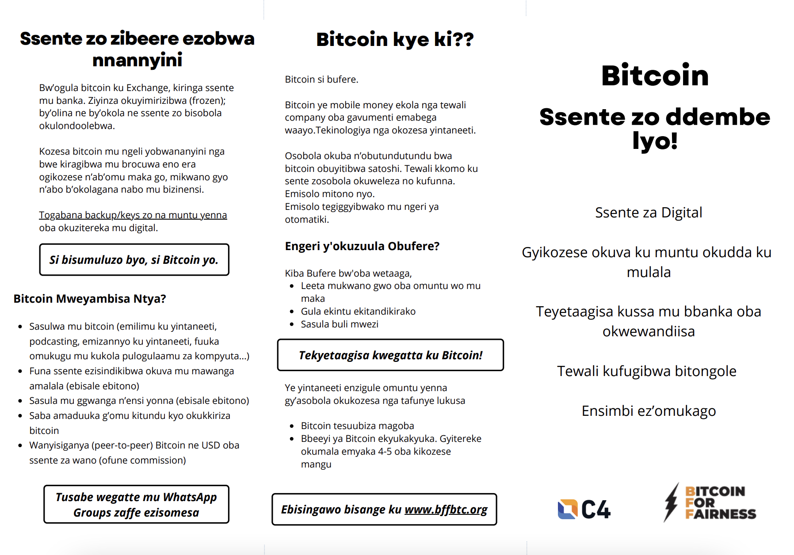

# Bitcoin Flyer in Luganda

The [Bitcoin flyer](https://anitaposch.com/bitcoin-flyer) is now available in the second African language after [Swahili](https://anitaposch.com/bitcoin-swahili). The **Ganda language** or **Luganda** is a Bantu language spoken in the African Great Lakes region. It is one of the major languages in Uganda and is spoken by more than 10 million [Baganda](https://en.wikipedia.org/wiki/Ganda_people "Ganda people") and other people principally in central Uganda including the capital Kampala of Uganda.

[Download the Luganda flyer PDF here](https://bffbtc.org/wp-content/uploads/2022/11/BFF-Luganda-Bitcoin-flyer.pdf)

---

You like Anita's work and efforts with [Bitcoin for Fairness](https://bffbtc.org) to foster Bitcoin adoption on the ground in the Global South? It's all community powered and funded by donations. Feel free to [support our work with a donation](https://anita.link/donate) or send sats to our Lightning address: bffbtc@getalby.com.

