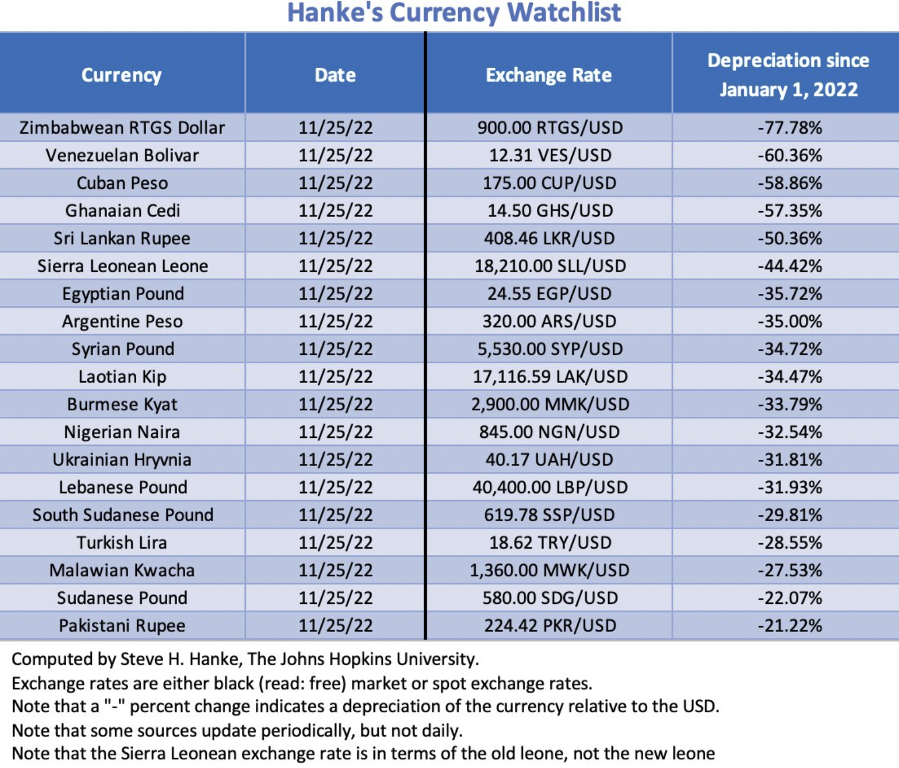
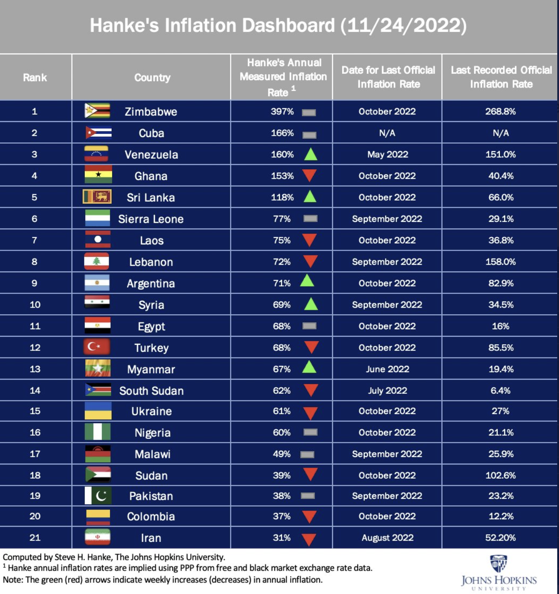

# Countries where people suffer the most from currency depreciation

## Ghanaian Cedi the fourth worst performing currency

Ahead of this weeks AfroBitcoin conference in Ghana, Zimbabwe is still the country with the worst performing currency globally with a loss of 75% against the USD since Jan 1, 2022. Followed by Venezuela, Cuba and the Ghanaian cedi on Rank 4 with a depreciation of 57%.

[Source](https://twitter.com/steve_hanke/status/1598066843155017729)

The inflation dashboard shows a similar picture. Zimbabwe leads with an annual inflation of 400%. Ghana is on the 4th place as well with an annual inflation rate of 153%.

[Source](https://twitter.com/steve_hanke/status/1598081942062174208/photo/1)

Inflation, corruption and authoritarianism go often hand in hand as laid out in my article [Opposing the Corruptible Fiat System, Bitcoin Enforces Universal Human Rights](https://anitaposch.com/bitcoin-enforces-human-rights).

---
You like my work and efforts with [Bitcoin for Fairness](https://bffbtc.org) to foster Bitcoin adoption on the ground in the Global South? It's all community powered and funded by donations. Feel free to [support our campaign with a donation](https://anita.link/geyser), send sats to our lightning address bff@geyser.fund or send fiat money on [Patreon](https://patreon.com/anitaposch).
