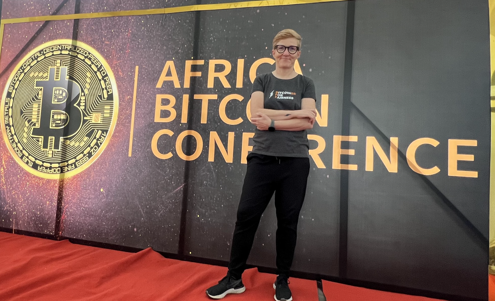

---
taxonomy:
    tags: [Blog, Ghana, Bitcoin in Africa]
routes:
    default: '/afrobitcoin-22'
date: 2022-12-09 12:40
dateformat: 'Y-m-d H:i'
summary: Six hundred people from all continents gathered in Accra, Ghana for the first African Bitcoin conference including Jack Dorsey former CEO of Twitter.
thumbnail: _Afrobitcoin.png
template: article 
---

# First African Bitcoin only Conference sowing the seeds for further adoption

As soon as the African Bitcoin Conference was announced over a year ago I knew I wanted to be a part of that moment. Since then I have been doing a lot of educational work in South Africa, Zambia and Zimbabwe. I've been to a lot of Bitcoin conferences throughout the years the African Bitcoin Conference was my favorite so far. Organized by Human Rights Activist Farida Bemba Nabourema it was the place where 600 participants from all over the world connected with Ghanaians and attendees from Nigeria, Kenya, Mali, Malawi, South Africa, Cameroon and many more African countries.

The focus of the conference was on Bitcoin as freedom money and not just a tool for speculation and investment. This was only the beginning. Bitcoin only conferences and education will be spreading far and wide across the continent and I hope the focus of all these will be on fighting scams and advancing self-custody and privacy.

<blockquote class="twitter-tweet">
Now the great <a href="https://twitter.com/Farida_N?ref_src=twsrc%5Etfw">@Farida_N</a> with <a href="https://twitter.com/jack?ref_src=twsrc%5Etfw">@jack</a>. <a href="https://twitter.com/hashtag/ABC2022?src=hash&amp;ref_src=twsrc%5Etfw">#ABC2022</a> Open source software brought Jack to Bitcoin. Followed the Cypherpunks, read the whitepaper and understood its magnificence. <a href="https://t.co/uKhTe4h2Up">pic.twitter.com/uKhTe4h2Up</a>
&mdash; Anita ⚡🏳️‍🌈 Bitcoin for Fairness (@AnitaPosch) <a href="https://twitter.com/AnitaPosch/status/1600076366887591937?ref_src=twsrc%5Etfw">December 6, 2022</a></blockquote> 

<blockquote class="twitter-tweet">
1/4 I&#39;ve been to a lot of <a href="https://twitter.com/hashtag/Bitcoin?src=hash&amp;ref_src=twsrc%5Etfw">#Bitcoin</a> conferences throughout the years. <a href="https://twitter.com/AfroBitcoinOrg?ref_src=twsrc%5Etfw">@AfroBitcoinOrg</a> was my favorite so far. Organizer <a href="https://twitter.com/Farida_N?ref_src=twsrc%5Etfw">@Farida_N</a> and team managed to unite people from many African countries with guests from other continents. The focus was on Bitcoin as freedom money. <a href="https://t.co/DAfI7pyBnP">pic.twitter.com/DAfI7pyBnP</a>
&mdash; Anita ⚡🏳️‍🌈 Bitcoin for Fairness (@AnitaPosch) <a href="https://twitter.com/AnitaPosch/status/1601244314767597571?ref_src=twsrc%5Etfw">December 9, 2022</a></blockquote> 

<blockquote class="twitter-tweet">
1/10 Yesterday the <a href="https://twitter.com/AfroBitcoinOrg?ref_src=twsrc%5Etfw">@AfroBitcoinOrg</a> conference started in <a href="https://twitter.com/hashtag/Accra?src=hash&amp;ref_src=twsrc%5Etfw">#Accra</a> <a href="https://twitter.com/hashtag/ABC2022?src=hash&amp;ref_src=twsrc%5Etfw">#ABC2022</a>   I had the pleasure to present our <a href="https://twitter.com/BFFbtc?ref_src=twsrc%5Etfw">@BFFbtc</a> projects: the Bitcoin flyer and <a href="https://twitter.com/BTCPodcasting?ref_src=twsrc%5Etfw">@BTCPodcasting</a> a free podcasting platform where you can earn bitcoin. <a href="https://t.co/79nAU0T5vU">pic.twitter.com/79nAU0T5vU</a>
&mdash; Anita ⚡🏳️‍🌈 Bitcoin for Fairness (@AnitaPosch) <a href="https://twitter.com/AnitaPosch/status/1600026279398490114?ref_src=twsrc%5Etfw">December 6, 2022</a></blockquote> 

<blockquote class="twitter-tweet">
1/ Yesterday I was interviewed by 10 year old <a href="https://twitter.com/SamaraOsae?ref_src=twsrc%5Etfw">@SamaraOsae</a> at <a href="https://twitter.com/AfroBitcoinOrg?ref_src=twsrc%5Etfw">@Afrobitcoinorg</a>. She is the youngest ambassador for <a href="https://twitter.com/_BitcoinMt?ref_src=twsrc%5Etfw">@_BitcoinMT</a> and had some quite interesting questions about Bitcoin. <a href="https://twitter.com/hashtag/ABC2022?src=hash&amp;ref_src=twsrc%5Etfw">#ABC2022</a> <a href="https://t.co/79rZMcEtjt">pic.twitter.com/79rZMcEtjt</a>
&mdash; Anita ⚡🏳️‍🌈 Bitcoin for Fairness (@AnitaPosch) <a href="https://twitter.com/AnitaPosch/status/1600441876171182080?ref_src=twsrc%5Etfw">December 7, 2022</a></blockquote> 

---
You like my work and efforts with [Bitcoin for Fairness](https://bffbtc.org) to foster Bitcoin adoption on the ground in the Global South? It's all community powered and funded by donations. Feel free to [support our campaign with a donation](https://anita.link/geyser), send sats to our lightning address bff@geyser.fund or send fiat money on [Patreon](https://patreon.com/anitaposch).
