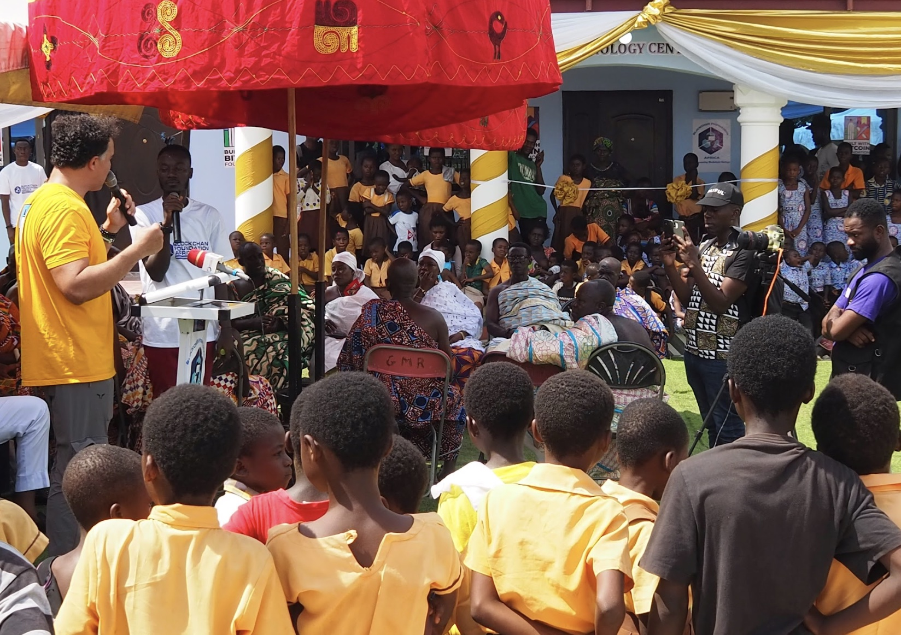
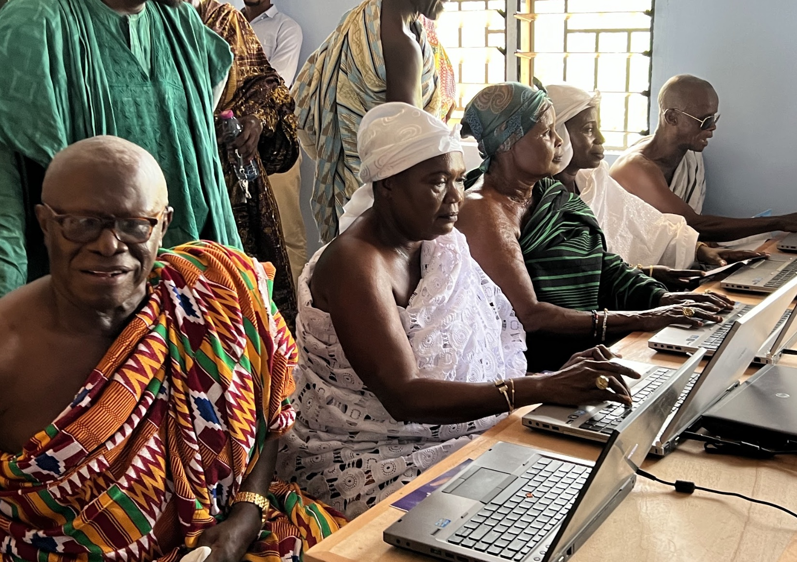
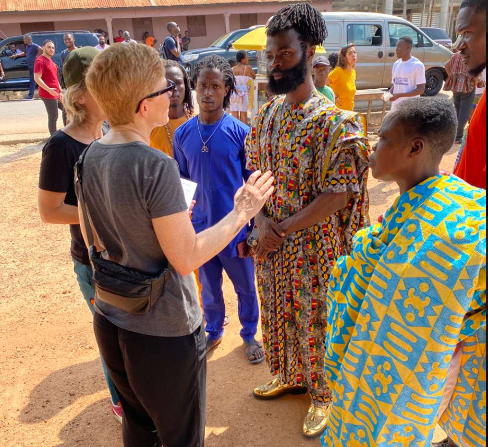
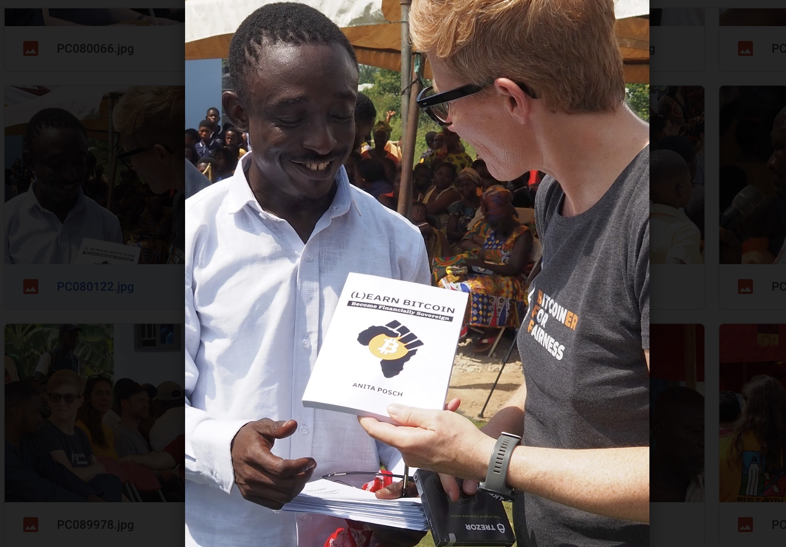

# Bitcoin Technology Center "BTC" in Edwinase community near Kumasi 

I was invited to join the opening of the "Built with Bitcoin" foundation's new technology center in Kumasi, Ghana. The Bitcoin Technology Center "BTC" in the Edwinase community by Built with Bitcoin and Paxful was inaugurated with a long ceremony which ended in the elders of the community checking out the computers.

Anyone will have access to the center and the facility aims to educate and train around 400 people in the first year. Staff will be paid in bitcoin. Goal is to start a circular economy. It's a lot of work to be done, also to fight scams which are prevalent on the continent. Part of the ceremony which was attended by about 300 people was the opening of the center by the elders of the village.

A newly built water well in the middle of the village is also part of the project.

I took the opportunity to explain the differences btw BTC and a scam to [Nana Okuoba](https://twitter.com/nana_okuoba) a local business owner.

I gifted my [(L)earn Bitcoin book](http://learnbitcoin.link) for the library and a Trezor signing device for the community. I finally met Philip Agyei Asare in person, who was a guest on my show already in 2020.

<iframe src="https://www.vodio.fr/frameplay.php?idref=25653&urlref=1" style="border: 0px none; box-shadow: rgba(0, 0, 0, 0.28) 0px 0px 10px; width: calc(100% - 10px); height: 180px; margin-left: 5px; padding: 0;" scrolling="no"></iframe>

<blockquote class="twitter-tweet">
Thank You <a href="https://twitter.com/builtwithbtc?ref_src=twsrc%5Etfw">@builtwithbtc</a> for this wonderful center to help educate and inform the youths about the growing technology and how the rural areas can take advantage🥰😍🙏🏿🙏🏿 <a href="https://twitter.com/YusufBWB?ref_src=twsrc%5Etfw">@YusufBWB</a> <a href="https://twitter.com/raypaxful?ref_src=twsrc%5Etfw">@raypaxful</a> <a href="https://twitter.com/bcfafrica?ref_src=twsrc%5Etfw">@bcfafrica</a> <a href="https://t.co/1C1uOo63e5">pic.twitter.com/1C1uOo63e5</a>
&mdash; philip agyei asare 🇬🇭 (@BTC4Revolution) <a href="https://twitter.com/BTC4Revolution/status/1601250257685581825?ref_src=twsrc%5Etfw">December 9, 2022</a></blockquote> 

