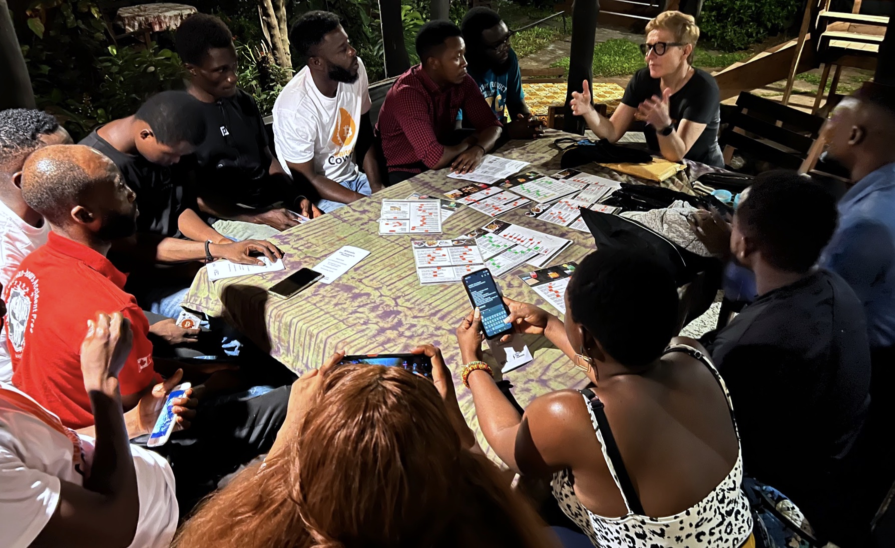
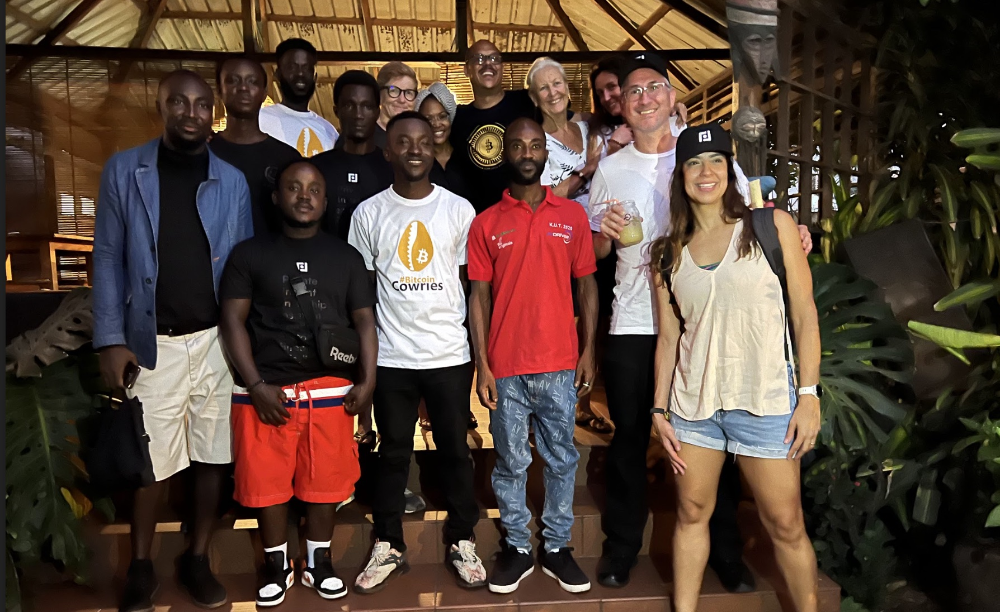
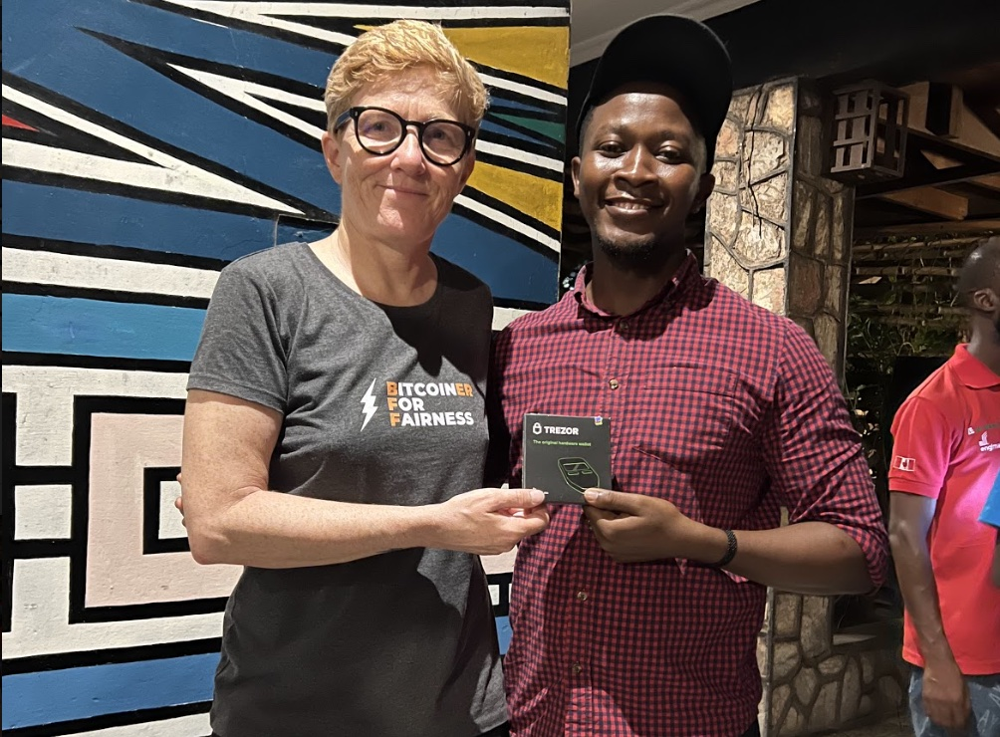
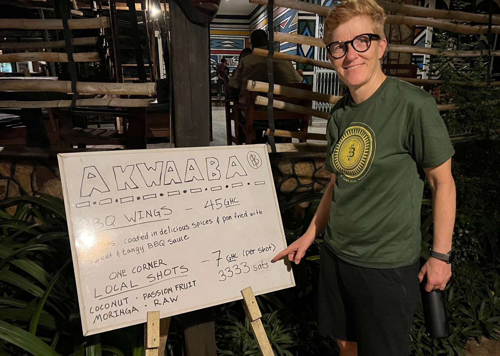

# Hosted a Bitcoin for Fairness Meetup in Accra, Ghana

We hosted a Bitcoin meetup in Accra as the Bitcoin for Fairness closing event of a long week with lots of bitcoin education and events at the first pan-African Bitcoin conference. Loved to see the curiosity and openness for solutions from all attendees.

We were discussing the use cases of bitcoin for their specific situations, installed the Blue Wallet and spoke about the importance of self-custody, which is provided if one uses the Breez App. Then we did some payments so that everyone sent and received some satoshis.

One of the participants was asking me about hardware wallets and how to earn bitcoin through content creation. When I gifted him a Trezor he was super happy.

We gave away the [Bitcoin for Fairness Bitcoin flyer](https://bffbtc.org/flyer/), which will be available in the local Akan Twi language soon.

<blockquote class="twitter-tweet">
1/14 Organized a <a href="https://twitter.com/BFFbtc?ref_src=twsrc%5Etfw">@BFFbtc</a> <a href="https://twitter.com/hashtag/Bitcoin?src=hash&amp;ref_src=twsrc%5Etfw">#Bitcoin</a> meetup in <a href="https://twitter.com/hashtag/Accra?src=hash&amp;ref_src=twsrc%5Etfw">#Accra</a> as the closing event of a long week with lots of bitcoin education and events <a href="https://twitter.com/AfroBitcoinOrg?ref_src=twsrc%5Etfw">@AfroBitcoinOrg</a>. Loved to see the curiosity and openness for solutions from all attendees. <a href="https://t.co/pnG9QN2f7o">pic.twitter.com/pnG9QN2f7o</a>
&mdash; Anita ⚡🏳️‍🌈 Bitcoin for Fairness (@AnitaPosch) <a href="https://twitter.com/AnitaPosch/status/1602331207651434496?ref_src=twsrc%5Etfw">December 12, 2022</a></blockquote> 

We hosted the meetup at One Corner Garden, a restaurant which is accepting bitcoin.

---
You like my work and efforts with [Bitcoin for Fairness](https://bffbtc.org) to foster Bitcoin adoption on the ground in the Global South? It's all community powered and funded by donations. Feel free to [support our campaign with a donation](https://anita.link/geyser), send sats to our lightning address bff@geyser.fund or send fiat money on [Patreon](https://patreon.com/anitaposch).
