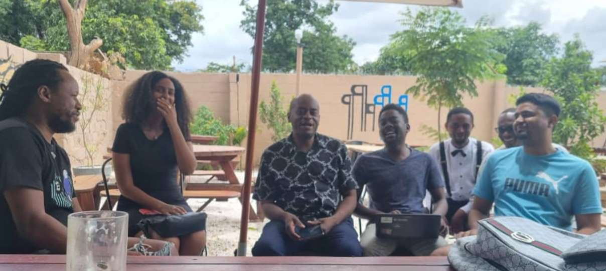
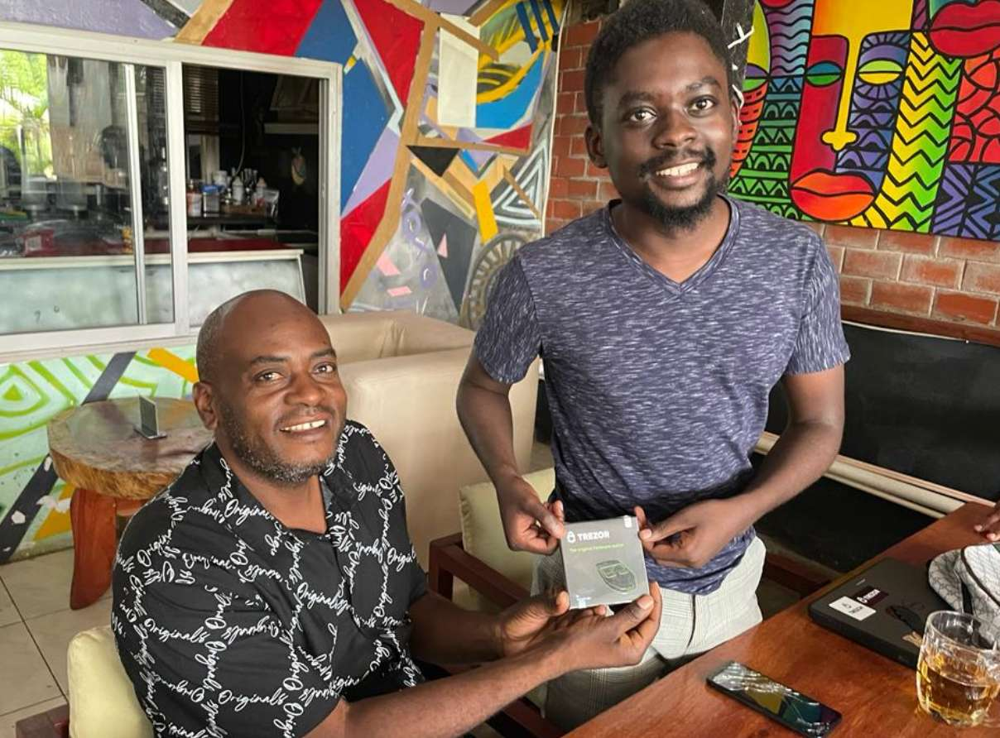

# 5th Bitcoin for Fairness Meetup in Lusaka, Zambia

Bitcoin for Fairness (BFF) held its final Bitcoin Meetup in Zambia for 2022. The Bitcoin-only meetup took place on December 17, 2022, at Scallywags Restaurant (BTC accepted) in Lusaka, Zambia’s capital.

Instead of the usual structured meetup, this time the team set up informal, participant-driven discussions. A range of topics were discussed, including hardware wallets, self-custody, seedphrase, etc. One of the participants, Emmanuel, demonstrated how Wasabi wallet works, what Coinjoins are and why they are important.

At the end of the meetup, BFF donated Trezor hardware wallets to participants.

---
You like my work and efforts with [Bitcoin for Fairness](https://bffbtc.org) to foster Bitcoin adoption on the ground in the Global South? It's all community powered and funded by donations. Feel free to [support our campaign with a donation](https://anita.link/geyser), send sats to our lightning address bff@geyser.fund or send fiat money on [Patreon](https://patreon.com/anitaposch).
