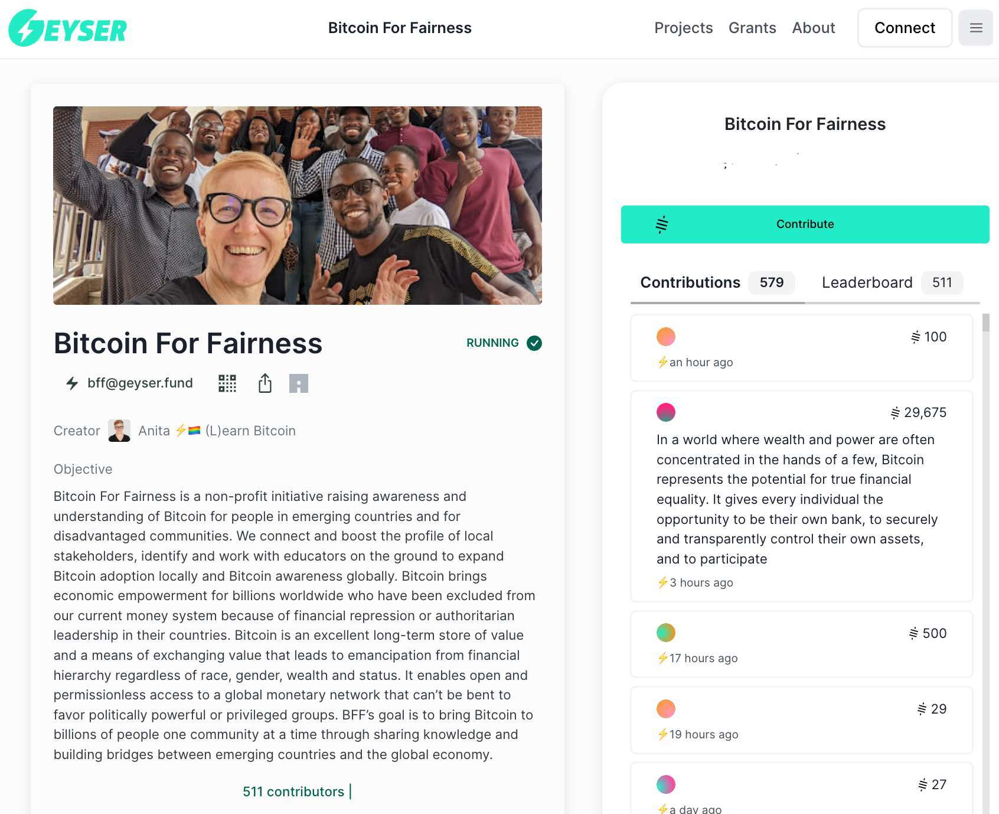
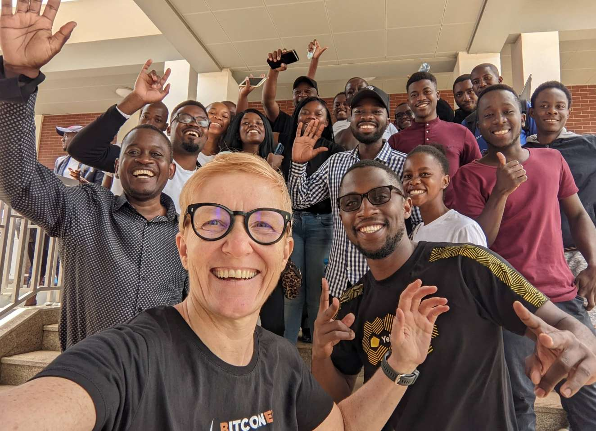
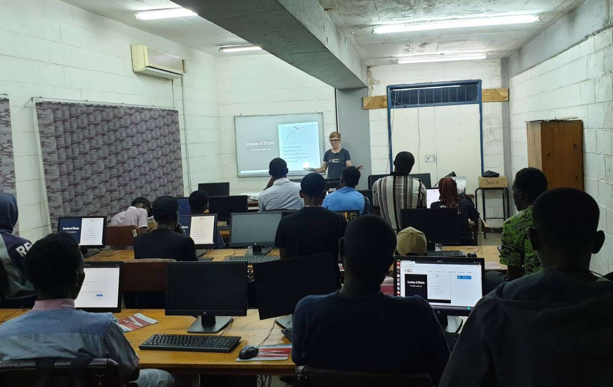
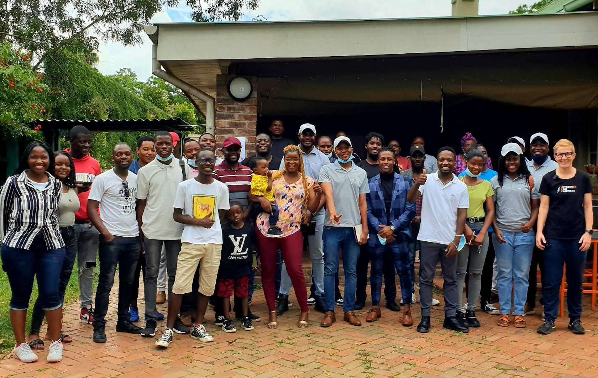
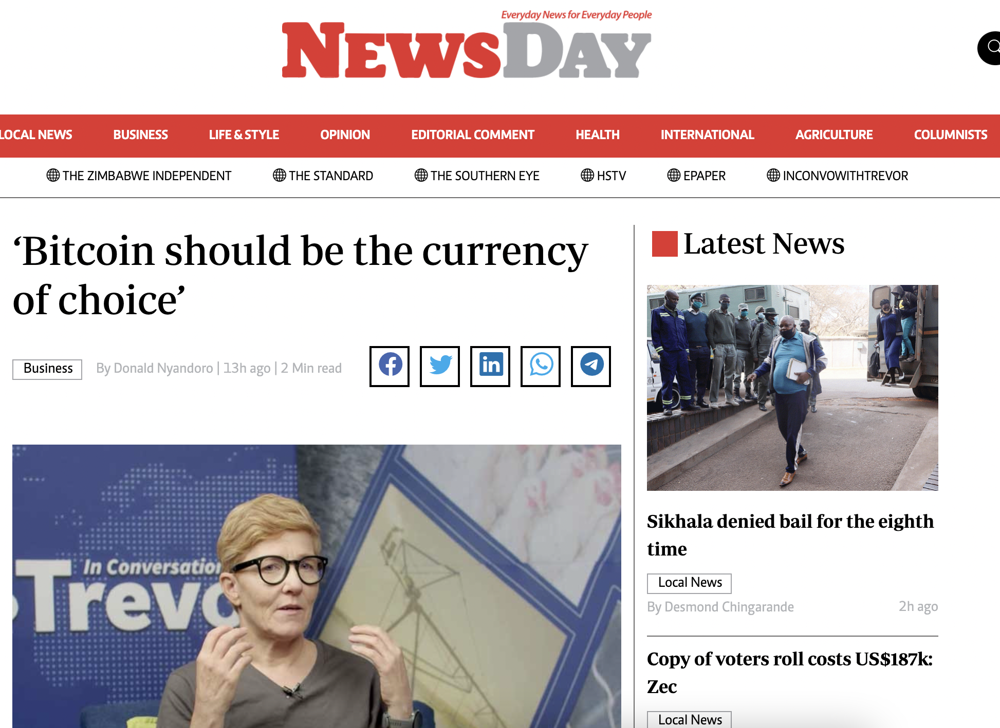
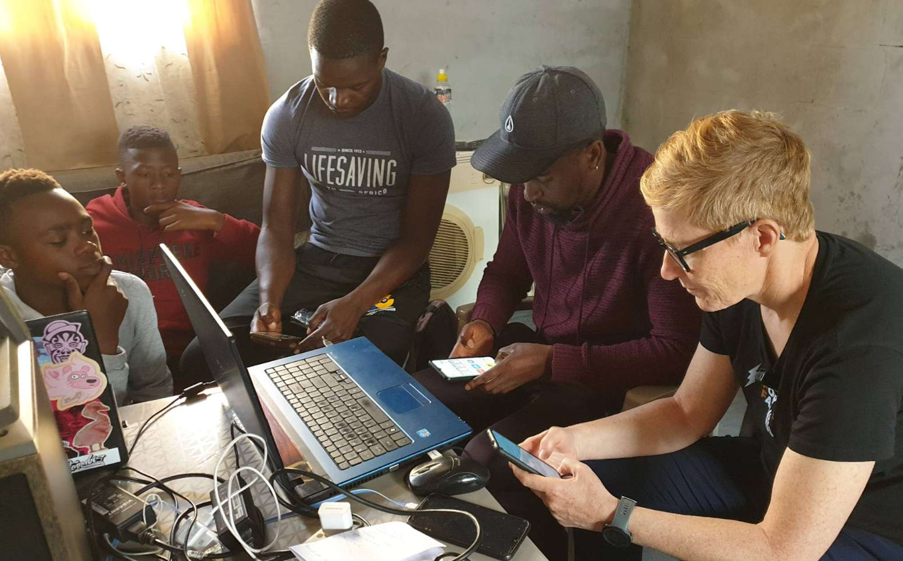
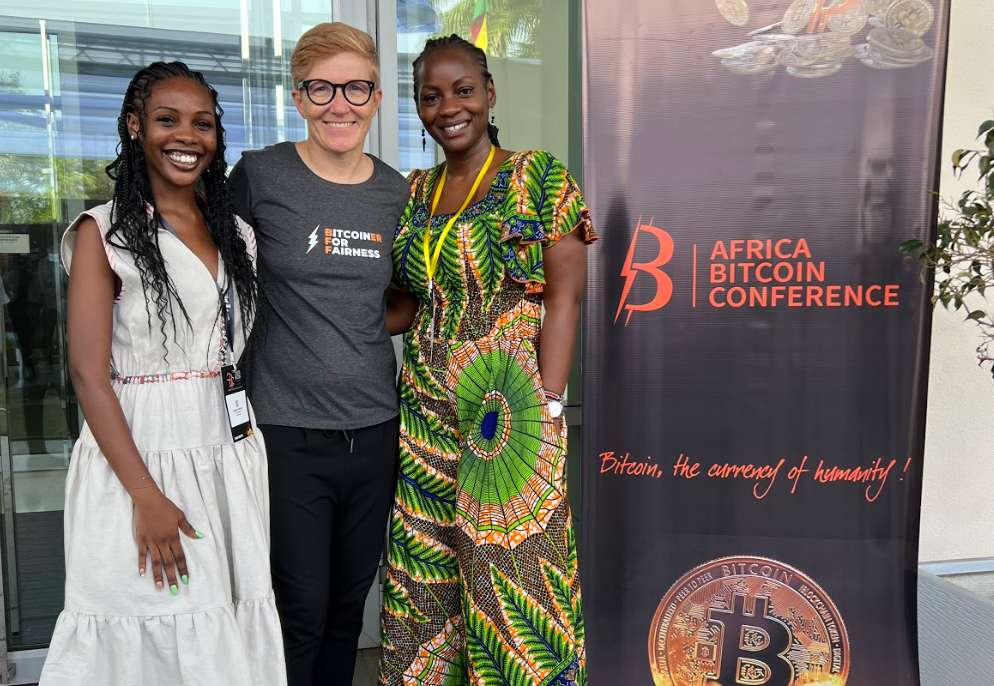
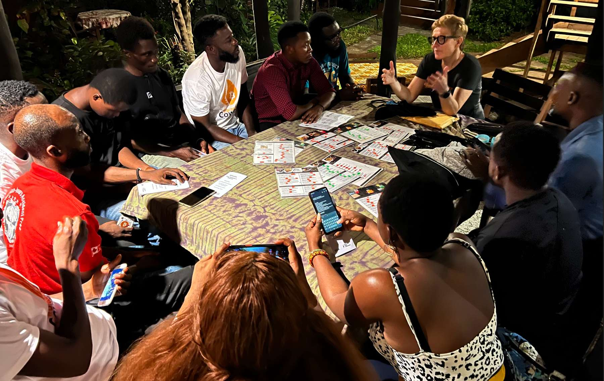

# Review 2022 - A Year In Grassroots Bitcoin Adoption For Africa

In early 2020, during my first visit in Zimbabwe, my assumption that Bitcoin is needed the most in the Global South was confirmed. I found a nation in distress about money, because of a kleptocratic ruling elite that had been defrauding and stealing from their people by [inflating the national currency for decades](https://anita.link/50). Despite this, corruption and military support allowed these leaders to stay at the top for over 40 years.

> This [article was originally published on Bitcoin Magazine](https://bitcoinmagazine.com/culture/2022s-bitcoin-adoption-in-africa) by BTC Inc.

<iframe src="https://www.vodio.fr/frameplay.php?idref=25736&urlref=1" style="border: 0px none; box-shadow: rgba(0, 0, 0, 0.28) 0px 0px 10px; width: calc(100% - 10px); height: 180px; margin-left: 5px; padding: 0;" scrolling="no"></iframe>

The need was there, but what about understanding of Bitcoin? I found a few true believers and HODLers from the early days, but I didn’t find a single Bitcoin-only event or community. What existed were cryptocurrency trading groups on WhatsApp and Facebook and a lot of scams. The first questions about Bitcoin always were: “How can I join Bitcoin?” (which is the language that scammers are using to lure in their victims) and “How can I trade it?” (which is the language of short time preference).

In 2021, I had the idea to bring Bitcoin knowledge to the Global South with a focus on fostering communities on the ground and connecting them infrastructure-wise and people-wise with the Bitcoin network. Elizabeth Stark of Lightning Labs encouraged me to apply for a donation at the Human Rights Foundation, [which became the first donor supporting “Bitcoin for Fairness.”](https://hrf.org/bitcoin-dev-fund-q1-2022gifts) 

With the advice of Jacob Strumwasser of Lightning Labs and Sharon Dow, I drafted a grant proposal, which resulted in sponsorships from LEDN, Okcoin, Paxful, Coinfinity, Breez and Trezor. I set up a crowdfunding campaign on Geyser which received over 500 donations from Bitcoiners all over the world. Brad Mills, Peter McCormack and f418_me all donated significant amounts. I’m sure I’m forgetting other donors — sorry about that and thank you each and everyone for your support!

## Our Impact

Through Bitcoin For Fairness, I visited four African countries to spread Bitcoin education and connections this year. The most time I spent was in Zimbabwe and Zambia, which I visited two times each. In April after Bitcoin 2022 in Miami, I gave up my apartment in Vienna and started my nomad life. 

It led me to South Africa in May, where I worked with Bitcoin Ekasi and did an interview with initiator Hermann:
<iframe src="https://www.vodio.fr/frameplay.php?idref=25724&urlref=1" style="border: 0px none; box-shadow: rgba(0, 0, 0, 0.28) 0px 0px 10px; width: calc(100% - 10px); height: 180px; margin-left: 5px; padding: 0;" scrolling="no"></iframe>

 In June, I was at the Oslo Freedom Forum to connect with human rights activists and freedom fighters like Meron Estefanos, Farida Nabourema and Leopoldo Lopez. COVID-19 stopped me for a few weeks and after the Baltic Honeybadger conference in Riga, I returned to Zimbabwe and Zambia. The last traveling I did in 2022 led me to the first pan-African Bitcoin conference in Ghana.

## Zambia

In March, I was [speaking to 50 students at the University of Zambia](https://www.youtube.com/watch?v=b0uSQI0B5Nw) — we hosted a Lightning Network workshop, I gave radio and newspaper interviews and we started a Bitcoin education group on WhatsApp, which has grown to 65 members. All of this was organized by Ndesa, Emmanuel and Japhet, three crypto-interested individuals who hadn’t known each other before. In May, they set up the [first Bitcoin For Fairness (BFF) meetup in Lusaka](https://bffbtc.org/first-bitcoin-for-fairness-bitcoin-meetup-photos/).

In October, I visited for the second time. I was speaking at the [Forum On Internet Freedom In Africa 2022](https://anitaposch.com/internet-freedom-africa) (FIFA22) and at the University of Zambia [to about 30 students, and we installed wallets and sent sats](https://anitaposch.com/bitcoin-unza). We organized a BFF meetup and donated a RaspiBlitz full node to one of the local Bitcoiners. Together, with the BFF team, we conducted a [one-day Bitcoin workshop for journalists](https://bffbtc.org/bitcoin-workshop/). 

In December the 5th BFF meetup was happening and the Bitcoin and Lightning node was up and running. The BFF goal to initiate a local group of Bitcoiners, regular meetups and bringing Bitcoin infrastructure to Zambia has been fully met. The local BFF group has setup their own [ZambiaBitcoinMeetups.com](https://ZambiaBitcoinMeetups.com) website, they meet at Scallywags a restaurant accepting bitcoin and one of the members started a Bitcoin podcast in the local Bemba language on our recently launched "BTC Podcasting" platform. 

## Zimbabwe

We kicked the Zimbabwe trip off with a Bitcoin talk in early March which was attended by 60 participants in the capital of Harare. One of them was Alexandria, who took a six-hour bus ride from Bulawayo, because he didn’t know any other Bitcoiners. I encouraged Alexandria to start a Bitcoin-only WhatsApp group and ask the guests to join. Today, that group has grown to 300 members and is on [Twitter](https://twitter.com/bitcoinreach), too. Alexandria and his Bitcoin Reach group is fully independent from BFF now. This has also been a goal of mine: self sovereignty and self organization of the communities.

I actually lost count on the number of Bitcoin meetups that happened in Zimbabwe since my talk in March, which is a good thing. The meetups in Gweru and Bulawayo were sponsored by BFF. "Run with Bitcoin" Paco was our guest, too. 

https://twitter.com/prestigegroup01/status/1547274244836528128

We gave away Trezor devices and I conducted a workshop to help people set the devices up. Because of my work a Zimbabwean farmer owning a solar power plant came together with someone from the international community, who donated 6 ASIC miners. The machines have been mining bitcoin from solar since June 2022. I did an interview with the miner in July.

<iframe src="https://www.vodio.fr/frameplay.php?idref=25727&urlref=1" style="border: 0px none; box-shadow: rgba(0, 0, 0, 0.28) 0px 0px 10px; width: calc(100% - 10px); height: 180px; margin-left: 5px; padding: 0;" scrolling="no"></iframe>

https://twitter.com/AnitaPosch/status/1545082894871298050

In September I visited a remote area in the Eastern Highlands and sent a [Lightning payment from my Voltage node to Bitcoin Ekasi in South Africa](https://anitaposch.com/send-money-from-zimbabwe-to-south-africa-with-zero-fee). 

https://twitter.com/AnitaPosch/status/1570502853575450626

This tweet had been shared a lot and Trevor Ncube a highly acclaimed journalist in the Southern African region invited me to be a [guest on his popular YouTube Show "In Conversation with Trevor"](https://anitaposch.com/conversation-with-trevor-ncube). They included my wallet setup video in the episode and in the following I onboarded Trevor to Lightning and Bitcoin. The trailblazer he is, he invited me to make his podcast Value4Value ready. Now his show is the [first Zimbabwean podcast receiving bitcoin payments](https://anitaposch.com/icwt-bitcoin-enabled) via Alby. 

After my appearance on “In Conversation With Trevor,” Newsday Zimbabwe published an [article titled “Bitcoin Should Be The Currency Of Choice](https://www.newsday.co.zw/business/article/200002981/bitcoin-should-be-the-currency-of-choice),” writing, “Anita Posch has urged Zimbabwean businesses and individuals to use bitcoin as a medium of exchange because of its low charges when transacting as well as its being less prone to abuse.”

## South Africa

In May, I went to South Africa to work with Bitcoin Ekasi, the circular Bitcoin economy in Mossel Bay. First I spent some time in Cape Town and met Bitcoin builders like Carel van Wyk, who was already working on a solution to what later became [Pick n Pay’s acceptance of Lightning payments](https://bitcoinmagazine.com/business/pick-n-pay-now-accepts-bitcoin).

<iframe src="https://www.vodio.fr/frameplay.php?idref=25725&urlref=1" style="border: 0px none; box-shadow: rgba(0, 0, 0, 0.28) 0px 0px 10px; width: calc(100% - 10px); height: 180px; margin-left: 5px; padding: 0;" scrolling="no"></iframe>

Since November, you have been able to pay for your groceries at one of the biggest supermarket chains in South Africa. This is a huge step for the future success of the circular Bitcoin economy in the township. Now, people can earn and spend bitcoin without the need to exchange to the South African rand.

https://twitter.com/BitcoinEkasi/status/1602194653457141760

We also brought a RaspiBlitz and Trezor devices to Bitcoin Ekasi. Senior coach Luthando learned how to run the node and I did a hardware wallet workshop with him and the junior coaches. Now the shop owners in the township can secure their bitcoin savings offline.

https://twitter.com/AnitaPosch/status/1525148698354892800

German television was interested to do a documentary about Bitcoin and cryptocurrencies. Since they were aware of my work we agreed that a TV team was following BFF and the Ekasi team in the township. 

Here you can watch the documentary in German (until 25 October 2027):

Last but not least, I served as the matchmaker between Bitcoin Ekasi’s new teacher, named Ms. Nomsa, and a BFF volunteer, who helped her get knowledgeable about Bitcoin. I also connected Paxful with the community, which led to a Paxful and Built With Bitcoin education center being placed on site. 

https://twitter.com/BitcoinEkasi/status/1579837612914720768

## Ghana

As soon as I heard the announcement of the first Pan-Africa Bitcoin Conference I knew I wanted to be a part of it. Organized by Farida Bemba Nabourema, a Togolese Human Rights and Bitcoin activist it became to be the greatest Bitcoin conference I have been to so far. The focus on Bitcoin as a tool for Africans to empower and free themselves financially from colonial and authoritarian structures resonated with the work of BFF. 

Prior to the conference, I helped Marcel Lorraine, the founder of [Bitcoin Dada](https://twitter.com/dada_bitcoin), a women-focused Bitcoin education group raising funds, to visit the conference. I also met Noelyne Sumba and Mary Imasuen from Nigeria. Mary organized a BFF sponsored meetup in Nigeria earlier this year.

After the conference we organized a BFF meetup together with the local Bitcoin Cowries community in One Corner Garden a restaurant accepting bitcoin, where we installed wallets, gave away a Trezor device and spoke about how to earn bitcoin. 

## Built educational content and infrastructure for communities

### The Bitcoin Flyer

On top of all of the above, I published the [BFF Bitcoin flyer](https://bffbtc.org/flyer) together with the [C4 Cryptocurrency Certification Consortium](https://cryptoconsortium.org/). The flyer is an easy and cheap-to-produce Bitcoin FAQ to give away at meetups or conferences. With the help of volunteers, we translated the flyer to twelve languages, including Swahili, Luganda and soon, Akan Twi and Eritrean. We encourage volunteers to translate the open-sourced folder into their local languages.

### BTC Podcasting

Together with [Michael Bumann from Alby](https://getalby.com), I developed a new podcast hosting platform called BTC Podcasting, where Bitcoiners can host their podcasts for free and, at the same time, earn bitcoin from their listeners without the need to run their own Lightning nodes. BFF wants to encourage communities to start their own podcasts. Given that the cost for internet bandwidth is very high and the speed also doesn’t allow video streaming in many African regions, we learned that audio is a much better medium through which to reach people.

### Documentary: How Bitcoin Enforces Human Rights 

One of the most compelling reasons for me to start working with and for Bitcoin was the humanitarian and social aspects. The possibility to stick it to authoritarians and take the power out of their hands and put it back into the hands of the people was compelling. 

During the last six years since I started in the Bitcoin space, it became clear to me that only Bitcoin delivers fair access for anyone to take economic action and that it is essential for enforcing human rights. This is the reason why I called my NPO initiative “Bitcoin For Fairness” and why I wrote an essay for [Bitcoin Magazine about “How Bitcoin Enforces Human Rights.”](https://anitaposch.com/bitcoin-enforces-human-rights) 

I also produced a podcast and a video documentary about it, so that people can share these thoughts easily with their peers. The importance of the Bitcoin project may not be underestimated. It’s our only shot to regain digital and financial privacy and to have an alternative system for the short-sighted, debt-based and consumption-driven fiat economy. If we mess up, there will be no similar freedom project in the near future.

## Learnings

Blockchain technology and crypto are big in African countries. But the differences between Bitcoin and altcoins are widely not understood. Altcoins and their marketing departments have done a great job of letting people believe that they are the better Bitcoin, telling them that the original is slow and not scalable. Even the people who are organizing events and sharing crypto knowledge haven’t heard of the Lightning Network or sidechains like Rootstock or Liquid yet.

In most countries, crypto and stablecoins are king. Only in Nigeria is the share of Bitcoin usage higher than that of altcoins, as I was told by Ray Youssef, the CEO of Paxful. In Zimbabwe, a [trader who exchanged a volume of $6 million in 2021 told me](https://anitaposch.com/insights-from-exchanging-bitcoin-peer-to-peer-in-zimbabwe) that most people are using USDT, and only a handful of convinced Bitcoiners are HODLing.

<iframe src="https://www.vodio.fr/frameplay.php?idref=25732&urlref=1" style="border: 0px none; box-shadow: rgba(0, 0, 0, 0.28) 0px 0px 10px; width: calc(100% - 10px); height: 180px; margin-left: 5px; padding: 0;" scrolling="no"></iframe>

There are hundreds of free guides, tutorials and videos about Bitcoin, but where to start? Five out of 50 people at my first talk in Lusaka were interested in Bitcoin only. They are isolated and far away from where the experienced users and developers are — it’s hard to catch up. They can’t afford to attend Lightning hackdays or other Bitcoin-focused conferences, which are mostly in the U.S. or Europe. Traveling to other African countries is expensive and cumbersome.

There is a need for more boots on the ground to share knowledge and tools. Nobody I had met at my talks was using a hardware wallet. The devices are very expensive for the average person and hard to get. I gifted a BitBox02 to a friend in Zimbabwe two years ago and he told me that he hadn’t set it up yet.

There is a need for more local Bitcoin infrastructure and the [Africa Free Routing project](https://bitcoiners.africa/africa-free-routing/) is a great start, because the two nodes I was able to bring are not enough. One great example of a solution built for Africa by an African is [Machankura](https://8333.mobi), a custodial Lightning wallet, which allows you to send and receive bitcoin on a feature phone without internet connection. It’s using the same technology that mobile money providers in Africa have been using for years called USSD. We used it in Zambia.

<iframe width="100%" height="476" src="https://www.youtube-nocookie.com/embed/FCiK1AZuPRM?si=Ms2KLQWxC_Qxhgoz" title="YouTube video player" frameborder="0" allow="accelerometer; autoplay; clipboard-write; encrypted-media; gyroscope; picture-in-picture; web-share" referrerpolicy="strict-origin-when-cross-origin" allowfullscreen></iframe>

## Going forward

Building in the bear market was not an easy task, but thanks to the BFF volunteers and donors, we did so. Our goal for 2023 is to focus even more on education around self custody and privacy. 

One thing we learned is that after all of the crypto scammers who have been hitting the African continent, building trust by being on the ground is essential. But it’s not enough, there has to be a possibility to stay connected and offer further knowledge to the communities and especially the individuals who are driving their groups. 

That’s why I’m going to build a community site with online courses and education around non-KYC bitcoin, privacy tools and, of course, self custody in 2023. At the same time, BFF’s goal is to find more volunteering translators for the Bitcoin flyer and to accompany Bitcoiners to develop their community podcasts and start earning bitcoin.

---

You like Anita Posch's work and efforts with [Bitcoin for Fairness](https://bffbtc.org) to foster Bitcoin adoption on the ground in the Global South? It's all community powered and funded by donations. Feel free to [support our work with a donation](https://anita.link/donate) or send sats to our Lightning address: bffbtc@getalby.com.

