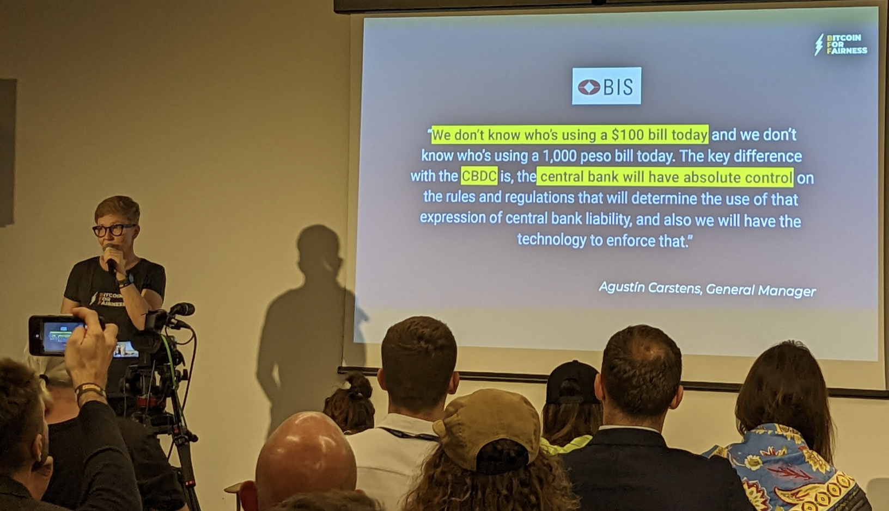

# Bitcoin Is the Embodiment of Human Rights - Talk
## The Ultimate Case For Bitcoin: Economic Empowerment & Civil Resistance

### Anita at the Baltic Honeybadger Conference in Riga

Bitcoin brings economic empowerment for billions of people worldwide who have been excluded from the current monetary system by global discriminatory regulations and authoritarian leadership in their countries. Bitcoin is a lifeboat as it gives back self-sovereignty and power to the people. Used as a permissionless means to exchange value it leads to emancipation from financial patriarchy for anyone regardless of race, gender, wealth or status. It enables open and fair access to a global money network that can’t be bent to favor political will or privileged groups. 

https://youtu.be/ril70QIDz24

Anita explains how Bitcoin represents human rights and acts as a tool for civil resistance and empowerment. She has been traveling to Zambia, Zimbabwe, El Salvador and South Africa with her non-profit initiative "Bitcoin for Fairness" to support grassroots movements and foster Bitcoin education on the ground. Learn about the unique properties of the Bitcoin blockchain to understand why it's unstoppable, censorship resistant, today's most secure internet network and how it embodies human rights like freedom of speech, the right to own things and to privacy.

Here are the slides:
<iframe src="https://docs.google.com/presentation/d/e/2PACX-1vT2wA46GTAYdFAT7_sd7BWD4IYEt5nKZVSLYR5qhohhacbE65s3ErOLZEF2eo0t6cBQVL1-Zr8Yzhyr/embed?start=false&loop=false&delayms=3000" frameborder="0" width="480" height="299" allowfullscreen="true" mozallowfullscreen="true" webkitallowfullscreen="true"></iframe>

