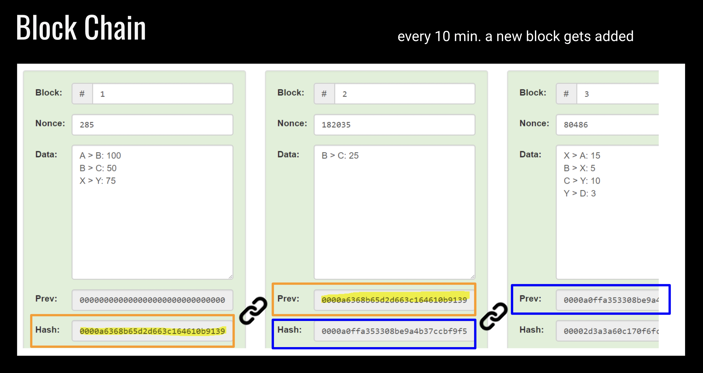

# Differences between Proof-of-Work and Proof-of-Stake
## Can Bitcoin use Proof-of-Stake?

Proof-of-Work and Proof-of-Stake have different goals, so the question is: what are you trying to achieve with a blockchain? 

Proof-of-Work provides security through an investment of electricity. Electricity is scarce and always has some form of cost. It makes Proof-of-Work very very secure, you’d have to re-invest all the energy that was used to mine in the first place again to rewrite the blockchain. Even if you own 100% of the mining you still have to do the work and invest in electricity. Burning electricity connects the coin to the physical world.

Proof-of-Stake validators stake the blockchain intrinsic cryptocurrency. If they validate correctly they get the money back and earn fees proportional to their stake. The more coins they stake, the more they earn. If they cheat they might lose their stake, but could still gain from the increase in value of the coin.

### The immutability of Proof-of-Work is higher
Proof-of-Work is better at producing a robust immutable blockchain that has a fair degree of decentralization and cannot be easily tampered with even by very rich, very influential, very powerful organizations and entities. The **immutability of Proof-of-Work is higher than that of Proof-of-Stake**. 

Proof-of-Stake doesn’t have any of these goals. It has the goal of governance in an environmental friendly way that still maintains decentralization but allows some flexibility of a blockchain. 

In the future: if Proof-of-Stake proves to be as secure as Proof-of-Work and it has a mechanism that doesn’t make the rich richer, then Bitcoin could _in theory_ use Proof-of-Stake too. But for now Proof-of-Work is essential for censorship resistance and fair distribution of coins.

---
Source: Andreas M. Antonopoulos, <a href="https://www.youtube.com/watch?v=3W_3AQrQEOM">Bitcoin Q&A: Proof-of-Work (PoW), Proof-of-Stake (PoS), Delegated Proof-of-Stake (DPoS)</a>, <a href="https://www.youtube.com/watch?v=qrwgYDAoZV0">Governments vs. Proof-of-Work or Proof-of-Stake</a> and <a href="https://www.youtube.com/watch?v=MHYS0xgZ9dQ">The Game Theory of Staking</a> and Patreon session September 2022

