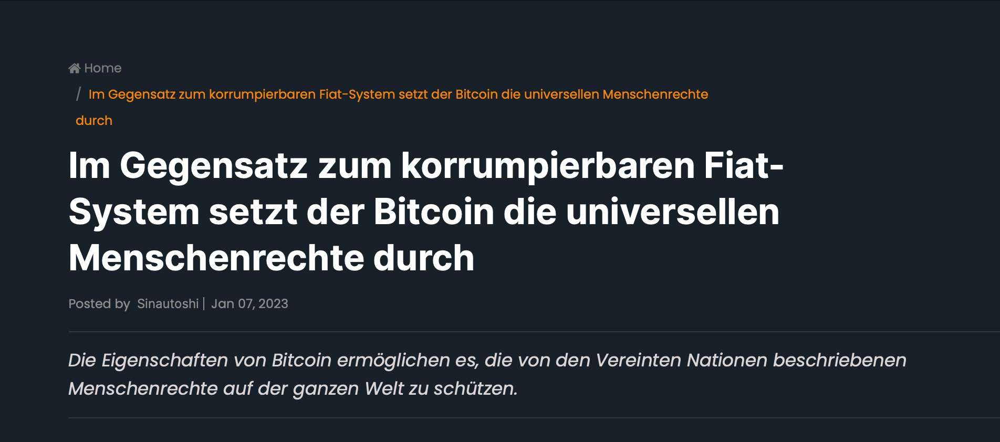
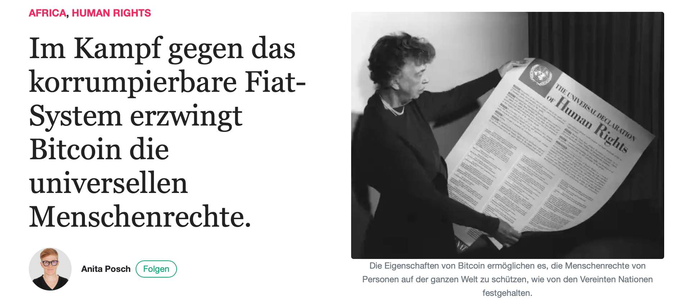

# Bitcoin and Human Rights Article goes international

My article about [how Bitcoin enforces human rights](/bitcoin-enforces-human-rights) has been translated to German, Italian and French. Thanks to Bitcoin Sozial and European Bitcoiners.

## Bitcoin und Menschenrechte Artikel Deutsch

## Bitcoin e diritti umani Articolo in italiano

## Bitcoin et droits humains article français

