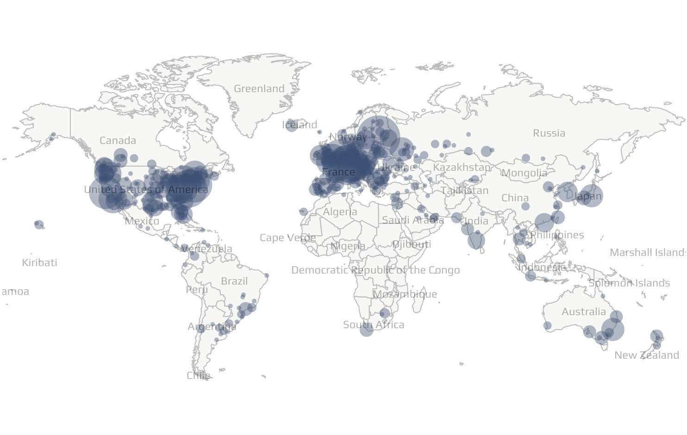
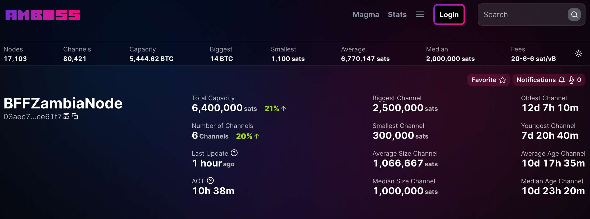

# First Bitcoin and Lightning node in Zambia

Light up Africa with nodes! There is a big and wide empty space on the map of Bitcoin nodes on the African continent. While a lot of nodes might be run behind Tor, which makes them undetectable for the map, in general there are not many nodes operated here. 

One of my objectives with [Bitcoin for Fairness](https://bffbtc.org/mission/) is to bring Bitcoin infrastructure to emerging countries in order to give local communities the opportunity to be a part of the Bitcoin network. In May 2022, Bitcoin for Fairness [donated](https://bffbtc.org/lightning-node-south-africa/) a Bitcoin and Lightning Node to [Bitcoin Ekasi](https://anita.link/154) in South Africa.

