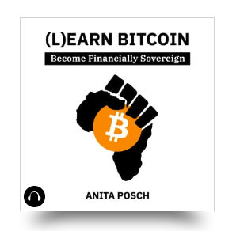

---
taxonomy:
    tags: [Blog, Learn Bitcoin, Book]
routes:
    default: '/learn-bitcoin-audiobook'
date: 2023-02-01 12:28
dateformat: 'Y-m-d H:i'
summary: My Bitcoin beginners book is available as an audiobook on Audible and many other platforms. It was produced and narrated by Kevin Hanssen a Zimbabwean actor and musician.
thumbnail: _Audiobook-EN.png
template: article 
---

# (L)earn Bitcoin audiobook

You can now drive your car, do a workout or dishes and listen and learn about Bitcoin at the same time. With the second edition of the English version of (L)earn Bitcoin I also released an audiobook. It's read by Kevin Hanssen an actor and musician from Zimbabwe.

The <strong>audiobook is available on</strong>
[Amazon / Audible](https://geni.us/lb-audio),  <a href="https://www.kobo.com/us/en/audiobook/l-earn-bitcoin-1">Kobo</a>, <a href="https://www.scribd.com/audiobook/595274665/L-earn-Bitcoin-Become-Financially-Sovereign">Scribd</a>, <a href="https://play.google.com/store/audiobooks/details/Anita_Posch_L_earn_Bitcoin?id=AQAAAECC43mj6M">Google Play</a>, <a href="https://www.barnesandnoble.com/w/bookanita-posch/1142268218">Barnes & Noble</a>, <a href="https://www.chirpbooks.com/audiobooks/l-earn-bitcoin-by-anita-posch">Chirp books</a>, <a href="https://libro.fm/audiobooks/9783950504354">Libro FM</a>, <a href="https://www.audiobooks.com/audiobook/l-earn-bitcoin-become-financially-sovereign/625518">Audiobooks.com</a>.

