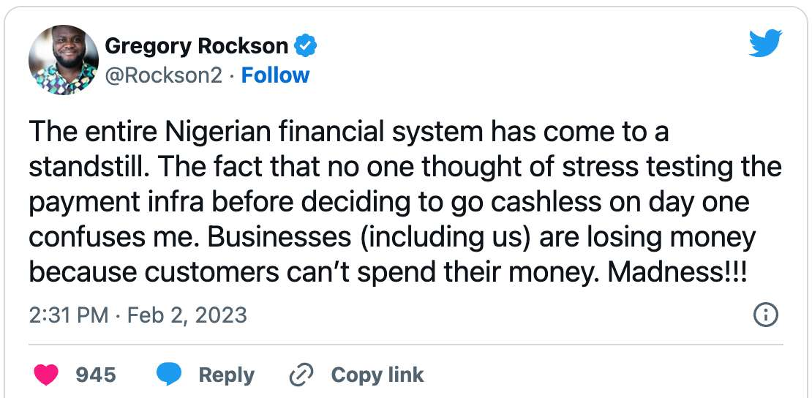
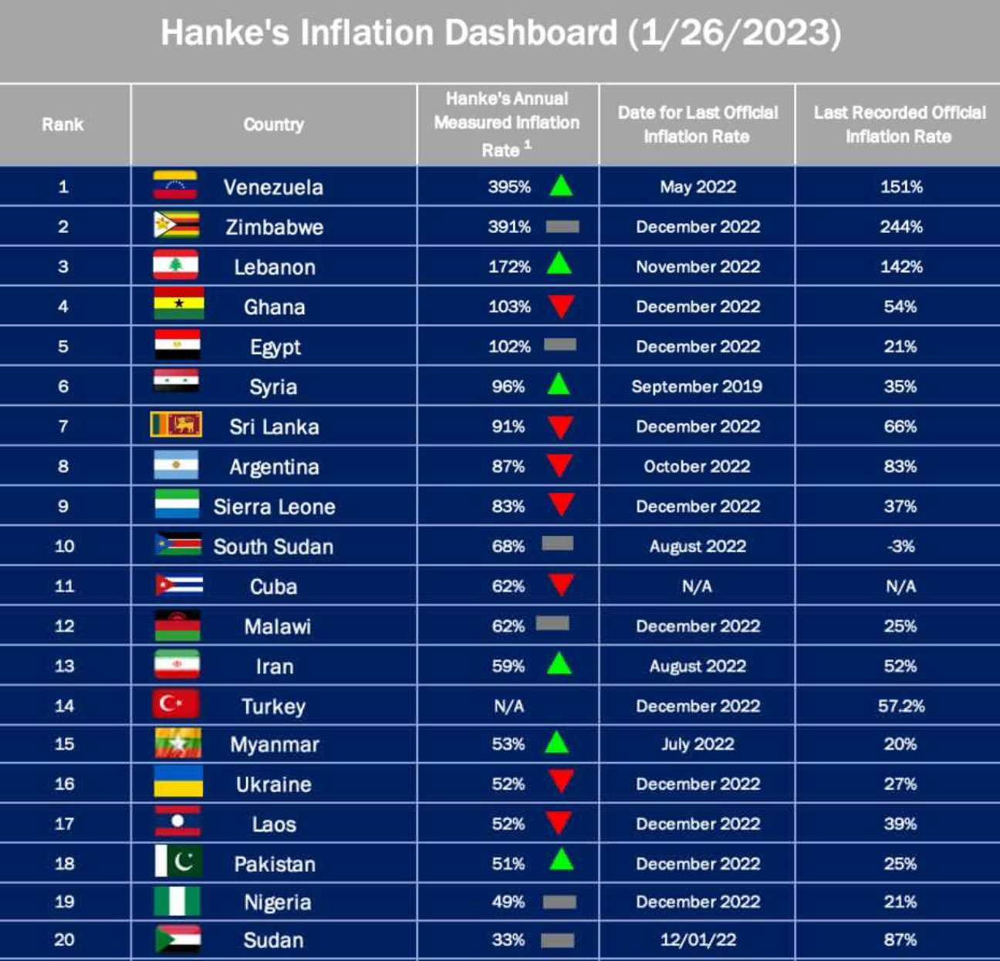

---
taxonomy:
    tags: [Blog, Nigeria, Bitcoin in Africa]
routes:
    default: '/nigeria-bitcoin-naira-2023'
date: 2023-02-03 10:40
dateformat: 'Y-m-d H:i'
summary: The war on cash has led to an increase in the value of bitcoin in Nigeria in January 2023. How can it be that one bitcoin is 40% more expensive there than anywhere else?
thumbnail: _230203-Nigeria-cashless-1675421985234.jpeg
template: article 
---

# Bitcoin price surges during a war on cash in Nigeria

The Nigerian government together with the central bank have been trying to push the adoption of the digital naira, the country's central bank digital currency, for a couple of months now. As I learned, during the AfroBitcoin conference in Ghana in December 2022, the digital naira has not been very well received by the population, for different reasons like privacy concerns, mistrust in the government and mostly because millions of people are unbanked and depend on cash. 

The actions by the CBN in its cashless society campaign are getting harsher. After limiting the amount of money that can be withdrawn at ATMs last year, existing bills are being replaced with new and lower denomination banknotes. Nigerians had until Jan. 24 to swap for the new notes, but long queues and complaints about insufficient time led to a deadline extension to Feb. 10.

The imposed measures are resulting in a catastrophic monetary crisis in Nigeria. "The entire Nigerian financial system has come to a standstill. The fact that no one thought of stress testing the payment infra before deciding to go cashless on day one confuses me. Businesses (including us) are losing money because customers can’t spend their money. Madness!!!"

## Good money drives bad money out

A [single Bitcoin was selling for roughly 17.5 million Nigerian nairas](https://news.yahoo.com/bitcoin-trades-higher-nigeria-amid-145946011.html) (NGN), or around US$38,000, which is about 40% higher than the global average Bitcoin price of US$23,100 at the end of January 2023.

There are several possible reasons: 

### Low bitcoin liquidity

Since Nigeria was the leader in bitcoin adoption in Africa in 2022 and people are aware of the preciousness of bitcoin, they are not selling them with the result, that not enough bitcoin are available on the local market, a [situation which is even worse in Zimbabwe](https://anitaposch.com/insights-from-exchanging-bitcoin-peer-to-peer-in-zimbabwe).

### Supposedly a run on bitcoin

Nigeria is not only the country with the highest crypto adoption in Africa, it has the [highest bitcoin adoption too](https://anitaposch.com/podcast-bitcoin-solves-financial-apartheid-168) as I was told by Paxful CEO Ray Youssef. 

### The local currency has been losing value due to inflation

Bitcoin is valued higher, because the local currency has been losing value for many years, is unreliable (will my banknotes be valid in the future?) and difficult to use. 

## Gresham's law

What we can see is [Gresham's law](https://en.wikipedia.org/wiki/Gresham%27s_law) in action, where "good money drives bad money out". In this case the central bank is actively pushing people to adopt bitcoin by making it harder to live on cash. With millions of people without ID, a general mistrust in banks and a decades long history of naira devaluation due to inflation people are open to try new forms of money. 

